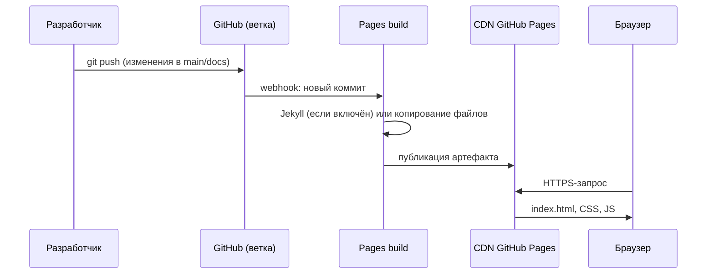
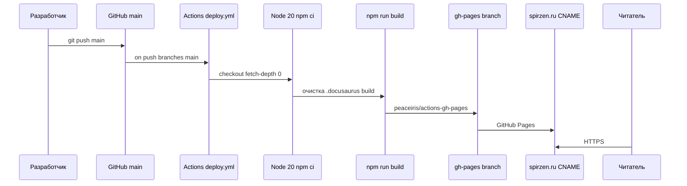

import ExternalCodeEmbed from '@site/src/components/ExternalCodeEmbed';

# Размещение своего сайта с GitHub Pages

<div class="article-tags">
  <span class="tag tag-notrequired">НЕ ОБЯЗАТЕЛЬНО</span>
  <span class="tag tag-beginner">ДЛЯ НОВИЧКОВ</span>
</div>

Пошаговое руководство по публикации статического сайта на [GitHub Pages](https://pages.github.com/): от создания репозитория до автоматического деплоя через [GitHub Actions](https://docs.github.com/ru/actions) и подключения своего домена.

Официальные материалы GitHub (на русском, где есть перевод):

- [Документация GitHub Pages](https://docs.github.com/ru/pages)
- [Быстрый старт](https://docs.github.com/ru/pages/quickstart)
- [Создание сайта GitHub Pages](https://docs.github.com/ru/pages/getting-started-with-github-pages/creating-a-github-pages-site)
- [Настройка источника публикации](https://docs.github.com/ru/pages/getting-started-with-github-pages/configuring-a-publishing-source-for-your-github-pages-site)
- [Пользовательский домен](https://docs.github.com/ru/pages/configuring-a-custom-domain-for-your-github-pages-site)

Проверил на практике: если вы читаете это на [spirzen.ru](https://spirzen.ru), значит цепочка «репозиторий → сборка → Pages → DNS» работает. Полная архитектурная схема того же проекта (C4, папки, CI, runtime) — [О проекте → архитектура](/about/project#arhitektura-proekta).

<div class="callout callout--tip">
  <div class="callout-title">Сначала базовый Git</div>

  <div class="callout-body">
  Pages опирается на репозиторий и `git push`. Команды `init`, `add`, `commit`, `push` с построчным разбором — [лабораторная шпаргалка Git](/lab/Примеры/1123) ([залить проект на GitHub](/lab/Примеры/1123#как-залить-проект-на-github-с-нуля)).

  Теория — [Как работать с Git](/encyclopedia/4-code-dev/4-13-osnovy-raboty-s-git/112).
</div>
</div>

---

## С нуля — репозиторий, три файла, первый коммит

Ниже — самый короткий путь для Windows без терминала: [GitHub Desktop](https://desktop.github.com/) и любой редактор (Блокнот, VS Code, Notepad++). Установка клиента — в [главе про Git и GitHub Desktop](/encyclopedia/4-code-dev/4-13-osnovy-raboty-s-git/111).

---

### 1. Создайте репозиторий в GitHub Desktop

1. Установите и войдите в **GitHub Desktop** под своим аккаунтом GitHub.
2. **File → New repository** (или «Создать репозиторий»).
3. Заполните поля:
   - **Name** — для **проектного** сайта подойдёт `MySite` (адрес будет `https://ваш-логин.github.io/MySite/`).
   - Для **главной страницы профиля** имя должно быть **`ваш-логин.github.io`** (например `Spirzen.github.io`) — см. [типы сайтов](#три-типа-сайтов-и-правила-именования-репозитория) ниже.
   - **Local path** — папка на диске, например `C:\Projects\MySite` (можно `D:\Sites\MySite` — главное, запомнить путь).
   - Включите **Initialize this repository with a README** по желанию (не обязательно).
   - **Git ignore** — None или шаблон Node, если позже добавите сборку.
   - **License** — по желанию.
4. Нажмите **Create repository**. GitHub Desktop создаст папку и откроет её как текущий репозиторий.

---

### 2. Откройте папку и создайте файлы сайта

В проводнике перейдите в `C:\Projects\MySite` (ваш **Local path**) или в GitHub Desktop: **Repository → Show in Explorer**.

Создайте в **корне** папки (рядом с `.git`, не внутри подпапок) три файла — `index.html`, `style.css` и `script.js`. Полные листинги с вкладками — в каталоге [IT Code Examples](https://code.spirzen.ru/e/html/github-pages-starter/):

<ExternalCodeEmbed example="html/github-pages-starter" title="GitHub Pages — стартовый сайт" minHeight={360} />

Проверка локально: дважды щёлкните `index.html` в проводнике — страница откроется в браузере (стили и скрипт подтянутся, если файлы лежат в той же папке).

---

### 3. Коммит и публикация на GitHub

Вернитесь в **GitHub Desktop**:

1. Слева во вкладке **Changes** должны появиться `index.html`, `style.css`, `script.js` (и README, если создавали).
2. Внизу в поле **Summary** введите сообщение коммита, например: `Первый вариант сайта`.
3. Нажмите **Commit to main** (или `Commit to master` — зависит от имени ветки по умолчанию).
4. Если репозиторий ещё только локальный, нажмите **Publish repository**:
   - снимите галочку **Keep this code private**, если нужен бесплатный Pages на обычном аккаунте;
   - подтвердите **Publish repository**.

После публикации кнопка **Push origin** отправляет следующие коммиты на GitHub — для первого раза достаточно **Publish**.

---

### 4. Включите GitHub Pages

1. На [github.com](https://github.com) откройте свой репозиторий (`MySite` или `логин.github.io`).
2. **Settings → Pages**.
3. **Source** → **Deploy from a branch**.
4. **Branch** → `main` (или `master`), папка **`/ (root)`** → **Save**.
5. Через 1–10 минут появится ссылка вида `https://ваш-логин.github.io/MySite/`.

Дальнейшие правки: меняете файлы в `C:\Projects\MySite`, в Desktop — **Commit** → **Push origin**; Pages пересоберёт сайт автоматически.

<div class="callout callout--info">
  <div class="callout-title">Имя репозитория и URL</div>

  <div class="callout-body">
  Репозиторий <code>MySite</code> даёт адрес <code>/MySite/</code> в конце. Чтобы сайт открывался с корня <code>https://логин.github.io/</code>, создайте репозиторий <code>логин.github.io</code> и повторите те же шаги с файлами в его папке.
</div>
  </div>


---

## Что такое GitHub Pages

**GitHub Pages** — бесплатный хостинг **статических** сайтов внутри GitHub. Сайт собирается из файлов в репозитории (HTML, CSS, JS) или из артефакта сборки (Docusaurus, Vite, Hugo и т.д.) и отдаётся через CDN GitHub с HTTPS.

Подходит для:

- портфолио и личных страниц;
- документации и учебных проектов;
- демо пет-проектов;
- лендингов без серверного кода (PHP, Node на хостинге, базы данных).

Не подходит для серверной логики, API «на том же хостинге» и долгих фоновых задач — только статика и клиентский JavaScript.

---

## Три типа сайтов и правила именования репозитория

GitHub различает три сценария. От типа зависят **URL по умолчанию** и **нужно ли особое имя репозитория**.

| Тип | Кто владелец | Имя репозитория | URL по умолчанию | Где включать Pages |
|-----|--------------|-----------------|------------------|-------------------|
| **Пользовательский** | ваш аккаунт | строго `username.github.io` | `https://username.github.io/` | Settings → Pages в этом репозитории |
| **Организации** | организация на GitHub | строго `orgname.github.io` | `https://orgname.github.io/` | то же |
| **Проектный** | пользователь или org | **любое** (например `ArchiStylerOnline`) | `https://username.github.io/имя-репозитория/` | Settings → Pages в репозитории проекта |

---

### Пользовательский или сайт организации

1. Создайте **новый** публичный репозиторий с именем **точно** как у хоста Pages:
   - для аккаунта `Spirzen` → репозиторий `Spirzen.github.io` (регистр в URL обычно не важен, имя репозитория — важно);
   - для организации `MyCompany` → `MyCompany.github.io`.
2. Положите в корень (или в выбранную папку при настройке) `index.html` и остальные файлы.
3. В **Settings → Pages** выберите ветку и папку — через несколько минут сайт откроется на `https://username.github.io/`.

Имя `username.github.io` — **требование платформы**, а не просто удобная привычка.

---

### Проектный сайт

Имя репозитория может быть любым: `my-game`, `docs`, `ArchiStylerOnline`. В **Settings → Pages** включаете публикацию — адрес будет:

`https://<username>.github.io/<repository>/`

Путь к ресурсам в HTML/CSS иногда нужно настраивать с учётом **базового пути** (`baseUrl` в Docusaurus, `homepage` в package.json и т.д.), иначе сломаются ссылки на картинки и стили.

---

### Живые примеры (мои сайты)

| Что | URL | Репозиторий / смысл |
|-----|-----|---------------------|
| Энциклопедия на своём домене | [spirzen.ru](https://spirzen.ru) | [Spirzen/it-knowledge-base](https://github.com/Spirzen/it-knowledge-base) — кастомный домен в Pages + файл `CNAME` |
| Портфолио профиля на домене GitHub | [spirzen.github.io](https://spirzen.github.io/) | пользовательский сайт (`Spirzen.github.io` или аналог) |
| Демо одного проекта | [spirzen.github.io/ArchiStylerOnline/](https://spirzen.github.io/ArchiStylerOnline/) | проектный сайт — имя репозитория попадает в URL |
| Браузерная игра | [spirzen.github.io/OnlineCardGame/](https://spirzen.github.io/OnlineCardGame/) | [Spirzen/OnlineCardGame](https://github.com/Spirzen/OnlineCardGame) — «Приключения Урала Батыра», React + TypeScript, PWA |

Кастомный домен **привязывается к конкретному репозиторию**, а не ко всему аккаунту сразу: у `it-knowledge-base` — `spirzen.ru`, у другого репозитория может быть только `*.github.io` или другой домен.

---

## Ограничения и политика

Кратко по [официальным лимитам](https://docs.github.com/ru/pages/getting-started-with-github-pages/github-pages-limits):

- только **статический** контент (HTML, CSS, JS, медиа, результат SSG);
- рекомендуемый размер репозитория — до ~1 ГБ, для скорости лучше держать публикацию **до ~100 МБ**;
- мягкие лимиты трафика (порядка 100 ГБ/мес и ~10 000 запросов/час для публичных проектов) — при злоупотреблении GitHub может ограничить сайт;
- публичные репозитории — Pages на бесплатном плане; приватные — с [GitHub Pro / Team / Enterprise](https://docs.github.com/ru/pages/getting-started-with-github-pages/about-github-pages#types-of-github-pages-sites);
- контент должен соответствовать [правилам сообщества GitHub](https://docs.github.com/site-policy/community-guidelines/github-community-guidelines).

---

## Быстрый старт — только настройки Pages

Если репозиторий и файлы уже есть (см. [раздел «С нуля»](#с-нуля--репозиторий-три-файла-первый-коммит) выше), остаётся включить хостинг:

---

### Settings → Pages

1. Откройте репозиторий на GitHub.
2. Вкладка **Settings** (только у владельца или с правами admin).
3. Слева раздел **Pages** (в блоке *Code and automation*).
4. **Build and deployment** → **Source**:
   - **Deploy from a branch** — GitHub публикует файлы **как есть** из выбранной ветки;
   - **GitHub Actions** — публикацию выполняет workflow (сборка, тесты, выкладка).
5. Для ветки: **Branch** → например `main`, папка **`/ (root)`** или **`/docs`**.
6. **Save**.

Опционально в корне: `robots.txt`, `favicon.ico` — см. раздел [Файлы в репозитории](#файлы-в-репозитории--cname-robotstxt-favicon-static).

---

### Проверка

- В том же разделе **Pages** появится ссылка *Your site is live at …*
- Первый деплой часто занимает **1–10 минут**, повторные — быстрее.
- Вкладка **Actions** (если включён workflow) или **Environments** → *github-pages* покажет историю выкладок.

---

## Settings → Pages — что означает каждая настройка

### Build and deployment → Source

| Источник | Когда выбирать |
|----------|----------------|
| **Deploy from a branch** | Готовые HTML-файлы, Jekyll-сайт в корне, папка `docs/` с Markdown |
| **GitHub Actions** | Нужна сборка (`npm run build`, Hugo, MkDocs) или свой `deploy.yml` |

При **Deploy from a branch** GitHub **не запускает** ваш `npm run build` — в ветку должны уже попадать файлы, которые нужно отдать посетителю.

При **GitHub Actions** ветка в селекторе branch часто **не используется** для финального URL: результат даёт job, который заливает артефакт на Pages (официальный `actions/deploy-pages` или, как в этом проекте, пуш в ветку `gh-pages`).

---

### Branch и папка

- **Branch** — обычно `main`, `master` или отдельная `gh-pages`.
- **Folder** — `/` (корень репозитория) или `/docs` (типично для Jekyll и документации).

После каждого **push** в выбранную ветку GitHub запускает **Pages build and deployment** (видно во вкладке *Actions* как workflow *pages build and deployment*).

---

### Custom domain

Поле **Custom domain** — ваш домен (`spirzen.ru`, `www.example.com`). После сохранения:

1. GitHub создаёт или обновляет файл **`CNAME`** в источнике публикации (часто в корне или в `gh-pages`).
2. Запускается **DNS check** — пока записи у регистратора неверны, статус будет жёлтым.
3. Когда DNS сходится, станет доступно **Enforce HTTPS** (сертификат Let's Encrypt).

Подробнее — в разделе [Пользовательский домен](#пользовательский-домен-spirzenru-и-dns) ниже.

---

## Как сайт развёртывается из ветки (внутренний процесс)

Упрощённая цепочка для **Deploy from a branch**:



Что важно понимать:

1. **Триггер** — push в настроенную ветку (или merge в неё).
2. **Сборка** — для чистого HTML GitHub в основном **копирует** файлы; для Jekyll на Pages действуют [ограниченные плагины](https://pages.github.com/versions/).
3. **Публикация** — содержимое попадает на инфраструктуру `*.github.io` или на ваш домен, если настроен `CNAME`.
4. **Кэш CDN** — после деплоя изменения могут появиться не мгновенно; жёсткое обновление в браузере (Ctrl+F5) помогает отличить кэш браузера от задержки CDN.

Для **проектного** сайта корень URL — `https://user.github.io/repo/`, поэтому относительные ссылки вида `href="style.css"` ищут файл по пути `/repo/style.css`. Абсолютные пути от корня домена (`href="/style.css"`) на проектном сайте **ломаются**, если не настроен base path.

---

## Загрузка кода — HTTPS и SSH

Деплой в смысле Pages — это **обычный `git push`** в GitHub. Способ аутентификации выбираете вы.

---

### HTTPS

```bash
git clone https://github.com/Spirzen/my-site.git
cd my-site
# правки
git add .
git commit -m "Обновил главную"
git push origin main
```

При push GitHub запросит логин и **Personal Access Token** (пароль аккаунта для Git по HTTPS не подходит). Токен создаётся в [Settings → Developer settings → Personal access tokens](https://github.com/settings/tokens).

---

### SSH

```bash
git clone git@github.com:Spirzen/my-site.git
```

Нужна пара ключей и добавление публичного ключа в [SSH keys](https://github.com/settings/keys). Удобно для ежедневной работы без ввода токена.

Подробнее о clone, remote и первом push — в энциклопедии: [Основы работы с Git](/encyclopedia/4-code-dev/4-13-osnovy-raboty-s-git/intro), карманный набор команд — [12 команд](/encyclopedia/4-code-dev/4-13-osnovy-raboty-s-git/115#12-komand).

---

### Локальный скрипт деплоя (.bat для Windows)

Можно вынести повторяющиеся команды в `deploy.bat` в корне проекта:

```bat
@echo off
setlocal
cd /d "%~dp0"

echo === Сборка (если есть package.json) ===
if exist package.json (
  call npm run build
  if errorlevel 1 exit /b 1
)

echo === Коммит и push ===
git add -A
git commit -m "deploy: %date% %time%" 2>nul
git push origin main
if errorlevel 1 exit /b 1

echo === Готово. Дождитесь Actions / Pages на GitHub. ===
endlocal
```

Скрипт **не заменяет** GitHub Actions: он только пушит код; сборка на сервере всё равно выполнится в workflow, если он настроен. Для «чистого HTML» без CI достаточно `git push` в ветку, из которой читает Pages.

---

## Файлы в репозитории — CNAME, robots.txt, favicon, static

### CNAME

Два разных смысла одной аббревиатуры:

| Где | Что это |
|-----|---------|
| **DNS-запись CNAME** | У регистратора: поддомен `www` → `username.github.io` |
| **Файл `CNAME` в репозитории** | Одна строка с доменом (`spirzen.ru`); говорит Pages, какой хост обслуживать |

В этом проекте домен задан в [`static/CNAME`](https://github.com/Spirzen/it-knowledge-base/blob/main/static/CNAME) — при сборке Docusaurus файл копируется в корень сайта. Содержимое:

```
spirzen.ru
```

Если задали домен в веб-интерфейсе **Settings → Pages**, GitHub сам добавит `CNAME` в ветку публикации. При ручном деплое **не удаляйте** его коммитом, иначе домен отвяжется.

---

### robots.txt

Текстовый файл для поисковых роботов в **корне сайта**. Пример из этого репозитория (`static/robots.txt`):

```
User-agent: *
Allow: /
Sitemap: https://spirzen.ru/sitemap.xml
```

На GitHub Pages положите `robots.txt` в корень публикуемой ветки или в `static/`, если генератор копирует её в корень при сборке.

---

### favicon.ico

Иконка вкладки браузера. Путь по умолчанию: `/favicon.ico`. Можно положить в `static/favicon.ico` (Docusaurus, MkDocs) или в корень HTML-репозитория. В разметке:

```html
<link rel="icon" href="/favicon.ico" sizes="any">
```

---

### Папка `static/` (Docusaurus и аналоги)

В [Docusaurus](https://docusaurus.io/docs/static-assets) всё из каталога `static/` попадает в **корень** собранного сайта без изменения пути:

- `static/img/logo.png` → `https://site/img/logo.png`
- `static/CNAME` → корневой `CNAME` на Pages
- `static/robots.txt` → `/robots.txt`

Тот же приём есть у VuePress, части шаблонов VitePress и других SSG.

---

### `.nojekyll`

Пустой файл `.nojekyll` в корне публикации **отключает** обработку Jekyll на GitHub Pages. Нужен для сайтов с путями, начинающимися с `_` (например `_build`), и для Docusaurus. В этом репозитории — `static/.nojekyll`.

---

### `.gitignore` и безопасность

В репозиторий **нельзя** коммитить:

- `.env`, ключи API, пароли, `*.pem`, токены;
- локальные конфиги IDE с секретами;
- `node_modules/` (тяжело и бессмысленно для Pages).

Шаблон `.gitignore` под стек и разбор утечек секретов — [`.gitignore` в разделе Git](/encyclopedia/4-code-dev/4-13-osnovy-raboty-s-git/116) и [забота о коде](/encyclopedia/8-infra-security/8-03-zabota-o-kode-i-dannyh/intro).

<div class="callout callout--danger">
  <div class="callout-title">Секрет в истории Git</div>

  <div class="callout-body">
  Один раз запушенный токен остаётся в истории. Нужно отозвать ключ, удалить из истории (<code>git filter-repo</code> / BFG) и заново настроить секреты в <strong>Settings → Secrets and variables → Actions</strong>, а не хранить их в <code>deploy.yml</code>.
</div>
  </div>


---

## GitHub Actions — зачем и как связано с Pages

**GitHub Actions** — CI/CD внутри GitHub: на события (`push`, `pull_request`, расписание, ручной запуск) выполняются job'ы в виртуальных машинах (`ubuntu-latest` и др.).

Для Pages типичный сценарий:

1. `checkout` — скачать репозиторий.
2. Установить Node/Python/Go, выполнить `npm ci` и `npm run build`.
3. Опубликовать папку `build/` или `dist/` на Pages.

Учебная статья в энциклопедии: [GitHub Actions](/encyclopedia/8-infra-security/8-04-devops-ci-cd/2112). Готовые YAML с разбором — [CI/CD рецепты](/lab/Примеры/1134). Раздел DevOps: [8.04 CI/CD](/encyclopedia/8-infra-security/8-04-devops-ci-cd/intro).

---

### Вкладка Actions в репозитории

1. Откройте **Actions**.
2. Слева список workflow (например *Deploy to GitHub Pages*).
3. Выберите workflow → справа **Run workflow** (если в YAML есть `workflow_dispatch`) — **ручной** деплой без нового коммита.
4. Клик по конкретному run → логи шагов (`build`, `deploy`).

---

### Автоматический деплой при правке `index.html` или стилей

Если в `.github/workflows/deploy.yml` указано:

```yaml
on:
  push:
    branches: [main]
```

любой push в `main` (включая правку одного `index.html` или `styles.css`) **запустит** workflow заново. Ждать ручного нажатия не нужно.

Если настроен только **Deploy from a branch** без Actions, достаточно push в выбранную ветку — сработает встроенный *pages build and deployment*.

---

### GitFlow и ветки

В [модели GitFlow](/encyclopedia/8-infra-security/8-03-zabota-o-kode-i-dannyh/1111) продакшен-ветка часто `main` или `master`. Для Pages имеет смысл:

- деплой **только** с `main` (`if: github.ref == 'refs/heads/main'`);
- на `develop` — только тесты без публикации;
- релиз — merge в `main` → автоматический деплой.

В **Actions** можно запустить workflow вручную с ветки `develop`, если добавить `workflow_dispatch` и не ограничивать ветку в job — для продакшена так делают редко.

---

## Файл `.github/workflows/deploy.yml` — разбор и примеры

Workflow — YAML в каталоге [`.github/workflows/`](https://docs.github.com/ru/actions/using-workflows/workflow-syntax-for-github-actions). Ниже — реальный файл **этого** репозитория и два альтернативных шаблона.

---

### Как устроен деплой Вселенной IT (it-knowledge-base)

Файл в репозитории: [`.github/workflows/deploy.yml`](https://github.com/Spirzen/it-knowledge-base/blob/main/.github/workflows/deploy.yml).

<ExternalCodeEmbed example="yaml/github-pages-docusaurus-deploy" title="Deploy Docusaurus → gh-pages" minHeight={320} />

| Строка / блок | Назначение |
|---------------|------------|
| `on.push.branches: [main]` | Деплой после каждого push в `main` |
| `permissions: contents: write` | Бот может пушить ветку `gh-pages` |
| `fetch-depth: 0` | Полная история Git (нужна Docusaurus для last update и т.п.) |
| `npm ci` + `npm run build` | Чистая установка зависимостей и сборка в `build/` |
| `rm -rf .docusaurus .cache build` | Сброс кэша при «залипшей» сборке |
| `peaceiris/actions-gh-pages` | Публикует содержимое `build/` в ветку **`gh-pages`** |
| `force_orphan: true` | Ветка `gh-pages` каждый раз пересоздаётся только из артефакта (без истории исходников) |

В **Settings → Pages** для такого схемы обычно выбирают источник **Deploy from a branch** → ветка **`gh-pages`**, папка **`/ (root)`**, либо источник **GitHub Actions**, если перейдёте на официальный `actions/deploy-pages`.

Связка: **`main`** хранит исходники, **`gh-pages`** — только готовый сайт для CDN. Кастомный домен `spirzen.ru` смотрит на Pages этого репозитория.

Та же цепочка в виде диаграммы последовательности (отличается от [упрощённой схемы «Deploy from a branch»](#как-сайт-развёртывается-из-ветки-внутренний-процесс) — здесь явно Actions, Node и `peaceiris/actions-gh-pages`):



---

### Пример 2 — простой HTML без сборки (официальный deploy-pages)

Подходит, когда в `main` уже лежит готовый сайт, а workflow только отдаёт его на Pages:

<ExternalCodeEmbed example="yaml/github-pages-static-html" title="Deploy static HTML (deploy-pages)" minHeight={280} />

В **Settings → Pages** источник должен быть **GitHub Actions**, а не ветка `main`.

---

### Пример 3 — ручной деплой и только линт на PR

<ExternalCodeEmbed example="yaml/github-pages-site-cicd" title="Site CI/CD — тесты и деплой" minHeight={320} />

- **pull_request** — только `test`, без деплоя;
- **workflow_dispatch** — кнопка *Run workflow* в UI;
- **deploy** — только push в `main` после успешных тестов.

---

### Частые ошибки в YAML

- Неверные отступы в `steps` (только пробелы, без табов).
- Забыли `permissions` для `GITHUB_TOKEN` при записи в репозиторий.
- `publish_dir` указывает не на ту папку (`build` vs `dist` vs `docs/.vuepress/dist`).
- На проектном сайте в конфиге не задан `baseUrl` / `base` — сайт открывается «без стилей».

---

## Пользовательский домен (spirzen.ru) и DNS

### Шаг 1 — домен у регистратора

Купите домен (reg.ru, nic.ru, Cloudflare Registrar и др.). В панели DNS настройте записи по [документации GitHub](https://docs.github.com/ru/pages/configuring-a-custom-domain-for-your-github-pages-site/managing-a-custom-domain-for-your-github-pages-site).

**Корень домена (apex), например `example.com`:**

| Тип | Имя | Значение |
|-----|-----|----------|
| A | @ | 185.199.108.153 |
| A | @ | 185.199.109.153 |
| A | @ | 185.199.110.153 |
| A | @ | 185.199.111.153 |

Актуальный список IP — в официальной документации (адреса могут обновляться).

**Поддомен `www`:**

| Тип | Имя | Значение |
|-----|-----|----------|
| CNAME | www | username.github.io |

---

### Шаг 2 — Custom domain на GitHub

**Settings → Pages → Custom domain** → `spirzen.ru` → **Save**.

---

### Шаг 3 — HTTPS

После успешной **DNS check** включите **Enforce HTTPS**. Сертификат выпускает GitHub (Let's Encrypt).

Теория DNS и записей A/CNAME — [DNS в разделе «Сеть и интернет»](/encyclopedia/2-system-network/2-03-set-i-internet/6), контекст сайтов и доменов — [«Сайты и веб-сайты»](/encyclopedia/2-system-network/2-04-kak-rabotayut-sayty-i-veb-sayty/1).

---

## Чек-лист перед публикацией

1. Репозиторий **публичный** (или план с Pages для приватного).
2. Имя репозитория соответствует типу сайта (`user.github.io` vs произвольное).
3. В корне публикации есть **`index.html`** (или генератор его создаёт).
4. **Settings → Pages** — верные source, ветка и папка.
5. Для SSG — успешный **Actions** run, артефакт не пустой.
6. **`CNAME`** и DNS согласованы с доменом.
7. **`.gitignore`** закрывает секреты и `node_modules`.
8. Открыли сайт в режиме инкогнито или с Ctrl+F5 после деплоя.

---

## Рекомендую читать дальше в энциклопедии

| Тема | Раздел |
|------|--------|
| Git, push, SSH, `.gitignore` | [4.13 Основы работы с Git](/encyclopedia/4-code-dev/4-13-osnovy-raboty-s-git/intro) |
| Пет-проекты и портфолио | [4.14 Пет-проекты](/encyclopedia/4-code-dev/4-14-razrabotka-i-otladka/114) |
| Сайты, URL, DNS в контексте веба | [2.04 Веб-сайты и веб-приложения](/encyclopedia/2-system-network/2-04-kak-rabotayut-sayty-i-veb-sayty/intro) |
| CI/CD, пайплайны, Actions | [8.04 DevOps, CI/CD](/encyclopedia/8-infra-security/8-04-devops-ci-cd/intro) · [GitHub Actions](/encyclopedia/8-infra-security/8-04-devops-ci-cd/2112) |

---

## Заключение

GitHub Pages закрывает полный цикл «код в Git → живой HTTPS-сайт»: для простой вёрстки хватит ветки и **Settings → Pages**, для Docusaurus и пет-проектов — **workflow** в `.github/workflows/deploy.yml`. Три типа сайтов отличаются **именем репозитория и URL**; кастомный домен вешается **на репозиторий**, как `spirzen.ru` на [it-knowledge-base](https://github.com/Spirzen/it-knowledge-base). Проектные демо вроде [ArchiStylerOnline](https://spirzen.github.io/ArchiStylerOnline/) и [Приключения Урала Батыра](https://spirzen.github.io/OnlineCardGame/) живут по пути `/имя-репозитория/` без отдельного домена.

Для динамики, серверных API и тяжёлой логики смотрите Vercel, Netlify, Cloudflare Pages или свой VPS — но для портфолио, документации и статических пет-проектов GitHub Pages остаётся простым и бесплатным стартом.

---
