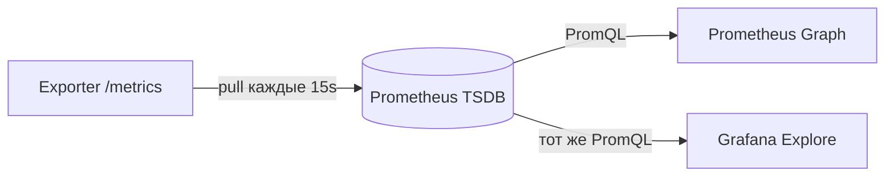

import ExternalCodeEmbed from '@site/src/components/ExternalCodeEmbed';


import ExternalPlayEmbed from '@site/src/components/ExternalPlayEmbed';


# Prometheus + Grafana — запросы

<div class="article-tags">
  <span class="tag tag-notrequired">НЕ ОБЯЗАТЕЛЬНО</span>
  <span class="tag tag-beginner">ДЛЯ НОВИЧКОВ</span>
</div>

Приветствую! Здесь вы наверняка найдете, что ищете. Примеры в лаборатории рассчитаны на то, что мы разбираем что-то конкретное.

Текущая статья посвящена запросам PromQL и дашбордам Prometheus + Grafana.

Поэтому за теорией по текущей теме вам — в [энциклопедию](/encyclopedia/intro).
Если ещё не погружались, то маршрут прост:

1. [Основы](/section/basics)
2. [Система и сеть](/section/system-network)
3. [Данные и разметка](/section/data-markup)
4. [Код и разработка](/section/code-dev)
5. [Языки](/section/languages)
6. [Искусственный интеллект](/section/ai)
7. [Проект](/section/project)
8. [Инфраструктура и безопасность](/section/infra-security)
9. [Спин-офф](/section/spinoff)

Обязательно пройдитесь.

А теперь приступим к нашему предмету.

<div class="callout callout--tip">
  <div class="callout-title">Теория и соседние материалы</div>

  <div class="callout-body">
  Поднять Prometheus и Grafana — [практикум, шаг 2](/encyclopedia/2-system-network/2-06-sistemnoe-administrirovanie/prometheus-grafana-praktikum/2) или минимальный [compose-стек №8](/lab/Примеры/11111#8-prometheus--grafana-минимум).

  Теория — [мониторинг и метрики](/encyclopedia/2-system-network/2-06-sistemnoe-administrirovanie/92).

  Пошаговый маршрут PromQL — [практикум, шаг 3](/encyclopedia/2-system-network/2-06-sistemnoe-administrirovanie/prometheus-grafana-praktikum/3); дашборды — [шаг 4](/encyclopedia/2-system-network/2-06-sistemnoe-administrirovanie/prometheus-grafana-praktikum/4).
</div>
</div>

---

<div class="callout callout--info">
  <div class="callout-title">Как устроен каждый пример ниже</div>

  <div class="callout-body">
  <strong>Задача</strong> — что вы получите и цель.<br />
  <strong>PromQL</strong> — готовая строка для копирования.<br />
  <strong>Что делает запрос целиком</strong> — логика «снаружи внутрь» простыми словами.<br />
  <strong>Разбор по частям</strong> — таблица «что означает каждый фрагмент».<br />
  <strong>Что увидите</strong> — пример ответа в Table или на графике.<br />
  <strong>Попробуйте</strong> — маленький эксперимент для закрепления.<br />
  <strong>Частая ошибка</strong> — типичный промах новичков.<br />
  Так же устроены <a href="/lab/Примеры/111">Turtle</a>, <a href="/lab/Примеры/1145">Fetch</a> и <a href="/lab/Примеры/11111">Docker Compose</a> — сначала код, потом объяснение.
</div>
</div>

---

## Как выполнить любой запрос

### Вариант 1 — Prometheus UI (самый быстрый)

1. Откройте `http://localhost:9090` (или ваш `<PORT_PROM>` из compose).
2. Вкладка **Graph** — график во времени; **Table** — число «прямо сейчас».
3. В поле **Expression** вставьте PromQL.
4. **Execute** → переключите **Graph** / **Table**.

**Разбор интерфейса:**

| Элемент | Смысл |
|---------|--------|
| **Expression** | Поле ввода PromQL — как формула в Excel |
| **Execute** | Выполнить запрос к базе метрик |
| **Graph** | Линии по оси времени |
| **Table** | Таблица label → значение на выбранный момент |
| **Evaluation time** | «На какой момент» считать Table — по умолчанию «сейчас» |

**Попробуйте:** вставьте `up` → **Execute** → **Table**. На минимальном стенде увидите одну строку.

---

### Вариант 2 — Grafana Explore

1. `http://localhost:3000` → логин `admin` / `admin`.
2. Меню слева → **Explore** (иконка компаса).
3. Data source — **Prometheus**.
4. Вставьте тот же PromQL → **Run query**.

**Зачем Grafana, если есть Prometheus:** красивые дашборды, переменные `$job`, легенда `&#123;&#123;instance&#125;&#125;`, несколько панелей на одном экране.

---

### Вариант 3 — панель дашборда

**Dashboards → New → New dashboard → Add visualization → Prometheus** — запрос, тип **Time series** / **Stat** / **Gauge**. Подробнее — [раздел Grafana](#grafana-панели-и-переменные).

---

## Синтаксис PromQL

PromQL читают **слева направо**, как формулу:

```text
функция( метрика{фильтр}[окно] ) by (группировка)
```

| Фрагмент | Простыми словами | Пример |
|----------|------------------|--------|
| `http_requests_total` | Имя метрики | «Счётчик HTTP-запросов» |
| `&#123;job="api"&#125;` | Фильтр по label | Только job api |
| `[5m]` | Окно истории | Последние 5 минут точек |
| `rate(..)` | Функция | «Скорость роста counter в секунду» |
| `sum(..) by (job)` | Агрегация | Сложить и разбить по job |



**Два адреса** — как в Docker Compose:

| Откуда | Куда подключаться |
|--------|-------------------|
| Браузер на вашем ПК | `http://localhost:9090` — UI Prometheus |
| Grafana в контейнере → Prometheus | `http://prometheus:9090` — **имя сервиса** из compose, не `localhost` |

---

## Три типа метрик — запомните раз и навсегда

| Тип | Поведение | Пример имени | Как строить график «в секунду» |
|-----|-----------|--------------|--------------------------------|
| **Counter** | Только растёт (сброс при рестарте) | `http_requests_total` | Обязательно `rate()` или `increase()` |
| **Gauge** | Может расти и падать | `node_memory_MemAvailable_bytes` | Читать как есть, **без** `rate()` |
| **Histogram** | Распределение по «корзинам» | `http_request_duration_seconds_bucket` | `rate()` по bucket + `histogram_quantile()` |

**Аналогии:**

- Counter — **одометр** автомобиля (километры только прибавляются).
- Gauge — **спидометр** (скорость сейчас 60, через минуту 0).
- Histogram — **корзины** «сколько запросов уложилось в 0.1 с, 0.5 с, 1 с…».

---

## Навигация по примерам

| Ищут в интернете | Раздел ниже |
|------------------|-------------|
| promql up / prometheus up query / check if target is up | [Обязательный шаблон up](#обязательный-шаблон-up) |
| prometheus rate example / rate counter promql | [Counter — RPS](#11-запросов-http-в-секунду-rps) |
| node_exporter cpu promql / prometheus cpu usage query | [CPU хоста](#21-загрузка-cpu-node_exporter) |
| prometheus memory usage query / node_memory | [Память](#22-свободная-память-процент) |
| prometheus disk usage promql / filesystem full | [Диск](#23-заполнение-диска) |
| http_requests_total promql / 5xx rate prometheus | [HTTP и ошибки](#3-http-запросы-и-ошибки) |
| histogram_quantile promql / p99 latency grafana | [P99 latency](#41-p99-latency-http) |
| promql sum by / avg by example | [Агрегации](#5-агрегации-sum-avg-by) |
| grafana prometheus query variable / label_values | [Переменные Grafana](#grafana-панели-и-переменные) |
| prometheus alert rule example / alertmanager | [Алерты](#6-запросы-для-алертов) |
| prometheus query empty / no data grafana | [Типичные ошибки](#типичные-ошибки) |

---

## Основы — с чего начать

<span id="обязательный-шаблон-up"></span>

### Обязательный шаблон — `up`

Любой мониторинг начинается с вопроса: **жив ли сервис, который мы опрашиваем?** Prometheus сам создаёт метрику `up` для каждого target из `prometheus.yml`.

**Задача:** увидеть, какие jobs доступны. Поиск: *prometheus up query*, *promql check target*.

```promql
up
```

**Что делает запрос целиком:**

1. Берёт **все** time series с именем `up`.
2. На каждом scrape Prometheus записывает `1` (успех) или `0` (ошибка).
3. В Table вы видите текущее значение и labels `job`, `instance`.

**Разбор по частям:**

| Часть | Что происходит | Зачем |
|-------|----------------|-------|
| `up` | Имя встроенной метрики | Не нужно настраивать — появляется автоматически |
| Без `{..}` | Без фильтра | Показать **все** targets сразу |
| Значение `1` | Последний scrape успешен | Exporter ответил, порт открыт |
| Значение `0` | Scrape упал | Сервис выключен, неверный порт, firewall |
| Label `job` | Имя job из `prometheus.yml` | Группировка «prometheus», «node», «windows» |
| Label `instance` | `host:port` target | Какой именно хост |

**Что увидите в Table** (минимальный стенд):

```text
up{instance="localhost:9090", job="prometheus"}    1
```

**Легенда в Grafana:** `&#123;&#123;job&#125;&#125; / &#123;&#123;instance&#125;&#125;`

**Попробуйте:** остановите контейнер с exporter → подождите один scrape (15–30 с) → снова `up` — значение станет `0`.

**Частая ошибка:** путать `up` с health-check приложения. `up=1` значит лишь «Prometheus **достучался** до `/metrics`», а не «бизнес-логика работает идеально».

---

#### Фильтр по одному job

**Задача:** проверить только Prometheus, без остальных targets.

```promql
up{job="prometheus"}
```

**Разбор по частям:**

| Часть | Смысл |
|-------|--------|
| `{` `}` | **Селектор labels** — фильтр, как `WHERE` в SQL |
| `job="prometheus"` | Точное совпадение: label `job` равен строке `prometheus` |
| `".."` | Строковые labels **всегда** в двойных кавычках |

**Что увидите:** одна строка со значением `1`, если job `prometheus` в конфиге и scrape работает.

**Попробуйте:** замените на `up&#123;job="no-such-job"&#125;` — Table будет **пустой**. Пустой результат ≠ ошибка синтаксиса.

---

#### Сколько targets лежат

**Задача:** одно число «сколько сервисов недоступно» для панели Stat.

```promql
count(up == 0)
```

**Что делает запрос целиком:**

1. `up == 0` — для каждого ряда: true (1) если down, false (0) если up.
2. `count(..)` — считает, сколько рядов с ненулевым результатом.

**Разбор по частям:**

| Часть | Смысл |
|-------|--------|
| `== 0` | Сравнение — оставляет только «упавшие» |
| `count` | Агрегатор — количество серий |
| Результат `0` | Все targets живы — хороший знак для учебного стенда |

**Панель Grafana:** тип **Stat**, порог красный если `> 0`.

---

### Стартовые запросы

#### Сколько метрик хранит Prometheus

**Задача:** понять, не «раздулась» ли база. Поиск: *prometheus_tsdb_head_series*.

```promql
prometheus_tsdb_head_series
```

**Что делает запрос:** возвращает одно число — сколько **time series** (уникальных комбинаций метрика+labels) сейчас в памяти TSDB.

**Разбор:**

| Часть | Смысл |
|-------|--------|
| `prometheus_tsdb_head_series` | Встроенная gauge-метрика самого Prometheus |
| Рост с 500 до 500 000 за день | Часто **cardinality explosion** — слишком много labels (например `user_id` в каждом запросе) |

**Что увидите:** на маленьком стенде — от сотен до нескольких тысяч. На проде — смотрят динамику, не абсолют.

---

#### Версия Prometheus

```promql
prometheus_build_info
```

**Разбор:** info-метрика — значение всегда `1`, версия сидит в **labels** `version`, `goversion`, `revision`.

**Что увидите в Table:**

```text
prometheus_build_info{version="2.53.0", ..}    1
```

**Зачем:** на дашборде «инфраструктура» сразу видно, какой бинарник крутится после `docker compose pull`.

---

#### Длительность scrape

**Задача:** target отвечает медленно? Поиск: *scrape_duration_seconds prometheus*.

```promql
scrape_duration_seconds
```

**Разбор по частям:**

| Часть | Смысл |
|-------|--------|
| `scrape_duration_seconds` | Сколько секунд длился **последний** опрос каждого target |
| Значение `0.05` | 50 ms — нормально |
| Значение `> 1` при `scrape_interval: 15s` | Тяжёлый `/metrics` или сеть тормозит — риск пропуска scrape |

**Попробуйте:** в Grafana постройте Time series — резкий скачок после деплоя часто означает «приложение отдало огромный /metrics».

---

## Примеры запросов

### 1. Counter — скорость событий

Counter (`*_total`, `*_count`) **монотонно растёт**. Если построить график «как есть», получится восходящая линия «сколько всего накопилось с установки» — для мониторинга нагрузки так **не** смотрят. Нужна **скорость** — функции `rate()` или `increase()`.

**Откуда берётся `http_requests_total`** — фрагмент текста с `/metrics` приложения:

```text
# HELP http_requests_total Total HTTP requests
# TYPE http_requests_total counter
http_requests_total{method="GET",status="200"} 15234
http_requests_total{method="POST",status="500"} 3
```

Каждая строка с уникальными labels — **отдельный ряд** на графике.

---

<span id="11-запросов-http-в-секунду-rps"></span>

#### 1.1. Запросов HTTP в секунду (RPS)

**Задача:** «сколько запросов в секунду в среднем за 5 минут». Поиск: *prometheus rate example*, *http_requests_total rate*.

```promql
rate(http_requests_total[5m])
```

**Что делает запрос целиком:**

1. Берёт counter `http_requests_total` за последние **5 минут** (`[5m]`).
2. `rate()` считает среднюю скорость роста в **единицах в секунду**.
3. Если labels `method`, `status`, `job` различаются — на графике **несколько линий**.

**Разбор по частям:**

| Часть | Что происходит | Зачем |
|-------|----------------|-------|
| `http_requests_total` | Имя counter-метрики | Сколько запросов накопилось с запуска |
| `[5m]` | Range vector — окно 5 минут | Без окна `rate` не работает |
| `rate(..)` | Производная counter с учётом сброса при рестарте | «Запросов в секунду», а не «всего за всё время» |
| Несколько рядов | Разные `&#123;method=.., status=..&#125;` | Каждая комбинация labels — своя линия |

**Правило окна:** `[5m]` ≥ **2 × scrape_interval**. При scrape 15s разумно `[1m]`–`[5m]`; `[30s]` — минимум, но график шумнее.

**Что увидите:** если приложение не шлёт `http_requests_total`, Table **пустая** — подключите exporter или [шаг 5 практикума](/encyclopedia/2-system-network/2-06-sistemnoe-administrirovanie/prometheus-grafana-praktikum/5).

**Попробуйте:** смените `[5m]` на `[1h]` — линия сгладится, реакция на всплеск станет медленнее.

**Частая ошибка:** применять `rate()` к **gauge** (память, температура) — получите бессмысленный «шум». Gauge читают напрямую.

---

#### 1.2. Сумма RPS по job

**Задача:** одна линия «весь RPS сервиса api», без разбивки по status.

```promql
sum(rate(http_requests_total[5m])) by (job)
```

**Что делает запрос целиком:**

1. `rate(..)` — RPS каждого ряда.
2. `sum(..) by (job)` — складывает все status/method **внутри одного job**.

**Разбор по частям:**

| Часть | Смысл |
|-------|--------|
| `sum` | Сложить значения matching рядов |
| `by (job)` | Отдельная сумма для каждого `job` |
| Без `by (job)` | Одна линия «всё на всех jobs» |

**Попробуйте:** уберите `by (job)` — линии схлопнутся в одну. Так проверяют, нужна ли группировка.

---

#### 1.3. Только ошибки 5xx

**Задача:** RPS ответов с кодами 500–599. Поиск: *prometheus 5xx rate*.

```promql
sum(rate(http_requests_total{status=~"5."}[5m])) by (job)
```

**Разбор по частям:**

| Часть | Смысл |
|-------|--------|
| `&#123;status=~"5."&#125;` | Фильтр: label `status` совпадает с regex |
| `=~` | «matches regex» (как `LIKE` в SQL) |
| `5.` | Цифра `5`, затем любые два символа → 500, 502, 503… |
| `!=` / `!~` | Отрицание — «всё, кроме» |

**Что увидите:** линия около нуля на здоровом стенде; всплеск при симуляции ошибок.

**Попробуйте:** замените на `&#123;status=~"4."&#125;` — увидите клиентские ошибки 4xx.

---

#### 1.4. Доля ошибок (error rate)

**Задача:** «какой процент запросов — 5xx». Поиск: *prometheus error rate query*.

```promql
sum(rate(http_requests_total{status=~"5."}[5m]))
/
sum(rate(http_requests_total[5m]))
```

**Что делает запрос целиком:**

1. Числитель — RPS ошибок 5xx.
2. Знаменатель — общий RPS.
3. Деление — доля от 0 до 1.

**Разбор по частям:**

| Часть | Смысл |
|-------|--------|
| `/` | Побочные labels должны **совпадать** — здесь оба `sum` без лишних labels |
| Результат `0.02` | 2% запросов — ошибки |
| Grafana Unit | **Percent (0.0–1.0)** или умножить на 100 |

**Что увидите:** на учебном стенде без трафика — `NaN` или пусто (деление на 0). Нагрузите API через [curl](/lab/Примеры/1133) — появятся числа.

**Частая ошибка:** делить **сырые** counters без `rate()` — получится бессмыслица, потому что counters всегда растут.

---

#### 1.5. Сколько событий за час — increase

**Задача:** «сколько запросов за последний час» (не в секунду). Поиск: *prometheus increase vs rate*.

```promql
increase(http_requests_total[1h])
```

**Разбор по частям:**

| Часть | Смысл |
|-------|--------|
| `increase` | Насколько вырос counter за окно (с экстраполяцией при сбросе) |
| `[1h]` | За последний час |
| `rate` vs `increase` | `rate` — в секунду; `increase` — сумма за окно |

**Когда что брать:**

| Вопрос | Функция |
|--------|---------|
| Запросов **в секунду** | `rate(..[5m])` |
| Запросов **за час / за сутки** | `increase(..[1h])` |

---

### 2. Gauge — загрузка CPU и памяти

Gauge — «сколько **сейчас**». **Не** оборачивайте в `rate()` без причины.

<span id="21-загрузка-cpu-node_exporter"></span>

#### 2.1. Загрузка CPU (node_exporter)

**Задача:** процент занятости CPU по каждому серверу. Поиск: *node_exporter cpu promql*, *prometheus cpu usage query*.

```promql
100 - (
  avg by (instance) (
    rate(node_cpu_seconds_total{mode="idle"}[5m])
  ) * 100
)
```

**Что делает запрос целиком:**

1. `node_cpu_seconds_total&#123;mode="idle"&#125;` — counter «сколько секунд CPU **простаивал**».
2. `rate(..[5m])` — доля idle в секунду (от 0 до 1).
3. `avg by (instance)` — усреднить по **ядрам** одного хоста.
4. `* 100` → проценты idle.
5. `100 - ..` → процент **занятости**.

**Разбор по частям:**

| Шаг | Фрагмент | Смысл |
|-----|----------|--------|
| 1 | `node_cpu_seconds_total` | Counter от node_exporter — секунды CPU по режимам |
| 2 | `&#123;mode="idle"&#125;` | Только время простоя |
| 3 | `rate(..[5m])` | Counter → скорость; здесь «доля idle» |
| 4 | `avg by (instance)` | На 8 ядрах — 8 рядов → одно число на хост |
| 5 | `100 - (..)*100` | Инверсия idle → **utilization %** |

**Что увидите:** без node_exporter — **пусто**. После [шага 5](/encyclopedia/2-system-network/2-06-sistemnoe-administrirovanie/prometheus-grafana-praktikum/5) — линия 5–40% на idle-стенде.

**Windows:** метрики другие — дашборд [Grafana 14694](https://grafana.com/grafana/dashboards/14694).

**Попробуйте:** запустите `stress-ng --cpu 4` на Linux-хосте — линия CPU вырастет за 1–2 минуты.

**Частая ошибка:** забыть `&#123;mode="idle"&#125;` — попадут все режимы CPU, формула станет неверной.

---

<span id="22-свободная-память-процент"></span>

#### 2.2. Свободная память (процент)

**Задача:** «сколько RAM свободно в %». Поиск: *prometheus memory usage node_exporter*.

```promql
node_memory_MemAvailable_bytes
/
node_memory_MemTotal_bytes
* 100
```

**Что делает запрос целиком:** делит доступную память на общую и умножает на 100.

**Разбор по частям:**

| Часть | Смысл |
|-------|--------|
| `MemAvailable_bytes` | Память, которую можно выделить **без** swap (Linux) |
| `MemTotal_bytes` | Объём RAM |
| Результат `73.5` | 73.5% RAM **свободно** |
| «Занято» | `100 - (этот запрос)` |

**Grafana:** Unit → **Percent (0–100)**.

---

<span id="23-заполнение-диска"></span>

#### 2.3. Заполнение диска

**Задача:** «насколько заполнен каждый раздел». Поиск: *prometheus disk usage promql*.

```promql
(
  1 -
  node_filesystem_avail_bytes{fstype!~"tmpfs|overlay"}
  /
  node_filesystem_size_bytes{fstype!~"tmpfs|overlay"}
) * 100
```

**Что делает запрос целиком:**

1. `avail / size` — доля **свободного** места.
2. `1 - ..` — переворот в «занято».
3. `* 100` — проценты.
4. Фильтр `fstype` убирает tmpfs и overlay Docker.

**Разбор по частям:**

| Часть | Смысл |
|-------|--------|
| `node_filesystem_avail_bytes` | Свободные байты на mountpoint |
| `node_filesystem_size_bytes` | Размер раздела |
| `fstype!~"tmpfs|overlay"` | Исключить виртуальные ФС — они дают «100%» и путают |
| Labels `mountpoint="/"` | Отдельная линия на `/`, `/home`, … |

**Что увидите:** несколько линий — по одной на каждый реальный диск.

**Попробуйте:** добавьте `&#123;mountpoint="/"&#125;` к обеим метрикам — только корневой раздел.

**Алерт > 90%** — [раздел 6.1](#61-диск-заполнен-более-чем-на-90).

---

#### 2.4. Load average (Linux)

```promql
node_load1
```

**Разбор:**

| Часть | Смысл |
|-------|--------|
| `node_load1` | Средняя длина очереди задач за 1 минуту |
| Интерпретация | Сравните с числом CPU: load **8** на 4 ядрах — перегруз |

Gauge — **без** `rate()`.

---

### 3. HTTP-запросы и ошибки

#### 3.1. RPS по методу и статусу

**Задача:** разложить трафик — GET 200 отдельно от POST 500.

```promql
sum(rate(http_requests_total[5m])) by (method, status)
```

**Grafana Legend:** `&#123;&#123;method&#125;&#125; &#123;&#123;status&#125;&#125;`

**Что увидите:** несколько линий — `GET 200`, `POST 201`, …

---

#### 3.2. Только успешные GET

```promql
sum(rate(http_requests_total{method="GET", status="200"}[5m])) by (job)
```

**Разбор:** два фильтра в селекторе через запятую — **И** (AND).

---

#### 3.3. Top-3 job по RPS

**Задача:** «кто больше всех нагружает». Поиск: *promql topk example*.

```promql
topk(3, sum(rate(http_requests_total[5m])) by (job))
```

**Разбор:**

| Функция | Смысл |
|---------|--------|
| `topk(3, expr)` | Только **3** ряда с максимальным значением |
| `bottomk(3, expr)` | 3 наименьших — «самые тихие» сервисы |

---

### 4. Histogram — latency и перцентили

Histogram создаёт **три** семейства рядов:

```text
http_request_duration_seconds_bucket{le="0.1"} 1200
http_request_duration_seconds_bucket{le="0.5"} 3400
http_request_duration_seconds_bucket{le="+Inf"} 3500
http_request_duration_seconds_sum 890.2
http_request_duration_seconds_count 3500
```

| Суффикс | Смысл |
|---------|--------|
| `_bucket&#123;le=".."&#125;` | Сколько запросов уложилось **не дольше** le |
| `_sum` | Сумма всех времён (для среднего) |
| `_count` | Количество запросов |

Label **`le`** (less or equal) **обязателен** в `sum by (le)` — иначе перцентиль сломается.

---

<span id="41-p99-latency-http"></span>

#### 4.1. P99 latency HTTP

**Задача:** «99% запросов быстрее чем X секунд». Поиск: *histogram_quantile promql*, *p99 latency grafana*.

```promql
histogram_quantile(
  0.99,
  sum by (le, job) (
    rate(http_request_duration_seconds_bucket[5m])
  )
)
```

**Что делает запрос целиком:**

1. `rate(.._bucket[5m])` — скорость попаданий в каждую «корзину» времени.
2. `sum by (le, job)` — сложить bucket **с сохранением** `le` (границы корзин).
3. `histogram_quantile(0.99, ..)` — статистическая оценка 99-го перцентиля.

**Разбор по частям:**

| Часть | Смысл |
|-------|--------|
| `0.99` | 99-й перцентиль (0.50 = медиана, 0.95 = P95) |
| `_bucket` | Counter корзин histogram |
| `le` | Верхняя граница bucket: 0.1, 0.5, 1, +Inf |
| `sum by (le, job)` | **`le` нельзя выкинуть** — без него quantile бессмысленен |
| Результат `0.34` | 99% запросов быстрее 340 ms |

**Grafana:** Unit → **seconds (s)**; для ms умножьте весь expr на `1000`.

**Попробуйте:** смените `0.99` на `0.50` — медиана обычно ниже P99.

**Частая ошибка:** `histogram_quantile` **без** `rate()` по bucket — на counter напрямую quantile не работает.

---

#### 4.2. P50, P95 и P99 на одной панели

В Grafana добавьте **три** Query (A, B, C):

```promql
histogram_quantile(0.50, sum by (le) (rate(http_request_duration_seconds_bucket[5m])))
```

```promql
histogram_quantile(0.95, sum by (le) (rate(http_request_duration_seconds_bucket[5m])))
```

```promql
histogram_quantile(0.99, sum by (le) (rate(http_request_duration_seconds_bucket[5m])))
```

| Query | Legend | Смысл |
|-------|--------|--------|
| A | `P50` | Медиана — «типичный» запрос |
| B | `P95` | 5% медленнее |
| C | `P99` | 1% самых медленных — «хвост» |

---

#### 4.3. Средняя latency (не перцентиль)

```promql
sum(rate(http_request_duration_seconds_sum[5m]))
/
sum(rate(http_request_duration_seconds_count[5m]))
```

**Разбор:**

| Часть | Смысл |
|-------|--------|
| `_sum / _count` | Классическое среднее арифметическое |
| vs P99 | Среднее **тянут** редкие таймауты; P99 показывает «худших 1%» |

---

### 5. Агрегации — sum, avg, by

#### 5.1. Одна линия — общий RPS

```promql
sum(rate(http_requests_total[5m]))
```

**Разбор:** все labels схлопываются — одна цифра «весь кластер».

---

#### 5.2. Средний сетевой приём по хосту

```promql
avg by (instance) (rate(node_network_receive_bytes_total[5m]))
```

**Разбор:** counter байт → `rate` = байт/с; `avg by (instance)` — если несколько интерфейсов, усредняет (часто лучше `sum by (instance)` для total traffic).

---

#### 5.3. Максимальная загрузка CPU среди хостов job

```promql
max by (job) (
  100 - avg by (instance) (rate(node_cpu_seconds_total{mode="idle"}[5m])) * 100
)
```

**Разбор:** внутри — CPU% каждого instance; снаружи `max by (job)` — «самый горячий» хост в job.

---

#### 5.4. Сколько targets живы

```promql
count(up == 1)
```

**Панель Stat:** «3 из 3 UP».

---

### 6. Запросы для алертов

В правилах алертинга expr должен стать **true (1)**, когда проблема есть. В Prometheus rule добавляют `for: 5m`, чтобы не будить ночью из-за секундного всплеска.

<span id="61-диск-заполнен-более-чем-на-90"></span>

#### 6.1. Диск заполнен более чем на 90%

**PromQL (условие):**

```promql
(
  1 -
  node_filesystem_avail_bytes{fstype!~"tmpfs|overlay"}
  /
  node_filesystem_size_bytes{fstype!~"tmpfs|overlay"}
) * 100 > 90
```

**Файл `rules/disk.yml` — разбор по строкам:**


<ExternalCodeEmbed example="yaml/lab-11114-001" title="6.1. Диск заполнен более чем на 90%" minHeight={318} />


| Строка | Смысл |
|--------|--------|
| `groups:` | Набор правил в одном файле |
| `alert: DiskAlmostFull` | Имя алерта в UI Alertmanager |
| `expr:` | PromQL — когда выражение true, алерт **pending** |
| `for: 5m` | Должен быть true **5 минут подряд** → **firing** |
| `labels.severity` | Маршрутизация (warning / critical) |
| `annotations.summary` | Текст для Telegram/Slack; `&#123;&#123; $labels.mountpoint &#125;&#125;` подставляется из метрики |

---

#### 6.2. Target недоступен

```promql
up == 0
```

**Разбор:** самый простой алерт — любой down target.

**For:** `2m` — exporter перезапускается быстрее, чем диск заполняется.

---

#### 6.3. Error rate выше 5%

```promql
sum(rate(http_requests_total{status=~"5."}[5m]))
/
sum(rate(http_requests_total[5m]))
> 0.05
```

**Разбор:** `> 0.05` = больше 5% RPS — ошибки.

---

#### 6.4. P99 latency выше 2 секунд

```promql
histogram_quantile(
  0.99,
  sum by (le) (rate(http_request_duration_seconds_bucket[5m]))
) > 2
```

**Разбор:** 2 — секунды; для ms используйте `> 0.5` (500 ms).

---

#### 6.5. Recording rule — предвычисленный RPS

**Задача:** не пересчитывать длинный `rate()` на каждой панели.

```yaml
groups:
  - name: api_rules
    interval: 30s
    rules:
      - record: job:http_requests:rate5m
        expr: sum by (job) (rate(http_requests_total[5m]))
```

**Разбор по строкам:**

| Строка | Смысл |
|--------|--------|
| `record:` | Имя **новой** метрики, которую Prometheus сам записывает |
| `job:http_requests:rate5m` | Соглашение имён: `level:metric:window` |
| `interval: 30s` | Как часто пересчитывать |
| `expr:` | Исходный PromQL |

**На дашборде:**

```promql
job:http_requests:rate5m
```

**Зачем:** дашборд с 20 панелями не нагружает TSDB одним и тем же тяжёлым запросом 20 раз.

---

## Grafana — панели и переменные

### Первая панель — Stat «Targets UP»

**Задача:** одно большое число «сколько сервисов мониторим».

| Шаг в UI | Значение |
|----------|----------|
| Visualization | **Stat** |
| Query | `sum(up)` |
| Value options → Show | **Calculate** → **Last** |
| Thresholds | Base **green**; добавить step **red** если `< 1` (для стенда с 1 target — настройте под себя) |

**Разбор запроса `sum(up)`:** складывает все `up` (каждый = 0 или 1) → «сколько targets в состоянии up».

---

### Time series — CPU

| Шаг | Значение |
|-----|----------|
| Query A | [формула CPU](#21-загрузка-cpu-node_exporter) |
| Legend | `&#123;&#123;instance&#125;&#125;` |
| Unit | **Percent (0–100)** |
| Min / Max | 0 / 100 (опционально — фиксирует шкалу) |

**Legend `&#123;&#123;instance&#125;&#125;`:** подставляет label `instance` в подпись линии — `192.168.1.10:9100`.

---

### Переменная `$job`

**Dashboard settings → Variables → Add variable**

| Поле | Значение | Зачем |
|------|----------|--------|
| Name | `job` | В запросах пишут `$job` |
| Type | Query | Список из Prometheus |
| Data source | Prometheus | |
| Query | `label_values(up, job)` | Все значения label `job` |
| Multi-value | On | Выбрать несколько jobs |
| Include All option | On | Пункт «All» в dropdown |

**Запрос на панели:**

```promql
sum(rate(http_requests_total{job="$job"}[5m])) by (status)
```

**Разбор:**

| Часть | Смысл |
|-------|--------|
| `$job` | Grafana подставляет выбранное значение |
| `$job` = All | Разворачивается в regex `job=~"a|b|c"` |
| `by (status)` | Отдельная линия на 200, 404, 500… |

**Попробуйте:** смените job в dropdown — график перестроится без правки PromQL.

---

### Переменная `$instance` (зависимая)

**Query variable:**

```promql
label_values(up{job="$job"}, instance)
```

**Разбор:** список instance **только** для выбранного job — «каскадный» фильтр.

**Запрос панели:**

```promql
up{job="$job", instance="$instance"}
```

---

### Explore — сравнение «вчера / сегодня»

1. Explore → введите `sum(rate(http_requests_total[5m]))`.
2. Справа **Split** — два окна.
3. В правом окне **Time range** → **Yesterday**.

**Зачем:** после деплоя видно, вырос ли RPS или latency относительно вчерашнего дня.

---

## Селекторы — шпаргалка


<ExternalCodeEmbed example="promql/lab-11114-002" title="Селекторы — шпаргалка" minHeight={318} />


| Оператор | Смысл | Пример |
|----------|--------|--------|
| `=` | равно | `job="api"` |
| `!=` | не равно | `status!="200"` |
| `=~` | regex match | `status=~"5."` |
| `!~` | regex not match | `fstype!~"tmpfs|overlay"` |

---

## Типичные ошибки

| Симптом | Причина | Исправление |
|---------|---------|-------------|
| Пустой график | Нет метрики на стенде | **Status → TSDB** или `&#123;__name__=~".+"&#125;` |
| `rate()` на gauge | Gauge — не counter | Уберите `rate`, читайте напрямую |
| Дёргающийся график | Окно `[1m]` при scrape 30s | Увеличьте до `[5m]` |
| Все линии слиплись | Нет `by (label)` | `sum by (job)` или `by (status)` |
| P99 = NaN | Мало точек в bucket | Подождите 2–3 × scrape_interval |
| Grafana No data, Prometheus OK | URL datasource | `http://prometheus:9090`, не localhost |
| `parse error` | Кавычки labels | `job="api"`, не `job=api` |

<div class="callout callout--warning">
  <div class="callout-title">Cardinality</div>

  <div class="callout-body">
  Не кладите в labels `user_id`, `order_id`, полный URL — на каждое значение Prometheus создаёт отдельный ряд.

  Миллионы рядов «положат» TSDB.

  Для id запроса — [логи и трассировки](/encyclopedia/2-system-network/2-06-sistemnoe-administrirovanie/prometheus-grafana-praktikum/7).
</div>
</div>

---

## Переиспользуемые шаблоны

### Availability — три панели Stat

```promql
count(up == 1)
```

```promql
count(up == 0)
```

```promql
avg(up)
```

| Панель | Смысл |
|--------|--------|
| 1 | Сколько targets UP |
| 2 | Сколько DOWN (должно быть 0) |
| 3 | Доля доступных 0…1 |

---

### HTTP dashboard — RPS, errors, P99

```promql
sum(rate(http_requests_total[5m]))
```

```promql
sum(rate(http_requests_total{status=~"5."}[5m]))
/ sum(rate(http_requests_total[5m]))
```

```promql
histogram_quantile(0.99, sum by (le) (rate(http_request_duration_seconds_bucket[5m])))
```

Три панели — «здоровье API» для слайда лабораторной.

---

### node_exporter — хост целиком

```promql
100 - (avg by (instance) (rate(node_cpu_seconds_total{mode="idle"}[5m])) * 100)
```

```promql
node_memory_MemAvailable_bytes / node_memory_MemTotal_bytes * 100
```

```promql
(1 - node_filesystem_avail_bytes{mountpoint="/"} / node_filesystem_size_bytes{mountpoint="/"}) * 100
```

| Панель | Метрика |
|--------|---------|
| CPU % | Занятость процессора |
| Memory % | Свободная RAM |
| Disk % | Заполненность `/` |

---

## Связь с практикумом

| Шаг | Что отработать из этой галереи |
|-----|----------------------------------|
| [Практикум Prometheus — установка и первые метрики — установка](/encyclopedia/2-system-network/2-06-sistemnoe-administrirovanie/prometheus-grafana-praktikum/2) | `up`, `prometheus_build_info`, UI Graph |
| [Практикум Prometheus — типы метрик и PromQL — PromQL](/encyclopedia/2-system-network/2-06-sistemnoe-administrirovanie/prometheus-grafana-praktikum/3) | Counter, Gauge, Histogram |
| [Практикум Grafana — источники данных и дашборды — Grafana](/encyclopedia/2-system-network/2-06-sistemnoe-administrirovanie/prometheus-grafana-praktikum/4) | Панели, переменные, Explore |
| [Практикум Prometheus — экспортёры и инструментирование — exporters](/encyclopedia/2-system-network/2-06-sistemnoe-administrirovanie/prometheus-grafana-praktikum/5) | `node_*`, `/metrics` приложения |
| [Практикум Prometheus — Alertmanager и Grafana Alerting — алерты](/encyclopedia/2-system-network/2-06-sistemnoe-administrirovanie/prometheus-grafana-praktikum/6) | Раздел 6, YAML rules |

---

## Официальные материалы

- [PromQL basics](https://prometheus.io/docs/prometheus/latest/querying/basics/)
- [Query functions](https://prometheus.io/docs/prometheus/latest/querying/functions/)
- [Understanding metric types](https://prometheus.io/docs/tutorials/understanding_metric_types/)
- [Visualizing with Grafana](https://prometheus.io/docs/tutorials/visualizing_metrics_using_grafana/)
- [Prometheus workshop (PromQL)](https://github.com/juliusv/prometheus_workshop/blob/master/workshop.md)

---
