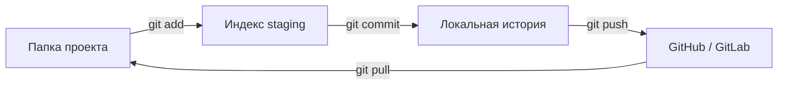

# Git — шпаргалка сценариев

<div class="article-tags">
  <span class="tag tag-notrequired">НЕ ОБЯЗАТЕЛЬНО</span>
  <span class="tag tag-beginner">ДЛЯ НОВИЧКОВ</span>
</div>

Приветствую! Здесь вы наверняка найдете, что ищете. Примеры в лаборатории рассчитаны на то, что мы разбираем что-то конкретное.

Текущая статья посвящена git init, add, commit, push, pull, ветки, merge и откат: примеры команд с построчным разбором для курсовой, практики и первого GitHub..

Поэтому за теорией по текущей теме вам — в [энциклопедию](/encyclopedia/intro).
Если ещё не погружались, то маршрут прост:

1. [Основы](/section/basics)
2. [Система и сеть](/section/system-network)
3. [Данные и разметка](/section/data-markup)
4. [Код и разработка](/section/code-dev)
5. [Языки](/section/languages)
6. [Искусственный интеллект](/section/ai)
7. [Проект](/section/project)
8. [Инфраструктура и безопасность](/section/infra-security)
9. [Спин-офф](/section/spinoff)

Обязательно пройдитесь.

А теперь приступим к нашему предмету.

<div class="callout callout--tip">
  <div class="callout-title">Теория и соседние материалы</div>

  <div class="callout-body">
  Цепочка `add → commit → push` и четыре уровня хранения — [Как работать с Git](/encyclopedia/4-code-dev/4-13-osnovy-raboty-s-git/112).

  Ветки и Pull Request — [Ветвление и слияние](/encyclopedia/4-code-dev/4-13-osnovy-raboty-s-git/113).

  Интерактивный тренажёр — [Learn Git Branching](https://learngitbranching.js.org/?locale=ru_RU) (на русском).
</div>
</div>

---
## Четыре уровня — куда попадают ваши файлы

Git хранит проект **слоями**. Команды переносят изменения между ними.

| Уровень | Где это | Простыми словами |
|---------|---------|------------------|
| **Рабочая папка** | файлы в `myapp/` | то, что вы правите в VS Code / PyCharm |
| **Индекс (staging)** | внутри `.git` | «корзина» перед снимком — что войдёт в коммит |
| **Локальный репозиторий** | папка `.git` | история коммитов **на вашем ПК** |
| **Удалённый репозиторий** | GitHub, GitLab | копия на сервере для сдачи и команды |



**Запомнить наизусть три шага сдачи работы:** отредактировали файлы → `git add` → `git commit` → `git push`.

---

## Словарь на одну минуту

| Слово | Значение |
|-------|----------|
| **Репозиторий (repo)** | папка проекта + скрытая папка `.git` с историей |
| **Коммит** | сохранённый снимок проекта с сообщением |
| **Ветка (branch)** | отдельная линия истории, например `main` или `feature/login` |
| **`main`** | главная ветка (раньше часто называли `master`) |
| **`origin`** | стандартное имя ссылки на ваш репозиторий на GitHub |
| **`HEAD`** | «где вы сейчас» — текущий коммит и ветка |
| **PR (Pull Request)** | запрос в веб-интерфейсе GitHub «влейте мои изменения» |

---

## Диагностика — что выполнить первым делом

Перед любым «откатом» или `reset` всегда смотрите состояние.

```bash
git status
git log --oneline -10
```

### Разбор

| Команда | Что покажет |
|---------|-------------|
| `git status` | текущая ветка; файлы **изменены**, **в индексе** (зелёные в некоторых IDE), **не отслеживаются** |
| `git log --oneline -10` | последние 10 коммитов — короткий хеш и сообщение |

**Пример строки лога:** `a1b2c3d Добавить форму входа` — `a1b2c3d` это сокращённый идентификатор коммита (хеш).

Если кажется, что коммиты «пропали» после `reset` или удаления ветки:

```bash
git reflog -20
```

`reflog` — журнал **куда двигался HEAD** на этом компьютере. По нему часто возвращают потерянную работу. Записи живут ограниченное время и **не копируются** при новом `git clone` на другом ПК.

### Зоны риска (кратко)

| Зона | Ситуация | Можно ли переписывать историю |
|------|----------|-------------------------------|
| **A** | всё только у вас, ещё не `push` | да — `amend`, `reset`, `rebase` |
| **B** | ваша ветка на GitHub, общая `main` чистая | осторожно — `push --force-with-lease` по договорённости |
| **C** | уже влили в `main` / `develop` | лучше `revert`, новый коммит; force push — только по правилам команды |

Подробная схема — [Типовые ситуации, зоны риска](/encyclopedia/4-code-dev/4-13-osnovy-raboty-s-git/1141#зоны-риска).

---

## Индекс сценариев

| Задача | Раздел |
|-------------------------|--------|
| git commit пример / git add commit push | [Популярные запросы](#популярные-запросы--короткий-ответ-и-ссылка-на-разбор) |
| как создать репозиторий и залить на GitHub | [Новый проект с нуля](#новый-проект-с-нуля) |
| git clone — скачать чужой проект | [Клонирование](#клонирование-чужого-репозитория) |
| git add, commit, push по шагам | [Ежедневный цикл](#ежедневный-цикл) |
| как понять `git status` | [Чтение status](#как-читать-git-status) |
| отдельная ветка для задания | [Ветка фичи](#ветка-фичи-для-задания-или-функции) |
| забыли файл в коммите | [Amend](#дополнить-последний-коммит-amend) |
| отменить `git add` | [Убрать из индекса](#убрать-файл-из-индекса-unstage) |
| срочно переключить ветку | [Stash](#stash-временно-спрятать-правки) |
| `push rejected`, non-fast-forward | [Push отклонён](#push-отклонён) |
| конфликт при merge | [Merge и конфликт](#merge-и-разрешение-конфликта) |
| отменить последний коммит | [Reset](#откат-reset) |
| вернуть после `reset --hard` | [Reflog](#восстановление-через-reflog) |
| перенести один коммит | [Cherry-pick](#cherry-pick) |
| найти коммит, который всё сломал | [Bisect](#bisect) |
| форк для open-source | [Fork](#fork-и-upstream) |

---

## Типовые команды git

Полный код с таблицей «что делает каждая строка» — в разделе по ссылке.

### git add, git commit, git push — пример для начинающих

Типичная цепочка сдачи лабораторной:

```bash
git add .
git commit -m "Лаба 3 — график функции"
git push origin main
```

| Команда | Смысл в одной фразе |
|---------|---------------------|
| `git add` | «Взять в корзину» файлы для следующего снимка |
| `git commit` | сохранить снимок **на вашем ПК** с подписью |
| `git push` | отправить коммиты на **GitHub**, чтобы их видел преподаватель |

Разбор всего дня разработки — [ежедневный цикл](#ежедневный-цикл). Теория четырёх уровней — [Как работать с Git](/encyclopedia/4-code-dev/4-13-osnovy-raboty-s-git/112).

---

### Как залить проект на GitHub с нуля

1. Создайте пустой репозиторий на [github.com/new](https://github.com/new) (без README, если папка уже есть локально).
2. В папке проекта — `git init`, `add`, `commit`, `remote add`, `push` — пошагово в разделе [новый проект с нуля](#новый-проект-с-нуля).
3. Если нужен **сайт-портфолио** в интернете после push — [кейс GitHub Pages](/lab/Кейсы/3) (ветка `gh-pages`, Actions, домен).

Альтернатива без терминала — GitHub Desktop, как в [первой главе про Git](/encyclopedia/4-code-dev/4-13-osnovy-raboty-s-git/1#первый-репозиторий).

---

### git clone — скачать репозиторий с GitHub

```bash
git clone https://github.com/USER/repo.git
cd repo
```

Скачивается и история, и все файлы. Разбор — [клонирование](#клонирование-чужого-репозитория).

---

### Ошибка при push (rejected, non-fast-forward)

Сначала подтяните изменения с сервера, потом снова push:

```bash
git pull --rebase origin имя-ветки
git push origin имя-ветки
```

Подробно — [push отклонён](#push-отклонён) и энциклопедия [Типовые ситуации](/encyclopedia/4-code-dev/4-13-osnovy-raboty-s-git/1141#push-отклонён-non-fast-forward).

---

### Как отменить последний коммит

| Цель | Команда |
|------|---------|
| отменить коммит, **код оставить** | `git reset --soft HEAD~1` |
| убрать коммит и из индекса | `git reset HEAD~1` |
| всё откатить жёстко (осторожно) | `git reset --hard HEAD~1` |

Таблица режимов и `reflog` — [откат](#откат-reset).

---

### git merge — конфликт слияния

Откройте файлы с `&lt;&lt;&lt;&lt;&lt;&lt;<`, выберите нужный код, удалите маркеры, затем `git add .` и `git commit`. Пошагово — [merge и конфликт](#merge-и-разрешение-конфликта), теория — [Ветвление и слияние](/encyclopedia/4-code-dev/4-13-osnovy-raboty-s-git/113).

---

## Новый проект с нуля

**Когда нужно:** вы написали проект в папке на диске и создали пустой репозиторий на GitHub (без README), нужно **впервые** отправить код.

```bash
mkdir myapp && cd myapp          # папка проекта
git init                         # создать .git — репозиторий
git switch -c main               # ветка main (если Git старый — git checkout -b main)
echo "# My App" > README.md      # первый файл
git add README.md                # положить файл в индекс (staging)
git commit -m "Первый коммит"    # зафиксировать снимок локально
git remote add origin https://github.com/USER/myapp.git
git push -u origin main          # отправить на GitHub; -u запомнит связь ветки
```

### Построчный разбор

| Шаг | Команда | Смысл |
|-----|---------|-------|
| 1 | `mkdir` / `cd` | рабочая папка — здесь лежат исходники |
| 2 | `git init` | Git начинает отслеживать **эту** папку; появляется скрытый каталог `.git` |
| 3 | `git switch -c main` | создать и перейти на ветку `main` |
| 4 | `echo … > README` | пример файла; у вас может быть `main.py`, `index.html` и т.д. |
| 5 | `git add` | выбрать, **что войдёт** в следующий коммит |
| 6 | `git commit -m "…"` | сохранить снимок **локально** с сообщением |
| 7 | `remote add origin URL` | имя `origin` = «мой GitHub-репозиторий» |
| 8 | `push -u origin main` | загрузить ветку `main` на сервер; `-u` — чтобы потом хватало `git push` |

**Проверка:** на GitHub в браузере видны файлы и коммит «Первый коммит».

<div class="callout callout--info">
  <div class="callout-title">Сайт на GitHub Pages после push</div>

  <div class="callout-body">
  Если цель — **портфолио или лендинг в интернете**, одного push мало: нужны настройки Pages или workflow.

  Пошаговый кейс с HTTPS, Actions и доменом — [Размещение своего сайта с GitHub Pages](/lab/Кейсы/3).

  Базовые команды push — в блоке выше.
</div>
</div>

<div class="callout callout--info">
  <div class="callout-title">Перед первым push</div>

  <div class="callout-body">
  Добавьте `.gitignore`, чтобы в репозиторий не попали `node_modules/`, `.env`, `__pycache__/`, папки сборки.

  Шаблоны — [лабораторные шаблоны](/lab/Примеры/2), подробно — [руководство .gitignore](/encyclopedia/4-code-dev/4-13-osnovy-raboty-s-git/116).
</div>
</div>

**Частые ошибки:**

- `remote origin already exists` — репозиторий уже привязан; смотрите `git remote -v`.
- `failed to push` / `authentication failed` — нужен [Personal Access Token](https://docs.github.com/ru/authentication/keeping-your-account-and-data-secure/creating-a-personal-access-token) вместо пароля или SSH-ключ.
- на GitHub при создании repo выбрали README — сначала `git pull origin main --rebase`, потом push.

---

## Клонирование чужого репозитория

**Когда нужно:** преподаватель дал ссылку, вы форкаете задание или клонируете open-source.

```bash
git clone https://github.com/ORG/repo.git
cd repo
git status
git switch main
git pull origin main
```

### Построчный разбор

| Команда | Смысл |
|---------|-------|
| `git clone URL` | скачать **всю историю** и рабочие файлы в папку `repo` |
| `cd repo` | зайти в проект — дальше все команды из этой папки |
| `git status` | убедиться, что репозиторий чистый или увидеть локальные правки |
| `git switch main` | перейти на главную ветку (имя может быть `master` — смотрите README) |
| `git pull origin main` | подтянуть последние коммиты с сервера |

**Проверка:** `git log --oneline -3` — видны свежие коммиты с GitHub.

---

## Ежедневный цикл

**Когда нужно:** каждый день — дописали код, нужно сохранить и отправить на GitHub (или GitLab).

```bash
git pull origin main
# … правки в редакторе …
git status
git diff
git add src/app.py
git commit -m "Исправить валидацию email в форме"
git push origin HEAD
```

### Построчный разбор

| Команда | Смысл |
|---------|-------|
| `git pull origin main` | забрать чужие коммиты с сервера **и** обновить файлы в папке (перед своей работой) |
| `git status` | что изменено, что уже в индексе |
| `git diff` | **построчная** разница в файлах, ещё не в индексе |
| `git add файл` | подготовить файл к коммиту |
| `git commit -m "…"` | зафиксировать индекс как новый коммит |
| `git push origin HEAD` | отправить **текущую** ветку на `origin` |

`HEAD` — «где я сейчас»; для ветки `feature/x` push уйдёт в `feature/x`.

**Совет для курсовых:** сообщение коммита пишите по-русски или по-английски **понятно преподавателю**: «Лаба 3 — график функции», а не `fix` / `update`.

**Частые ошибки:**

- забыли `add` — `commit` не включает новые файлы;
- `push` без `commit` — на сервере ничего нового;
- `pull` во время незакоммиченных правок — Git может попросить commit или stash (см. ниже).

---

## Как читать `git status`

Типичный вывод **до** `add`:

```text
On branch main
Changes not staged for commit:
  modified:   src/app.py

Untracked files:
  new_file.txt
```

| Фраза в выводе | Что делать |
|----------------|------------|
| `Changes not staged` | файл меняли, но ещё не `git add` |
| `Changes to be committed` | файл в индексе — готов к `commit` |
| `Untracked files` | Git видит файл впервые — нужен `git add` |
| `Your branch is ahead of 'origin/main' by 2 commits` | локально 2 коммита, которых нет на GitHub — пора `push` |
| `Your branch is behind…` | на сервере есть новое — нужен `pull` |

Короткий статус: `git status -sb`.

---

## Ветка фичи для задания или функции

**Когда нужно:** в `main` должна оставаться рабочая версия, а лабораторная — в отдельной ветке; в команде — Pull Request.

```bash
git fetch origin
git switch main
git pull origin main
git switch -c feature/lab-03

# работа, git add, git commit …
git push -u origin feature/lab-03
```

Затем на GitHub: **Compare & pull request** → описание → Create pull request.

### Построчный разбор

| Команда | Смысл |
|---------|-------|
| `git fetch origin` | узнать, что нового на сервере, **файлы в папке не менять** |
| `git switch main` + `pull` | обновить базу перед новой веткой |
| `git switch -c feature/lab-03` | создать ветку `feature/lab-03` и перейти на неё |
| `push -u origin feature/lab-03` | выложить ветку на GitHub для сдачи / ревью |

После слияния PR в веб-интерфейсе локально:

```bash
git switch main
git pull origin main
git branch -d feature/lab-03
```

`branch -d` удаляет **локальную** ветку, если она уже влита.

Закоммитили прямо в `main`, а нужна была отдельная ветка — [типовая ситуация 1141](/encyclopedia/4-code-dev/4-13-osnovy-raboty-s-git/1141#закоммитил-в-main-нужна-отдельная-ветка).

---

## Коммиты и индекс

### Дополнить последний коммит (amend)

**Симптом:** сделали `commit`, сразу увидели, что забыли файл или опечатку в сообщении. **Условие:** ещё **не** делали `push` (зона A).

```bash
git add forgotten.py
git commit --amend --no-edit
```

| Флаг | Смысл |
|------|-------|
| `--amend` | **заменить** последний коммит новым (тот же хеш исчезнет из истории) |
| `--no-edit` | оставить старое сообщение коммита |

Новое сообщение:

```bash
git commit --amend -m "Лаба 2 — добавить тесты и README"
```

**Проверка:** `git show HEAD --stat` — список файлов в коммите.

---

### Убрать файл из индекса (unstage)

**Симптом:** случайно `git add .` и в коммит попали лишние файлы.

```bash
git restore --staged path/to/file.ts
```

Файл **остаётся изменённым на диске**, из «корзины» перед коммитом убран.

Старый синоним: `git reset HEAD path/to/file.ts`.

---

### Отменить правки в файле

**Симптом:** испортили файл и хотите вернуть версию из **последнего коммита**.

```bash
git restore path/to/file.ts
```

Правки в файле на диске **пропадут**. Несохранённое в редакторе тоже может быть потеряно — сначала сохраните копию, если сомневаетесь.

---

### Часть файла в один коммит

```bash
git add -p path/to/file.ts
```

Git спросит по кускам (hunk): `y` — включить, `n` — пропустить, `s` — разбить кусок. Удобно, когда в одном файле и «фича», и мелкий рефакторинг.

---

## Stash — временно спрятать правки

**Когда нужно:** нужно срочно переключиться на `main`, а текущие правки **ещё не готовы** к коммиту.

```bash
git stash push -m "WIP: половина лабы 4"
git switch main
# срочные правки на main…
git switch feature/lab-04
git stash list
git stash pop
```

### Построчный разбор

| Команда | Смысл |
|---------|-------|
| `stash push -m "…"` | спрятать незакоммиченное в «ящик» с подписью |
| `stash list` | список ящиков: `stash@{0}`, `stash@{1}`… |
| `stash pop` | применить верхний stash и **удалить** его из списка |
| `stash apply stash@{0}` | применить, но **оставить** копию в списке |

**Проверка:** после `pop` снова `git status` — ваши правки снова в рабочей папке.

---

## Push и pull

### `fetch` и `pull` — в чём разница

| Команда | Файлы в папке | История на ПК |
|---------|---------------|---------------|
| `git fetch origin` | не меняются | обновляется знание о remote |
| `git pull origin main` | **меняются** | fetch + слияние в текущую ветку |

Осторожный вариант перед pull:

```bash
git fetch origin
git log --oneline HEAD.origin/main
git merge origin/main
```

`HEAD.origin/main` — коммиты, которые есть на GitHub, но **ещё нет** у вас.

---

### Push отклонён

**Симптом в терминале:** `rejected`, `non-fast-forward`, `Updates were rejected`.

**Причина:** на GitHub уже есть коммиты, которых нет у вас (кто-то запушил раньше, или вы пушили с другого ПК).

```bash
git fetch origin
git log --oneline HEAD.origin/имя-ветки
git pull --rebase origin имя-ветки
git push origin имя-ветки
```

### Построчный разбор

| Шаг | Смысл |
|-----|-------|
| `fetch` | скачать информацию о remote |
| `log HEAD.origin/ветка` | посмотреть **чужие** коммиты |
| `pull --rebase` | поставить **ваши** коммиты поверх свежих с сервера |
| `push` | отправить обновлённую историю |

На общей ветке `main` в учебной группе согласуйте с одногруппниками. Подробнее — [Типовые ситуации с Git](/encyclopedia/4-code-dev/4-13-osnovy-raboty-s-git/1141#push-отклонён-non-fast-forward).

---

### Локальная ветка = как на сервере

**Когда нужно:** вы намудрили локально, на GitHub правильная версия, нужно **выбросить** лишние локальные коммиты.

```bash
git fetch origin
git switch имя-ветки
git reset --hard origin/имя-ветки
```

`--hard` сбрасывает и индекс, и файлы в папке к состоянию remote. Незакоммиченное пропадёт.

---

## Merge и разрешение конфликта

**Когда нужно:** влить ветку `feature/lab-03` в `main` (локально или после одобрения PR).

```bash
git switch main
git pull origin main
git merge feature/lab-03
```

Если конфликта **нет** — Git создаст merge-коммит (или fast-forward). Дальше:

```bash
git push origin main
```

### Если Git пишет `CONFLICT`

1. Откройте файлы с маркерами:

```text
<<<<<<< HEAD
ваш код на main
=======
код из feature/lab-03
>>>>>>> feature/lab-03
```

2. Вручную оставьте **нужный** итог (можно объединить обе части).
3. Удалите строки `&lt;&lt;&lt;&lt;&lt;&lt;<`, `=======`, `&gt;&gt;&gt;&gt;&gt;&gt;>`.
4. Завершите merge:

```bash
git add .
git commit
git push origin main
```

**Смысл:** `git add` говорит Git «конфликт в этом файле решён»; `commit` фиксирует слияние.

Схема трёхстороннего слияния — [Ветвление и слияние в Git](/encyclopedia/4-code-dev/4-13-osnovy-raboty-s-git/113#trehstoronnee-sliyanie).

---

## Откат (reset)

`reset` двигает указатель ветки на другой коммит. Три режима — **главное для студентов**:

| Команда | Коммит | Индекс (staging) | Файлы на диске |
|---------|--------|------------------|----------------|
| `git reset --soft HEAD~1` | откат на 1 назад | как после add | **не трогает** |
| `git reset --mixed HEAD~1` | откат | очищает | **не трогает** |
| `git reset --hard HEAD~1` | откат | очищает | **откатывает** |

`HEAD~1` — «на один коммит назад». `HEAD~2` — на два.

### Отменить последний коммит, код оставить

```bash
git reset --soft HEAD~1
```

Все правки останутся в индексе — можно снова `commit` с другим сообщением.

### Отменить коммит и убрать из индекса

```bash
git reset HEAD~1
```

Правки останутся в файлах, но как «не staged».

---

## Восстановление через reflog

**Когда нужно:** после `reset --hard` пропали файлы или ветка.

```bash
git reflog
# найти строку ДО reset, скопировать хеш, например a1b2c3d
git reset --hard a1b2c3d
```

**Пример строки reflog:**

```text
a1b2c3d HEAD@{1}: commit: Лаба 4 готова
```

Берёте хеш **до** ошибочной команды.

Подробный алгоритм — [1141 после reset --hard](/encyclopedia/4-code-dev/4-13-osnovy-raboty-s-git/1141#после-git-reset---hard).

---

### Отменить коммит, который уже на GitHub (общая ветка)

На `main`, куда уже пушили все, **безопаснее** не переписывать историю, а сделать обратный коммит:

```bash
git revert HEAD
git push origin main
```

`revert` создаёт **новый** коммит, который отменяет изменения предыдущего.

---

## Rebase (ветка перед сдачей)

**Когда нужно:** в feature-ветке хотите «подтянуть» свежий `main` и история выглядела ровной линией.

```bash
git fetch origin
git switch feature/lab-03
git rebase origin/main
# при конфликте: правка файлов → git add → git rebase --continue
git push --force-with-lease origin feature/lab-03
```

| Команда | Смысл |
|---------|-------|
| `rebase origin/main` | перенести **ваши** коммиты поверх актуального `main` |
| `rebase --continue` | продолжить после исправления конфликта |
| `push --force-with-lease` | перезаписать ветку на GitHub; отменится, если кто-то успел запушить в ту же ветку |

Rebase на общей `main` в учебном репозитории — только если преподаватель разрешил.

---

## Cherry-pick

**Когда нужно:** один готовый коммит (например, исправление бага) перенести в другую ветку.

```bash
git switch main
git cherry-pick a1b2c3d
git push origin main
```

`a1b2c3d` — хеш из `git log`. Git применит **изменения этого коммита** поверх текущей ветки.

---

## Bisect

**Когда нужно:** «вчера работало, сегодня нет» — найти коммит-виновник бинарным поиском.

```bash
git bisect start
git bisect bad
git bisect good v1.0.0
```

Git переключит репозиторий на средний коммит. Вы проверяете программу:

```bash
# если сломано:
git bisect bad
# если работает:
git bisect good
```

Повторяете, пока Git не назовёт первый плохой коммит. Завершение:

```bash
git bisect reset
```

На клоне с `--depth 1` старых коммитов может не хватить — нужен полный `git clone`.

---

## Fork и upstream

**Когда нужно:** вклад в чужой open-source — сначала **форк** на свой GitHub, потом PR в оригинал.

```bash
git clone https://github.com/ВАШ-ЛОГИН/react.git
cd react
git remote add upstream https://github.com/facebook/react.git
git fetch upstream
git switch -c fix-typo
# правки, add, commit
git push -u origin fix-typo
```

| Remote | Куда смотрит |
|--------|--------------|
| `origin` | ваш форк на GitHub |
| `upstream` | оригинальный репозиторий |

Обновить свой `main` перед новой веткой:

```bash
git fetch upstream
git switch main
git merge upstream/main
git push origin main
```

---

## Полезные команды — шпаргалка одной таблицей

| Команда | Зачем |
|---------|-------|
| `git status -sb` | короткий статус + ветка |
| `git log --oneline --graph -15` | история «деревом» |
| `git diff` | изменения не в индексе |
| `git diff --staged` | что попадёт в следующий commit |
| `git branch -vv` | ветки и их связь с remote |
| `git remote -v` | URL origin и других |
| `git switch -` | вернуться на предыдущую ветку |

### Настройка Git один раз на компьютере

```bash
git config --global user.name "Иван Петров"
git config --global user.email "student@university.edu"
git config --global init.defaultBranch main
```

Без `user.name` и `user.email` Git **не даст** сделать commit.

Проверка:

```bash
git config --global --list
```

---

## Частые вопросы (коротко)

**Чем `commit` отличается от `push`?**  
`commit` сохраняет снимок **только на вашем ПК**. `push` отправляет коммиты на GitHub, чтобы их видели преподаватель и одногруппники.

**Можно ли отменить `push`?**  
На учебном аккаунте проще сделать новый коммит с исправлением или `revert`. Переписывание истории на общей ветке — риск для всех.

**Что такое `.git`?**  
Скрытая папка с историей. Её **не** удаляют и **не** заливают в zip на проверку вместо push — преподаватель ждёт ссылку на репозиторий.

**Git и GitHub — одно и то же?**  
Git — программа на компьютере. GitHub — сайт, где хранят копию репозитория.

---

## Рекомендую читать дальше

| Тема | Статья |
|------|--------|
| Симптом → пошаговое решение | [Типовые ситуации 1141](/encyclopedia/4-code-dev/4-13-osnovy-raboty-s-git/1141) |
| 12 команд и полный CLI | [Шпаргалка 115](/encyclopedia/4-code-dev/4-13-osnovy-raboty-s-git/115) |
| Pull Request, конфликты | [Ветвление и слияние в Git](/encyclopedia/4-code-dev/4-13-osnovy-raboty-s-git/113) |
| Секреты, `.env` в репозитории | [Типовые ситуации с Git](/encyclopedia/4-code-dev/4-13-osnovy-raboty-s-git/1141#секрет-или-конфиденциальный-файл-в-git), [Файл .gitignore](/encyclopedia/4-code-dev/4-13-osnovy-raboty-s-git/116) |
| Сайт после push | [GitHub Pages](/lab/Кейсы/3) |

12 команд «на каждый день» — [115#12-komand](/encyclopedia/4-code-dev/4-13-osnovy-raboty-s-git/115#12-komand).
