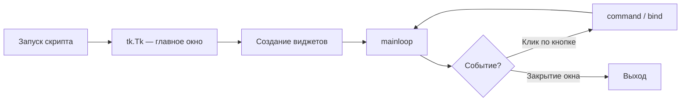

import ExternalCodeEmbed from '@site/src/components/ExternalCodeEmbed';


# Tkinter — окна и виджеты

<div class="article-tags">
  <span class="tag tag-notrequired">НЕ ОБЯЗАТЕЛЬНО</span>
  <span class="tag tag-beginner">ДЛЯ НОВИЧКОВ</span>
</div>

Приветствую! Здесь вы наверняка найдете, что ищете. Примеры в лаборатории рассчитаны на то, что мы разбираем что-то конкретное.

Текущая статья посвящена примерам: Tkinter на Python с разбором — окно, кнопка, Entry, Label, Listbox, меню, калькулятор и блокнот. Готовый код для курсовой, лабораторной и самообучения.

Поэтому за теорией по текущей теме вам — в [энциклопедию](/encyclopedia/intro).
Если ещё не погружались, то маршрут прост:

1. [Основы](/section/basics)
2. [Система и сеть](/section/system-network)
3. [Данные и разметка](/section/data-markup)
4. [Код и разработка](/section/code-dev)
5. [Языки](/section/languages)
6. [Искусственный интеллект](/section/ai)
7. [Проект](/section/project)
8. [Инфраструктура и безопасность](/section/infra-security)
9. [Спин-офф](/section/spinoff)

Обязательно пройдитесь.

А теперь приступим к нашему предмету.

<div class="callout callout--tip">
  <div class="callout-title">Теория и соседние материалы</div>

  <div class="callout-body">
  Для системного понимания GUI прочитайте [Tkinter и GUI](/encyclopedia/5-languages/5-02-python/311), [Первая программа на Tkinter](/encyclopedia/5-languages/5-02-python/3111) и [Справочник по элементам UI](/encyclopedia/5-languages/5-02-python/3112).

  Мобильный UI на Dart — [Flutter](/encyclopedia/5-languages/5-22-dart/311) и [готовые виджеты](/lab/Примеры/1154).
</div>
</div>

---
1. Скопируйте **обязательный каркас** — без него окно закроется сразу.
2. Выберите пример по задаче (кнопка, форма, список, меню…).
3. Прочитайте **Разбор** под кодом — там смысл строк и типичные ошибки.
4. Измените текст, цвета, размер окна — так быстрее запоминается API.

---

## Словарь виджетов за 30 секунд

| Виджет | Зачем | Как получить текст / значение |
|--------|-------|-------------------------------|
| `Label` | Надпись, статус | `text=` или `textvariable=` |
| `Button` | Кнопка | `command=функция` (без скобок!) |
| `Entry` | Однострочный ввод | `entry.get()` |
| `Text` | Много строк | `text.get("1.0", tk.END)` |
| `Checkbutton` | Галочка вкл/выкл | `BooleanVar.get()` |
| `Radiobutton` | Один из нескольких | `StringVar.get()` |
| `Listbox` | Список строк | `listbox.get(индекс)` |
| `Scale` | Ползунок | аргумент `command` или `IntVar` |
| `Menu` | Меню «Файл», «Справка» | пункты через `add_command` |
| `messagebox` | Всплывающее окно | `showinfo`, `showerror`, `askyesno` |

**Три способа разложить элементы в окне:** `pack()` (стопка или ряд), `grid()` (таблица), `place()` (координаты x, y). В **одном** родителе (например, одном `Frame`) смешивать `pack` и `grid` нельзя.

---

## Как работает Tkinter — цикл событий

GUI-приложение не «висит» в бесконечном `while True`. Оно ждёт **события**: клик, нажатие клавиши, движение мыши. За это отвечает `root.mainloop()`.



Пока `mainloop()` работает, Python **не идёт дальше** по файлу — программа живёт, пока пользователь не закроет окно.

---

### Обязательный каркас

Любой пример ниже опирается на этот шаблон. 

```python

import tkinter as tk  # стандартная библиотека, pip не нужен

root = tk.Tk()                    # главное окно приложения
root.title("Моё приложение")      # заголовок в панели окна
root.geometry("400x300")          # ширина x высота в пикселях

# --- здесь Label, Button, Entry и остальные виджеты ---

root.mainloop()                   # цикл событий; без этой строки окно мелькает и закроется
```

**Разбор:**

- `tk.Tk()` — корень дерева виджетов. В одной программе обычно **один** такой объект.
- `geometry("400x300")` — размер клиентской области. Можно добавить позицию: `"400x300+100+50"`.
- `mainloop()` — блокирует конец скрипта и обрабатывает клики. Если окно «мигает и исчезает» — почти всегда забыли эту строку.

---

### Стартовые окна

Простые примеры «с нуля» — с них удобно начинать лабораторную или первый проект с GUI.

#### Минимальное окно с меткой

**Задача:** показать, что Python умеет открывать окно с текстом — минимум для проверки установки.

```python

import tkinter as tk

root = tk.Tk()
root.title("Привет, Tkinter")

label = tk.Label(root, text="Окно работает!", font=("Segoe UI", 14))
label.pack(padx=20, pady=20)  # pack — положить виджет в окно с отступами

root.mainloop()
```

**Разбор:**

- `Label` — статическая надпись; сам по себе на экране не появится, нужен `pack`, `grid` или `place`.
- `font=("Segoe UI", 14)` — кортеж «шрифт, размер». На Linux часто подойдёт `"DejaVu Sans"`.
- `padx=20, pady=20` — внутренние отступы вокруг надписи.

**Попробуйте:** смените текст и `root.geometry("500x200")`.

---

#### Кнопка и диалог

**Задача:** по нажатию кнопки что-то происходит — основа любой формы и калькулятора.

```python

import tkinter as tk

from tkinter import messagebox  # стандартные диалоги ОС

def on_click():
    messagebox.showinfo("Сообщение", "Кнопка нажата!")

root = tk.Tk()
root.title("Кнопка")

btn = tk.Button(root, text="Нажми меня", command=on_click)  # command=on_click, НЕ on_click()
btn.pack(pady=30)

root.mainloop()
```

**Разбор:**

- `command=on_click` передаёт **ссылку на функцию**. Если написать `command=on_click()`, функция вызовется **сразу при старте**, а не по клику.
- `messagebox.showinfo(заголовок, текст)` — модальное окно; пользователь должен нажать OK.

**Попробуйте:** замените на `messagebox.showwarning` или `askyesno` — вернёт `True`/`False`.

---

#### Поле ввода и приветствие

**Задача:** прочитать текст из `Entry` и показать результат — типичная форма «введите имя».


<ExternalCodeEmbed example="python/lab-1124-001" title="Поле ввода и приветствие" minHeight={570} />


**Разбор:**

- `Frame` + `grid` — табличная раскладка: `row`, `column`, `sticky="w"` (прижать к левому краю ячейки).
- `entry.get()` вызывают **внутри** обработчика, когда пользователь уже что-то ввёл.
- `bind("<Return>", ..)` — реакция на клавишу Enter; `lambda e: greet()` игнорирует объект события `e`.

**Попробуйте:** добавьте второе поле «Фамилия» и выводите полное имя.

---

#### Конвертер °C → °F

**Задача:** классическая учебная программа — ввод числа, формула, вывод в интерфейсе (часто встречается в заданиях).


<ExternalCodeEmbed example="python/lab-1124-002" title="Конвертер °C → °F" minHeight={624} />


**Разбор:**

- `StringVar` связывают с `Label` через `textvariable=`. Меняете `result_var.set(..)` — надпись обновляется без пересоздания виджета.
- `try/except ValueError` — защита от букв в поле температуры.
- Формула: $F = C \times \frac&#123;9&#125;&#123;5&#125; + 32$.

**Попробуйте:** добавьте кнопку «Очистить» — `entry.delete(0, tk.END)` и `result_var.set("—")`.

---

#### Флажок и переключатели

**Задача:** несколько настроек «вкл/выкл» и выбор одного варианта из списка (роль, режим).


<ExternalCodeEmbed example="python/lab-1124-003" title="Флажок и переключатели" minHeight={678} />


**Разбор:**

- `BooleanVar` / `StringVar` — «мост» между логикой Python и виджетами. `.get()` читает текущее значение.
- У `Radiobutton` с одной `variable` и разными `value` выбирается **только один** пункт.
- `command=update_status` обновляет строку статуса при каждом изменении.

**Попробуйте:** добавьте третью роль «Гость» с `value="guest"`.

---

#### Список задач (Listbox)

**Задача:** простой to-do — добавить строку в список, удалить выбранную. Хороший мини-проект для отчёта.


<ExternalCodeEmbed example="python/lab-1124-004" title="Список задач (Listbox)" minHeight={660} />


**Разбор:**

- `Listbox` хранит строки; `insert(индекс, текст)` и `delete(индекс)`.
- `curselection()` пуст, если ничего не выделено — перед `delete` проверяем `if sel`.
- `fill=tk.BOTH, expand=True` — список растягивается при изменении размера окна.

**Попробуйте:** кнопка «Вверх» — `listbox.get(sel[0])`, delete, insert на `sel[0]-1`.

---

#### Ползунок громкости

**Задача:** `Scale` — ползунок с числовым диапазоном; `command` вызывается при каждом движении.


<ExternalCodeEmbed example="python/lab-1124-005" title="Ползунок громкости" minHeight={480} />


**Разбор:**

- `from_` с подчёркиванием — зарезервированное слово `from` в Python.
- `command` у `Scale` получает **новое значение ползунка** как аргумент.
- Вертикальный ползунок: `orient=tk.VERTICAL`.

---

## Примеры окон и виджетов

Ниже — тематические блоки: компоновка, текст, списки, меню, диалоги, вкладки, рисование, таймеры и цельные мини-приложения.

---

### 1. Компоновка — pack, grid, place

#### 1.1. Форма входа на grid

**Задача:** форма «Email / Пароль» с выравниванием — как на сайтах, но в десктопе.


<ExternalCodeEmbed example="python/lab-1124-006" title="1.1. Форма входа на grid" minHeight={444} />


**Разбор:**

- `grid_columnconfigure(1, weight=1)` — поле ввода тянется по ширине при ресайзе окна.
- `sticky="ew"` — east+west, растянуть по горизонтали в ячейке.
- `show="*"` в `Entry` — символы отображаются звёздочками.

---

#### 1.2. Панель инструментов через pack

**Задача:** ряд кнопок сверху и рабочая область снизу — каркас редактора или блокнота.


<ExternalCodeEmbed example="python/lab-1124-007" title="1.2. Панель инструментов через pack" minHeight={336} />


**Разбор:**

- `pack(side=tk.TOP)` и `side=tk.LEFT` — классическая «полоска кнопок».
- `fill=tk.X` — toolbar на всю ширину; `fill=tk.BOTH, expand=True` — контент забирает оставшееся место.

---

#### 1.3. Размещение place по координатам

**Задача:** точное позиционирование — реже `pack`/`grid`, но полезно для наложения элементов на `Canvas`.


<ExternalCodeEmbed example="python/lab-1124-008" title="1.3. Размещение place по координатам" minHeight={318} />


**Разбор:**

- `Canvas.create_rectangle(x1, y1, x2, y2)` — координаты от левого верхнего угла холста.
- `place(x=, y=)` — абсолютные пиксели от родителя (`canvas` здесь выступает родителем для `Label`).

---

### 2. Текстовые поля и многострочный ввод

#### 2.1. Text с прокруткой

**Задача:** заметки, лог, несколько абзацев — `Entry` для этого не подходит, нужен `Text` + `Scrollbar`.


<ExternalCodeEmbed example="python/lab-1124-009" title="2.1. Text с прокруткой" minHeight={408} />


**Разбор:**

- `Text` и `Scrollbar` связывают парами: `yscrollcommand=scrollbar.set` и `command=text.yview`.
- `"1.0"` — строка 1, символ 0 (индексация с 1 для строк).
- `wrap=tk.WORD` — перенос по словам, а не посередине слова.

---

#### 2.2. Счётчик символов (реактивный интерфейс)

**Задача:** подпись «осталось N символов» обновляется при каждом нажатии клавиши — без кнопки «Обновить».


<ExternalCodeEmbed example="python/lab-1124-010" title="2.2. Счётчик символов (реактивный интерфейс)" minHeight={408} />


**Разбор:**

- `textvariable=entry_var` связывает `Entry` с переменной; `.get()` в `on_change` читает актуальный текст.
- `trace_add("write", ..)` — callback при любом вводе и удалении.

---

### 3. Списки, таблицы и выпадающие меню

#### 3.1. Combobox (ttk)

**Задача:** выпадающий список в «современном» стиле — модуль `ttk` (themed tk).


<ExternalCodeEmbed example="python/lab-1124-011" title="3.1. Combobox (ttk)" minHeight={516} />


**Разбор:**

- `&lt;&lt;ComboboxSelected&gt;&gt;` — виртуальное событие ttk при выборе пункта.
- `state="normal"` разрешит ввод своего текста в комбобокс.

---

#### 3.2. Таблица Treeview

**Задача:** таблица «Имя / Возраст» — аналог простой Excel-таблицы в Tkinter.


<ExternalCodeEmbed example="python/lab-1124-012" title="3.2. Таблица Treeview" minHeight={390} />


**Разбор:**

- `columns=` — имена столбцов; `show="headings"` скрывает древовидную колонку слева.
- `insert("", tk.END, values=(..))` — новая строка в конец; `""` — корень дерева.

---

#### 3.3. Поиск и фильтр Listbox

**Задача:** живой поиск по списку — типичное UI для автодополнения и каталогов.


<ExternalCodeEmbed example="python/lab-1124-013" title="3.3. Поиск и фильтр Listbox" minHeight={534} />


**Разбор:**

- Список **пересобирается** при каждом символе в поиске: `delete(0, END)` + цикл `insert`.
- `ALL_ITEMS` — исходные данные в Python; в большом приложении их читают из файла или БД.

---

### 4. Меню, панели и строка состояния

#### 4.1. MenuBar — меню «Файл / Справка»

**Задача:** стандартное меню в шапке окна, как у Блокнота или калькулятора Windows.


<ExternalCodeEmbed example="python/lab-1124-014" title="4.1. MenuBar — меню «Файл / Справка»" minHeight={516} />


**Разбор:**

- `Menu(menubar)` — подменю; `add_cascade` добавляет пункт верхнего уровня.
- `tearoff=0` отключает «отрыв» меню в отдельное окно (устаревшая фича Tk).
- `root.destroy()` — закрыть приложение.

---

#### 4.2. StatusBar — строка состояния

**Задача:** внизу окна показывать «Готово», «Сохранение…», «Файл сохранён».


<ExternalCodeEmbed example="python/lab-1124-015" title="4.2. StatusBar — строка состояния" minHeight={552} />


**Разбор:**

- `pack(side=tk.BOTTOM)` — status bar прилипает к низу окна.
- `root.after(мс, функция)` — отложенный вызов **без** `time.sleep` (sleep заморозил бы GUI).

---

#### 4.3. Контекстное меню по ПКМ

**Задача:** меню «Копировать / Вставить» по правому клику — как в текстовых редакторах.


<ExternalCodeEmbed example="python/lab-1124-016" title="4.3. Контекстное меню по ПКМ" minHeight={516} />


**Разбор:**

- `event.x_root, event.y_root` — координаты курсора на **экране** для `tk_popup`.
- `text.tag_ranges("sel")` — есть ли выделение; `sel.first` / `sel.last` — границы выделения в `Text`.

---

### 5. Диалоги и дочерние окна

#### 5.1. Выбор файла и цвета

**Задача:** стандартные диалоги ОС — открыть `.txt`, выбрать цвет фона.


<ExternalCodeEmbed example="python/lab-1124-017" title="5.1. Выбор файла и цвета" minHeight={570} />


**Разбор:**

- `askopenfilename` возвращает **строку пути** или `""`, если пользователь нажал «Отмена».
- `askcolor()` возвращает `((r,g,b), "#hex")`; второй элемент удобен для `configure(bg=..)`.

---

#### 5.2. Модальное окно Toplevel

**Задача:** второе окно «Настройки», которое блокирует главное, пока открыто.


<ExternalCodeEmbed example="python/lab-1124-018" title="5.2. Модальное окно Toplevel" minHeight={498} />


**Разбор:**

- Второй `tk.Tk()` в одной программе ломает поведение — для диалогов используйте `Toplevel`.
- `grab_set()` / `grab_release()` — захват фокуса для модального окна.

---

### 6. Вкладки, прогресс и ttk-темы

#### 6.1. Notebook — вкладки

**Задача:** разнести настройки по вкладкам «Общее» и «Дополнительно».


<ExternalCodeEmbed example="python/lab-1124-019" title="6.1. Notebook — вкладки" minHeight={444} />


**Разбор:**

- Виджеты кладут **внутрь** `tab_general` / `tab_advanced`, а не напрямую в `root`.
- `ttk.Frame` + `padding=12` — отступы содержимого вкладки.

---

#### 6.2. Progressbar — индикатор загрузки

**Задача:** полоска прогресса 0–100% без зависания интерфейса.


<ExternalCodeEmbed example="python/lab-1124-020" title="6.2. Progressbar — индикатор загрузки" minHeight={408} />


**Разбор:**

- `mode="determinate"` — известный процент; `indeterminate` — «бегущая» полоска без числа.
- Рекursion через `after` — правильный способ анимации в Tkinter.

---

#### 6.3. ttk — более «системный» вид

**Задача:** кнопки и чекбоксы ближе к стилю ОС, чем классические `tk.Button`.


<ExternalCodeEmbed example="python/lab-1124-021" title="6.3. ttk — более «системный» вид" minHeight={372} />


**Разбор:**

- `print(ttk.Styletheme_names())` — список тем на вашей системе.
- Для курсовой часто достаточно `ttk` вместо `tk` для кнопок и комбобоксов.

---

### 7. Canvas и простая графика

#### 7.1. Фигуры на Canvas

**Задача:** нарисовать прямоугольник, круг, линию — основа схем, игр, графиков.


<ExternalCodeEmbed example="python/lab-1124-022" title="7.1. Фигуры на Canvas" minHeight={336} />


**Разбор:**

- Координаты в пикселях от левого верхнего угла `Canvas`.
- `create_*` возвращает id объекта — им можно двигать и удалять: `canvas.delete(id)`.

---

#### 7.2. Рисовалка мышью

**Задача:** обработка `<B1-Motion>` — зажатая левая кнопка + движение мыши.


<ExternalCodeEmbed example="python/lab-1124-023" title="7.2. Рисовалка мышью" minHeight={570} />


**Разбор:**

- `event.x`, `event.y` — позиция мыши **относительно виджета** (`canvas`).
- `lambda col=c` в цикле — классическая ловушка: без `col=c` все кнопки выберут последний цвет.

---

### 8. Таймеры и горячие клавиши

#### 8.1. Секундомер

**Задача:** счётчик времени с кнопками Старт / Стоп / Сброс.


<ExternalCodeEmbed example="python/lab-1124-024" title="8.1. Секундомер" minHeight={720} />


**Разбор:**

- Словари `elapsed` / `running` — изменяемое состояние без `global` (можно и через `global`).
- `tick` вызывает сам себя через `after(1000, tick)` — «раз в секунду», пока `running["active"]`.

---

#### 8.2. Горячие клавиши Ctrl+S / Ctrl+Q


<ExternalCodeEmbed example="python/lab-1124-025" title="8.2. Горячие клавиши Ctrl+S / Ctrl+Q" minHeight={372} />


**Разбор:**

- `bind` на `root` ловит клавиши, когда фокус в окне.
- Обработчик получает объект события; `_=None` позволяет вызывать `save` и из `command`, и из `bind`.

---

### 9. Мини-приложения для отчёта

Готовые «мини-проекты» — можно сдать как лабораторную с небольшой доработкой (иконка, своё меню, сохранение в файл).

#### 9.1. Калькулятор

**Задача:** сетка кнопок 0–9 и операций — демонстрация `grid` и обработчиков.


<ExternalCodeEmbed example="python/lab-1124-026" title="9.1. Калькулятор" minHeight={678} />


**Разбор:**

- Цикл по `buttons` создаёт 16 кнопок без копипасты.
- `eval` в учебном коде допустим; в «боевом» калькуляторе разбирают строку сами или используют `ast`.

**Попробуйте:** кнопка «⌫» — удаляет последний символ из `display_var`.

---

#### 9.2. Блокнот с файлами

**Задача:** открыть `.txt`, редактировать, сохранить — полноценная утилита на ~40 строк.


<ExternalCodeEmbed example="python/lab-1124-027" title="9.2. Блокнот с файлами" minHeight={720} />


**Разбор:**

- `current_file` в словаре — изменяемый «глобальный» путь без ключевого слова `global`.
- При первом сохранении `asksaveasfilename` спрашивает имя файла.

---

#### 9.3. Конвертер валют (демо)

**Задача:** форма с `OptionMenu`, несколько `StringVar` и расчёт по словарю курсов.


<ExternalCodeEmbed example="python/lab-1124-028" title="9.3. Конвертер валют (демо)" minHeight={720} />


**Разбор:**

- `OptionMenu(parent, variable, *options)` привязан к `StringVar` — выбранная валюта в `from_var.get()`.
- Курсы в `RATES` статичны; для курсовой можно читать JSON или API.

---

### 10. Шаблоны для своих проектов

#### 10.1. Окно по центру экрана


<ExternalCodeEmbed example="python/lab-1124-029" title="10.1. Окно по центру экрана" minHeight={408} />


**Разбор:** `winfo_screenwidth()` — ширина монитора; `+x+y` в `geometry` задаёт позицию окна.

---

#### 10.2. Подтверждение при закрытии

```python

import tkinter as tk

from tkinter import messagebox

def on_close():
    if messagebox.askokcancel("Выход", "Закрыть приложение?"):
        root.destroy()

root = tk.Tk()
root.title("Безопасный выход")
root.protocol("WM_DELETE_WINDOW", on_close)  # крестик в заголовке
tk.Label(root, text="Нажмите крестик — появится подтверждение").pack(padx=20, pady=20)
root.mainloop()
```

**Разбор:** без `protocol` крестик сразу вызывает уничтожение окна; с обработчиком — ваш код решает, закрывать или нет.

---

#### 10.3. Длинная форма с прокруткой


<ExternalCodeEmbed example="python/lab-1124-030" title="10.3. Длинная форма с прокруткой" minHeight={516} />


**Разбор:** виджеты добавляют в `scroll_frame`, а не в `canvas` напрямую; `scrollregion` обновляется при изменении размера фрейма.

---

## Частые ошибки и как исправить

| Симптом | Причина | Решение |
|---------|---------|---------|
| Окно мелькает и закрывается | Нет `mainloop()` | Добавьте `root.mainloop()` в конец |
| Виджет не виден | Нет `pack` / `grid` / `place` | Вызовите менеджер геометрии после создания |
| `TclError: geometry manager` | `pack` и `grid` в одном родителе | Один `Frame` — один менеджер; вложите второй `Frame` |
| Кнопка срабатывает при старте | `command=func()` | Пишите `command=func` без скобок |
| Окно «зависло» | `time.sleep` или долгий расчёт в обработчике | `root.after` или поток `threading` |
| Русские буквы в `Text` режутся | Кодировка файла | Сохраняйте `.py` в UTF-8 |

---

## Маршрут изучения

| Шаг | Пример в статье | Дальше |
|-----|-----------------|--------|
| 1 | Обязательный каркас | [Первая программа на Tkinter](/encyclopedia/5-languages/5-02-python/3111) |
| 2 | Метка + кнопка + Entry | Конвертер °C → °F |
| 3 | Listbox, Checkbutton | Список задач |
| 4 | grid, Menu, filedialog | Блокнот §9.2 |
| 5 | ttk, Treeview, Notebook | [Справочник UI](/encyclopedia/5-languages/5-02-python/3112) |

---

## См. также

- [Tkinter и GUI](/encyclopedia/5-languages/5-02-python/311) — теория и обзор экосистемы
- [Первая программа на Tkinter](/encyclopedia/5-languages/5-02-python/3111) — пошаговый конвертер температуры
- [Справочник по элементам UI](/encyclopedia/5-languages/5-02-python/3112) — рецепты по каждому виджету
- [Архитектура десктопных приложений](/encyclopedia/4-code-dev/4-11-desktopnye-prilozheniya/1) — окна, события, элементы управления
- [Десктопные приложения — о разделе](/encyclopedia/4-code-dev/4-11-desktopnye-prilozheniya/intro) — маршрут по стекам
- [C# WinForms и WPF — простые окна](/lab/Примеры/1138) — те же задачи на .NET
- [Java Swing — окна и кнопки](/lab/Примеры/1143) — те же задачи на Java
- [Шаблоны](/lab/Примеры/2) — минимальный каркас Tkinter

---
