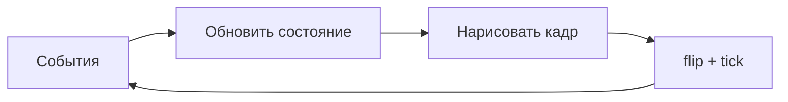

import ExternalCodeEmbed from '@site/src/components/ExternalCodeEmbed';


# Pygame — мини-игры на Python

<div class="article-tags">
  <span class="tag tag-notrequired">НЕ ОБЯЗАТЕЛЬНО</span>
  <span class="tag tag-beginner">ДЛЯ НОВИЧКОВ</span>
</div>

Приветствую! Здесь вы наверняка найдете, что ищете. Примеры в лаборатории рассчитаны на то, что мы разбираем что-то конкретное.

Текущая статья посвящена примерам: игр на Pygame для Python 3 — змейка, Pong, Breakout, Flappy, шарик. Готовый код с построчным разбором для школьников, студентов и самоучки.

Поэтому за теорией по текущей теме вам — в [энциклопедию](/encyclopedia/intro).
Если ещё не погружались, то маршрут прост:

1. [Основы](/section/basics)
2. [Система и сеть](/section/system-network)
3. [Данные и разметка](/section/data-markup)
4. [Код и разработка](/section/code-dev)
5. [Языки](/section/languages)
6. [Искусственный интеллект](/section/ai)
7. [Проект](/section/project)
8. [Инфраструктура и безопасность](/section/infra-security)
9. [Спин-офф](/section/spinoff)

Обязательно пройдитесь.

А теперь приступим к нашему предмету.

<div class="callout callout--tip">
  <div class="callout-title">Теория и соседние материалы</div>

  <div class="callout-body">
  Перед запуском примеров изучите главу [Разработка игр на Python](/encyclopedia/5-languages/5-02-python/312) — там игровой цикл, события, спрайты и столкновения.

  Пошаговые большие проекты (Tetris, Match-3, аркады) — в [Практикуме разработки игр](/encyclopedia/9-spinoff/9-04-razrabotka-igr/praktikum-razrabotki-igr/intro).

  Для рисования без игровой логики — [Turtle](/lab/Примеры/111) (Python) или [p5.js](/lab/Примеры/1114) (браузер); для 3D — [Panda3D](/lab/Примеры/1111).
</div>
</div>

---
## Основы мини-игр на Pygame

### Как запустить любой пример

```bash
pip install pygame
python bounce.py
```

Сохраните фрагмент кода в файл с латинским именем (`snake.py`, `pong.py`). Окно откроется на вашем компьютере — в браузере эти игры не запускаются. Закрытие: крестик окна, **Esc** (где указано) или остановка в IDE.

| Частый запрос в поиске | Раздел ниже |
|------------------------|-------------|
| pygame пример, первое окно | [Обязательный каркас](#karkas) |
| шарик отскакивает pygame | [Отскакивающий шар](#bounce) |
| змейка на python pygame | [Змейка](#snake) |
| pong на python | [Pong](#pong) |
| breakout pygame | [Breakout](#breakout) |
| flappy bird python | [Flappy](#flappy) |

Управление в большинстве игр: **стрелки** или **WASD**. В меню перезапуска часто **Пробел**.

### Чем Pygame отличается от Turtle

| | Turtle | Pygame |
|---|--------|--------|
| Задача | Рисовать фигуры по шагам | Игра: ввод, время, столкновения |
| Окно | Черепашка на холсте | Полноценное игровое окно |
| Цикл | `turtle.done()` ждёт | `while running` — десятки кадров в секунду |
| Координаты | Часто от центра | Левый верхний угол экрана — `(0, 0)` |

И Turtle, и Pygame учат алгоритмам; для **мини-игр** нужен именно игровой цикл из трёх шагов на каждом кадре.



1. **События** — клик, клавиша, закрытие окна (`pygame.event.get()`).
2. **Обновление** — новые координаты, счёт, проверка столкновений.
3. **Отрисовка** — заливка фона, фигуры, текст; `pygame.display.flip()` показывает кадр.
4. **`clock.tick(60)`** — пауза до следующего кадра (~60 FPS).

---

<span id="karkas"></span>

### Обязательный каркас

Любая мини-игра на Pygame повторяет один шаблон. Без `init`, цикла `while` и `flip()` окно либо не откроется, либо «зависнет» без перерисовки.


<ExternalCodeEmbed example="python/lab-1132-001" title="Обязательный каркас" minHeight={624} />


**Разбор по блокам:**

| Строка / блок | Зачем нужна |
|---------------|-------------|
| `pygame.init()` | Подготавливает SDL: без этого `set_mode` может упасть |
| `set_mode((w, h))` | Создаёт окно; `screen` — холст, на который рисуем |
| `while running` | Игровой цикл: повторяется, пока игра не закончена |
| `event.get()` | Очередь событий ОС: мышь, клавиатура, закрытие |
| `QUIT` | Единственный корректный способ выйти по крестику |
| `screen.fill(..)` | Стирает прошлый кадр (иначе останутся «шлейфы») |
| `display.flip()` | Двойная буферизация: показать нарисованное |
| `clock.tick(60)` | Ограничение скорости; без tick цикл жрёт 100% CPU |

<div class="callout callout--info">
  <div class="callout-title">Цвет в Pygame</div>

  <div class="callout-body">
  Кортеж `(R, G, B)` от 0 до 255: `(255, 0, 0)` — красный, `(0, 0, 0)` — чёрный.

  В примерах ниже фон тёмный, объекты яркие — так проще видеть столкновения на уроке.
</div>
</div>

Константы (`W`, `H`, `SPEED`, цвета) держите **вверху файла**. Несколько персонажей удобно оформлять через `pygame.sprite.Sprite` и `Group` — см. [шутер](#shooter).

---

<span id="start"></span>

### Стартовые мини-игры

Простые сцены без сложной физики: хватит одного файла и базового цикла.

---

<span id="bounce"></span>

#### Отскакивающий шар

Классический учебный пример: позиция `(x, y)` и скорость `(vx, vy)`. Удар о стенку — смена знака скорости по оси.


<ExternalCodeEmbed example="python/lab-1132-002" title="Отскакивающий шар" minHeight={720} />


**Разбор:**

- `vx`, `vy` — на сколько пикселей сдвигаем шар **каждый кадр**; это проще, чем физика с ускорением.
- Проверка `x - radius` учитывает **радиус**: центр не должен заходить за край.
- `vx = -vx` разворачивает движение по горизонтали (закон отражения в одну строку).
- `int(x)` — `draw.circle` ждёт целые координаты; без `int` на старых версиях бывают предупреждения.

**Что попробовать:** измените `vx, vy` на `8, 6` — шар станет быстрее; `radius = 40` — крупнее и чаще бьётся о края.

---

<span id="trail"></span>

#### След за курсором

Список последних позиций мыши — простейшая **структура данных в игре**: очередь из точек, старые удаляем.


<ExternalCodeEmbed example="python/lab-1132-003" title="След за курсором" minHeight={678} />


**Разбор:**

- `get_pos()` читает мышь **без** событий — каждый кадр, плавный след.
- `pop(0)` — FIFO: фиксированная длина хвоста, память не растёт.
- `enumerate(trail)` даёт индекс `i`: по нему рисуем «свежие» точки ярче и крупнее.

---

<span id="clicker"></span>

#### Кликер — очки за попадание

Здесь появляются **`pygame.Rect`** (прямоугольник-мишень) и **`collidepoint`** — попадание по клику. Текст рисуем через `font.render` и `blit`.


<ExternalCodeEmbed example="python/lab-1132-004" title="Кликер — очки за попадание" minHeight={720} />


**Разбор:**

| Элемент | Смысл |
|---------|--------|
| `Rect(x, y, w, h)` | Прямоугольник: позиция левого верхнего угла и размер |
| `collidepoint(event.pos)` | True, если координаты клика внутри прямоугольника |
| `MOUSEBUTTONDOWN` | Событие один раз на нажатие (не «зажатая» кнопка) |
| `font.render(.., True, color)` | Картинка-буквы; `True` — сглаживание |
| `blit` | Вставить картинку текста на `screen` |

`random.randint(r, W - r)` не даёт мишени вылезти за край экрана.

---

<span id="reaction"></span>

#### Реакция — нажми, когда зелёный

Учебная **машина состояний**: `WAIT` → `READY` (ждём) → `GO` (жми) → `DONE`. Время в миллисекундах — `pygame.time.get_ticks()`.


<ExternalCodeEmbed example="python/lab-1132-005" title="Реакция — нажми, когда зелёный" minHeight={720} />


**Разбор состояний:**

| Состояние | Экран | Что ждём от игрока |
|-----------|-------|---------------------|
| `WAIT` | Серый | Пробел — начать раунд |
| `READY` | Красный | Случайная пауза 1.2–3.5 с, ранний пробел = ошибка |
| `GO` | Зелёный | Пробел — засечь `react_ms = now - start_ms` |
| `DONE` | Синий | Показ времени, пробел — снова `WAIT` |

`start_ms = now + random.randint(..)` планирует момент смены цвета **в будущем**, без `time.sleep` — цикл игры не блокируется.

---

## Примеры мини-игр

Ниже — полноценные мини-игры: **скопируйте файл целиком**, запустите, затем читайте разбор под тем же заголовком. Якоря (`#snake`, `#pong` …) удобны для ссылок из тетради или чата.

### 1. Классические аркады

<span id="pong"></span>

#### 1.1. Pong (две ракетки)

Две ракетки и мяч. Скорость мяча хранится в `vx`, `vy`; ракетки двигаем через `get_pressed()` — удержание клавиши даёт плавное движение.


<ExternalCodeEmbed example="python/lab-1132-006" title="1.1. Pong (две ракетки)" minHeight={720} />


**Разбор:**

| Идея | Код |
|------|-----|
| Хитбокс ракетки и мяча | `pygame.Rect` — удобно для `colliderect` |
| Плавное движение | `keys = get_pressed()` вне `KEYDOWN` — пока держим W, ракетка едет каждый кадр |
| Отскок от ракетки | `vx = -vx` только если мяч летит **к** ракетке (`vx < 0` к левой) — иначе мяч «прилипает» |
| Гол | `ball.left <= 0` — очко правому, сброс в центр `reset_ball` |
| `global vx, vy` | В функции `reset_ball` меняем скорости мяча из внешней области |

Управление: **W/S** — левая ракетка, **↑/↓** — правая.

**Доработка:** увеличьте `SPEED` до 9 — сложнее; добавьте `clock.tick` в заголовок окна через `set_caption(f"FPS: &#123;clock.get_fps():.0f&#125;")` раз в секунду.

---

<span id="snake"></span>

#### 1.2. Змейка

Самый частый запрос «**змейка на python pygame**». Змейка — список клеток `(col, row)`; голова в начале списка. Движение **не каждый кадр**, а раз в `tick_ms` миллисекунд — классическая «пошаговая» скорость.


<ExternalCodeEmbed example="python/lab-1132-007" title="1.2. Змейка" minHeight={720} />


**Разбор змейки:**

```text
snake = [(5,3), (4,3), (3,3)]   # голова слева — (5,3)
insert(0, new_head)             # рост: хвост не удаляем
pop()                           # обычный ход: хвост исчезает
```

| Проверка | Зачем |
|----------|--------|
| `direction != (1, 0)` при повороте влево | Иначе змейка врежется в себя за один кадр |
| `now - last_move >= tick_ms` | Ход по таймеру, а не 60 раз в секунду |
| `new_head in snake` | Столкновение с собственным телом |
| `tick_ms - 4` после еды | Игра ускоряется — ощущение прогресса |

Рисование: `cx * CELL` переводит **номер клетки** в пиксели. `(0,0)` — левый верхний угол поля.

---

<span id="flappy"></span>

#### 1.3. Flappy — прыжок между препятствиями

Гравитация и импульс прыжка; трубы движутся влево — типичная механика для урока «физика в 2D без формул».


<ExternalCodeEmbed example="python/lab-1132-008" title="1.3. Flappy — прыжок между препятствиями" minHeight={720} />


**Суть примера:** `bird_vy += GRAVITY` — вертикальная скорость на каждом кадре; **Пробел** даёт импульс `JUMP`. Трубы — словари `&#123;"x", "gap_y"&#125;`; столкновение через `colliderect` двух прямоугольников (верхняя и нижняя часть трубы). Счёт +1, когда труба ушла левее птицы (`pipe["scored"]`).

---

<span id="breakout"></span>

#### 1.4. Breakout — кирпичи и платформа

Мяч, платформа и сетка кирпичей — учит `colliderect`, отражению скорости и флагу «кирпич ещё жив».


<ExternalCodeEmbed example="python/lab-1132-009" title="1.4. Breakout — кирпичи и платформа" minHeight={720} />


**Разбор Breakout:**

| Блок | Смысл |
|------|--------|
| `bricks` — список словарей | У каждого кирпича `alive`: можно выключать без удаления из списка |
| `paddle.centerx = mx` | Платформа следует за мышью по X |
| Отскок от платформы | `vy = -abs(vy)` — мяч всегда улетает вверх; `offset` меняет `vx` — угол отражения |
| Потеря жизни | `ball.bottom >= H` — мяч упал вниз, не поймали |

Платформа следует за **мышью**.

---

### 2. Ловля и уклонение

<span id="catch"></span>

#### 2.1. Лови падающие звёзды


<ExternalCodeEmbed example="python/lab-1132-010" title="2.1. Лови падающие звёзды" minHeight={720} />


**Суть:** корзина `player` — `Rect` внизу; объекты `items` падают (`item.y += 5`). `colliderect` — поймали; `item.top > H` — промах. Счётчики `score` / `missed` — типичная домашняя работа «поймай N предметов».

---

<span id="dodge"></span>

#### 2.2. Уклоняйся от машин


<ExternalCodeEmbed example="python/lab-1132-011" title="2.2. Уклоняйся от машин" minHeight={720} />


**Суть:** три «полосы» дороги (`lane`), машины спавнятся в случайной полосе. Очки растут, если **пропустили** машину вниз (`obs.top > H`) — мотивация рисковать, а не стоять.

---

### 3. Стрельба и действие

<span id="shooter"></span>

#### 3.1. Вид сверху — стрельба по врагам


<ExternalCodeEmbed example="python/lab-1132-012" title="3.1. Вид сверху — стрельба по врагам" minHeight={720} />


**Разбор ООП в Pygame:**

| Класс | Роль |
|-------|------|
| `Player` | Наследует `Sprite`; в `update` читает клавиши |
| `Bullet` | Сам двигается; `kill()` удаляет из всех групп |
| `Enemy` | Преследует игрока: нормализованный вектор `(dx, dy) / length` |
| `Group` | `all_sprites.draw(screen)` рисует всех за один вызов |
| `spritecollide` | Пуля + враг: `True` во 2-м аргументе — враг уничтожен |

Стрельба — **клик**: угол от игрока к `event.pos`. Движение — **WASD**.

---

<span id="invaders"></span>

#### 3.2. Космические захватчики (упрощённо)


<ExternalCodeEmbed example="python/lab-1132-013" title="3.2. Космические захватчики (упрощённо)" minHeight={720} />


**Суть:** стая врагов движется синхронно; при касании края — `enemy_dir *= -1` и сдвиг вниз (`move_down`) — как в оригинальных Invaders. Пули — отдельный список `bullets`, не спрайты: проще для курса после списков в Python.

---

### 4. Головоломки и таймеры

<span id="odd"></span>

#### 4.1. Найди отличающийся квадрат


<ExternalCodeEmbed example="python/lab-1132-014" title="4.1. Найди отличающийся квадрат" minHeight={720} />


**Суть:** сетка 5×5; клик переводит `(mx, my)` в `(col, row)` через деление на `CELL`. Один квадрат другого оттенка — тренировка координат и `MOUSEBUTTONDOWN`.

---

<span id="survive"></span>

#### 4.2. Таймер на выживание 30 секунд


<ExternalCodeEmbed example="python/lab-1132-015" title="4.2. Таймер на выживание 30 секунд" minHeight={720} />


**Суть:** `elapsed = (get_ticks() - start) / 1000` — секунды без `import time`. Враги спавнятся с вероятностью `random.random() < 0.04` каждый кадр. Победа при `elapsed >= 30`.

---

<span id="tic-tac-toe"></span>

#### 4.3. Крестики-нолики с ИИ


<ExternalCodeEmbed example="python/lab-1132-016" title="4.3. Крестики-нолики с ИИ" minHeight={720} />


Поле 3×3. Вы играете крестиками (`X`), компьютер — ноликами (`O`). Ход — **клик левой кнопкой** по клетке.

**Как устроен код**

- Класс `Board` хранит сетку `cells[row][col]` и методы `place`, `winner`, `empty_cells`.
- Функция `cell_from_mouse(mx, my)` переводит пиксели экрана в индексы ячейки. Смещение поля — `OFFSET_X`, `OFFSET_Y`, размер клетки — `CELL`.
- Крестик и нолик рисуются через `pygame.draw.line` и `pygame.draw.circle`, без картинок.
- После вашего хода вызывается `choose_ai_move` — **эвристика**, не полный перебор (minimax).

**Логика ИИ по шагам**

1. Если есть ход, который сразу даёт победу `O` — сделать его.
2. Иначе заблокировать ваш выигрышный ход `X`.
3. Иначе занять центр.
4. Иначе занять угол.
5. Иначе любую свободную клетку.

Такой ИИ силён для поля 3×3 и хорошо читается в коде. Для произвольного размера поля смотрите алгоритм minimax в [теории игр](/encyclopedia/1-basics/1-18-kompyuternye-igry/intro) и [ИИ в играх](/encyclopedia/9-spinoff/9-04-razrabotka-igr/128).

**Управление**

- ЛКМ — поставить `X` в клетку.
- `R` — новая партия.
- `Esc` — выход.

**С чем связан пример**

- Клик мыши и сетка — те же навыки, что в [Match-3 практикуме](/encyclopedia/9-spinoff/9-04-razrabotka-igr/praktikum-razrabotki-igr/2) и [крестиках-ноликах на Smalltalk](/encyclopedia/5-languages/5-08-smalltalk/12).
- Разделение логики (`Board`) и отрисовки — шаг к модулям в [Space Invaders](/encyclopedia/9-spinoff/9-04-razrabotka-igr/praktikum-razrabotki-igr/11#full-revision).
- События `MOUSEBUTTONDOWN` — в [главе 312, события](/encyclopedia/5-languages/5-02-python/312).

---

### 5. Переиспользуемые заготовки

#### 5.1. Окно эксперимента

```python
def setup_game_window(title: str = "Pygame Lab", size=(800, 600), fps: int = 60):
    pygame.init()
    screen = pygame.display.set_mode(size)
    pygame.display.set_caption(title)
    clock = pygame.time.Clock()
    return screen, clock, fps
```

---

#### 5.2. Машина состояний (меню → игра → конец)

```python
MENU, PLAY, GAME_OVER = "menu", "play", "over"
state = MENU

# В цикле событий переключайте state по клавишам и условиям победы.
# В блоке отрисовки рисуйте разный UI в зависимости от state.
```

Тот же приём используют Match-3 и аркады в [Практикуме](/encyclopedia/9-spinoff/9-04-razrabotka-igr/praktikum-razrabotki-igr/intro).

---

#### 5.3. Сброс и выход

```python
def quit_game():
    pygame.quit()
    raise SystemExit
```

---

## Типичные ошибки новичков

| Симптом | Причина | Что сделать |
|---------|---------|-------------|
| Чёрное окно и ничего не рисуется | Нет `flip()` или нет рисования после `fill` | После всех `draw` вызовите `pygame.display.flip()` |
| Всё мерцает или оставляет следы | Не вызывают `screen.fill` каждый кадр | Заливайте фон в начале блока отрисовки |
| Окно «не отвечает» | Долгий цикл без событий | Обработайте `QUIT`; не используйте бесконечный `while` без `event.get()` |
| `No module named 'pygame'` | Пакет в другом Python | `python -m pip install pygame` тем же `python`, что запускает скрипт |
| Игра слишком быстрая | Нет `clock.tick` | Добавьте `clock.tick(60)` в конец цикла |
| Змейка мгновенно умирает при повороте | Разворот на 180° | Запретите направление противоположное текущему (см. [змейку](#snake)) |
| Координаты «не те» | Путают клетки и пиксели | Умножайте индекс клетки на `CELL` |
| Текст не виден | Цвет текста = цвет фона | Второй аргумент `render`: контрастный `(230, 230, 240)` |

---

## Словарь терминов (коротко)

| Термин | Объяснение |
|--------|------------|
| Surface | Картинка в памяти; `screen` — главная |
| Rect | Прямоугольник: столкновения, позиция спрайта |
| Sprite | Класс игрового объекта с `image` и `rect` |
| Event | Сообщение ОС: клавиша, мышь, закрытие |
| FPS | Кадров в секунду; держим через `Clock.tick` |
| Blit | «Приклейка» одной картинки на другую |
| HUD | Счёт, жизни, подсказки на экране |

---

## Как доработать пример под отчёт или проект

1. **Переименуйте** окно и заголовок в `set_caption` — видно, что это ваша версия.
2. **Добавьте звук** — `pygame.mixer.Sound` при поедании еды или голе (глава [Разработка игр на Python](/encyclopedia/5-languages/5-02-python/312)).
3. **Картинки вместо квадратов** — `image = pygame.image.load("hero.png")`, `rect = image.get_rect()`.
4. **Меню** — состояние `MENU` / `PLAY` как в [реакции](#reaction).
5. **Запись рекорда** — сохранить `score` в файл `scores.txt` через обычный `open`.

Для курсовой достаточно одной игры из раздела 1 с вашим комментарием к 5–10 строкам — преподаватели ценят понимание цикла, а не объём кода.

---

## Что дальше

| Уровень | Куда идти |
|---------|-----------|
| Теория цикла и спрайтов | [Разработка игр на Python](/encyclopedia/5-languages/5-02-python/312) |
| Полноценные проекты | [Практикум разработки игр](/encyclopedia/9-spinoff/9-04-razrabotka-igr/praktikum-razrabotki-igr/intro) |
| 2D-рисование без игр | [Turtle](/lab/Примеры/111) (Python) · [p5.js](/lab/Примеры/1114) (браузер) |
| Окна, формы, кнопки | [Tkinter — окна и виджеты](/lab/Примеры/1124) |
| 3D | [Panda3D](/encyclopedia/5-languages/5-02-python/318) · [примеры Panda3D](/lab/Примеры/1111) |

Сохраняйте каждый пример в отдельный файл, подключайте `venv` и фиксируйте версию в `requirements.txt` (`pygame>=2.5`). Проверка установки:

```bash
python -c "import pygame; print(pygame.version.ver)"
```

Если версия печатается — можно запускать любой скрипт из этой статьи.
