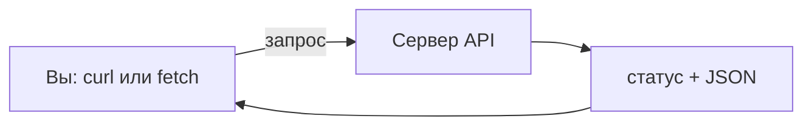

import ExternalCodeEmbed from '@site/src/components/ExternalCodeEmbed';


# curl / fetch — API-запросы

<div class="article-tags">
  <span class="tag tag-notrequired">НЕ ОБЯЗАТЕЛЬНО</span>
  <span class="tag tag-beginner">ДЛЯ НОВИЧКОВ</span>
</div>

Приветствую! Здесь вы наверняка найдете, что ищете. Примеры в лаборатории рассчитаны на то, что мы разбираем что-то конкретное.

Текущая статья посвящена примерам: curl и fetch с разбором: GET и POST JSON, заголовки, токен, ошибки 401/404/500, Python requests и health-check для лабораторных и pet-проектов..

Поэтому за теорией по текущей теме вам — в [энциклопедию](/encyclopedia/intro).
Если ещё не погружались, то маршрут прост:

1. [Основы](/section/basics)
2. [Система и сеть](/section/system-network)
3. [Данные и разметка](/section/data-markup)
4. [Код и разработка](/section/code-dev)
5. [Языки](/section/languages)
6. [Искусственный интеллект](/section/ai)
7. [Проект](/section/project)
8. [Инфраструктура и безопасность](/section/infra-security)
9. [Спин-офф](/section/spinoff)

Обязательно пройдитесь.

А теперь приступим к нашему предмету.

<div class="callout callout--tip">
  <div class="callout-title">Теория и соседние материалы</div>

  <div class="callout-body">
  Полный справочник по curl — [Утилита curl](/encyclopedia/2-system-network/2-05-terminal/1133).

  Postman и коллекции — [Работа с Postman и curl](/encyclopedia/2-system-network/2-09-osnovy-integratsionnogo-vzaimodeystviya/2).

  Async и fetch в JS — [Примеры JavaScript](/lab/Примеры/116).

  Bash-скрипты — [однострочники и скрипты](/lab/Примеры/1151), production-каркас — [Примеры скриптов Linux](/lab/Примеры/113).
</div>
</div>

---
## Что такое API-запрос простыми словами

**API** — способ, которым программа спрашивает у сервера данные или отправляет их. Обычно по **HTTP** (как сайт в браузере, но ответ чаще **JSON**, а не красивая страница).

Один запрос состоит из:

| Часть | Пример | Зачем |
|-------|--------|--------|
| **Метод** | `GET`, `POST` | Что вы хотите сделать (прочитать, создать, удалить) |
| **URL** | `https://api.example.com/posts/1` | Куда стучаться |
| **Заголовки** | `Content-Type: application/json` | Формат тела, токен, язык |
| **Тело** | `&#123;"title":"hello"&#125;` | Данные для POST/PUT (у GET тела обычно нет) |

Ответ сервера тоже из **кода статуса**, **заголовков** и **тела**:

| Код | Имя | Обычный смысл |
|-----|-----|----------------|
| 200 | OK | Всё хорошо, данные в теле |
| 201 | Created | Ресурс создан (часто после POST) |
| 400 | Bad Request | Клиент прислал мусор (битый JSON, не те поля) |
| 401 | Unauthorized | Нужен логин или токен |
| 404 | Not Found | Нет такого URL или id |
| 500 | Internal Server Error | Упал бэкенд — чинить сервер |



**curl** — программа в терминале: удобно для лабораторных, проверки «жив ли сервер», CI.  
**fetch** — встроенная функция в JavaScript (сайт, Node): то же HTTP, но из кода приложения.

---

1. Найдите свой сценарий в оглавлении (GET, POST, токен, ошибки).
2. Скопируйте код **целиком**.
3. Прочитайте блок **Разбор** под примером.
4. Выполните **Попробуйте** — одна маленькая правка закрепляет тему.
5. Если fetch в браузере «ломается», повторите тот же URL в **curl** — так отделяют CORS от бага API.

---

## Словарь за 30 секунд

| Термин | Смысл |
|--------|--------|
| REST | Стиль API: ресурсы по URL, методы GET/POST/PUT/DELETE |
| JSON | Текстовый формат `&#123;"ключ": "значение"&#125;` — стандарт для API |
| Query | Параметры в URL после `?`, например `?userId=1` |
| Bearer | Токен в заголовке `Authorization: Bearer …` |
| CORS | Правила браузера: с чужого сайта нельзя читать ответ без разрешения сервера |
| `-s` (curl) | Тихий режим — без progress-bar, только ответ |
| `res.ok` (fetch) | `true`, если статус 200–299 |

---

## Основы — с чего начать

### Обязательный шаблон curl

**Задача:** один раз увидеть рабочий GET и понять, что curl печатает **тело ответа** в терминал.

```bash
curl "https://jsonplaceholder.typicode.com/posts/1"
```

**Разбор:**

- Слово `curl` — запуск утилиты.
- Строка в кавычках — **URL**. Кавычки обязательны, если в адресе есть `&` или пробелы.
- Флагов нет → метод **GET** по умолчанию.
- В терминале появится JSON — это **тело ответа**. Код `200` curl сам в stdout не пишет (его можно вывести флагом `-w`, см. ниже).
- В stderr может мелькнуть progress-bar — это нормально.

**Попробуйте:** добавьте `-s` (silent) — останется только JSON:

```bash
curl -s "https://jsonplaceholder.typicode.com/posts/1"
```

---

### Обязательный шаблон fetch

**Задача:** получить JSON в JavaScript (браузер F12 → Console или файл `node app.mjs`).

```javascript
const res = await fetch('https://jsonplaceholder.typicode.com/posts/1');
const data = await res.json();
console.log(data.title);
```

**Разбор:**

- `fetch(url)` отправляет GET и возвращает **Promise** с объектом `Response`.
- `await` ждёт ответа сети (в консоли браузера top-level `await` разрешён).
- `res.json()` читает тело как JSON и тоже асинхронный — нужен второй `await`.
- `data.title` — поле из ответа сервера.
- Если статус **404** или **500**, `fetch` **не бросает ошибку** — только `res.ok === false`. Поэтому ниже добавляют проверку.

С проверкой ошибки HTTP:

```javascript
const res = await fetch('https://jsonplaceholder.typicode.com/posts/1');
if (!res.ok) {
  throw new Error(`HTTP ${res.status} ${res.statusText}`);
}
const data = await res.json();
console.log(data);
```

**Разбор:**

- `res.ok` — сокращение для статусов **200–299**.
- `res.status` — число (`200`, `404`, …), `res.statusText` — короткая фраза (`OK`, `Not Found`).
- `throw` останавливает выполнение — в консоли увидите красную ошибку с кодом.

**Попробуйте:** подставьте URL `https://jsonplaceholder.typicode.com/posts/99999` — часто приходит пустой объект и статус 404; проверка `!res.ok` сработает.

<div class="callout callout--warning">
  <div class="callout-title">PowerShell и имя curl</div>

  <div class="callout-body">
  В PowerShell <code>curl</code> часто — это <code>Invoke-WebRequest</code>, другой синтаксис. Пишите <strong><code>curl.exe</code></strong> или откройте CMD / WSL.
</div>
</div>

---

## Стартовые запросы

Простые сценарии «с нуля» — с них удобно начинать отчёт по лабораторной или первый тест своего API.

### GET — получить один пост (JSON)

**Задача:** прочитать ресурс по id — самый частый запрос в учебниках и реальных API.

```bash
curl -s "https://jsonplaceholder.typicode.com/posts/1"
```

**Разбор:**

- `-s` — **silent**: убрать полоску загрузки, в stdout только ответ.
- Путь `/posts/1` — ресурс «пост номер 1».
- Ответ — одна «простыня» JSON; переносы в `body` могут быть как `\n`.

Пример фрагмента ответа:

```json
{
  "userId": 1,
  "id": 1,
  "title": "sunt aut facere repellat provident occaecati excepturi optio reprehenderit",
  "body": "quia et suscipit\n.."
}
```

| Поле | Смысл |
|------|--------|
| `userId` | Автор поста (связь с `/users/1`) |
| `id` | Идентификатор поста |
| `title` | Заголовок |
| `body` | Текст |

**Попробуйте:** замените `1` на `2` в URL и сравните `title`.

---

### GET — список с фильтром (query-параметры)

**Задача:** не качать все 100 постов, а только три поста пользователя `userId=1`.

```bash
curl -s "https://jsonplaceholder.typicode.com/posts?userId=1&_limit=3"
```

**Разбор:**

- После `?` идут **query-параметры**: `имя=значение`, пары разделяют `&`.
- `userId=1` — фильтр «посты пользователя 1» (учебный API понимает такой параметр).
- `_limit=3` — взять не больше трёх записей (соглашение многих API).
- Кавычки вокруг URL **обязательны** в bash/zsh: иначе символ `&` запустит команду в фоне.

**Попробуйте:** уберите `_limit=3` и посмотрите, как вырос ответ (можно прокрутить или передать в `jq`).

---

### POST — отправить JSON (создать запись)

**Задача:** отправить на сервер новый объект — типичный сценарий «создать заказ / пост / пользователя».

```bash
curl -s -X POST \
  -H "Content-Type: application/json" \
  -d '{"title":"hello","body":"text","userId":1}' \
  "https://jsonplaceholder.typicode.com/posts"
```

**Разбор построчно:**

| Фрагмент | Смысл |
|----------|--------|
| `-X POST` | Явно указать метод POST (создание / действие с телом) |
| `-H "Content-Type: application/json"` | Заголовок: «в теле лежит JSON» — без него сервер может вернуть **400** |
| `-d '{..}'` | **d**ata — тело запроса одной строкой |
| Обратный слэш `\` | В Linux/macOS перенос команды на следующую строку (в CMD — символ `^`) |
| URL в конце | Адрес коллекции `/posts` — создаём элемент в коллекции |

Ответ jsonplaceholder **не сохраняется** в базу, но **выглядит как настоящий**:

```json
{
  "title": "hello",
  "body": "text",
  "userId": 1,
  "id": 101
}
```

Поле `id: 101` — сервер «притворился», что выдал новый id.

Проверить статус **201 Created**:

```bash
curl -s -o /dev/null -w "HTTP %{http_code}\n" -X POST \
  -H "Content-Type: application/json" \
  -d '{"title":"hello","body":"text","userId":1}' \
  "https://jsonplaceholder.typicode.com/posts"
```

**Разбор флагов:**

- `-o /dev/null` — тело ответа выбросить (на Windows в Git Bash можно `-o NUL`).
- `-w "HTTP %&#123;http_code&#125;\n"` — после запроса напечатать шаблон; `%&#123;http_code&#125;` подставит число (`201`).
- В лабораторной можно скриншотить строку `HTTP 201`.

**Попробуйте:** уберите заголовок `Content-Type` и посмотрите, изменится ли ответ на другом API (httpbin покажет, что пришло).

---

### Только код ответа (жив ли сервер)

**Задача:** для отчёта или мониторинга — не читать JSON, а узнать «сервер ответил 200 или нет».

```bash
curl -s -o /dev/null -w "%{http_code}\n" "https://httpbin.org/status/200"
```

**Разбор:**

- httpbin `/status/200` всегда отвечает кодом 200 — учебный эндпоинт.
- Ожидание в терминале: одна строка `200`.

Проверка «сервис упал»:

```bash
curl -s -o /dev/null -w "%{http_code}\n" "https://httpbin.org/status/503"
```

Должно напечатать `503`.

С флагом **fail** curl завершит команду с ошибкой при 4xx/5xx — удобно в скриптах:

```bash
curl -sf "https://httpbin.org/status/200" && echo OK
```

**Разбор:**

- `-f` — при HTTP ≥ 400 curl вернёт ненулевой exit code.
- `&& echo OK` — напечатает OK только если curl успешен.

**Попробуйте:** замените URL на `/status/500` — `echo OK` не выполнится.

---

### Заголовки ответа и тело

**Задача:** увидеть `Content-Type`, cookies, версию HTTP — при отладке «приходит JSON или HTML».

```bash
curl -s -i "https://httpbin.org/get?check=1"
```

**Разбор:**

- `-i` — **include** headers: сначала заголовки, пустая строка, потом тело.
- Первая строка `HTTP/2 200` — версия протокола и статус.
- Дальше `content-type: application/json` и т.д.
- Тело JSON — httpbin вернул ваш query `check=1` в поле `args`.

Только заголовки (метод **HEAD**):

```bash
curl -sI "https://example.com"
```

**Разбор:**

- Заглавная `I` в `-I` — режим HEAD: тела нет, только заголовки.
- Быстро проверить, жив ли сайт и какой `content-type`.

---

### fetch — POST с JSON (браузер или Node)

**Задача:** то же, что curl POST, но из JavaScript — как на фронтенде React/Vue или в Node.


<ExternalCodeEmbed example="javascript/lab-1133-001" title="fetch — POST с JSON (браузер или Node)" minHeight={354} />


**Разбор:**

| Строка | Смысл |
|--------|--------|
| Второй аргумент `fetch` | Настройки запроса |
| `method: 'POST'` | Метод HTTP |
| `headers: { .. }` | Заголовки; браузер может добавить свои (User-Agent и др.) |
| `JSON.stringify({..})` | Объект JS → строка JSON для тела |
| `created.id` | Поле из ответа сервера |

**Попробуйте:** в DevTools → Network найдите запрос `posts`, вкладки **Headers** и **Payload** — сверьте с кодом.

---

## Примеры запросов — углубление

### 1. REST — все методы на одном URL

**Задача:** для отчёта показать разницу GET, PUT, PATCH, DELETE на одном ресурсе `/posts/1`.

Сначала переменная в bash (чтобы не копировать длинный URL):

```bash
BASE="https://jsonplaceholder.typicode.com/posts/1"
```

#### GET — прочитать

```bash
curl -s "$BASE"
```

**Разбор:** `$BASE` подставляет URL; кавычки сохраняют строку целиком.

#### PUT — заменить ресурс целиком

```bash
curl -s -X PUT \
  -H "Content-Type: application/json" \
  -d '{"id":1,"title":"new title","body":"new body","userId":1}' \
  "$BASE"
```

**Разбор:** PUT ожидает **полный** объект — все поля, которые сервер хранит. Отправили только `title` — в строгих API остальные поля могут обнулиться.

#### PATCH — изменить часть

```bash
curl -s -X PATCH \
  -H "Content-Type: application/json" \
  -d '{"title":"only title changed"}' \
  "$BASE"
```

**Разбор:** PATCH — «заплатка», только изменённые поля. В лабораторных часто путают с PUT — в отчёте напишите, какой метод требует задание.

#### DELETE — удалить

```bash
curl -s -X DELETE "$BASE"
```

**Разбор:** тела запроса обычно нет; ответ может быть пустым или `{}`. У jsonplaceholder удаление тоже «игрушечное».

**Попробуйте:** после каждого запроса выполните GET и сравните `title` (для учебного API изменения могут не сохраняться между запросами — это нормально для тренажёра).

---

### 2. Авторизация — Bearer и Basic

#### Bearer-токен (JWT, API key)

**Задача:** передать секрет в заголовке — стандарт для современных API.

```bash
TOKEN="your-token-here"
curl -s -H "Authorization: Bearer $TOKEN" "https://httpbin.org/bearer"
```

**Разбор:**

- `TOKEN=..` — переменная shell; в отчёт токен не вставляйте.
- Заголовок `Authorization: Bearer <токен>` — слово **Bearer** и пробел обязательны.
- httpbin `/bearer` вернёт JSON с полем, куда подставил сервер ваш токен — проверка, что заголовок дошёл.

**Попробуйте:** подставьте `TOKEN=test123` и найдите в ответе `"test123"`.

#### HTTP Basic Auth

**Задача:** логин и пароль в одном заголовке (старые API, внутренние панели).

```bash
curl -s -u "admin:secret" "https://httpbin.org/basic-auth/admin/secret"
```

**Разбор:**

- `-u "login:password"` — curl кодирует пару в Base64 и шлёт заголовок `Authorization: Basic …`.
- URL httpbin содержит `admin` и `secret` — сервис сверяет с `-u`.
- Успех — JSON `"authenticated": true`.

**Попробуйте:** неверный пароль `-u "admin:wrong"` — будет 401.

---

### 3. Тело из файла, форма и загрузка файла

#### JSON из файла

**Задача:** большой JSON не вставлять в командную строку, а хранить в `payload.json`.

```bash
cat > payload.json <<'EOF'
{"title":"from file","body":"text","userId":1}
EOF

curl -s -X POST \
  -H "Content-Type: application/json" \
  -d @payload.json \
  "https://jsonplaceholder.typicode.com/posts"
```

**Разбор:**

- `cat > payload.json &lt;&lt;'EOF'` — создать файл here-document (Linux/macOS/Git Bash).
- `-d @payload.json` — символ **`@`** значит «прочитать тело из файла».
- Удобно для CI и повторяющихся тестов.

#### HTML-форма (поля login/password)

```bash
curl -s -X POST -d "login=user&password=pass" "https://httpbin.org/post"
```

**Разбор:**

- Формат `ключ=значение&ключ2=значение2` — **application/x-www-form-urlencoded** (как форма в браузере без файлов).
- curl сам выставит подходящий `Content-Type`, если не переопределять.

#### Загрузка файла (multipart)

```bash
curl -s -X POST \
  -F "file=@./photo.jpg" \
  -F "description=avatar" \
  "https://httpbin.org/post"
```

**Разбор:**

- `-F` — **form** multipart: можно файл + текстовые поля.
- `file=@./photo.jpg` — имя поля `file`, `@` — путь к файлу на диске.
- В ответе httpbin покажет имена полей и размер файла (файл должен существовать).

**Попробуйте:** создайте пустой `test.txt` и подставьте вместо `photo.jpg`.

---

### 4. fetch — таймаут (не ждать вечно)

**Задача:** если сервер завис, через 5 секунд прервать запрос — важно для UI и лабораторных по асинхронности.


<ExternalCodeEmbed example="javascript/lab-1133-002" title="4. fetch — таймаут (не ждать вечно)" minHeight={372} />


**Разбор:**

| Элемент | Смысл |
|---------|--------|
| `AbortController` | Объект «кнопка отмены» для fetch |
| `controller.signal` | Передаётся в `fetch`; при `abort()` запрос обрывается |
| `setTimeout(.., timeoutMs)` | Через N мс вызвать `abort()` |
| `finally` + `clearTimeout` | Убрать таймер, если ответ пришёл раньше — иначе утечка таймеров |
| `&#123; timeoutMs = 5000 &#125; = &#123;&#125;` | Параметр по умолчанию 5 секунд |

При обрыве в консоли будет **AbortError**.

**Попробуйте:** `timeoutMs: 1` и URL `https://httpbin.org/delay/5` — запрос оборвётся раньше ответа.

---

### 5. fetch — повтор при сбое сервера (retry)

**Задача:** при временной ошибке 502/503 повторить запрос 2–3 раза — типичный паттерн для сетевых лабораторных.


<ExternalCodeEmbed example="javascript/lab-1133-003" title="5. fetch — повтор при сбое сервера (retry)" minHeight={444} />


**Разбор:**

- Цикл `for` — до `attempts` попыток.
- `status >= 500` — вина сервера → можно повторить.
- `400`, `401`, `404` — помечены `(no retry)` → повтор бессмысленен, сразу `throw`.
- `baseMs * 2 &#42;&#42; i` — пауза растёт: 300 мс, 600 мс, 1200 мс (экспоненциальная задержка).

**Попробуйте:** вызовите с `https://httpbin.org/status/503` и `attempts: 2` — увидите две попытки в Network.

---

### 6. Python — библиотека requests

**Задача:** то же HTTP из Python — частый язык на курсе «программирование» и «веб-разработка».

Установка один раз:

```bash
pip install requests
```


<ExternalCodeEmbed example="python/lab-1133-004" title="6. Python — библиотека requests" minHeight={426} />


**Разбор:**

| Строка | Смысл |
|--------|--------|
| `requests.get(url, timeout=10)` | GET с лимитом 10 с на весь запрос |
| `r.raise_for_status()` | Если статус 4xx/5xx — исключение `HTTPError` |
| `r.json()` | Разобрать тело как JSON (словарь Python) |
| `json={..}` в `post` | Библиотека сама сериализует dict и ставит `Content-Type` |

**Попробуйте:** замените `posts/1` на `posts/99999` без `raise_for_status` и с ним — сравните поведение.

---

### 7. Отладка — когда «не работает»

| Задача | Команда | Что смотреть |
|--------|---------|----------------|
| Весь обмен TLS + заголовки | `curl -v -s "https://httpbin.org/get"` | Строки `>` запрос, `<` ответ |
| Редиректы | `curl -sL "https://httpbin.org/redirect/2"` | `-L` follow redirects |
| Время ответа | `curl -s -o /dev/null -w "time %&#123;time_total&#125;s code %&#123;http_code&#125;\n" URL` | Секунды и код |
| Лимит ожидания | `curl -s --max-time 10 URL` | Обрыв через 10 с |

Эхо POST — «дошло ли то, что я отправил»:

```bash
curl -s -X POST \
  -H "Content-Type: application/json" \
  -d '{"title":"hello"}' \
  "https://httpbin.org/post"
```

**Разбор:** в JSON ответа найдите объект `"json": &#123; "title": "hello" &#125;` — это зеркало вашего тела.

**Попробуйте:** отправьте невалидный JSON в `-d '{broken'` — сравните ответ httpbin и реального API.

---

### 8. Скрипт health-check для cron или отчёта

**Задача:** bash-скрипт, который возвращает 0 при «сервер жив» и 1 при ошибке — связка с [однострочниками Bash](/lab/Примеры/1151) и [production-скриптами](/lab/Примеры/113).


<ExternalCodeEmbed example="bash/lab-1133-005" title="8. Скрипт health-check для cron или отчёта" minHeight={336} />


**Разбор построчно:**

| Строка | Смысл |
|--------|--------|
| `#!/usr/bin/env bash` | Запуск через bash |
| `set -euo pipefail` | Строгий режим: ошибка → выход; пустые переменные — ошибка |
| `URL="$&#123;1:-..&#125;"` | Первый аргумент скрипта или URL по умолчанию |
| `curl -fsS` | `-f` fail на 4xx/5xx, `-s` тихо, `-S` показать ошибку |
| `\|\| echo "000"` | Если curl упал по сети — считать код 000 |
| `exit 0` / `exit 1` | Код для cron/CI: 0 успех, 1 провал |

Запуск:

```bash
chmod +x healthcheck.sh
./healthcheck.sh
./healthcheck.sh https://httpbin.org/status/503
```

**Попробуйте:** добавить в отчёт скриншот вывода `OK` и `FAIL`.

---

### 9. CORS — fetch в браузере заблокирован

**Задача:** понять, почему в Postman/curl всё OK, а в React — «Failed to fetch».

Браузер для безопасности запрещает JavaScript читать ответ с **другого домена**, если сервер не отдал заголовки `Access-Control-Allow-Origin`.

| Шаг | Действие |
|-----|----------|
| 1 | Тот же URL в **curl** — если там 200 и JSON, бэкенд жив |
| 2 | DevTools → **Network** — запрос ушёл, статус может быть 200, но консоль красная |
| 3 | На сервере настроить CORS или в dev — proxy (Vite `server.proxy`) |

Подробнее — [отладка веб-приложений](/encyclopedia/4-code-dev/4-14-razrabotka-i-otladka/2).

**Разбор:** curl и Postman **не браузер** — CORS на них не действует. Поэтому порядок отладки: сначала curl, потом fetch.

---

### 10. curl или fetch — что писать в отчёте

| Критерий | curl | fetch |
|----------|------|-------|
| Где запускать | Терминал, CI, Raspberry Pi | Сайт, Node.js, React Native |
| Лабораторная «проверка API» | Идеально — одна команда в отчёт | Если тема — JavaScript |
| Скачать файл | `-O`, `-o file.zip` | Через `blob()` / потоки |
| Показать преподавателю | Скрин терминала с командой и ответом | Скрин Console + Network |

---

## Частые вопросы (коротко)

**Как отправить POST запрос curl с JSON?**  
`-X POST -H "Content-Type: application/json" -d '&#123;"ключ":"значение"&#125;' URL` — полный пример в разделе POST выше.

**Почему curl ничего не печатает?**  
Возможно, ответ ушёл в файл (`-o`), или ошибка только в stderr. Добавьте `-v` или `-w "%&#123;http_code&#125;"`.

**Чем fetch отличается от axios?**  
`fetch` встроен в браузер и Node; **axios** — библиотека с удобствами (перехватчики, автоматический JSON). Подробное сравнение и типовые запросы — [Fetch / axios — типовые запросы](/lab/Примеры/1145).

**Можно ли без интернета?**  
Нужен доступ к учебным URL или своему `localhost` после запуска бэкенда (`http://127.0.0.1:8080/..`).

**Как проверить свой API на localhost?**

```bash
curl -s "http://127.0.0.1:8080/api/health"
```

Сервер должен быть уже запущен (`npm run dev`, `uvicorn`, `dotnet run` и т.д.).

---

## Типичные ошибки

| Симптом | Частая причина | Что сделать |
|---------|----------------|-------------|
| `curl: command not found` | curl не установлен | Windows: `curl.exe`; Linux: `sudo apt install curl` |
| HTML вместо JSON | Неверный URL или 404-страница | `-i` и `-w "%&#123;http_code&#125;"` |
| `400 Bad Request` | Битый JSON или нет `Content-Type` | Проверить кавычки в `-d`, заголовок JSON |
| `401 Unauthorized` | Нет токена | `-H "Authorization: Bearer $TOKEN"` |
| `403 Forbidden` | Токен есть, но нет прав | Другой пользователь / роль |
| fetch `Failed to fetch` | Сеть, CORS, HTTPS mixed | curl с той же машины; вкладка Network |
| Команда «зависла» | Нет таймаута | `--max-time 10` или `AbortController` |
| В PowerShell «не тот curl» | Псевдоним Invoke-WebRequest | `curl.exe` |

---

## Шпаргалка — скопировать в тетрадь


<ExternalCodeEmbed example="bash/lab-1133-006" title="Шпаргалка — скопировать в тетрадь" minHeight={336} />


```javascript
// GET + проверка
const res = await fetch(url);
if (!res.ok) throw new Error(res.status);
const data = await res.json();

// POST JSON
await fetch(url, {
  method: 'POST',
  headers: { 'Content-Type': 'application/json' },
  body: JSON.stringify({ key: 'value' }),
});
```

---

## Чек-лист перед сдачей лабораторной

- [ ] В отчёте есть **команда или код** и **фрагмент ответа** (или код статуса).
- [ ] Для POST указан `Content-Type: application/json`.
- [ ] URL в кавычках; для localhost указан порт.
- [ ] Токены и пароли не вставлены в Git — только «из переменной окружения».
- [ ] При ошибке fetch приложен скрин **curl** с тем же URL.
- [ ] Таймаут указан (`--max-time` или `timeout` в requests).

---

## Связанные материалы

| Тема | Ссылка |
|------|--------|
| Теория curl, TLS, cookies | [Утилита curl](/encyclopedia/2-system-network/2-05-terminal/1133) |
| Postman, коллекции | [Postman и curl](/encyclopedia/2-system-network/2-09-osnovy-integratsionnogo-vzaimodeystviya/2) |
| HTTP и REST | [Интеграционное взаимодействие](/encyclopedia/2-system-network/2-09-osnovy-integratsionnogo-vzaimodeystviya/intro) |
| JavaScript | [Примеры JavaScript](/lab/Примеры/116) |
| Bash-скрипты | [Однострочники и скрипты](/lab/Примеры/1151), [production](/lab/Примеры/113) |
| Практикум REST | [REST и WebSocket](/encyclopedia/8-infra-security/8-08-praktikum-rest-i-websocket/intro) |
| Примеры Turtle (формат галереи) 
---
