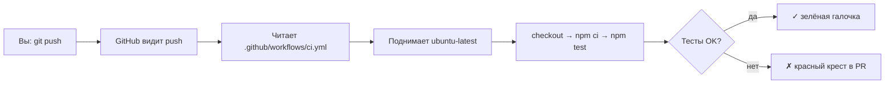

import ExternalCodeEmbed from '@site/src/components/ExternalCodeEmbed';


# GitHub Actions — CI/CD рецепты

<div class="article-tags">
  <span class="tag tag-notrequired">НЕ ОБЯЗАТЕЛЬНО</span>
  <span class="tag tag-beginner">ДЛЯ НОВИЧКОВ</span>
</div>

Приветствую! Здесь вы наверняка найдете, что ищете. Примеры в лаборатории рассчитаны на то, что мы разбираем что-то конкретное.

Текущая статья посвящена cI для Node.js и Python, тесты, деплой на GitHub Pages, секреты и matrix. Пошаговый разбор каждой строки workflow для курсовой, лабораторной и pet-проекта..

Поэтому за теорией по текущей теме вам — в [энциклопедию](/encyclopedia/intro).
Если ещё не погружались, то маршрут прост:

1. [Основы](/section/basics)
2. [Система и сеть](/section/system-network)
3. [Данные и разметка](/section/data-markup)
4. [Код и разработка](/section/code-dev)
5. [Языки](/section/languages)
6. [Искусственный интеллект](/section/ai)
7. [Проект](/section/project)
8. [Инфраструктура и безопасность](/section/infra-security)
9. [Спин-офф](/section/spinoff)

Обязательно пройдитесь.

А теперь приступим к нашему предмету.

<div class="callout callout--tip">
  <div class="callout-title">Теория и соседние материалы</div>

  <div class="callout-body">
  Системное введение — [GitHub Actions](/encyclopedia/8-infra-security/8-04-devops-ci-cd/2112).

  Полный справочник по ключам YAML — [Справочник по GitHub Actions](/encyclopedia/8-infra-security/8-04-devops-ci-cd/3113).

  Связка Git и триггеров — [Git и GitFlow в DevOps](/encyclopedia/8-infra-security/8-04-devops-ci-cd/12).

  Пошаговый деплой сайта — [кейс GitHub Pages](/lab/cases/3).
</div>
</div>

---
1. Прочитайте блок **«Что такое GitHub Actions»** — там смысл CI/CD без жаргона.
2. Сделайте **первый workflow за 5 минут** — минимальный рабочий файл.
3. Найдите свой стек (Node, Python, деплой, PR).
4. Скопируйте YAML **целиком**.
5. Прочитайте **Разбор** и **Разбор построчно** под кодом.
6. Выполните **Попробуйте** — одна маленькая правка закрепляет тему.
7. Для отчёта по лабораторной можно скриншотить вкладку Actions и зелёный step.

---

## Что такое GitHub Actions простыми словами

Вы делаете `git push` — код попадает на GitHub. **GitHub Actions** — это робот на сервере GitHub, который **автоматически** выполняет команды из вашего репозитория: установить Node.js, запустить тесты, собрать сайт, залить на GitHub Pages.

Инструкции роботу лежат в файле **YAML** (текст с отступами) в папке `.github/workflows/`.

| Без CI | С GitHub Actions |
|--------|------------------|
| «У меня локально всё работает» | На каждый push проверка на чистой Linux-ВМ |
| Преподаватель клонирует и мучается с версией Node | В YAML зафиксирована версия `20` |
| Забыли запустить тесты перед сдачей | Тесты стартуют сами, результат виден в PR |
| Деплой — копировать папку руками | `npm run build` + публикация на Pages одной кнопкой |



**CI (Continuous Integration)** — «каждое изменение кода автоматически проверяется». **CD (Continuous Delivery/Deployment)** — «после проверок артефакт выкладывается на сервер или Pages».

---

## Словарь за 30 секунд

| Термин | Простыми словами |
|--------|------------------|
| **Workflow** | Один YAML-файл = один сценарий автоматизации |
| **Job** | Блок работы на одной виртуальной машине |
| **Step** | Один шаг внутри job — команда или готовый action |
| **Runner** | Временная ВМ, где выполняются step (`ubuntu-latest` = Linux) |
| **Action** | Чужой готовый step из каталога (`actions/checkout@v4`) |
| **`on:`** | Когда запускать — push, PR, расписание, кнопка |
| **`uses:`** | Подключить action |
| **`run:`** | Выполнить shell-команду (`npm test`, `pytest`) |
| **`with:`** | Параметры для action (версия Node, путь к папке) |
| **`&#36;{{ … }}`** | Подстановка переменной GitHub (секрет, matrix, ref) |
| **Secret** | Пароль/токен в Settings, в код не пишется |
| **Artifact** | Zip с `build/` или `dist/` — скачать из UI run |
| **Matrix** | Один job × много версий (Node 18 и 20 параллельно) |

---

## Первый workflow за 5 минут

**Задача:** с нуля получить зелёный run во вкладке Actions.

### Шаг 1 — создать файл локально

В корне репозитория (там же, где `README.md`):

```
my-project/
  .github/
    workflows/
      hello.yml    ← ваш первый workflow
  README.md
```

Папки `.github` и `workflows` **с точкой** — это стандарт GitHub, не опечатка.

### Шаг 2 — минимальный YAML

Файл `.github/workflows/hello.yml`:

```yaml
name: Hello CI

on:
  push:
    branches: [main]
  workflow_dispatch:

jobs:
  greet:
    runs-on: ubuntu-latest
    steps:
      - run: echo "GitHub Actions работает"
```

### Шаг 3 — отправить на GitHub

```bash
git add .github/workflows/hello.yml
git commit -m "ci: первый workflow GitHub Actions"
git push origin main
```

Если основная ветка называется `master`, в YAML замените `main` на `master`.

### Шаг 4 — посмотреть результат

1. Откройте репозиторий на github.com.
2. Вкладка **Actions** → слева **Hello CI** → сверху последний run.
3. Клик по job **greet** → step с `echo` → в логе строка `GitHub Actions работает`.
4. Зелёная галочка ✓ — workflow успешен.

**Что увидите в UI:**

| Элемент | Значение |
|---------|----------|
| Жёлтый кружок | Run ещё выполняется |
| Зелёная галочка | Все step прошли |
| Красный крест | Какой-то step упал — откройте его лог |
| **Re-run jobs** | Повторить без нового коммита |

**Попробуйте:** на вкладке Actions нажмите **Run workflow** (работает, потому что в YAML есть `workflow_dispatch`).

---

## Анатомия YAML-файла workflow

Любой workflow — это **четыре уровня вложенности**. Отступы **только пробелами** (обычно 2), табы ломают парсер.

```
name          ← имя в UI
on            ← триггеры
jobs          ← список job
  job_id      ← имя job (вы придумываете)
    runs-on   ← ОС runner
    steps     ← список шагов
      - run   ← команда
      - uses  ← action
```

### Разбор минимального hello.yml построчно

```yaml
name: Hello CI
```

**Разбор:**

- `name:` — подпись workflow во вкладке Actions. Можно по-русски: `name: Моя первая CI`.
- Без `name` GitHub покажет имя файла `hello.yml`.

---

```yaml
on:
  push:
    branches: [main]
  workflow_dispatch:
```

**Разбор построчно:**

| Строка | Смысл |
|--------|--------|
| `on:` | Блок «когда запускать» |
| `push:` | При отправке коммитов (`git push`) |
| `branches: [main]` | Только push в ветку `main`, push в `feature/login` этот workflow **не** тронет |
| `workflow_dispatch:` | Ручной запуск кнопкой **Run workflow** в UI |

Короткая запись того же триггера: `on: [push, workflow_dispatch]` — без фильтра по ветке (сработает на **любой** push).

---

```yaml
jobs:
  greet:
    runs-on: ubuntu-latest
    steps:
      - run: echo "GitHub Actions работает"
```

**Разбор построчно:**

| Строка | Смысл |
|--------|--------|
| `jobs:` | Начало списка job. Можно несколько: `test`, `deploy`, … |
| `greet:` | **ID job** — латиница, без пробелов. В логах и в `needs: greet` |
| `runs-on: ubuntu-latest` | GitHub выдаёт свежую Ubuntu с bash, curl, git |
| `steps:` | Шаги выполняются **сверху вниз** на одной и той же ВМ |
| `- run: echo "…"` | Минус + пробел = элемент списка. `run` — команда в shell |
| `echo` | Печать текста в лог (как в терминале Linux) |

**Почему `-` перед step:** в YAML это **массив**. Каждый step — новый элемент списка.

---

## Основы — checkout и actions

### Checkout — скачать код на runner

**Задача:** понять, зачем почти везде первый step — `actions/checkout`.

Без checkout на runner **пустая папка**. Команда `npm ci` упадёт — нет `package.json`.

```yaml
steps:
  - uses: actions/checkout@v4
  - run: ls -la
  - run: cat package.json
```

**Разбор построчно:**

| Строка | Смысл |
|--------|--------|
| `- uses: actions/checkout@v4` | **uses** = взять готовый action. `actions/checkout` — официальный, клонирует репо |
| `@v4` | Версия action. Пишите `@v4`, `@v5`, **не** `@main` — иначе завтра action может сломаться |
| `ls -la` | Список файлов в рабочей папке — в логе увидите исходники |
| `cat package.json` | Печать файла — проверка, что checkout сработал |

**Где лежит код на runner:** переменная `$GITHUB_WORKSPACE` — обычно `/home/runner/work/ИМЯ_РЕПО/ИМЯ_РЕПО`.

**Попробуйте:** добавьте под checkout:

```yaml
      - uses: actions/checkout@v4
        with:
          fetch-depth: 0
```

**Разбор `fetch-depth: 0`:**

- По умолчанию checkout качает **1 последний коммит** (`fetch-depth: 1`) — быстрее.
- `0` = **вся история Git**. Нужно для release notes, `git describe`, Docusaurus «last updated».

---

### `uses:` и `run:` — в чём разница

| | `uses:` | `run:` |
|---|---------|--------|
| **Что это** | Готовый action (чужой YAML+скрипт) | Ваша команда в shell |
| **Пример** | `actions/setup-node@v4` | `npm test` |
| **Когда** | Стандартные задачи (git, node, cache) | Ваши скрипты проекта |

Один step — **либо** `uses`, **либо** `run` (иногда оба через `run` внутри action).

---

### Синтаксис `&#36;{{ }}` — подстановка значений

GitHub подставляет значения **до** выполнения step:

```yaml
node-version: ${{ matrix.node-version }}
github_token: ${{ secrets.GITHUB_TOKEN }}
if: github.ref == 'refs/heads/main'
```

| Выражение | Откуда значение |
|-----------|-----------------|
| `&#36;&#123;&#123; matrix.node-version &#125;&#125;` | Из блока `strategy.matrix` |
| `&#36;&#123;&#123; secrets.API_TOKEN &#125;&#125;` | Settings → Secrets |
| `&#36;&#123;&#123; github.ref &#125;&#125;` | Текущая ветка или тег |
| `&#36;&#123;&#123; github.event_name &#125;&#125;` | `push`, `pull_request`, … |
| `&#36;&#123;&#123; runner.os &#125;&#125;` | `Linux`, `Windows`, `macOS` |

В **логах** секреты заменяются на `&#42;&#42;*`. Писать `echo &#36;&#123;&#123; secrets.TOKEN &#125;&#125;` бессмысленно — увидите звёздочки.

---

## Стартовые рецепты

Простые сценарии для отчёта, курсовой и первого badge в README.

### Node.js — установка и тесты (самый частый запрос)

**Задача:** на каждый push и pull request установить зависимости и запустить `npm test`.

Файл `.github/workflows/node-ci.yml`:


<ExternalCodeEmbed example="yaml/lab-1134-001" title="Node.js — установка и тесты (самый частый запрос)" minHeight={408} />


**Разбор блоков:**

| Блок | Зачем |
|------|--------|
| `pull_request` + `push` | PR проверяется **до** merge; push в `main` — после слияния |
| `setup-node@v4` | Ставит Node.js 20 на runner (локально у вас может быть 22 — в CI всегда 20) |
| `cache: 'npm'` | Кэш скачанных пакетов — второй run быстрее на 30–60 секунд |
| `npm ci` | **c**lean **i**nstall строго по `package-lock.json`. Для CI предпочтительнее `npm install` |
| `npm test` | Вызывает скрипт `"test"` из `package.json` |

**Разбор построчно — блок `on:`:**

```yaml
on:
  push:
    branches: [main]
  pull_request:
    branches: [main]
```

- `push` на ветку `feature/x` **без** открытого PR — только если добавите `push` без фильтра или отдельный workflow.
- `pull_request` с `branches: [main]` — когда PR **влит** в main или открыт **в** main (target branch = main).

**Связь с package.json** — в проекте должен быть скрипт `"test"`:

```json
{
  "scripts": {
    "test": "jest"
  }
}
```

Другие варианты той же строки: `"node --test"`, `"vitest run"`, `"mocha"`. Главное — чтобы `npm test` находил команду.

Без `"test"` команда `npm test` упадёт с `missing script: test`.

**Что увидите в логе step `npm test`:**

```
> my-app@1.0.0 test
> jest

 PASS  src/app.test.js
Tests: 3 passed, 3 total
```

Красный step — прокрутите вверх до первой строки `FAIL` или `Error:`.

**Попробуйте:**

1. Добавьте step `- run: npm run lint` после `npm ci`.
2. Добавьте в README badge (замените `USER` и `REPO`):

```markdown

```

---

### Python — pytest

**Задача:** прогнать unit-тесты на Python 3.12 в CI.


<ExternalCodeEmbed example="yaml/lab-1134-002" title="Python — pytest" minHeight={354} />


**Разбор построчно:**

| Строка | Смысл |
|--------|--------|
| `on: [push, pull_request]` | Короткая форма — любой push и любой PR |
| `setup-python@v5` | Python 3.12 на runner |
| `cache: 'pip'` | Кэш wheel-файлов pip |
| `pip install -r requirements.txt` | Зависимости проекта из файла |
| `pip install pytest` | Тестовый раннер (если нет в requirements) |
| `pytest -q` | **q**uiet — меньше строк в логе, только итог и ошибки |

**Структура тестов для pytest:**

```
project/
  src/
    calc.py
  tests/
    test_calc.py
```

Пример `tests/test_calc.py`:

```python
def test_add():
    assert 1 + 1 == 2
```

**Попробуйте:** замените `pytest -q` на `pytest -v` — в логе будет имя каждого теста (удобно для отчёта).

**Если зависимости в pyproject.toml:**

```yaml
      - run: pip install -e ".[dev]"
      - run: pytest -q
```

---

### Только pull request — проверки без деплоя

**Задача:** на каждый PR в `main` — lint и test; деплой этот файл **не** трогает.


<ExternalCodeEmbed example="yaml/lab-1134-003" title="Только pull request — проверки без деплоя" minHeight={372} />


**Разбор:**

- Триггер **только** `pull_request` — обычный push в feature-ветку без PR workflow **не** запустит.
- В карточке PR появится секция **Checks** — зелёный или красный статус.
- Если в **Settings → Branches → Branch protection** включено «Require status checks», merge без зелёного CI невозможен.

**Что увидите в PR:**

```
All checks have passed
  ✓ verify / test (pull_request)
```

**Попробуйте:** намеренно сломайте тест, откройте PR — преподаватель увидит красный крест до исправления.

---

### Java — Maven (сборка и тесты)

**Задача:** типичный CI для учебного Java-проекта с `pom.xml`.


<ExternalCodeEmbed example="yaml/lab-1134-004" title="Java — Maven (сборка и тесты)" minHeight={336} />


**Разбор построчно:**

| Строка | Смысл |
|--------|--------|
| `setup-java@v4` | JDK на runner |
| `distribution: temurin` | Сборка Eclipse Temurin (бывший AdoptOpenJDK) |
| `java-version: '21'` | Версия языка — как в вашем `pom.xml` |
| `cache: maven` | Кэш `~/.m2` — не качать одни и те же jar каждый раз |
| `mvn -B verify` | **B**atch mode (без интерактива) + compile + test + package checks |

**Попробуйте:** Gradle вместо Maven — `cache: gradle` и `run: ./gradlew test`.

---

## CI/CD рецепты

### 1. Matrix — Node 18 и 20 параллельно

**Задача:** убедиться, что проект работает на двух LTS-версиях Node.


<ExternalCodeEmbed example="yaml/lab-1134-005" title="1. Matrix — Node 18 и 20 параллельно" minHeight={390} />


**Разбор построчно:**

| Строка | Смысл |
|--------|--------|
| `strategy:` | Настройки параллельного запуска |
| `matrix:` | Таблица параметров → GitHub создаёт **отдельный run** на каждую комбинацию |
| `node-version: [18, 20]` | Два job: один с Node 18, второй с 20 |
| `fail-fast: false` | Упал тест на 18 — проверка на 20 **всё равно** дойдёт до конца |
| `&#36;&#123;&#123; matrix.node-version &#125;&#125;` | В первом job подставится `18`, во втором `20` |

**Что увидите в UI:** два под-job `test (18)` и `test (20)` внутри одного workflow run.

**Попробуйте — кросс-платформа:**

```yaml
    strategy:
      matrix:
        os: [ubuntu-latest, windows-latest]
        node-version: [20]
    runs-on: ${{ matrix.os }}
```

Получится 2 job: Linux + Windows.

---

### 2. Кэш npm вручную (actions/cache)

**Задача:** ускорить CI в монорепо, когда встроенного `cache: 'npm'` мало.

Фрагмент steps:

```yaml
      - uses: actions/checkout@v4
      - uses: actions/cache@v4
        id: npm-cache
        with:
          path: ~/.npm
          key: ${{ runner.os }}-npm-${{ hashFiles('**/package-lock.json') }}
          restore-keys: |
            ${{ runner.os }}-npm-
      - run: npm ci
```

**Разбор построчно:**

| Строка | Смысл |
|--------|--------|
| `actions/cache@v4` | Сохранить/восстановить папку между run |
| `id: npm-cache` | Имя step — можно сослаться в `if: steps.npm-cache.outputs.cache-hit` |
| `path: ~/.npm` | Что кэшируем — каталог npm на Linux |
| `hashFiles('&#42;&#42;/package-lock.json')` | Хэш lock-файла в ключе: изменился lock → новый кэш |
| `restore-keys:` | Если точного ключа нет — взять ближайший префикс `&#36;&#123;&#123; runner.os &#125;&#125;-npm-` |
| `\|` после `restore-keys:` | Многострочный YAML — вторая строка с отступом |

**Что увидите в логе cache step:**

```
Cache restored from key: Linux-npm-a1b2c3d4..
```

или при первом run:

```
Cache not found for input keys: Linux-npm-..
```

**Попробуйте:** второй push без изменения `package-lock.json` — время step `npm ci` обычно падает.

---

### 3. Секреты — API-токен без утечки в Git

**Задача:** вызвать внешний API из CI, токен хранится только в Settings.

**Шаг 1 — в GitHub UI:**

Settings → Secrets and variables → Actions → **New repository secret**

| Поле | Значение |
|------|----------|
| Name | `API_TOKEN` |
| Secret | ваш токен (строка) |

**Шаг 2 — в YAML:**

```yaml
      - name: Deploy with token
        env:
          API_TOKEN: ${{ secrets.API_TOKEN }}
        run: |
          curl -sf -H "Authorization: Bearer $API_TOKEN" \
            https://api.example.com/deploy
```

**Разбор построчно:**

| Строка | Смысл |
|--------|--------|
| `name: Deploy with token` | Подпись step в UI (необязательно, но удобно) |
| `env:` | Переменные окружения **только для этого step** |
| `API_TOKEN: &#36;&#123;&#123; secrets.API_TOKEN &#125;&#125;` | GitHub подставит секрет перед запуском shell |
| `run: \|` | Многострочный shell-скрипт |
| `curl -sf` | `-s` тихо, `-f` exit code ≠ 0 при HTTP 4xx/5xx — step станет красным |
| `$API_TOKEN` | Shell-переменная из `env` (без `&#36;{{ }}` внутри run) |

**`GITHUB_TOKEN`** — секрет **создаётся автоматически** на каждый run. Нужен для push в тот же репозиторий (ветка `gh-pages`, releases). Пишут `&#36;&#123;&#123; secrets.GITHUB_TOKEN &#125;&#125;`.

<div class="callout callout--danger">
  <div class="callout-title">Секрет в истории Git</div>

  <div class="callout-body">
  Токен в коммите остаётся в истории навсегда.

  Отзовите ключ, очистите историю (`git filter-repo` / BFG), создайте секрет заново.

  В YAML — только `$&#123;&#123; secrets.NAME &#125;&#125;`.
</div>
</div>

**Попробуйте:** step `run: echo "token length is $&#123;#API_TOKEN&#125;"` с секретом в env — в логе число символов, сам токен скрыт `&#42;&#42;*`.

---

### 4. Артефакты — сохранить папку build/

**Задача:** после сборки положить `dist/` в zip — скачать из UI без повторной сборки локально.


<ExternalCodeEmbed example="yaml/lab-1134-006" title="4. Артефакты — сохранить папку build/" minHeight={696} />


**Разбор связки:**

- `needs: build` — job `deploy` стартует **после** успешного `build`.
- `download-artifact` — распаковывает zip в `dist/` на **новой** ВМ (у каждого job свой runner).

---

### 5. Условный деплой только с main

**Задача:** тесты на всех ветках и PR; выкладка на Pages — только push в `main`.


<ExternalCodeEmbed example="yaml/lab-1134-007" title="5. Условный деплой только с main" minHeight={678} />


**Разбор построчно — job `deploy`:**

| Строка | Смысл |
|--------|--------|
| `needs: test` | Ждём зелёный job `test` |
| `if: github.event_name == 'push' && github.ref == 'refs/heads/main'` | PR и push в `develop` → job **пропускается** (skipped) |
| `permissions: contents: write` | Без этого `GITHUB_TOKEN` только читает репо — push в `gh-pages` упадёт |
| `peaceiris/actions-gh-pages@v4` | Community action: коммитит содержимое `publish_dir` в ветку `gh-pages` |
| `publish_dir: ./dist` | Откуда брать HTML/CSS/JS |
| `publish_branch: gh-pages` | Куда пушить (GitHub Pages читает эту ветку) |

**Что увидите при PR:** job `test` зелёный, `deploy` серый **Skipped**.

**Попробуйте:** Vite/React часто пишет в `dist`, Docusaurus — в `build`. Проверьте локально `npm run build` и подставьте правильную папку.

---

### 6. Официальный деплой GitHub Pages

**Задача:** опубликовать статику через официальные action `deploy-pages` (без peaceiris).


<ExternalCodeEmbed example="yaml/lab-1134-008" title="6. Официальный деплой GitHub Pages" minHeight={606} />


**Разбор построчно — верх файла:**

| Строка | Смысл |
|--------|--------|
| `permissions: pages: write` | Право публиковать на Pages |
| `id-token: write` | OIDC-токен для безопасной авторизации |
| `concurrency: group: pages` | Один deploy Pages одновременно |
| `cancel-in-progress: true` | Новый push отменяет старый незавершённый deploy |
| `environment: github-pages` | Связь с Settings → Environments (опционально protection rules) |
| `url: &#36;&#123;&#123; steps.deployment.outputs.page_url &#125;&#125;` | Ссылка на сайт в UI run |
| `configure-pages@v5` | Подготовка Pages |
| `upload-pages-artifact` | Zip для Pages |
| `id: deployment` | Имя step — ссылка `steps.deployment.outputs.page_url` |
| `deploy-pages@v4` | Финальная публикация |
| `path: .` | Корень репо = готовый HTML. После сборки укажите `path: build` |

**В Settings → Pages** источник должен быть **GitHub Actions**, не «Deploy from a branch».

**Попробуйте:** перед upload добавьте `npm ci`, `npm run build`, смените `path` на `build`.

---

### 7. Расписание cron — ночной smoke test

**Задача:** раз в сутки проверить, что API отвечает 200.


<ExternalCodeEmbed example="yaml/lab-1134-009" title="7. Расписание cron — ночной smoke test" minHeight={336} />


**Разбор построчно:**

| Строка | Смысл |
|--------|--------|
| `schedule:` | Запуск по cron (UTC!) |
| `cron: '0 6 * * *'` | Каждый день в 06:00 UTC (= 09:00 МСК зимой) |
| `curl -s -o /dev/null` | Тело ответа выбросить |
| `-w "%&#123;http_code&#125;"` | Напечатать только код статуса |
| `test "$code" = "200"` | Shell: если не 200 — exit 1 → красный step |

**Формат cron (5 полей):** `минута час день_месяца месяц день_недели`

| Пример | Значение |
|--------|----------|
| `'0 6 * * *'` | Каждый день 06:00 UTC |
| `'0 */4 * * *'` | Каждые 4 часа |
| `'30 8 * * 1-5'` | Пн–Пт в 08:30 UTC |

Расписание работает только на **default branch** (`main`).

**Попробуйте:** `workflow_dispatch` + Run workflow — отладка без ожидания ночи.

---

### 8. Concurrency — отмена старых run

**Задача:** десять push подряд в PR — не ждать десять одинаковых CI, отменять устаревшие.

Добавьте **на уровне workflow** (рядом с `on:`, не внутри job):


<ExternalCodeEmbed example="yaml/lab-1134-010" title="8. Concurrency — отмена старых run" minHeight={318} />


**Разбор построчно:**

| Строка | Смысл |
|--------|--------|
| `group: ci-&#36;&#123;&#123; github.workflow &#125;&#125;-&#36;&#123;&#123; github.ref &#125;&#125;` | Одна «очередь» на пару workflow + ветка/PR |
| `cancel-in-progress: true` | Новый run **убивает** предыдущий незавершённый |

**Что увидите:** первый run со статусом **Cancelled**, последний — актуальный результат.

---

### 9. Reusable workflow — один шаблон для всех студентов

**Задача:** преподаватель держит эталон CI, студенты подключают одной строкой.

**Репозиторий `org/ci-templates/.github/workflows/node-test.yml`:**


<ExternalCodeEmbed example="yaml/lab-1134-011" title="9. Reusable workflow — один шаблон для всех студентов" minHeight={426} />


**Разбор:**

| Ключ | Смысл |
|------|--------|
| `workflow_call` | Этот workflow **не** стартует от push — только когда его вызвали |
| `inputs.node-version` | Параметр от вызывающего workflow |
| `&#36;&#123;&#123; inputs.node-version &#125;&#125;` | Значение параметра внутри reusable |

**В проекте студента `.github/workflows/ci.yml`:**

```yaml
name: CI

on: [push, pull_request]

jobs:
  call-shared:
    uses: org/ci-templates/.github/workflows/node-test.yml@main
    with:
      node-version: '20'
```

**Разбор вызова:**

- `uses: org/repo/path@main` — `@main` = ветка шаблона (можно `@v1` tag).
- Один репозиторий — локально: `uses: ./.github/workflows/node-test.yml`.

---

### 10. Docker — проверить сборку Dockerfile

**Задача:** убедиться, что образ собирается на CI (для отчёта по DevOps).


<ExternalCodeEmbed example="yaml/lab-1134-012" title="10. Docker — проверить сборку Dockerfile" minHeight={336} />


**Разбор построчно:**

| Строка | Смысл |
|--------|--------|
| `setup-buildx-action` | Современный движок сборки Docker |
| `build-push-action` | `docker build` внутри action |
| `context: .` | Dockerfile и контекст — корень репо |
| `push: false` | **Не** пушить в registry — только проверка сборки |
| `tags: myapp:ci` | Локальное имя образа на runner |

**Попробуйте:** `push: true` + `docker/login-action` + GHCR — для продвинутых проектов; теория — [контейнеризация](/encyclopedia/8-infra-security/8-06-konteynerizatsiya-i-orkestratsiya/intro). Сначала убедитесь, что локальный [Dockerfile собирается](/lab/Примеры/11113) — примеры Node, Python, Go с построчным разбором.

---

## Реальный пример — деплой этого сайта

Workflow [it-knowledge-base](https://github.com/Spirzen/it-knowledge-base/blob/main/.github/workflows/deploy.yml) — Docusaurus на GitHub Pages.


<ExternalCodeEmbed example="yaml/lab-1134-013" title="Реальный пример — деплой этого сайта" minHeight={606} />


**Разбор построчно — каждый step:**

| Step | Что делает | Зачем |
|------|------------|--------|
| `checkout` + `fetch-depth: 0` | Клон с полной историей | Docusaurus показывает дату последнего изменения страницы |
| `setup-node` 20 | Node LTS на runner | Совпадает с `engines` проекта |
| `npm ci` | Установка по lock-файлу | Воспроизводимая сборка |
| `rm -rf .docusaurus .cache build` | Удалить старый кэш сборки | Лечит «залипший» битый build на runner |
| `npm run build` | Docusaurus → папка `build/` | Готовый статический сайт |
| `peaceiris/actions-gh-pages` | Push `build/` в `gh-pages` | GitHub Pages отдаёт сайт читателям |
| `force_orphan: true` | Ветка `gh-pages` без истории | Только HTML, без исходников |
| `user_name` / `user_email` | Автор коммита — bot | В history видно `github-actions[bot]` |

**Цепочка для отчёта:**

```
push main → Actions deploy.yml → npm run build → ветка gh-pages → spirzen.ru
```

Подробнее с DNS и Settings — [кейс GitHub Pages](/lab/cases/3).

---

## Badge «CI passing» в README

**Задача:** в README красивая картинка статуса последнего run.

```markdown

```

**Разбор URL:**

| Часть | Замените на |
|-------|-------------|
| `USER` | ваш логин GitHub |
| `REPO` | имя репозитория |
| `node-ci.yml` | имя файла workflow **без** пути |

Пример для этого репозитория:

```markdown

```

Статус обновляется после каждого run. Красный badge = последний run упал.

---

## Частые ошибки — симптом и лечение

| Симптом в логе | Частая причина | Что сделать |
|----------------|----------------|-------------|
| Workflow не появился в Actions | Файл не в `.github/workflows/` | Проверьте путь и расширение `.yml` |
| `yaml syntax error` | Табы вместо пробелов | Переведите отступы на 2 пробела |
| `npm ERR! Missing script: "test"` | Нет `"test"` в package.json | Добавьте скрипт или замените команду |
| `npm ci` can only install with package-lock | Нет lock-файла | `npm install` локально, закоммитьте lock |
| `Permission denied` при gh-pages | Нет `permissions: contents: write` | Добавьте блок permissions |
| `No such file or directory: dist` | Неверная папка сборки | Локально `npm run build`, посмотрите имя папки |
| Secret пустой | Опечатка `secrets.API_TOKEN` | Имя = как в Settings, регистр важен |
| Сайт без CSS на Pages | Неверный `base` / `homepage` | Для project site нужен `/repo-name/` в конфиге |
| Два deploy подряд | Нет concurrency | `cancel-in-progress: true` |
| PR без Checks | Только `push` в workflow | Добавьте `pull_request` в `on:` |

<div class="callout callout--warning">
  <div class="callout-title">Как читать красный лог</div>

  <div class="callout-body">
  Откройте упавший step → прокрутите вверх от <code>##[error]</code> → найдите первую строку с <code>Error:</code>, <code>FAIL</code> или <code>exit code 1</code>. Часто ошибка в step выше, чем кажется (например, <code>npm ci</code> упал из-за lock-файла).
</div>
</div>

---

## Шпаргалка — что вставить в отчёт по лабораторной

Краткий текст для пояснительной записки (адаптируйте под свой проект):

> В репозитории настроен CI на GitHub Actions. Файл `.github/workflows/node-ci.yml` описывает pipeline: при push и pull request запускается job на виртуальной машине `ubuntu-latest`, выполняется checkout кода, установка Node.js 20, команда `npm ci` для установки зависимостей и `npm test` для автоматического тестирования. Результат отображается во вкладке Actions и в статусах pull request. Это обеспечивает непрерывную интеграцию (CI) — проверку кода на каждое изменение без ручного запуска тестов на машине разработчика.

---

## Куда дальше

| Задача | Материал |
|--------|----------|
| Теория CI/CD, runner, events | [GitHub Actions](/encyclopedia/8-infra-security/8-04-devops-ci-cd/2112) |
| Все ключи YAML, contexts | [Справочник](/encyclopedia/8-infra-security/8-04-devops-ci-cd/3113) |
| E2E в браузере | [Playwright и Actions](/encyclopedia/8-infra-security/8-04-devops-ci-cd/3123) |
| Git, PR, branch protection | [Основы Git](/encyclopedia/4-code-dev/4-13-osnovy-raboty-s-git/intro) |
| Деплой сайта с нуля | [Кейс GitHub Pages](/lab/cases/3) |
| HTTP в job (curl) | [curl / fetch — примеры](/lab/Примеры/1133) |
| Bash-скрипты в step | [Bash — однострочники](/lab/Примеры/1151), [production](/lab/Примеры/113) |

---
