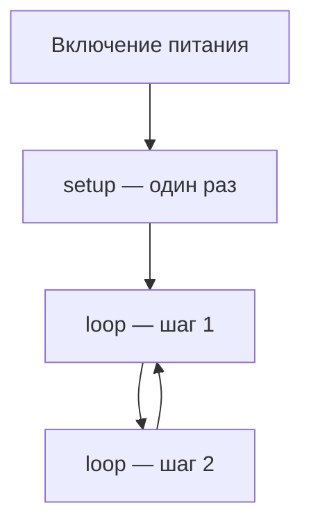

import ExternalCodeEmbed from '@site/src/components/ExternalCodeEmbed';


import ExternalPlayEmbed from '@site/src/components/ExternalPlayEmbed';


# Arduino и micro:bit — примеры с разбором

<div class="article-tags">
  <span class="tag tag-notrequired">НЕ ОБЯЗАТЕЛЬНО</span>
  <span class="tag tag-beginner">ДЛЯ НОВИЧКОВ</span>
</div>

Приветствую! Здесь вы наверняка найдете, что ищете. Примеры в лаборатории рассчитаны на то, что мы разбираем что-то конкретное.

Текущая статья посвящена Arduino и micro:bit — светодиод, ШИМ, датчики и Serial с построчным разбором.

Поэтому за теорией по текущей теме вам — в [энциклопедию](/encyclopedia/intro).
Если ещё не погружались, то маршрут прост:

1. [Основы](/section/basics)
2. [Система и сеть](/section/system-network)
3. [Данные и разметка](/section/data-markup)
4. [Код и разработка](/section/code-dev)
5. [Языки](/section/languages)
6. [Искусственный интеллект](/section/ai)
7. [Проект](/section/project)
8. [Инфраструктура и безопасность](/section/infra-security)
9. [Спин-офф](/section/spinoff)

Обязательно пройдитесь.

А теперь приступим к нашему предмету.

<div class="callout callout--tip">
  <div class="callout-title">Теория и соседние материалы</div>

  <div class="callout-body">
  Интерфейс Tinkercad, breadboard, Blockly и ограничения симулятора — [Tinkercad Circuits и Arduino](/encyclopedia/2-system-network/2-10-zhelezo/1013).

  Что такое микроконтроллер и прошивка — [Встраиваемые системы](/encyclopedia/2-system-network/2-10-zhelezo/112).

  Визуальный код без проводов — [Scratch](/lab/Примеры/112), рисование на ПК — [Turtle](/lab/Примеры/111).
</div>
</div>

---
## Оглавление

**Arduino**

1. [Что такое скетч и зачем setup / loop](#chto-takoe-sketch)
2. [Обязательный шаблон](#arduino-shablon)
3. [Мигающий светодиод (Blink)](#blink)
4. [Кнопка включает LED](#button)
5. [Плавная яркость (ШИМ)](#pwm)
6. [Потенциометр и Serial Monitor](#sensor)
7. [Светофор на трёх LED](#traffic)
8. [Бегущий огонь](#chase)
9. [Звук tone и buzzer](#tone)
10. [Переключение LED по нажатию](#toggle)

**micro:bit**

11. [Сердце на матрице](#mb-heart)
12. [Мигающий смайлик](#mb-blink)
13. [Кнопки A и B](#mb-buttons)
14. [Наклон — стрелка](#mb-tilt)
15. [Счётчик нажатий](#mb-counter)
16. [Температура и свет](#mb-sensors)

**Итог**

17. [Arduino или micro:bit](#sravnenie) · [Частые ошибки](#oshibki) · [Куда дальше](#dalsche)

---

<span id="simulator"></span>

## Интерактивный симулятор

Перед пайкой проводов можно **нажать пины Arduino**, открыть **micro:bit**, собрать схему на breadboard и **запустить учебные проекты** прямо на этой странице.

<ExternalPlayEmbed example="lab/tinkercad-circuits-play" title="Tinkercad Circuits" minHeight={520} playProps={{ section: 'hub' }} />

**Как пользоваться симулятором:**

1. Вкладка **Arduino Uno** — клик по пину **13** (там же встроенный LED «L» на реальной плате).
2. Вкладка **Проекты** — выберите «Мигающий LED», нажмите **▶**, смотрите подсветку кода.
3. В проекте «Кнопка → LED» **зажмите кнопку мышью** во время симуляции.

---

<span id="chto-takoe-sketch"></span>

## Что такое Arduino простыми словами

**Arduino Uno** — учебная плата с микроконтроллером. Вы пишете программу (**скетч**) на компьютере, загружаете по USB — и плата **много раз подряд** выполняет ваши команды: зажечь LED, прочитать кнопку, измерить напряжение с датчика.

Программа на Arduino **всегда** устроена так:



| Функция | Сколько раз | Смысл |
|---------|-------------|--------|
| `setup()` | **1 раз** при старте | «Подготовка» — какие пины вход, какие выход, скорость Serial |
| `loop()` | **бесконечно** | «Рабочий день» — опрос кнопок, мигание, чтение датчиков |

На **micro:bit** то же самое, только вместо `setup`/`loop` часто блоки **«при старте»** и **«всегда»** (`basic.forever`), а экран — матрица 5×5 LED на самой плате.

### Словарь (если термины путаются)

| Термин | Простыми словами |
|--------|------------------|
| **Пин** | Металлический «ноготь» на краю платы; через него идёт сигнал 0 или 1 (цифра) или число 0…1023 (аналог) |
| **GND** | Земля, минус, общий провод схемы |
| **5V** | Плюс питания 5 вольт (для Uno) |
| **HIGH / LOW** | Логическая 1 (~5 В) и 0 (0 В) |
| **Скетч** | Файл `.ino` с вашим кодом |
| **ШИМ (PWM)** | Быстрое мигание; глаз видит **яркость**, а не мигание |
| **Serial Monitor** | Окно в IDE/Tinkercad, куда программа **печатает текст** для отладки |

---

<span id="arduino-shablon"></span>

## Arduino — обязательный шаблон

**Задача:** понять каркас **любого** скетча. Без `pinMode` плата не знает, выводить сигнал на LED или читать кнопку.

```cpp
void setup() {
  // выполнится ОДИН раз после включения или Reset
}

void loop() {
  // выполнится снова и снова — бесконечно
}
```

### Разбор построчно

| Строка | Смысл |
|--------|--------|
| `void setup()` | Объявление функции **настройки**. `void` = «ничего не возвращает наружу» |
| `{` `}` | Границы тела функции — всё между скобками выполняется при старте |
| `void loop()` | Функция **цикла**. После последней строки `loop` управление **снова** прыгает на первую строку `loop` |
| Комментарии `// …` | Для человека; компилятор их **игнорирует** |

Arduino IDE **сама** подставляет служебный код (`#include <Arduino.h>`, `main`, который вызывает `setup` и `loop`). Вам писать `main` не нужно.

### Минимальный рабочий скетч с отладкой

**Задача:** убедиться, что загрузка и **Serial Monitor** работают.

```cpp
void setup() {
  Serial.begin(9600);   // скорость обмена с компьютером — 9600 бод
  Serial.println("Плата включилась");
}

void loop() {
  Serial.println("tick");
  delay(1000);          // раз в секунду новая строка
}
```

**Разбор:**

- `Serial.begin(9600)` — **обязательно в setup** перед любыми `print`, иначе монитор пустой или «кракозябры».
- `Serial.println("…")` — отправить текст и **перейти на новую строку**.
- `delay(1000)` — процессор **1000 мс ничего другого не делает** (для учебных blink это нормально; в играх на кнопках позже учат обход без `delay`).

**Попробуйте:** в Tinkercad откройте **Serial Monitor** внизу — увидите `tick` каждую секунду.

**Если не работает:** в мониторе выберите скорость **9600**, как в `begin(9600)`.

<ExternalPlayEmbed example="lab/tinkercad-circuits-play" title="Tinkercad Circuits" minHeight={520} playProps={{ section: 'arduino' }} />

---

<span id="arduino-start"></span>

## Arduino — стартовые проекты

Ниже — проекты, с которых обычно начинают курс. Каждый можно собрать **без паяльника** в Tinkercad, потом повторить на реальной Arduino Uno и breadboard.

---

<span id="blink"></span>

### Мигающий светодиод (Blink)

**Задача:** зажечь и погасить LED — «Hello, World» мира Arduino. Поймёте `pinMode`, `digitalWrite`, `delay`.

**Схема (как подключать):**

| Элемент | Куда |
|---------|------|
| **Анод** LED (длинная ножка, «+») | Через резистор **220 Ω** → пин **13** |
| **Катод** (короткая ножка) | **GND** |
| На плате Uno | Есть **встроенный** LED на пине 13 (подпись **L**) — внешний диод можно не ставить для первого теста |

Резистор **ограничивает ток** — без него LED может сгореть. Цвет полосок 220 Ω — красный-красный-коричневый (допуск ± золото).

```cpp
void setup() {
  pinMode(13, OUTPUT);
}

void loop() {
  digitalWrite(13, HIGH);
  delay(1000);
  digitalWrite(13, LOW);
  delay(1000);
}
```

### Разбор построчно

| Строка | Что делает | Зачем так |
|--------|------------|-----------|
| `void setup()` | Старт настройки | Arduino вызывает **один раз** |
| `pinMode(13, OUTPUT)` | Пин 13 — **выход** | Без этой строки `digitalWrite` на 13 может не работать |
| `void loop()` | Начало бесконечного цикла | |
| `digitalWrite(13, HIGH)` | На пине 13 **~5 В** | Ток идёт через LED → светится |
| `delay(1000)` | Пауза **1 секунда** (1000 мс) | LED горит 1 с |
| `digitalWrite(13, LOW)` | На пине **0 В** | LED погас |
| `delay(1000)` | Ещё 1 с пауза | Цикл повторится — снова `digitalWrite HIGH` |

### Что вы видите

- В симуляторе и на плате LED **1 с горит, 1 с нет**.
- Встроенный LED **L** на Uno мигает синхронно с кодом на пине 13.

**Попробуйте:**

1. `delay(1000)` → `delay(200)` — мигание **в 5 раз быстрее**.
2. Поменяйте `13` на `9` (и в `pinMode`, и в `digitalWrite`) — подключите внешний LED к **9** через 220 Ω.

**Если не мигает:**

- LED перевёрнут (катод и анод) — поменяйте ножки.
- Нет `pinMode(13, OUTPUT)`.
- В Tinkercad не нажали **▶ Start Simulation**.

<ExternalPlayEmbed example="lab/tinkercad-circuits-play" title="Tinkercad Circuits" minHeight={520} playProps={{ section: 'blink' }} />

---

<span id="button"></span>

### Кнопка включает светодиод

**Задача:** научиться **читать** цифровой вход (`digitalRead`) и ветвиться через `if`. Пока кнопку **держат** — LED горит.

**Схема:**

| Элемент | Соединение |
|---------|------------|
| Кнопка | Один контакт → **5V**, второй → пин **2** |
| Резистор **10 кОм** | От пина **2** к **GND** (подтяжка вниз — без нажатия на пине «0») |
| LED | Как в [Blink](#blink), пин **13** |

Пока кнопка **не нажата**, пин 2 через резистор на GND → `LOW`. Нажали — пин соединён с 5V → `HIGH`.


<ExternalCodeEmbed example="cpp/lab-1135-001" title="Кнопка включает светодиод" minHeight={336} />


### Разбор построчно

| Строка | Смысл |
|--------|--------|
| `const int buttonPin = 2;` | **Имя** для номера пина. Число `2` в коде больше не ищем — меняем в одном месте |
| `const int ledPin = 13;` | То же для светодиода |
| `const` | Значение **не меняется** во время работы программы |
| `pinMode(ledPin, OUTPUT)` | LED-пин — выход |
| `pinMode(buttonPin, INPUT)` | Пин кнопки — **вход** (плата читает напряжение) |
| `digitalRead(buttonPin)` | Возвращает `HIGH` или `LOW` **прямо сейчас** |
| `if (… == HIGH)` | Если кнопка нажата — выполнить блок `{ … }` |
| `else` | Иначе — погасить LED |

### Как это работает по шагам (один проход loop)

1. Arduino **читает** пин 2.
2. Если там 5 В → зажигает 13.
3. Если 0 В → гасит 13.
4. Сразу снова с шага 1 — сотни раз в секунду, поэтому LED кажется «залипшим» в нужном состоянии.

**Попробуйте:** поменяйте `HIGH` и `LOW` в `if`, если кнопка подключена через **INPUT_PULLUP** (см. [переключение по нажатию](#toggle)).

**Если LED всегда горит или всегда погашен:** перепутана подтяжка или контакты кнопки; проверьте провод на **5V** и **GND**.

<ExternalPlayEmbed example="lab/tinkercad-circuits-play" title="Tinkercad Circuits" minHeight={520} playProps={{ section: 'button' }} />

---

<span id="pwm"></span>

### Плавная яркость (ШИМ, PWM)

**Задача:** не просто вкл/выкл, а **плавное** изменение яркости. Функция `analogWrite` и цикл `for`.

**Схема:** LED на пин **9** (на Uno у 9 есть **ШИМ**, на плате рядом с цифрой может быть знак **~**). Через 220 Ω на GND.


<ExternalCodeEmbed example="cpp/lab-1135-002" title="Плавная яркость (ШИМ, PWM)" minHeight={354} />


### Разбор построчно

| Строка | Смысл |
|--------|--------|
| `const int ledPin = 9;` | Только пины **3, 5, 6, 9, 10, 11** поддерживают `analogWrite` на Uno |
| `for (int brightness = 0; …)` | Цикл: переменная `brightness` от 0 до 255 |
| `brightness <= 255` | Условие продолжения цикла |
| `brightness += 5` | Шаг **5** за итерацию (меньше шаг — плавнее, дольше цикл) |
| `analogWrite(ledPin, brightness)` | «Яркость» 0…255. Внутри — **очень быстрое** мигание, глаз видит свет |
| `delay(20)` | Задержка между шагами яркости — скорость «дыхания» |
| Второй `for` | То же **вниз** от 255 до 0 |

### Зачем 0…255, а не 0…1023

`analogWrite` на Arduino Uno принимает **8 бит** (256 уровней). `analogRead` с датчика даёт **0…1023** (10 бит) — это разные шкалы; в [потенциометре](#sensor) их связывают через `map`.

**Попробуйте:** `brightness += 1` вместо `5` — плавнее, но цикл дольше.

**Если не плавно, а мигает:** LED на пине **без ШИМ** (например 13) — перенесите на **9**.

<ExternalPlayEmbed example="lab/tinkercad-circuits-play" title="Tinkercad Circuits" minHeight={520} playProps={{ section: 'pwm' }} />

---

<span id="sensor"></span>

### Потенциометр управляет яркостью

**Задача:** **аналоговый вход** `analogRead`, пересчёт `map`, вывод в **Serial Monitor** — типичная лабораторная «ручка яркости».

**Схема:**

| Вывод потенциометра | Куда |
|---------------------|------|
| Крайний | **5V** |
| Средний (бегунок) | **A0** |
| Другой крайний | **GND** |
| LED | Пин **9** + 220 Ω на GND |

Поворот ручки меняет напряжение на A0 от 0 до 5 В; АЦП превращает в число **0…1023**.


<ExternalCodeEmbed example="cpp/lab-1135-003" title="Потенциометр управляет яркостью" minHeight={444} />


### Разбор построчно

| Строка | Смысл |
|--------|--------|
| `const int sensorPin = A0;` | Аналоговые пины **A0–A5** — только **чтение** |
| `Serial.begin(9600);` | Включить «разговор» с компьютером |
| `analogRead(sensorPin)` | Число **0…1023** пропорционально напряжению на A0 |
| `map(sensorValue, 0, 1023, 0, 255)` | Линейно перевести диапазон датчика в диапазон для `analogWrite` |
| `analogWrite(ledPin, ledBrightness)` | Яркость LED |
| `Serial.print("Датчик: ")` | Текст **без** перевода строки |
| `Serial.print(sensorValue)` | Число рядом с текстом |
| `Serial.println(ledBrightness)` | Последнее число + **новая строка** |
| `delay(100)` | Печать не чаще 10 раз в секунду — монитор читается глазами |

### Что видите в Serial Monitor

При вращении ручки в Tinkercad строки вроде:

```text
Датчик: 512  Яркость: 128
```

**Попробуйте:** уберите `delay(100)` — строк станет очень много (для отладки иногда полезно, для отчёта — нет).

**Если число не меняется:** средний вывод потенциометра не на **A0**; нет общего **GND** с Arduino.

<ExternalPlayEmbed example="lab/tinkercad-circuits-play" title="Tinkercad Circuits" minHeight={520} playProps={{ section: 'sensor' }} />

---

<span id="arduino-prodvinutye"></span>

## Arduino — проекты посложнее

Когда базовые примеры работают, переходите к **нескольким выходам**, **функциям** и **событиям по нажатию**.

---

<span id="traffic"></span>

### Светофор на трёх LED

**Задача:** три выхода, функция-помощник `setLight`, последовательность `delay` — модель «красный → жёлтый → зелёный».

**Схема:** три LED (или один RGB) на пины **8** (красный), **9** (жёлтый), **10** (зелёный), каждый через 220 Ω на GND.


<ExternalCodeEmbed example="cpp/lab-1135-004" title="Светофор на трёх LED" minHeight={534} />


### Разбор построчно

| Строка | Смысл |
|--------|--------|
| Три `const int …Pin` | Три **независимых** выхода — удобно для отчёта и схемы |
| `void setLight(int r, int y, int g)` | **Своя функция**: передаём `HIGH`/`LOW` для каждого цвета |
| `digitalWrite(redPin, r)` | Параметр `r` подставляется вместо константы |
| `setLight(HIGH, LOW, LOW)` | Только красный горит |
| `delay(3000)` | Красный **3 секунды** |
| `setLight(HIGH, HIGH, LOW)` | Красный + жёлтый перед зелёным (упрощённая модель) |
| `setLight(LOW, LOW, HIGH)` | Зелёный фаза |

**Попробуйте:** сократите все `3000` до `500` — быстрый «мигающий светофор» для проверки проводки.

---

<span id="chase"></span>

### «Бегущий огонь» на пяти LED

**Задача:** **массив** пинов и вложенный `for` — типовой паттерн для гирлянд и индикаторов.


<ExternalCodeEmbed example="cpp/lab-1135-005" title="«Бегущий огонь» на пяти LED" minHeight={354} />


### Разбор построчно

| Строка | Смысл |
|--------|--------|
| `int ledPins[] = {4, 5, 6, 7, 8};` | **Массив** — список пинов в одной переменной |
| `ledCount = 5` | Длина массива (для цикла) |
| `pinMode(ledPins[i], OUTPUT)` | `i`-й элемент массива — номер пина |
| `digitalWrite(ledPins[i], HIGH)` | Зажечь только **текущий** LED |
| `delay(150)` | Видимое «бегущее» пятно |
| `digitalWrite(…, LOW)` | Погасить перед следующим `i` |

**Попробуйте:** добавьте в конец `loop` второй цикл `for` с `i` от `ledCount-1` до `0` — огонь побежит **назад**.

---

<span id="tone"></span>

### Звуковой сигнал (`tone`)

**Задача:** пьезо **buzzer** на пине **8**, функции `tone` / `noTone`, константы частоты.


<ExternalCodeEmbed example="cpp/lab-1135-006" title="Звуковой сигнал (`tone`)" minHeight={426} />


### Разбор построчно

| Строка | Смысл |
|--------|--------|
| `#define NOTE_C4 262` | **Макрос**: перед компиляцией `NOTE_C4` заменится на `262` (частота в герцах) |
| `tone(buzzerPin, NOTE_C4, 300)` | Звук на пине, **262 Гц**, длительность **300 мс** |
| `delay(350)` | Чуть дольше ноты — пауза между нотами слышна |
| `noTone(buzzerPin)` | Остановить генерацию — тишина до следующего `loop` |

**Важно:** к пину **не подключайте наушники** — только buzzer или маленький динамик через транзистор.

---

<span id="toggle"></span>

### Переключение LED по нажатию (один щелчок — одно переключение)

**Задача:** LED **меняет** состояние при каждом нажатии, а не горит, пока палец на кнопке. Используем **INPUT_PULLUP** и **фронт** сигнала.

**Схема:** кнопка между пином **2** и **GND** (без внешнего 10 кОм — подтяжка **внутри** платы).


<ExternalCodeEmbed example="cpp/lab-1135-007" title="Переключение LED по нажатию (один щелчок — одно переключение)" minHeight={480} />


### Разбор построчно

| Строка | Смысл |
|--------|--------|
| `int ledState = LOW;` | Память «горит или нет» между нажатиями |
| `INPUT_PULLUP` | Внутренний резистор тянет пин к **HIGH**; нажатие = **LOW** |
| `digitalWrite(ledPin, ledState)` | Сразу выставить LED в начальное состояние |
| `static int lastBtn` | Значение **сохраняется** между вызовами `loop` |
| `int btn = digitalRead(..)` | Текущее состояние кнопки |
| `lastBtn == HIGH && btn == LOW` | **Фронт**: было отпущено, стало нажато — **один раз** на щелчок |
| `ledState = !ledState` | Инверсия: 0→1, 1→0 |
| `delay(50)` | Гасит **дребезг** контактов (механическое дрожание при нажатии) |
| `lastBtn = btn` | Запомнить для следующего прохода |

**Попробуйте:** уберите `delay(50)` — иногда LED переключается **дважды** на одно нажатие (дребезг).

---

<span id="microbit"></span>

## micro:bit — стартовые программы

**BBC micro:bit** — плата с матрицей **5×5**, кнопками **A** и **B**, акселерометром и Bluetooth. В школах часто программируют **блоками** в [MakeCode](https://makecode.microbit.org); ниже — тот же смысл на **JavaScript** (вкладка «JavaScript» в редакторе).

| Arduino | micro:bit |
|---------|-----------|
| `setup()` | Блоки «при запуске» / код вне `forever` |
| `loop()` | `basic.forever(function () { … })` |
| `digitalWrite` на LED | `basic.showIcon`, `basic.showNumber` |
| `if (digitalRead)` | `input.onButtonPressed(…)` |

<ExternalPlayEmbed example="lab/tinkercad-circuits-play" title="Tinkercad Circuits" minHeight={520} playProps={{ section: 'microbit' }} />

---

<span id="mb-heart"></span>

### Сердце на матрице

**Задача:** один вызов — картинка на экране. Самый частый первый проект «microbit сердце».

```javascript
basic.showIcon(IconNames.Heart)
```

### Разбор построчно

| Часть | Смысл |
|-------|--------|
| `basic` | Библиотека «базовые действия» (экран, паузы) |
| `showIcon` | Показать **готовую** иконку на матрице 5×5 |
| `IconNames.Heart` | Имя картинки из набора (сердце) |

**В MakeCode блоками:** `Основное` → `показать иконку` → `Heart`.

Программа **выполняется один раз** и останавливается (нет `forever`).

**Попробуйте:** `IconNames.Happy`, `IconNames.Yes`, `IconNames.Asleep`.

---

<span id="mb-blink"></span>

### Мигание смайлика

**Задача:** бесконечный цикл с паузой — аналог `loop` + `delay` на Arduino.

```javascript
basic.forever(function () {
    basic.showIcon(IconNames.Happy)
    basic.pause(500)
    basic.clearScreen()
    basic.pause(500)
})
```

### Разбор построчно

| Строка | Смысл |
|--------|--------|
| `basic.forever(function () {` | «Всегда» повторять функцию в фигурных скобках |
| `showIcon(Happy)` | Смайлик на 5×5 |
| `basic.pause(500)` | Пауза **500 мс** |
| `clearScreen()` | Погасить **все** LED матрицы |
| Второй `pause(500)` | Пауза с пустым экраном |

**В MakeCode:** блок `всегда` → `показать иконку` → `пауза` → `очистить экран` → `пауза`.

**Попробуйте:** `pause(100)` — быстрое мигание.

---

<span id="mb-buttons"></span>

### Кнопки A и B показывают букву

**Задача:** **событийное** программирование — код не крутит `if` в цикле, а **реагирует** на нажатие.

```javascript
input.onButtonPressed(Button.A, function () {
    basic.showString("A")
})

input.onButtonPressed(Button.B, function () {
    basic.showString("B")
})
```

### Разбор построчно

| Строка | Смысл |
|--------|--------|
| `input.onButtonPressed` | «Когда нажали кнопку…» |
| `Button.A` | Встроенная кнопка **A** слева на плате |
| `function () { … }` | Что выполнить **один раз** при событии |
| `showString("A")` | Прокрутить букву **A** по матрице (длинный текст идёт медленно) |

**В MakeCode:** `Ввод` → `при нажатии кнопки A` → `показать строку`.

**Попробуйте:** `showNumber(1)` вместо строки на кнопке A.

---

<span id="mb-tilt"></span>

### Наклон влево — стрелка

**Задача:** встроенный **акселерометр** — наклон платы как управление.

```javascript
input.onGesture(Gesture.TiltLeft, function () {
    basic.showArrow(ArrowDirections.West)
})

input.onGesture(Gesture.TiltRight, function () {
    basic.showArrow(ArrowDirections.East)
})
```

### Разбор построчно

| Строка | Смысл |
|--------|--------|
| `onGesture` | Реакция на **жест** (наклон, встряхивание) |
| `TiltLeft` | Наклон **влево** |
| `showArrow(West)` | Стрелка влево на матрице |
| `East` | Стрелка вправо при наклоне вправо |

**В MakeCode:** `Ввод` → `при жесте` → `наклон влево` → `показать стрелку`.

---

<span id="mb-counter"></span>

### Счётчик нажатий на кнопку A

**Задача:** переменная **живёт** между нажатиями — как `ledState` в Arduino.

```javascript
let count = 0

input.onButtonPressed(Button.A, function () {
    count += 1
    basic.showNumber(count)
})
```

### Разбор построчно

| Строка | Смысл |
|--------|--------|
| `let count = 0` | Создать переменную, начальное значение **0** |
| `count += 1` | Увеличить на 1 (то же, что `count = count + 1`) |
| `showNumber(count)` | Показать число на матрице |

**В MakeCode:** переменная `count`, в обработчике A — `изменить count на 1`, `показать число count`.

**Попробуйте:** второй обработчик на **B** с `count = 0` (сброс).

---

<span id="mb-sensors"></span>

### Температура и освещённость

**Задача:** встроенные датчики + вывод в **Serial** при подключении USB к ПК.

```javascript
basic.forever(function () {
    let t = input.temperature()
    let light = input.lightLevel()
    serial.writeLine("T=" + t + " L=" + light)
    basic.pause(1000)
})
```

### Разбор построчно

| Строка | Смысл |
|--------|--------|
| `input.temperature()` | Температура **платы** в °C (грубо, не медицинский термометр) |
| `input.lightLevel()` | Освещённость 0…255 (отверстие под LED на плате) |
| `"T=" + t` | Склеить текст и число в одну строку |
| `serial.writeLine` | Отправить строку на компьютер (как `Serial.println`) |
| `pause(1000)` | Раз в секунду новая строка |

**Попробуйте:** накройте плату ладонью — `light` уменьшится.

**На компьютере:** в MakeCode откройте **View data** / Serial при подключённом USB.

---

<span id="sravnenie"></span>

## Arduino и micro:bit — что выбрать

| | **Arduino Uno** | **BBC micro:bit** |
|---|-----------------|-------------------|
| Язык | C++ (`setup` / `loop`) | Блоки MakeCode или JavaScript |
| Экран | Нужен внешний LED/LCD | Матрица 5×5 на плате |
| Провода | Breadboard, LED, резисторы | Часто хватает одной платы |
| Курс | Робототехника, IoT, старшие классы | 5–8 класс, быстрый результат |
| «arduino код светодиод» | «microbit makecode сердце» |

Обе платформы учат **алгоритмам**: условие, цикл, переменная, событие. Arduino ближе к **реальной электронике**; micro:bit — к **наглядному экрану** и кнопкам без пайки.

---

<span id="oshibki"></span>

## Частые ошибки (и что гуглить дальше)

| Симптом | Почему так | Что сделать |
|---------|------------|-------------|
| LED не горит | Анод/катод перепутаны, нет резистора, не `OUTPUT` | Длинная ножка → резистор → пин; `pinMode(…, OUTPUT)` |
| Мигает слишком быстро/медленно | Другой `delay` | Число в `delay` — это **миллисекунды** |
| Кнопка «дребезжит» | Механика контактов | `delay(50)` после нажатия или [фронт](#toggle) |
| `analogWrite` не плавно | Пин без ШИМ | Пины **~** 3,5,6,9,10,11 |
| Serial пустой | Не открыт монитор / другой baud | `Serial.begin(9600)` и **9600** в мониторе |
| micro:bit не копируется | Кабель только зарядки | USB с **данными**; другой порт |
| Tinkercad «не стартует» | Не нажали Simulate | Кнопка **▶**; схема соединена с GND |

---

<span id="dalsche"></span>

## Куда дальше

| Тема | Материал |
|------|----------|
| Tinkercad, breadboard, Blockly | [Tinkercad Circuits и Arduino](/encyclopedia/2-system-network/2-10-zhelezo/1013) |
| MCU, прошивка, шины | [Встраиваемые системы](/encyclopedia/2-system-network/2-10-zhelezo/112) |
| Рисование на Python | Блоки без железа | [Scratch](/lab/Примеры/112) |
| HTTP и API (для старших) | [curl / fetch](/lab/Примеры/1133) |
| Справочник Arduino | [Arduino Reference](https://www.arduino.cc/reference/en/) |

---
