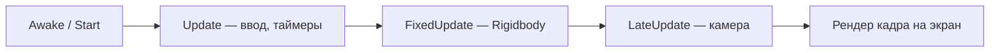

import ExternalCodeEmbed from '@site/src/components/ExternalCodeEmbed';


# Unity C# — скрипты для новичков

<div class="article-tags">
  <span class="tag tag-notrequired">НЕ ОБЯЗАТЕЛЬНО</span>
  <span class="tag tag-beginner">ДЛЯ НОВИЧКОВ</span>
</div>

Приветствую! Здесь вы наверняка найдете, что ищете. Примеры в лаборатории рассчитаны на то, что мы разбираем что-то конкретное.

Текущая статья посвящена готовым скрипты Unity на C# с построчным разбором.

Поэтому за теорией по текущей теме вам — в [энциклопедию](/encyclopedia/intro).
Если ещё не погружались, то маршрут прост:

1. [Основы](/section/basics)
2. [Система и сеть](/section/system-network)
3. [Данные и разметка](/section/data-markup)
4. [Код и разработка](/section/code-dev)
5. [Языки](/section/languages)
6. [Искусственный интеллект](/section/ai)
7. [Проект](/section/project)
8. [Инфраструктура и безопасность](/section/infra-security)
9. [Спин-офф](/section/spinoff)

Обязательно пройдитесь.

А теперь приступим к нашему предмету.

<div class="callout callout--tip">
  <div class="callout-title">Теория и соседние материалы</div>

  <div class="callout-body">
  Установка редактора, окна, GameObject — [Разработка на Unity](/encyclopedia/9-spinoff/9-04-razrabotka-igr/3).

  Синтаксис C# — [первая программа](/encyclopedia/5-languages/5-05-csharp/1), [ООП в C#](/encyclopedia/5-languages/5-05-csharp/25) (блок Unity).

  Lifecycle и API — [Справочник по Unity](/encyclopedia/9-spinoff/9-04-razrabotka-igr/301).

  2D на Python без движка — [Pygame — мини-игры](/lab/Примеры/1132).
</div>
</div>

---
## Навигация по примерам

| Раздел | Тема |
|--------|-----------------|
| [Каркас MonoBehaviour](#karkas) | `unity monobehaviour пример`, `unity script template`, `awake start update` |
| [Вращение куба](#rotate) | `unity rotate object script`, `transform rotate c#` |
| [Движение WASD](#move-wasd) | `unity movement wasd`, `input getaxis horizontal`, `transform translate` |
| [Прыжок](#jump) | `unity jump rigidbody`, `addforce space`, `fixedupdate physics` |
| [Монетка](#coin) | `unity ontriggerenter`, `collect coin script`, `comparetag player` |
| [Спавн](#spawn) | `unity instantiate prefab`, `spawn object on key press` |
| [Камера](#camera) | `unity camera follow player`, `lateupdate camera script` |
| [UI и счёт](#ui-button) | `unity ui button script`, `update text score` |
| [Смена цвета](#color) | `unity change material color`, `getcomponent renderer` |
| [Патруль и враг](#patrol) | `unity enemy follow player`, `move towards script` |
| [Перезагрузка сцены](#restart) | `unity reload scene`, `scenemanager loadscene` |
| [Частые ошибки](#errors) | `nullreferenceexception unity`, `ontriggerenter not working` |

---

## Из чего состоит любой Unity-скрипт

В консольном C# программа начинается с `static void Main()`. В Unity **точки входа нет** — движок сам вызывает методы вашего класса **каждый кадр** или **один раз при старте**.



| Часть | Роль |
|-------|------|
| **Файл `.cs`** | Исходный код; компилируется Unity при сохранении |
| **`MonoBehaviour`** | Базовый класс — скрипт становится **компонентом** на GameObject |
| **`[SerializeField]`** | Поле видно в **Inspector**; значение можно менять без правки кода |
| **`transform`** | Позиция, поворот, масштаб **этого** объекта на сцене |
| **`Update`** | Логика **каждый кадр** — ввод, UI, движение через `transform` |
| **`FixedUpdate`** | Шаг **физики** (~50 раз в секунду) — силы, `Rigidbody` |
| **`Time.deltaTime`** | Сколько секунд прошло с прошлого кадра — без него скорость зависит от FPS |

### Чем Unity отличается от консольного C# и Pygame

| | Консоль | Pygame | Unity |
|---|---------|--------|-------|
| Старт | `Main()` один раз | `while running` вручную | `Awake` / `Start` / `Update` вызывает движок |
| Мир | Только переменные | Окно + поверхность | **Сцена** с объектами в Inspector |
| Ввод | `Console.ReadLine` | `event.get()` | `Input.GetKey`, `GetAxis` |
| Вывод | `WriteLine` | `draw` + `flip` | Движок рисует 3D/2D сам |

---

<span id="karkas"></span>

## Обязательный каркас MonoBehaviour

Любой учебный скрипт повторяет одну структуру. **Имя файла и имя класса должны совпадать** — иначе Unity покажет ошибку компиляции.


<ExternalCodeEmbed example="csharp/lab-1136-001" title="Обязательный каркас MonoBehaviour" minHeight={462} />


### Разбор сигнатуры класса — по словам

| Часть | Смысл |
|-------|-------|
| `using UnityEngine;` | Подключает API движка: `MonoBehaviour`, `Vector3`, `Input`, `Debug` |
| `public class MyFirstScript` | Имя класса = имя файла `MyFirstScript.cs` |
| `: MonoBehaviour` | Наследование — без этого Unity **не прикрепит** скрипт к объекту |
| `[SerializeField] private float speed` | Поле **private**, но **видно в Inspector**; `5f` — литерал float |
| `void Awake()` | Вызывается **один раз** при создании объекта; кешируйте `GetComponent` |
| `void Start()` | **Один раз** перед первым `Update`; все `Awake` уже отработали |
| `void Update()` | **Каждый кадр**; умножайте скорость на `Time.deltaTime` |
| `Debug.Log(..)` | Белое сообщение в **Console**; ошибки — `Debug.LogError` |

### Порядок вызова lifecycle (важно для экзамена)

| Момент | Метод | Пример использования |
|--------|-------|------------------------|
| Объект появился | `Awake` | `rb = GetComponent<Rigidbody>()` |
| Перед первым кадром | `Start` | `score = 0`, загрузка из `PlayerPrefs` |
| Каждый кадр | `Update` | `Input.GetKeyDown`, таймеры |
| Шаг физики | `FixedUpdate` | `AddForce`, изменение `velocity` |
| После всех Update | `LateUpdate` | Камера следует за игроком |

**Что попробовать:** прикрепите скрипт к Cube, нажмите Play — в Console появятся две строки `Awake` и `Start` (порядок всегда такой).

<div class="callout callout--info">
  <div class="callout-title">Input Manager</div>

  <div class="callout-body">
  В примерах — классический `Input.GetAxis("Horizontal")` и `Input.GetKeyDown`.

  Он работает в большинстве учебных проектов (WASD и стрелки уже настроены).

  В новых шаблонах Unity может быть пакет **Input System** — тогда в *Project Settings → Player → Active Input Handling* выберите один подход.

  Подробнее — [глава 3](/encyclopedia/9-spinoff/9-04-razrabotka-igr/3).
</div>
</div>

---

## Стартовые скрипты

Примеры ниже — для **3D-шаблона** Unity (Cube, Capsule, Plane). Для 2D используйте `Rigidbody2D`, `Collider2D`, `OnTriggerEnter2D` — логика та же, другие типы.

---

<span id="rotate"></span>

### Вращение объекта

**Типичный запрос:** `unity rotate cube script`, `transform rotate update`.

**Задача:** куб крутится вокруг вертикальной оси без участия игрока — первый «живой» объект на сцене.

**Настройка сцены:**

1. `GameObject` → `3D Object` → **Cube** (или используйте куб по умолчанию).
2. Создайте скрипт `RotateCube.cs`, вставьте код ниже.
3. Перетащите скрипт на Cube → **Play**.

```csharp
using UnityEngine;

public class RotateCube : MonoBehaviour
{
    [SerializeField] private float degreesPerSecond = 90f;

    void Update()
    {
        transform.Rotate(Vector3.up, degreesPerSecond * Time.deltaTime);
    }
}
```

**Разбор построчно:**

| Строка | Что происходит |
|--------|----------------|
| `degreesPerSecond = 90f` | Полный оборот (360°) займёт 4 секунды при 90°/с |
| `void Update()` | Unity вызывает метод **~60 раз в секунду** (зависит от FPS) |
| `transform` | Ссылка на **Transform** этого Cube — позиция, поворот, масштаб |
| `Vector3.up` | Единичный вектор оси Y `(0, 1, 0)` — «вертикаль» |
| `Rotate(ось, угол)` | Поворачивает объект на `угол` **градусов** вокруг `оси` |
| `* Time.deltaTime` | Делает скорость **независимой от FPS** — на 30 FPS и 144 FPS оборот одинаковый |

**Разбор по смыслу:**

- Без `Time.deltaTime` на слабом ПК куб крутится медленнее, на мощном — быстрее.
- `transform.Rotate` крутит **локально** (относительно текущего поворота объекта).
- Поле `degreesPerSecond` можно менять в **Inspector** без перекомпиляции — удобно на демонстрации урока.

**Что попробовать:**

- `Vector3.right` — вращение вокруг оси X (куб «крутится на бок»).
- `degreesPerSecond = 180f` — в два раза быстрее.
- Добавьте `transform.Rotate(Vector3.up, 45f * Time.deltaTime);` **и** `Vector3.forward` — двойное вращение.

---

<span id="move-wasd"></span>

### Движение по WASD

**Типичный запрос:** `unity player movement script c#`, `wasd movement unity 3d`.

**Задача:** капсула ездит по плоскости стрелками или WASD. Физики нет — объект может проходить сквозь стены (для прототипа это нормально).

**Настройка сцены:**

1. **Plane** — пол (уже есть в 3D-шаблоне).
2. **Capsule** — переименуйте в `Player`, поставьте чуть выше Plane.
3. Скрипт `MoveWASD.cs` на Player → **Play**, двигайте WASD.


<ExternalCodeEmbed example="csharp/lab-1136-002" title="Движение по WASD" minHeight={390} />


**Разбор построчно:**

| Строка | Что происходит |
|--------|----------------|
| `GetAxis("Horizontal")` | A/D или ←/→ → значение от **−1** до **1** (плавно) |
| `GetAxis("Vertical")` | W/S или ↑/↓ → то же по оси «вперёд-назад» |
| `new Vector3(h, 0f, v)` | Направление на плоскости XZ; **Y = 0** — не летим |
| `sqrMagnitude > 1f` | При одновременном W+D длина вектора ≈ 1.41 — быстрее, чем по одной оси |
| `Normalize()` | Длина вектора = 1 — **диагональ не быстрее** прямой |
| `Translate(.., Space.World)` | Сдвиг в **мировых** осях; `Space.Self` — «вперёд» относительно поворота модели |
| `moveSpeed * Time.deltaTime` | Скорость в **метрах в секунду**, а не «метрах за кадр» |

**Разбор по смыслу:**

- `GetAxis` даёт **плавный** ввод (можно подключить геймпад).
- `GetKey(KeyCode.W)` — только «включено/выключено», без промежуточных значений.
- Этот скрипт **обходит физику** — для финальной игры с коллизиями добавьте `Rigidbody` (см. [прыжок](#jump)).

**Что попробовать:** `moveSpeed = 12f` — в два раза быстрее; поверните Player на 45° и сравните `Space.World` и `Space.Self`.

---

<span id="jump"></span>

### Прыжок и ходьба с Rigidbody

**Типичный запрос:** `unity jump script rigidbody`, `how to jump in unity c#`.

**Задача:** персонаж ходит по полу с **физикой**, прыгает по **Space** один раз, пока стоит на земле.

**Настройка сцены:**

1. **Capsule** → `Player`.
2. **Add Component** → **Rigidbody** (Mass = 1, Use Gravity ✓).
3. **Rigidbody** → **Constraints** → Freeze Rotation **X** и **Z** (капсула не заваливается).
4. **Plane** → в Inspector сверху выберите Layer **Ground** (создайте в *Tags and Layers*, если нет).
5. На Player — скрипт `PlayerJump.cs`; в поле **Ground Mask** отметьте только слой **Ground**.


<ExternalCodeEmbed example="csharp/lab-1136-003" title="Прыжок и ходьба с Rigidbody" minHeight={720} />


**Разбор — почему два метода:**

| Метод | Что делаем | Почему не в другом |
|-------|------------|---------------------|
| `Update` | `GetKeyDown(Space)` + прыжок | Ввод **разовый** — ловим нажатие один раз |
| `FixedUpdate` | Задаём горизонтальную скорость | Физика Unity считается **фиксированным шагом** (~0.02 с) |
| `Awake` | `GetComponent<Rigidbody>()` | Ссылку берём **один раз**, не каждый кадр |

**Разбор физики:**

| Строка | Смысл |
|--------|--------|
| `AddForce(.., ForceMode.Impulse)` | Мгновенный «толчок» вверх — классический прыжок |
| `rb.linearVelocity` / `rb.velocity` | Сохраняем **Y** (падение/прыжок), меняем только X и Z |
| `#if UNITY_6000_0_OR_NEWER` | В Unity 6 свойство переименовали в `linearVelocity` |
| `Physics.Raycast` вниз | Невидимый луч: если до пола ≤ distance — «на земле» |
| `groundMask` | Луч **игнорирует** монетки, врагов, UI — только слой Ground |

**Частая ошибка:** прыжок бесконечный в воздухе — нет `IsGrounded()` или `groundMask` не включает слой пола.

**Что попробовать:** `jumpForce = 10f` — выше прыжок; в Scene View включите **Gizmos** и смотрите, упирается ли луч в Plane.

---

<span id="coin"></span>

### Монетка и счёт (OnTriggerEnter)

**Типичный запрос:** `unity collect coin script`, `ontriggerenter not working unity`.

**Задача:** игрок касается сферы — она исчезает, счёт +1, в Console печатается результат.

**Настройка сцены:**

1. **Sphere** → имя `Coin`; **Add Component** → скрипт `CoinPickup.cs`.
2. На **Sphere Collider** включите **Is Trigger** ✓.
3. *Edit → Project Settings → Tags and Layers* → тег **Player** и **Coin**.
4. Player (Capsule + Rigidbody) → Tag **Player**.
5. Пустой объект `GameSystems` → скрипт `ScoreManager.cs` (один на сцену).

**`CoinPickup.cs`:**


<ExternalCodeEmbed example="csharp/lab-1136-004" title="Монетка и счёт (OnTriggerEnter)" minHeight={720} />


**Разбор `CoinPickup` построчно:**

| Строка | Смысл |
|--------|--------|
| `OnTriggerEnter(Collider other)` | Unity вызывает, когда **триггер** и другой collider **пересеклись** |
| `other` | Collider **чужого** объекта (капсула игрока) |
| `CompareTag("Player")` | Быстрая проверка тега; не путать с `tag ==` (лишние аллокации) |
| `return` | Если задел не игрок — **выходим**, монетка не исчезает |
| `Instance?.AddScore` | `?.` — если менеджера нет, не упадём с NullReference |
| `Destroy(gameObject)` | Удаляет **этот** GameObject (монетку) из сцены |

**Разбор `ScoreManager` — учебный singleton:**

| Строка | Смысл |
|--------|--------|
| `static Instance` | Одна «глобальная» ссылка — любой скрипт может вызвать `ScoreManager.Instance` |
| `if (Instance != null && Instance != this)` | Второй менеджер на сцене — **уничтожаем дубликат** |
| `Score &#123; get; private set; &#125;` | Читать счёт можно откуда угодно, писать — только через `AddScore` |

**Чек-лист, если триггер молчит:**

| Проверка | |
|----------|---|
| На монетке **Is Trigger** ✓ | |
| Хотя бы у одного из объектов есть **Rigidbody** | Обычно на Player |
| Тег Player назначен **капсуле**, не камере | |
| `ScoreManager` есть на сцене | |

**Что попробуйте:** поставьте 5 монеток — счёт должен дойти до 5; измените `value = 10` — +10 за штуку.

---

<span id="spawn"></span>

### Спавн префаба по клавише

**Типичный запрос:** `unity instantiate prefab example`, `spawn bullet unity`.

**Задача:** по нажатию **E** в точке `FirePoint` появляется клон префаба (снаряд, яблоко, враг).

**Настройка:**

1. Sphere → настройте → перетащите в папку `Prefabs/` (синий куб в Project = префаб).
2. На Player создайте пустой дочерний объект **FirePoint** (чуть впереди капсулы).
3. Скрипт `SpawnerOnKey.cs` на Player; в Inspector: **Prefab** ← префаб, **Spawn Point** ← FirePoint.


<ExternalCodeEmbed example="csharp/lab-1136-005" title="Спавн префаба по клавише" minHeight={354} />


**Разбор построчно:**

| Строка | Смысл |
|--------|--------|
| `GameObject prefab` | Ссылка на **ассет** в Project, не на объект в Hierarchy |
| `Transform spawnPoint` | Откуда брать **позицию и поворот** (дочерний объект на модели) |
| `KeyCode key = KeyCode.E` | Клавиша по умолчанию — меняется в Inspector |
| `GetKeyDown` | **Один** спавн за нажатие; `GetKey` — каждый кадр, пока держите |
| `prefab != null` | Защита от `NullReferenceException`, если забыли перетащить префаб |
| `Instantiate(..)` | Создаёт **копию** в сцене; оригинал-префаб в Project не исчезает |
| `spawnPoint.rotation` | Клон «смотрит» туда же, куда FirePoint |

**Что попробуйте:** добавьте на префаб `DestroyAfterDelay` (ниже) — снаряды исчезают через 3 с и не засоряют сцену.

---

<span id="camera"></span>

### Камера следует за игроком

**Типичный запрос:** `unity third person camera script`, `camera follow player c#`.

**Задача:** Main Camera плавно едет за капсулой и смотрит на неё — вид от третьего лица.

**Настройка:** скрипт на **Main Camera**; поле **Target** ← перетащите Player.


<ExternalCodeEmbed example="csharp/lab-1136-006" title="Камера следует за игроком" minHeight={426} />


**Разбор построчно:**

| Строка | Смысл |
|--------|--------|
| `LateUpdate` | После **всех** `Update` — игрок уже сдвинулся, камера не «отстаёт на кадр» |
| `offset = (0, 2, -5)` | Камера **выше** на 2 м и **сзади** на 5 м от центра игрока |
| `target.position + offset` | Желаемая точка в **мировых** координатах |
| `Vector3.Lerp(a, b, t)` | Плавное приближение от `a` к `b`; `t` = 0.1 за кадр |
| `smooth * Time.deltaTime` | Чем больше `smooth`, тем **быстрее** камера догоняет |
| `LookAt(target)` | Поворот камеры **лицом к игроку** |

**Что попробуйте:** `offset = (3, 4, -6)` — камера сбоку-сверху; `smooth = 2f` — более «ленивое» следование.

---

<span id="ui-button"></span>

### UI — текст счёта и кнопка

**Типичный запрос:** `unity ui text update script`, `button onclick c#`.

**Задача:** на экране надпись «Монеты: N» обновляется при сборе; кнопка **Restart** пишет в Console (или перезагружает сцену).

**Настройка:**

1. `GameObject` → `UI` → **Canvas** (режим Screen Space Overlay).
2. ПКМ на Canvas → `UI` → **Text** (или TextMeshPro).
3. ПКМ на Canvas → `UI` → **Button** — подпись «Restart».
4. На Canvas — `GameUI.cs`; перетащите **Score Label** и **Restart Button**.


<ExternalCodeEmbed example="csharp/lab-1136-007" title="UI — текст счёта и кнопка" minHeight={624} />


**Разбор построчно:**

| Строка | Смысл |
|--------|--------|
| `using UnityEngine.UI` | Пространство имён для `Text`, `Button`, `Slider` |
| `OnEnable` / `OnDisable` | Подписка при **включении** объекта; отписка при выключении |
| `onClick.AddListener` | При клике вызовется `OnRestartClicked` **без** public-метода в Inspector |
| `RemoveListener` | Иначе при перезагрузке сцены останутся «висячие» обработчики |
| `$"Монеты: &#123;Score&#125;"` | Интерполяция строк C# — подставляет число в текст |
| `Update` для текста | Для учебного UI достаточно; в больших проектах — событие `OnScoreChanged` |

**Связка с монетками:** работает вместе с [ScoreManager](#coin) — соберите монетку, цифра на экране вырастет.

---

## Примеры посложнее

<span id="color"></span>

### Смена цвета по клавише C

**Запрос:** `unity change object color script`.


<ExternalCodeEmbed example="csharp/lab-1136-008" title="Смена цвета по клавише C" minHeight={516} />


**Разбор:**

| Строка | Смысл |
|--------|--------|
| `GetComponent<Renderer>()` | Компонент, который **рисует** меш (Mesh Renderer) |
| Кеш в `Awake` | `GetComponent` в `Update` каждый кадр — лишняя работа |
| `(index + 1) % palette.Length` | Циклический перебор: после жёлтого снова красный |
| `material.color` | Меняет **экземпляр** материала на этом объекте |

---

### Исчезновение через время

```csharp
using UnityEngine;

public class DestroyAfterDelay : MonoBehaviour
{
    [SerializeField] private float lifetimeSeconds = 3f;

    void Start()
    {
        Destroy(gameObject, lifetimeSeconds);
    }
}
```

| Строка | Смысл |
|--------|--------|
| `Destroy(gameObject, delay)` | Unity сам удалит объект через N секунд — без `Update` и таймеров |
| `Start` | Таймер запускается **один раз** при появлении объекта |

Прикрепите к снаряду из [спавнера](#spawn) — след от выстрелов не копится бесконечно.

---

<span id="patrol"></span>

### Патруль и преследование игрока

**Патруль** — враг ездит между двумя точками:


<ExternalCodeEmbed example="csharp/lab-1136-009" title="Патруль и преследование игрока" minHeight={720} />


**Разбор патруля:**

- `MoveTowards` — не «перепрыгивает» цель, если FPS просел (в отличие от `position = target`).
- `0.05f` — порог «дошли»; иначе объект дёргается на месте.
- Тернарный оператор `A ? B : C` — переключение цели A ↔ B.

**Разбор преследования:**

- `toPlayer.y = 0` — враг не «летит» к голове игрока, только по полу.
- `normalized` — единичный вектор направления; длина шага задаётся `speed * deltaTime`.
- `LookRotation` — модель **поворачивается лицом** к игроку.

---

<span id="restart"></span>

### Перезагрузка сцены

**Запрос:** `unity restart level script`.

Сцена должна быть в **File → Build Settings → Scenes In Build**.

```csharp
using UnityEngine;
using UnityEngine.SceneManagement;

public class LevelRestart : MonoBehaviour
{
    public void ReloadCurrentScene()
    {
        Scene scene = SceneManager.GetActiveScene();
        SceneManager.LoadScene(scene.buildIndex);
    }
}
```

| Строка | Смысл |
|--------|--------|
| `SceneManagement` | Пространство имён для загрузки сцен |
| `GetActiveScene()` | Текущая открытая сцена |
| `buildIndex` | Номер сцены в списке Build Settings |
| `public void` | Метод можно привязать к **Button → On Click ()** в Inspector |

В `GameUI.OnRestartClicked` добавьте вызов `FindObjectOfType<LevelRestart>()?.ReloadCurrentScene()` или ссылку на компонент через `[SerializeField]`.

---

<span id="errors"></span>

## Частые ошибки новичка

| Симптом | Причина | Решение |
|---------|---------|---------|
| `NullReferenceException` | Пустое поле в Inspector | Перетащите объект / префаб в `[SerializeField]` |
| Скрипт серый, не добавляется | Ошибка компиляции | Откройте Console, исправьте красные строки |
| «Script class cannot be found» | Имя файла ≠ имя класса | `PlayerMove.cs` → `class PlayerMove` |
| Ничего не происходит | Не нажали **Play** | Код работает только в Play Mode |
| `OnTriggerEnter` не вызывается | Нет Rigidbody или не Trigger | Is Trigger на монетке; Rigidbody на Player |
| Персонаж проваливается | Нет Collider | Collider на поле **и** на персонаже |
| Прыжок бесконечный | Нет проверки земли | `Raycast` + правильный `LayerMask` |
| Движение «рывками» / зависит от FPS | Нет `Time.deltaTime` | Умножайте скорость на `deltaTime` в `Update` |
| Движение сквозь стены | Только `transform.Translate` | Добавьте Rigidbody + Collider или Character Controller |
| `Tag .. is not defined` | Тег не создан | *Tags and Layers* → добавьте Player, Coin |

<div class="callout callout--warning">
  <div class="callout-title">Console — ваш друг</div>

  <div class="callout-body">
  Красная строка содержит <strong>файл:строка</strong> — двойной клик открывает IDE. <code>Debug.Log</code> — белый текст для отладки; <code>LogWarning</code> — жёлтый; <code>LogError</code> — красный. На зачёте преподаватель часто просит показать Console при Play.
</div>
</div>

---

## Мини-проект: сцена с монетами и UI

Свяжите примеры в одну сцену:

1. **Player** — [MoveWASD](#move-wasd) или [PlayerJump](#jump).
2. **5× Coin** — [CoinPickup](#coin) + `ScoreManager` на `GameSystems`.
3. **Main Camera** — [SimpleCameraFollow](#camera).
4. **Canvas** — [GameUI](#ui-button) показывает счёт.
5. **Cube-враг** — [ChasePlayer](#patrol) с ссылкой на Player.

Так вы получите **бегать → собирать → видеть счёт → убегать от врага** — достаточно для доклада или слайдов курсовой.

---

## Куда дальше

1. [Разработка на Unity](/encyclopedia/9-spinoff/9-04-razrabotka-igr/3) — white-box, стрельба, NavMesh, UI подробнее.
2. [Unity + C# — учебный маршрут](/encyclopedia/9-spinoff/9-04-razrabotka-igr/intro#unity-csharp-track) — порядок глав.
3. [Справочник по Unity](/encyclopedia/9-spinoff/9-04-razrabotka-igr/301) — lifecycle, слои, API.
4. [200 вопросов по Unity](/lab/questions/138) — самопроверка.
5. [Pygame — мини-игры](/lab/Примеры/1132) — тот же игровой цикл на Python.
6. [Roblox / Luau — скрипты](/lab/Примеры/1141) — те же механики в Roblox Studio.

---
