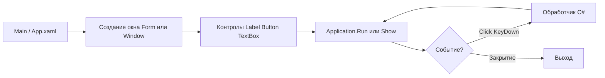

import ExternalCodeEmbed from '@site/src/components/ExternalCodeEmbed';


# C# WinForms и WPF — простые окна

<div class="article-tags">
  <span class="tag tag-notrequired">НЕ ОБЯЗАТЕЛЬНО</span>
  <span class="tag tag-beginner">ДЛЯ НОВИЧКОВ</span>
</div>

Приветствую! Здесь вы наверняка найдете, что ищете. Примеры в лаборатории рассчитаны на то, что мы разбираем что-то конкретное.

Текущая статья посвящена примерам: WinForms и WPF на C# с построчным разбором.

Поэтому за теорией по текущей теме вам — в [энциклопедию](/encyclopedia/intro).
Если ещё не погружались, то маршрут прост:

1. [Основы](/section/basics)
2. [Система и сеть](/section/system-network)
3. [Данные и разметка](/section/data-markup)
4. [Код и разработка](/section/code-dev)
5. [Языки](/section/languages)
6. [Искусственный интеллект](/section/ai)
7. [Проект](/section/project)
8. [Инфраструктура и безопасность](/section/infra-security)
9. [Спин-офф](/section/spinoff)

Обязательно пройдитесь.

А теперь приступим к нашему предмету.

<div class="callout callout--tip">
  <div class="callout-title">Теория и соседние материалы</div>

  <div class="callout-body">
  Обзор платформ — [WinForms](/encyclopedia/4-code-dev/4-11-desktopnye-prilozheniya/115) и [WPF с нуля](/encyclopedia/4-code-dev/4-11-desktopnye-prilozheniya/119).

  Рецепты по каждому элементу — [справочник WinForms](/encyclopedia/4-code-dev/4-11-desktopnye-prilozheniya/1152) и [справочник WPF](/encyclopedia/4-code-dev/4-11-desktopnye-prilozheniya/1192).

  Аналог на Python — [Tkinter — окна и виджеты](/lab/Примеры/1124).

  Синтаксис C# — [первая программа](/encyclopedia/5-languages/5-05-csharp/1).
</div>
</div>

---
## Навигация по примерам

| Раздел | Тема |
|--------|-----------------|
| [Каркас WinForms](#karkas-winforms) | `winforms program.cs пример`, `application.run c#`, `statthread winforms` |
| [Каркас WPF](#karkas-wpf) | `wpf mainwindow xaml пример`, `initializecomponent`, `startupuri` |
| [Окно с текстом](#hello-label) | `winforms label пример`, `wpf textblock`, `как сделать окно c#` |
| [Кнопка и MessageBox](#button-messagebox) | `winforms button click`, `messagebox.show c#`, `wpf button click event` |
| [Поле ввода и имя](#textbox-greet) | `winforms textbox get text`, `wpf textbox x:name`, `форма ввода c#` |
| [Конвертер °C → °F](#converter-temp) | `конвертер температуры winforms`, `tryparse c# textbox`, `курсовая калькулятор c#` |
| [CheckBox и RadioButton](#checkbox-radio) | `winforms checkbox`, `wpf radiobutton groupname`, `настройки форма c#` |
| [Список задач](#todo-listbox) | `winforms listbox add item`, `wpf listbox пример`, `todo list c# gui` |
| [Форма входа](#login-form) | `winforms tablelayoutpanel`, `wpf grid passwordbox`, `форма логин c#` |
| [Меню](#menu-status) | `winforms menustrip`, `wpf menu menuitem`, `statusbar c#` |
| [OpenFileDialog](#open-file) | `openfiledialog c#`, `microsoft.win32.openfiledialog wpf` |
| [Привязка WPF](#binding-simple) | `wpf binding textbox`, `datacontext пример`, `binding mode` |
| [Частые ошибки](#errors) | `окно сразу закрывается winforms`, `net8.0-windows`, `invoke ui thread` |

---

## WinForms и WPF — что выбрать для учебного проекта

| | **WinForms** | **WPF** |
|---|--------------|---------|
| **Разметка** | Код C# или визуальный Designer в Visual Studio | XAML + code-behind |
| **Отрисовка** | GDI+, «родные» окна Windows | DirectX, векторный UI |
| **Привязка данных** | Базовая | `&#123;Binding&#125;`, MVVM |
| **Шаблон проекта** | `dotnet new winforms` | `dotnet new wpf` |
| **Когда удобнее** | Быстрая утилита, CRUD, legacy | Кастомный UI, стили, анимации |

Для **первого окна** подойдут оба стека. WinForms проще «увидеть результат в одном `.cs` файле»; WPF учит XAML — это пригодится в [практикуме WPF](/encyclopedia/4-code-dev/4-11-desktopnye-prilozheniya/wpf-praktikum/intro).

---

## Создание проекта

**WinForms:**

```powershell
dotnet new winforms -n MyDesktopApp -o MyDesktopApp
cd MyDesktopApp
dotnet run
```

**WPF:**

```powershell
dotnet new wpf -n MyWpfApp -o MyWpfApp
cd MyWpfApp
dotnet run
```

### Разбор команд

| Команда | Смысл |
|---------|-------|
| `dotnet new winforms` | Шаблон с `Program.cs`, `Form1.cs`, флагом `UseWindowsForms` в `.csproj` |
| `dotnet new wpf` | Шаблон с `App.xaml`, `MainWindow.xaml`, флагом `UseWPF` |
| `-n MyDesktopApp` | Имя проекта и namespace по умолчанию |
| `-o MyDesktopApp` | Папка на диске |
| `dotnet run` | Сборка и запуск; откроется пустое окно |

Появится пустое окно — шаблон уже рабочий. Примеры ниже можно **заменить содержимое** `Program.cs` (WinForms) или `MainWindow.xaml` + `MainWindow.xaml.cs` (WPF).

---

## Из чего состоит десктоп-приложение на C#

В консольной программе всё крутится вокруг `Main()` и `Console.ReadLine()`. В WinForms и WPF **точка входа та же**, но вместо текста в консоли — **окно** и **цикл сообщений**, который ждёт клики и ввод.



| Часть | WinForms | WPF | Роль |
|-------|----------|-----|------|
| **Точка входа** | `Program.Main()` | `App.xaml` → `StartupUri` | Запуск приложения |
| **Главное окно** | `Form` | `Window` | Рамка с заголовком и кнопкой закрытия |
| **Элемент UI** | `Label`, `Button`, `TextBox`… | То же + `TextBlock`, `PasswordBox` | То, что видит пользователь |
| **Событие** | `button.Click += ..` | `Click="OnClick"` в XAML | Реакция на действие |
| **Цикл** | `Application.Run(form)` | Внутри `Application` | Программа жива, пока окно открыто |
| **Диалог** | `MessageBox.Show(..)` | `MessageBox.Show(..)` | Всплывающее сообщение поверх окна |

Пока цикл работает, код **после** `Application.Run` **не выполняется** — как `mainloop()` в [Tkinter](/lab/Примеры/1124).

---

## Словарь элементов за 30 секунд

| Элемент | WinForms | WPF | Зачем | Как прочитать значение |
|---------|----------|-----|-------|------------------------|
| Окно | `Form` | `Window` | Главная рамка | — |
| Надпись | `Label` | `Label`, `TextBlock` | Статический текст | `label.Text` / `&#123;Binding&#125;` |
| Кнопка | `Button` | `Button` | Действие по клику | `Click` / `command` |
| Поле ввода | `TextBox` | `TextBox` | Одна строка | `textBox.Text` |
| Пароль | `TextBox` + `UseSystemPasswordChar` | `PasswordBox` | Скрытый ввод | `PasswordBox.Password` |
| Галочка | `CheckBox` | `CheckBox` | Вкл/выкл | `Checked` / `IsChecked` |
| Переключатель | `RadioButton` | `RadioButton` | Один из нескольких | `Checked` + группа |
| Список | `ListBox` | `ListBox` | To-do, выбор строки | `SelectedIndex`, `Items` |
| Меню | `MenuStrip` | `Menu` | Файл, Справка | обработчик пункта |
| Диалог | `MessageBox.Show` | `MessageBox.Show` | OK, Yes/No | возвращаемое значение |

**Компоновка WinForms:** `Location` + `Size`, `Dock`, `Anchor`, `TableLayoutPanel`.  
**Компоновка WPF:** `Grid`, `StackPanel`, `DockPanel` — см. [справочник XAML](/encyclopedia/3-data-markup/3-04-konfiguratsii-i-dannye/6).

---

<span id="karkas-winforms"></span>

## Обязательный каркас WinForms

Любой пример WinForms ниже повторяет эту структуру. Запомните её — как `import tkinter` и `mainloop()` в [Tkinter](/lab/Примеры/1124).

Скопируйте в **`Program.cs`** целиком (после `dotnet new winforms`):


<ExternalCodeEmbed example="csharp/lab-1138-001" title="Обязательный каркас WinForms" minHeight={498} />


### Разбор каркаса WinForms — по строкам

| Строка / блок | Смысл |
|---------------|-------|
| `using System.Drawing;` | Типы `Point`, `Size`, `Font`, `Color` — координаты и оформление |
| `using System.Windows.Forms;` | `Form`, `Button`, `Application`, `MessageBox` |
| `namespace MyDesktopApp;` | Имя проекта из шаблона `dotnet new`; должно совпадать с `.csproj` |
| `[STAThread]` | Один UI-поток для COM и контролов Windows; **без атрибута** возможны странные ошибки |
| `ApplicationConfiguration.Initialize()` | Настройка DPI и стилей (.NET 6+); вызывают **один раз** в начале `Main` |
| `new Form { .. }` | Главное окно; `Text` — заголовок в строке заголовка ОС |
| `ClientSize = new Size(400, 300)` | Ширина × высота **рабочей области** без рамки окна |
| `StartPosition = CenterScreen` | Окно по центру монитора при старте |
| `Application.Run(form)` | **Цикл сообщений**; без этой строки окно мелькает и сразу закроется |

**Файл проекта** (шаблон создаёт сам):

```xml
<TargetFramework>net8.0-windows</TargetFramework>
<UseWindowsForms>true</UseWindowsForms>
```

Если указать `net8.0` без `-windows`, типы `Form` и `Application` **не найдутся** при сборке.

**Что попробовать:** добавьте `form.MaximizeBox = false;` — исчезнет кнопка «развернуть».

---

<span id="karkas-wpf"></span>

## Обязательный каркас WPF

WPF делит UI на **разметку** (XAML) и **код** (C#). Окно описывают в двух связанных файлах.

**MainWindow.xaml** — замените содержимое после `dotnet new wpf`:

```xml
<Window x:Class="MyWpfApp.MainWindow"
        xmlns="http://schemas.microsoft.com/winfx/2006/xaml/presentation"
        xmlns:x="http://schemas.microsoft.com/winfx/2006/xaml"
        Title="Моё приложение"
        Height="300" Width="400"
        WindowStartupLocation="CenterScreen">
    <!-- Label, Button, TextBox — между открывающим и закрывающим Window -->
</Window>
```

**MainWindow.xaml.cs:**

```csharp
namespace MyWpfApp;

public partial class MainWindow : Window
{
    public MainWindow()
    {
        InitializeComponent();
    }
}
```

**App.xaml** (шаблон, обычно не трогают):

```xml
<Application x:Class="MyWpfApp.App"
             StartupUri="MainWindow.xaml">
</Application>
```

### Разбор каркаса WPF — по частям

| Часть | Смысл |
|-------|-------|
| `x:Class="MyWpfApp.MainWindow"` | Связь XAML с классом `MainWindow` в `MainWindow.xaml.cs`; имя **должно совпадать** |
| `xmlns` / `xmlns:x` | Пространства имён XML — стандартные для WPF |
| `Title`, `Height`, `Width` | Заголовок и размер окна (в отличие от WinForms `ClientSize`) |
| `WindowStartupLocation="CenterScreen"` | Центрирование — аналог `FormStartPosition.CenterScreen` |
| `partial class MainWindow : Window` | Класс окна; `partial` — вторая часть генерируется из XAML |
| `InitializeComponent()` | Загружает XAML и создаёт поля для `x:Name`; **не удаляйте** |
| `StartupUri="MainWindow.xaml"` | Какое окно открыть при старте |

**Что попробуйте:** смените `Title` и перезапустите `dotnet run` — заголовок окна изменится без правки C#.

---

## Стартовые окна

Простые примеры «с нуля» — с них. Каждый блок — **полный рабочий код**: скопируйте, вставьте, запустите.

---

<span id="hello-label"></span>

### Минимальное окно с меткой

**Задача:** показать, что C# на .NET умеет открыть окно с текстом — минимум для проверки установки SDK и сдачи отчёта «программа с GUI».

**Что получится:** окно по центру экрана с одной надписью «Окно работает!».

#### WinForms — полный `Program.cs`


<ExternalCodeEmbed example="csharp/lab-1138-002" title="WinForms — полный `Program.cs`" minHeight={720} />

Символ `|` разделяет пары «подпись — маска».

| Стек | Класс | Успешный результат |
|------|-------|-------------------|
| WinForms | `System.Windows.Forms.OpenFileDialog` | `DialogResult.OK` |
| WPF | `Microsoft.Win32.OpenFileDialog` | `true` |

---

### 4. Мини-калькулятор сложения (WinForms)

**Задача:** два `TextBox`, кнопка «=», результат в `Label` — связка ввода, события и `TryParse`.


<ExternalCodeEmbed example="csharp/lab-1138-008" title="4. Мини-калькулятор сложения (WinForms)" minHeight={336} />


**Смысл:** результат на форме, без `MessageBox` — пользователь видит ошибку «Ошибка» в том же окне. Расширение до `-`, `*`, `/` — один обработчик и `switch` по оператору.

---

<span id="binding-simple"></span>

### 5. Привязка данных в WPF (простой уровень)

**Задача:** текст «Привет, …!» обновляется **сам**, пока пользователь печатает в поле — задел под MVVM.

**Models/Person.cs:**

```csharp
namespace MyWpfApp.Models;

public sealed class Person
{
    public string Name { get; set; } = "Гость";
}
```

**MainWindow.xaml:**

```xml
<StackPanel Margin="20">
    <TextBlock Text="{Binding Name, StringFormat='Привет, {0}!'}" FontSize="14"/>
    <TextBox Text="{Binding Name, UpdateSourceTrigger=PropertyChanged}" Margin="0,12,0,0"/>
</StackPanel>
```

**MainWindow.xaml.cs:**

```csharp
using MyWpfApp.Models;

public MainWindow()
{
    InitializeComponent();
    DataContext = new Person();
}
```

#### Разбор Binding

| Конструкция | Смысл |
|-------------|-------|
| `DataContext = new Person()` | Объект-источник для всех `&#123;Binding ..&#125;` на окне |
| `&#123;Binding Name&#125;` | Свойство `Person.Name` |
| `StringFormat='Привет, {0}!'` | Шаблон отображения |
| `UpdateSourceTrigger=PropertyChanged` | Модель обновляется **на каждый символ**, не только при потере фокуса |
| Два `&#123;Binding Name&#125;` | Одно свойство — два контрола; WPF синхронизирует их |

<div class="callout callout--info">
  <div class="callout-title">Дальше — MVVM</div>

  <div class="callout-body">
  В учебных проектах достаточно `DataContext` и простого класса.

  В курсовой и production свойства выносят во **ViewModel** с `INotifyPropertyChanged` — см. [Первая форма WPF — XAML, стили и шаблоны](/encyclopedia/4-code-dev/4-11-desktopnye-prilozheniya/119) и [практикум MVVM](/encyclopedia/4-code-dev/4-11-desktopnye-prilozheniya/wpf-praktikum/2).
</div>
</div>

---

### 6. Подтверждение при закрытии окна

**WinForms:**

```csharp
form.FormClosing += (_, e) =>
{
    if (MessageBox.Show("Закрыть приложение?", "Выход",
            MessageBoxButtons.YesNo, MessageBoxIcon.Question) == DialogResult.No)
        e.Cancel = true;
};
```

**WPF** — атрибут `Closing="OnClosing"` на `Window` и в обработчике `e.Cancel = true` при ответе No.

**Смысл:** крестик в заголовке по умолчанию закрывает окно сразу; `Cancel = true` **отменяет** закрытие — нужно для «Сохранить изменения?».

---

### 7. Шаблоны для своих проектов

#### Окно по центру

WinForms: `StartPosition = FormStartPosition.CenterScreen`.  
WPF: `WindowStartupLocation="CenterScreen"`.

#### Логика отдельно от формы

```csharp
// Services/GreetingService.cs
public static class GreetingService
{
    public static string Build(string name) =>
        string.IsNullOrWhiteSpace(name) ? "Введите имя" : $"Здравствуй, {name.Trim()}!";
}
```

Кнопка вызывает `GreetingService.Build(entry.Text)` — форма остаётся тонкой; логику можно проверить **unit-тестом** без GUI. Это плюс на защите курсовой.

---

<span id="errors"></span>

## Частые ошибки и как исправить

| Симптом | Причина | Решение |
|---------|---------|---------|
| Окно мелькает и закрывается | Нет `Application.Run(form)` | Добавьте в конец `Main` перед закрывающей `}` |
| «Не найден тип Form» | TFM `net8.0` без `-windows` | В `.csproj`: `net8.0-windows` |
| Ошибка CS0246 Window / Form | Нет `UseWindowsForms` / `UseWPF` | Флаги в `.csproj` из шаблона `dotnet new` |
| Контрол не виден | Нет `Controls.Add` | Каждый контрол добавьте на `form` или в panel |
| Кнопка срабатывает при старте | Вызвали метод вместо ссылки | `Click += Handler`, **не** `Click += Handler()` |
| XAML: имя не существует | `x:Class` не совпадает с namespace | `MyApp.MainWindow` в XAML = `namespace MyApp` + `class MainWindow` |
| UI «завис» на 5 секунд | `Thread.Sleep` или тяжёлый цикл в Click | `await Task.Run(..)` — см. [Особенности разработки десктопных приложений](/encyclopedia/4-code-dev/4-11-desktopnye-prilozheniya/112) |
| InvalidOperationException | Обновление UI из фонового потока | WinForms: `control.Invoke(() => ..)`; WPF: `Dispatcher.Invoke` |
| `25,5` не парсится | Локаль Windows | `.Replace(',', '.')` + `InvariantCulture` в `TryParse` |

---

## Маршрут изучения

| Шаг | Пример в статье | Зачем | Дальше |
|-----|-----------------|-------|--------|
| 1 | [Каркас WinForms](#karkas-winforms) | Понять `Application.Run` | [Windows Forms (WinForms) — теория WinForms](/encyclopedia/4-code-dev/4-11-desktopnye-prilozheniya/115) |
| 2 | [Окно + кнопка](#button-messagebox) | События и MessageBox | [Справочник по WinForms — элементы UI — справочник UI](/encyclopedia/4-code-dev/4-11-desktopnye-prilozheniya/1152) |
| 3 | [TextBox + конвертер](#converter-temp) | Ввод, парсинг, формула | Лабораторная «калькулятор» |
| 4 | [ListBox to-do](#todo-listbox) | Коллекция на форме | Курсовая «список задач» |
| 5 | [WPF Binding](#binding-simple) | XAML и данные | [Первая форма WPF — XAML, стили и шаблоны — WPF с нуля](/encyclopedia/4-code-dev/4-11-desktopnye-prilozheniya/119) |
| 6 | [Практикум MVVM](/encyclopedia/4-code-dev/4-11-desktopnye-prilozheniya/wpf-praktikum/2) | Клиент-сервер | TaskDesk |

---

## См. также

- [Windows Forms (WinForms)](/encyclopedia/4-code-dev/4-11-desktopnye-prilozheniya/115) — теория и конструктор Visual Studio
- [Первая форма WPF](/encyclopedia/4-code-dev/4-11-desktopnye-prilozheniya/119) — XAML, стили, DataTemplate
- [Справочник WinForms](/encyclopedia/4-code-dev/4-11-desktopnye-prilozheniya/1152) и [справочник WPF](/encyclopedia/4-code-dev/4-11-desktopnye-prilozheniya/1192)
- [Десктопные приложения — о разделе](/encyclopedia/4-code-dev/4-11-desktopnye-prilozheniya/intro)
- [C# — о разделе](/encyclopedia/5-languages/5-05-csharp/intro)
- [Tkinter — окна и виджеты](/lab/Примеры/1124) — те же задачи на Python
- [Java Swing — окна и кнопки](/lab/Примеры/1143) — те же задачи на Java
- [Unity C# — скрипты](/lab/Примеры/1136) — C# в игровом движке
- [Шаблоны](/lab/Примеры/2) — минимальные каркасы проектов

---
