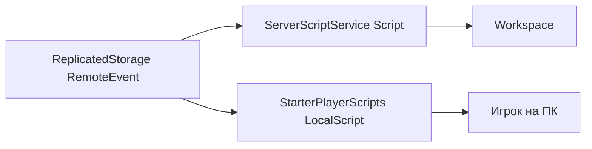
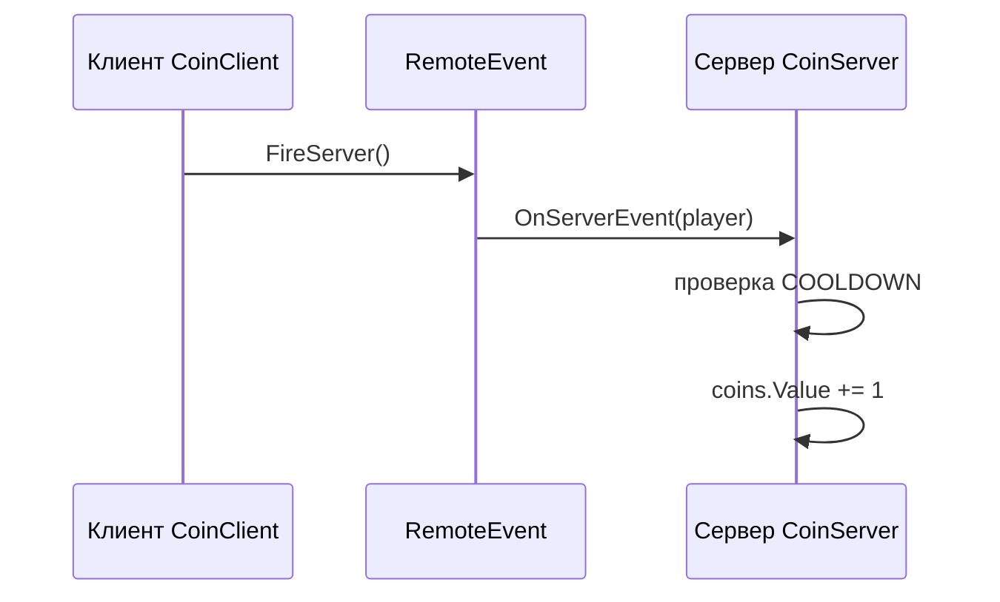

import ExternalCodeEmbed from '@site/src/components/ExternalCodeEmbed';


# Roblox / Luau — скрипты для новичков

<div class="article-tags">
  <span class="tag tag-notrequired">НЕ ОБЯЗАТЕЛЬНО</span>
  <span class="tag tag-beginner">ДЛЯ НОВИЧКОВ</span>
</div>

Приветствую! Здесь вы наверняка найдете, что ищете. Примеры в лаборатории рассчитаны на то, что мы разбираем что-то конкретное.

Текущая статья посвящена готовым скрипты Roblox Studio на Luau с разбором каждой строки.

Поэтому за теорией по текущей теме вам — в [энциклопедию](/encyclopedia/intro).
Если ещё не погружались, то маршрут прост:

1. [Основы](/section/basics)
2. [Система и сеть](/section/system-network)
3. [Данные и разметка](/section/data-markup)
4. [Код и разработка](/section/code-dev)
5. [Языки](/section/languages)
6. [Искусственный интеллект](/section/ai)
7. [Проект](/section/project)
8. [Инфраструктура и безопасность](/section/infra-security)
9. [Спин-офф](/section/spinoff)

Обязательно пройдитесь.

А теперь приступим к нашему предмету.

<div class="callout callout--tip">
  <div class="callout-title">Теория и соседние материалы</div>

  <div class="callout-body">
  <a href="/encyclopedia/intro">Энциклопедия</a> — разделы по вашей теме.
</div>
</div>

---
Подборка **готовых скриптов Roblox Studio на Luau** с **подробным разбором каждой строки** — «что написано», «что происходит в Play» и «зачем так».

---

## Основы скриптов в Roblox Studio

**Luau** — язык Roblox (диалект Lua). Код живёт не в отдельном `.lua` на диске, а в объектах **Script**, **LocalScript** и **ModuleScript** в дереве **Explorer**. Нажали **Play (F5)** — Studio запускает локальный сервер и клиент; скрипты начинают выполняться.

<div class="callout callout--tip">
  <div class="callout-title">С чего начать</div>

  <div class="callout-body">
  Установка Studio и первый Place — [Roblox Studio — первая игра](/encyclopedia/9-spinoff/9-04-razrabotka-igr/203).

  Синтаксис — [основы Lua](/encyclopedia/5-languages/5-15-lua-i-luau/14), API Roblox — [Luau в Roblox](/encyclopedia/5-languages/5-15-lua-i-luau/23).

  Рисование на Python — [Turtle](/lab/Примеры/111); те же идеи «событие → действие» — здесь, в 3D.

  Unity-аналог — [скрипты C#](/lab/Примеры/1136).
</div>
</div>

### Как запустить пример за 30 секунд

1. Откройте [Roblox Studio](https://create.roblox.com/) → шаблон **Baseplate**.
2. В **Explorer** найдите папку из инструкции к примеру (чаще всего **ServerScriptService**).
3. ПКМ → **Insert Object** → **Script** или **LocalScript** → переименуйте (`HelloServer`, `CoinPickup`…).
4. Дважды щёлкните скрипт → вставьте код **целиком** → **Ctrl+S**.
5. **Test → Play (F5)**. Окно **View → Output** — белые `print` и красные ошибки.

| Где смотреть результат | Что увидите |
|------------------------|-------------|
| **Output** | Текст `print`, ошибки с номером строки |
| **Viewport** | Движение Part, смерть на лаве, исчезновение монетки |
| **Tab** (клавиша **Tab** в Play) | Таблица **leaderstats** с Coins |
| **Экран игрока** | UI из **StarterGui** |

Скрипты **не запускаются** на этой странице сайта — только в Studio или в опубликованной игре.

---

<span id="google"></span>

## Навигация по примерам

| Типичный запрос | Куда на странице |
|-----------------|------------------|
| `roblox script example`, `luau script` | [Первый print](#print), [каркас](#karkas) |
| `roblox script template` | [Обязательный каркас](#karkas) |
| `ServerScriptService script` | [Каркас Script](#karkas) |
| `roblox print hello` | [Первый print](#print) |
| `Players.PlayerAdded` | [Приветствие игрока](#hello) |
| `roblox rotate part` | [Вращение Part](#spin) |
| `roblox lava script kill` | [Кирпич-смерть](#kill) |
| `roblox collect coin script` | [Монетка и leaderstats](#coin) |
| `leaderstats roblox` | [Монетка и leaderstats](#coin) |
| `roblox jump pad script` | [Прыжковая платформа](#jump-pad) |
| `roblox sprint script LocalScript` | [Спринт](#move) |
| `WalkSpeed script roblox` | [Спринт](#move) |
| `roblox gui TextLabel score` | [UI счёт](#ui) |
| `RemoteEvent FireServer example` | [RemoteEvent](#remote) |
| `require ModuleScript roblox` | [ModuleScript](#module) |
| `roblox Touched not working` | [Частые ошибки](#errors) |
| `LocalPlayer is nil` | [Частые ошибки](#errors) |
| `how to make obby roblox` | [Мини-проект obby](#obby) |

---

### Базовые термины — за 2 минуты

| Термин | Простыми словами |
|--------|------------------|
| **Script** | Код на **сервере** — счёт, урон, спавн, античит |
| **LocalScript** | Код на **вашем ПК** — UI, камера, ввод клавиш |
| **ModuleScript** | Библиотека функций; подключается через `require` |
| **Part** | Куб, шар, платформа на карте |
| **Humanoid** | «Жизнь» персонажа — здоровье, прыжок, скорость |
| **Touched** | Событие «что-то коснулось этого Part» |
| **Connect** | Подписка на событие — «когда случится X, вызови функцию» |
| **leaderstats** | Папка у Player; Roblox показывает её в Tab как таблицу счёта |
| **RemoteEvent** | Сигнал клиент → сервер (и обратно) по сети |
| **CFrame** | Позиция и поворот объекта в 3D |

---

### Какую механику выбрать

| Вы ищете… | Пример ниже | Идея |
|-----------|-------------|------|
| Проверить, что Studio работает | [Print](#print) | Одна строка в Output |
| Покрасить платформу | [Цвет Part](#color-part) | Свойства объекта из кода |
| Лава / смерть | [Кирпич-смерть](#kill) | `Touched` → `Health = 0` |
| Монетки, очки | [Монетка](#coin) | `leaderstats` + `IntValue` |
| Прыжок выше | [Jump pad](#jump-pad) | `Humanoid.JumpPower` / `JumpHeight` |
| Бег по Shift | [Спринт](#move) | `LocalScript` + `WalkSpeed` |
| Текст на экране | [UI](#ui) | `TextLabel` + `Changed` |
| Кнопка E → действие | [RemoteEvent](#remote) | Клиент просит, сервер решает |
| Общий код в одном месте | [ModuleScript](#module) | `require` |

---

## Клиент и сервер — где какой скрипт

В Roblox один **сервер** (главный по правилам игры) и **клиент** у каждого игрока (его экран и клавиатура). Счёт монет и урон от лавы делают на **сервере**. Подпись «Монеты: 5» на экране и реакция на Shift — часто на **клиенте**, но цифру монет всё равно меняет сервер.



| Тип | Папка в Explorer | Кто выполняет |
|-----|------------------|---------------|
| **Script** | `ServerScriptService`, иногда внутри Part | Сервер |
| **LocalScript** | `StarterPlayerScripts`, `StarterGui` | Только этот игрок |
| **ModuleScript** | `ReplicatedStorage`, `ServerScriptService` | Откуда вызвали `require` |

| |---|-----------------------------------|----------------------------|-------------|
| Запуск | `python file.py` | Кнопка Play | **F5** в Studio |
| Мир | окно черепашки | Scene | **Workspace** + Explorer |
| Цикл кадров | `ontimer` / цикл | `Update()` | `RunService.Heartbeat` |
| Касание | нет | `OnTriggerEnter` | `Touched` |

<div class="callout callout--warning">
  <div class="callout-title">LocalPlayer только на клиенте</div>

  <div class="callout-body">
  В <code>Script</code> на сервере <code>Players.LocalPlayer</code> всегда <code>nil</code>. Свой персонаж на клиенте — <code>LocalScript</code> и <code>Players.LocalPlayer</code>. Очки, которые видят все игроки, создавайте в <code>leaderstats</code> на сервере.
</div>
</div>

---

<span id="karkas"></span>

## Обязательный каркас

Любой учебный скрипт повторяет одну схему: **получить сервис → подписаться на событие или цикл → менять объекты**.

### Script на сервере (ServerScriptService)

```lua
--!strict

local Players = game:GetService("Players")

print("Сервер запущен")

-- обработчики: PlayerAdded, Touched, task.wait, require
```

**Разбор построчно:**

| Строка | Что происходит | Зачем |
|--------|----------------|-------|
| `--!strict` | Studio проверяет типы при наборе | Меньше ошибок «не тот тип» |
| `local Players = ..` | Ссылка на сервис игроков | Не писать длинный путь каждый раз |
| `game:GetService("Players")` | Официальный способ взять API | Работает после перезагрузки Place |
| `game` | Корень всего дерева Explorer | Отсюда доступен весь мир |
| `print(..)` | Строка в **Output** | Первая отладка без UI |

**Разбор по смыслу:**

- В Luau **`local`** — переменная только в этом файле; так принято почти везде.
- Комментарий `--` — строка для человека, движок её пропускает.
- Серверный скрипт **не видит** клавиатуру игрока — для WASD нужен **LocalScript**.

### LocalScript на клиенте (StarterPlayerScripts)

```lua
--!strict

local Players = game:GetService("Players")
local player = Players.LocalPlayer

print("Клиент готов:", player.Name)
```

| Строка | Что происходит | Зачем |
|--------|----------------|-------|
| `LocalPlayer` | Объект **вашего** игрока на этом ПК | UI, камера, «свой» ввод |
| `StarterPlayerScripts` | При входе Studio копирует скрипт в игрока | Один раз написали — у всех клиентов |

**Где создавать объекты:**

| Задача | Explorer → Insert Object |
|--------|---------------------------|
| Сервер | **ServerScriptService** → **Script** |
| Клиент | **StarterPlayer** → **StarterPlayerScripts** → **LocalScript** |
| Библиотека | **ReplicatedStorage** → **ModuleScript** |
| Логика одного куба | Part → **Script** (сервер, если Part в Workspace) |

---

## Стартовые скрипты

Шаблон **Baseplate**: пол, **SpawnLocation**, один локальный игрок в **Play**.

---

<span id="print"></span>

### Первый скрипт — print в Output

**Запрос:** `roblox hello world script`, `roblox print example`.

**Задача:** убедиться, что Script вообще запускается.

**Настройка:** **ServerScriptService** → **Script** → имя `HelloPrint`.

```lua
print("Привет, Roblox!")
print("Скрипт работает")
```

**Что увидите в Play:** в **Output** две белые строки сразу после старта.

**Разбор построчно:**

| Строка | Что происходит | Зачем |
|--------|----------------|-------|
| `print("..")` | Текст в Output | Аналог `console.log` в JavaScript |
| Две строки подряд | Выполняются сверху вниз | Порядок = порядок в файле |

**Что попробовать:** `print(2 + 2)` → в Output будет `4`.

---

<span id="color-part"></span>

### Part красный при старте игры

**Запрос:** `roblox change part color script`.

**Задача:** куб на карте становится красным без ручной покраски в Properties.

**Настройка:**

1. **Workspace** → Part (или используйте Baseplate).
2. ПКМ на Part → **Insert Object** → **Script**.

```lua
--!strict

local part = script.Parent :: BasePart
part.Color = Color3.fromRGB(255, 0, 0)
part.Material = Enum.Material.Neon
```

**Что увидите в Play:** Part светится красным (Neon).

**Разбор построчно:**

| Строка | Что происходит | Зачем |
|--------|----------------|-------|
| `script.Parent` | Объект-родитель Script (этот Part) | Script лежит **внутри** Part |
| `:: BasePart` | Подсказка типа для `--!strict` | Studio знает, что есть `.Color` |
| `Color3.fromRGB(255, 0, 0)` | Цвет из трёх чисел 0…255 | R=255, G=0, B=0 — красный |
| `Material = Neon` | Материал «неон» | Ярче видно на уроке |

**Разбор по смыслу:**

- **`script`** — всегда «этот» Script, который выполняется.
- Цвет можно менять и в **Properties** без кода; скрипт нужен, когда цвет зависит от события (касание, счёт).

---

<span id="hello"></span>

### Приветствие при входе игрока

**Запрос:** `roblox PlayerAdded script`, `print player name when join`.

**Задача:** при входе в Play в Output появляется ник игрока.

**Настройка:** **ServerScriptService** → **Script** `HelloServer`.

```lua
--!strict

local Players = game:GetService("Players")

local function onPlayerAdded(player: Player)
    print("Игрок на сервере:", player.Name)
end

Players.PlayerAdded:Connect(onPlayerAdded)

for _, player in Players:GetPlayers() do
    onPlayerAdded(player)
end
```

**Что увидите в Play:** `Игрок на сервере: ВашНик` (локальный тестовый игрок).

**Разбор построчно:**

| Строка | Что происходит | Зачем |
|--------|----------------|-------|
| `local function onPlayerAdded(player: Player)` | Именованная функция с типом аргумента | Удобно передать в `Connect` |
| `player.Name` | Строка-ник | В Tab и в чате |
| `PlayerAdded:Connect(onPlayerAdded)` | «Когда игрок зашёл — вызови функцию» | Основной паттерн Roblox |
| `for _, player in GetPlayers()` | Перебор уже сидящих игроков | Script мог загрузиться **после** вашего входа в Play |
| `_` в `for _, player` | Номер в списке не нужен | Идиома Luau |

**Разбор по смыслу:**

- **Событие** в Roblox — не `if` каждый кадр, а «вызови один раз, когда случилось».
- Без цикла `GetPlayers()` в учебном Play иногда **нет строки** в Output — кажется, что скрипт сломан.

**Что попробовать:** `print(player.UserId)` — числовой ID аккаунта (для DataStore).

---

<span id="spin"></span>

### Вращающийся Part

**Запрос:** `roblox spin part script`, `rotate part Heartbeat`.

**Задача:** платформа на финише obby крутится — визуальный ориентир.

**Настройка:**

1. Part `Spinner`, **Anchored** ✓.
2. **Script** внутри `Spinner`.

```lua
--!strict

local RunService = game:GetService("RunService")
local part = script.Parent :: BasePart

local DEG_PER_SECOND = 90

RunService.Heartbeat:Connect(function(dt: number)
    part.CFrame = part.CFrame * CFrame.Angles(0, math.rad(DEG_PER_SECOND) * dt, 0)
end)
```

**Что увидите в Play:** Part плавно крутится вокруг вертикали; полный оборот ~4 с при `90` град/с.

**Разбор построчно:**

| Строка | Что происходит | Зачем |
|--------|----------------|-------|
| `RunService` | Сервис «кадры» игры | Циклы без `while true` вручную |
| `Heartbeat:Connect(function(dt) .. end)` | Каждый кадр вызывается функция | `dt` — секунды с прошлого кадра |
| `part.CFrame` | Позиция + поворот | Одно свойство вместо Position + Rotation |
| `CFrame.Angles(0, угол, 0)` | Поворот вокруг оси **Y** (вертикаль) | «Карусель» |
| `math.rad(..)` | Градусы → радианы | `Angles` ждёт радианы |
| `* dt` | Угол за **этот** кадр | Без `dt` скорость зависит от FPS |

**Разбор по смыслу:**

- Аналог **бесконечного цикла** в Turtle, но движок сам вызывает функцию каждый кадр — не зависает весь сервер.
- `DEG_PER_SECOND = 180` — в два раза быстрее.

---

<span id="kill"></span>

### Кирпич-смерть (лава, Touched)

**Запрос:** `roblox kill brick script`, `lava touched humanoid`, `kill part roblox`.

**Задача:** красный Part убивает персонажа при касании — классика obby.

**Настройка:**

1. Part `Lava`, красный цвет, **Anchored** ✓, размер достаточный (например 20×1×20).
2. **Script** внутри `Lava`.


<ExternalCodeEmbed example="lua/lab-1141-001" title="Кирпич-смерть (лава, Touched)" minHeight={372} />


**Что увидите в Play:** зашли на красный Part — персонаж умер и появился у **SpawnLocation**.

**Разбор построчно:**

| Строка | Что происходит | Зачем |
|--------|----------------|-------|
| `onTouched(other: BasePart)` | `other` — Part, который коснулся (часто нога/торс) | Roblox передаёт «кто ударился» |
| `other.Parent` | Обычно **Model** персонажа | У Part родитель — не Player, а модель |
| `if not character then return end` | Защита от мусорных касаний | Без этого — ошибка на следующей строке |
| `FindFirstChildOfClass("Humanoid")` | Ищет Humanoid в модели | У декора в Workspace Humanoid нет |
| `Health = 0` | Смерть | Движок сам респавнит |
| `Touched:Connect` | Подписка на касания | Много раз за одно падение — нормально |

**Разбор по смыслу:**

- Цепочка: **нога (Part) → модель персонажа → Humanoid → Health**.
- Если лава «не убивает» — чаще всего касается **не Humanoid**, а пола; увеличьте Part по Y.

**Чек-лист:**

| Проверка | |
|----------|---|
| Script внутри Part `Lava` | |
| **CanTouch** включён | |
| Персонаж реально касается (не пролетает сквозь тонкий слой) | |
| В Output нет красных ошибок | |

**Что попробовать:** `humanoid.Health = 50` — половина жизни вместо смерти.

---

<span id="coin"></span>

### Монетка и leaderstats

**Запрос:** `roblox coin script`, `leaderstats coins`, `collect coin touched`, `IntValue roblox`.

**Задача:** жёлтая сфера исчезает при касании; в Tab появляется **Coins: 1**.

**Настройка (два скрипта):**

1. **ServerScriptService** → Script `LeaderstatsSetup` — код ниже **первым**.
2. **Workspace** → Part, форма **Ball**, имя `Coin`, **Anchored** ✓, **CanCollide** выкл.
3. Внутри `Coin` → Script `CoinPickup`.

**Схема:**

```text
Игрок касается Coin
    → CoinPickup (Script на монетке)
    → находит Player по модели персонажа
    → coins.Value += 1  (сервер)
    → Tab показывает leaderstats
    → CoinUI (LocalScript) обновляет TextLabel
```

#### LeaderstatsSetup (ServerScriptService)


<ExternalCodeEmbed example="lua/lab-1141-002" title="LeaderstatsSetup (ServerScriptService)" minHeight={354} />


**Разбор построчно:**

| Строка | Что происходит | Зачем |
|--------|----------------|-------|
| `Instance.new("Folder")` | Создаёт пустую папку в памяти | Контейнер для счёта |
| `folder.Name = "leaderstats"` | Имя **строго** `leaderstats` | Иначе Tab Roblox не покажет таблицу |
| `folder.Parent = player` | Папка внутри объекта Player | Живёт на сервере, видна клиентам |
| `Instance.new("IntValue")` | Целое число | Монеты, убийства, этап — всё IntValue |
| `coins.Name = "Coins"` | Заголовок столбца в Tab | Можно `Stage`, `Wins` |
| `Value = 0` | Старт с нуля | |
| `PlayerAdded:Connect` | Каждому новому игроку — своя папка | |

#### CoinPickup (Script внутри Coin)


<ExternalCodeEmbed example="lua/lab-1141-003" title="CoinPickup (Script внутри Coin)" minHeight={660} />


**Разбор построчно:**

| Строка | Что происходит | Зачем |
|--------|----------------|-------|
| `collected = false` | Флаг «уже подобрали» | `Touched` срабатывает **десятки раз** за секунду |
| `if collected then return end` | Второй раз не начислять | Без этого Coins +10 за одно касание |
| `GetPlayerFromCharacter(character)` | Player из модели ног/торса | В `Touched` приходит Part, не Player |
| `FindFirstChild("leaderstats")` | Ищет папку | Может ещё не создана — тогда `nil` |
| `leaderstats and .. FindFirstChild("Coins")` | Два шага без ошибки | Паттерн «если есть папка — ищи Coins» |
| `coins.Value += 1` | Увеличить счёт на сервере | Все игроки видят в Tab |
| `Transparency = 1` | Полностью прозрачный | Монетка «исчезла», объект остался для отладки |
| `CanTouch = false` | Больше не ловит Touched | Дополнительная защита |

**Что увидите в Play:** коснулись шара — он пропал; **Tab** → `Coins: 1`.

**Что попробовать:**

```lua
task.delay(5, function()
    collected = false
    coin.Transparency = 0
    coin.CanTouch = true
end)
```

Вставьте после сбора — монетка вернётся через 5 секунд.

---

<span id="jump-pad"></span>

### Прыжковая платформа

**Запрос:** `roblox jump pad script`, `JumpPower boost`, `jump boost part`.

**Задача:** зелёный Part подбрасывает вверх — короткий obby-прыжок.

**Настройка:** Part `JumpPad`, зелёный, **Anchored** ✓, Script внутри.


<ExternalCodeEmbed example="lua/lab-1141-004" title="Прыжковая платформа" minHeight={390} />


**Что увидите в Play:** наступили на зелёный блок — персонаж подпрыгнул выше обычного.

**Разбор построчно:**

| Строка | Что происходит | Зачем |
|--------|----------------|-------|
| `BOOST = 80` | Константа силы прыжка | Меняете одно число в Inspector-стиле |
| `JumpPower = BOOST` | Задаёт силу прыжка Humanoid | В старых шаблонах |
| `ChangeState(Jumping)` | Принудительный прыжок | Срабатывает сразу при касании, не ждёт Space |

<div class="callout callout--info">
  <div class="callout-title">JumpPower и JumpHeight</div>

  <div class="callout-body">
  В новых шаблонах Roblox вместо `JumpPower` может быть `JumpHeight`.

  Откройте Humanoid персонажа в Play → Properties.

  Если `JumpPower` нет — замените строку на `humanoid.JumpHeight = 50` (подберите число).

  Документация — [create.roblox.com](https://create.roblox.com/docs).
</div>
</div>

---

<span id="move"></span>

### Спринт по Left Shift (LocalScript)

**Запрос:** `roblox sprint script`, `WalkSpeed LocalScript`, `shift to run roblox`.

**Задача:** зажали Shift — бег быстрее; отпустили — снова обычная ходьба.

**Настройка:** **StarterPlayer** → **StarterPlayerScripts** → **LocalScript** `SprintClient`.


<ExternalCodeEmbed example="lua/lab-1141-005" title="Спринт по Left Shift (LocalScript)" minHeight={720} />


**Что увидите в Play:** Shift — бег; отпустили — снова 16 studs/s (стандарт Roblox).

**Разбор построчно:**

| Строка | Что происходит | Зачем |
|--------|----------------|-------|
| `UserInputService` | Клавиатура/мышь **этого** клиента | Сервер не видит Shift |
| `InputBegan` | Клавишу **нажали** | Старт спринта |
| `InputEnded` | Клавишу **отпустили** | Вернуть скорость |
| `processed` | `true` — ввод съел UI (чат) | Не спринтовать при наборе в чате |
| `Enum.KeyCode.LeftShift` | Константа клавиши | Не строка `"LeftShift"` |
| `getHumanoid()` | Humanoid текущего персонажа | После смерти модель новая |
| `CharacterAdded` | Событие «новый персонаж после респавна» | Сброс WalkSpeed после лавы |
| `NORMAL = 16` | Дефолт Roblox | |
| `SPRINT = 28` | ~1.75× быстрее | Подберите на вкус |

**Разбор по смыслу:**

- Это **LocalScript** — на сервере тот же код с `LocalPlayer` работает, на Script — нет.
- В реальной игре читеры меняют `WalkSpeed` на клиенте; в продакшене скорость проверяют на **сервере**.

---

<span id="ui"></span>

### UI — надпись «Монеты: N»

**Запрос:** `roblox TextLabel update`, `screen gui score script`, `leaderstats gui`.

**Задача:** на экране текст обновляется при сборе монет ([пример с leaderstats](#coin)).

**Настройка:**

1. **StarterGui** → **ScreenGui** → **TextLabel**, имя `CoinLabel`, Text = `Монеты: 0`, Size в Properties.
2. ПКМ на `CoinLabel` → **LocalScript** `CoinUI` (родитель = TextLabel).


<ExternalCodeEmbed example="lua/lab-1141-006" title="UI — надпись «Монеты: N»" minHeight={642} />


**Что увидите в Play:** собрали монетку — надпись `Монеты: 1` без перезапуска.

**Разбор построчно:**

| Строка | Что происходит | Зачем |
|--------|----------------|-------|
| `script.Parent :: TextLabel` | UI-элемент, внутри которого лежит скрипт | `label.Text` — свойство надписи |
| `"Монеты: " . tostring(coins.Value)` | Склейка строк | `.` — как `+` для строк в Python |
| `WaitForChild("leaderstats", 10)` | Ждёт папку до 10 с | Сервер создаёт её чуть позже клиента |
| `warn(..)` | Жёлтое предупреждение в Output | Понятнее, чем молчание |
| `coins.Changed:Connect` | При каждом `Value += 1` на сервере | UI **сам** обновляется |
| `CharacterAdded` + `hookCoins` | После смерти переподписка | Иначе UI «застынет» |

**Разбор по смыслу:**

- **Сервер** меняет число; **клиент** только **показывает** — правильное разделение.
- Не пишите `coins.Value += 1` в LocalScript для честной игры.

---

<span id="remote"></span>

### RemoteEvent — нажал E, сервер добавил монету

**Запрос:** `roblox RemoteEvent tutorial`, `FireServer example`, `OnServerEvent`.

**Задача:** игрок жмёт **E**; **сервер** добавляет +1 Coins (клиент не ворует счёт).

**Настройка:**

1. **ReplicatedStorage** → **RemoteEvent** → имя `AddCoinRequest`.
2. **ServerScriptService** → Script `CoinServer`.
3. **StarterPlayerScripts** → LocalScript `CoinClient`.
4. Работает с [LeaderstatsSetup](#coin).

#### CoinServer (сервер)


<ExternalCodeEmbed example="lua/lab-1141-007" title="CoinServer (сервер)" minHeight={480} />


**Разбор построчно (сервер):**

| Строка | Что происходит | Зачем |
|--------|----------------|-------|
| `WaitForChild("AddCoinRequest")` | Ждёт RemoteEvent в ReplicatedStorage | Имя должно совпадать с Explorer |
| `OnServerEvent:Connect(function(player) ..)` | Клиент вызвал `FireServer` | `player` — **кто** нажал E (не доверяйте аргументам клиента для identity) |
| `lastPress[player]` | Таблица «последний раз нажал» | У каждого игрока свой кулдаун |
| `os.clock()` | Время в секундах | Для антиспама |
| `if now - prev < COOLDOWN` | Чаще 1 раз/с — игнор | Защита от макросов |
| `coins.Value += 1` на сервере | Единственное честное место | |

#### CoinClient (клиент)


<ExternalCodeEmbed example="lua/lab-1141-008" title="CoinClient (клиент)" minHeight={318} />


**Разбор построчно (клиент):**

| Строка | Что происходит | Зачем |
|--------|----------------|-------|
| `FireServer()` | «Попроси сервер сделать действие» | Без аргументов — просто сигнал «нажали E» |
| Только `FireServer`, без `Value += 1` | Клиент не меняет счёт | Иначе читеры |

**Что увидите в Play:** E → +1 в Tab и строка в Output с именем и счётом.



<div class="callout callout--danger">
  <div class="callout-title">Безопасность</div>

  <div class="callout-body">
  Клиент может вызвать `FireServer` тысячу раз из эксплойта — сервер обязан проверять кулдаун, дистанцию, наличие предмета.

  В учебном obby достаточно `COOLDOWN`; в магазине — ещё цена и баланс на сервере.
</div>
</div>

---

<span id="module"></span>

### ModuleScript — вынести код в модуль

**Запрос:** `roblox require ModuleScript`, `return module table`.

**Задача:** приветствие в одном файле, вызов из нескольких Script.

**Настройка:**

1. **ReplicatedStorage** → **ModuleScript** `HelloUtil`.
2. **ServerScriptService** → Script `UseHello`.

**HelloUtil (ModuleScript):**

```lua
--!strict

local HelloUtil = {}

function HelloUtil.greet(player: Player): string
    return "Привет, " . player.Name . "!"
end

return HelloUtil
```

**UseHello (Script):**

```lua
--!strict

local ReplicatedStorage = game:GetService("ReplicatedStorage")
local Players = game:GetService("Players")
local HelloUtil = require(ReplicatedStorage:WaitForChild("HelloUtil"))

Players.PlayerAdded:Connect(function(player)
    print(HelloUtil.greet(player))
end)
```

**Разбор ModuleScript:**

| Строка | Что происходит | Зачем |
|--------|----------------|-------|
| `local HelloUtil = {}` | Пустая таблица — «модуль» | В неё кладут функции |
| `function HelloUtil.greet(..)` | Метод модуля | Вызов: `HelloUtil.greet(player)` |
| `return HelloUtil` | Что вернёт `require` | Без `return` — `require` даст пустоту |

**Разбор Script:**

| Строка | Что происходит | Зачем |
|--------|----------------|-------|
| `require(..)` | Загрузить ModuleScript один раз | Кэш — повторный `require` быстрый |
| `WaitForChild("HelloUtil")` | Имя = имя объекта в Explorer | Опечатка → бесконечное ожидание |

**Разбор по смыслу:**

- Один **ServerHandler** + модули `CoinService`, `StageService` — так строят [практикум obby](/encyclopedia/9-spinoff/9-04-razrabotka-igr/204).

---

## Примеры посложнее

<span id="rainbow"></span>

### Случайный цвет при каждом касании

**Запрос:** `roblox random color part touched`.

```lua
--!strict

local part = script.Parent :: BasePart

part.Touched:Connect(function()
    part.Color = Color3.fromRGB(
        math.random(0, 255),
        math.random(0, 255),
        math.random(0, 255)
    )
end)
```

| Строка | Что происходит | Зачем |
|--------|----------------|-------|
| `Touched:Connect(function. end)` | Анонимная функция без `other` | Цвет меняется при любом касании |
| `math.random(0, 255)` | Случайное целое | Три канала RGB |
| На сервере | `random` честный для всех | На клиенте — только для себя |

---

<span id="countdown"></span>

### Таймер обратного отсчёта в Output

**Запрос:** `roblox countdown script`, `task.wait loop`.

```lua
--!strict

local SECONDS = 10

for t = SECONDS, 1, -1 do
    print("Старт через", t)
    task.wait(1)
end

print("Поехали!")
```

| Строка | Что происходит | Зачем |
|--------|----------------|-------|
| `for t = SECONDS, 1, -1` | t = 10, 9, … 1 | Третье число — **шаг** −1 |
| `task.wait(1)` | Пауза 1 с | Не блокирует весь сервер как старый `wait()` |

**Что увидите:** десять строк в Output, затем `Поехали!`.

---

<span id="spawner"></span>

### Спавн падающих кубов

**Запрос:** `roblox spawn part script`, `Clone Instance`.


<ExternalCodeEmbed example="lua/lab-1141-009" title="Спавн падающих кубов" minHeight={318} />


**Настройка:** Part `FallingCube` в **ServerStorage**, **Anchored** выкл.

| Строка | Что происходит | Зачем |
|--------|----------------|-------|
| `ServerStorage` | Игроки не видят шаблон | Хранилище «заготовок» |
| `Clone()` | Копия Part | Оригинал остаётся |
| `Vector3.new(x, y, z)` | Позиция в мире | Y=30 — высоко над картой |
| `Parent = workspace` | Клон появился в игре | |
| `task.delay(5, function() clone:Destroy() end)` | Удалить через 5 с | Не копить мусор |
| `while true` + `task.wait(2)` | Каждые 2 с новый куб | Бесконечный спавн |

---

## Частые ошибки новичка

<span id="errors"></span>

| Симптом | Что гуглят | Причина | Решение |
|---------|------------|---------|---------|
| `attempt to index nil` | roblox nil error | `FindFirstChild` не нашёл объект | `if obj then`, `WaitForChild`, проверьте Explorer |
| `LocalPlayer is nil` | LocalPlayer nil server | Script на сервере | **LocalScript** в StarterPlayerScripts |
| Скрипт серый | script won't run | LocalScript не в том месте | Только StarterPlayerScripts / StarterGui / Tool |
| `Touched` молчит | touched not working | Нет контакта, маленький Part | Увеличить Part, **CanTouch** |
| Coins +10 за раз | coin gives too many | Много `Touched` | Флаг `collected` |
| UI всегда 0 | textlabel not updating | Нет `Changed` / нет leaderstats | [UI пример](#ui) |
| RemoteEvent ничего | FireServer not working | Не тот родитель / имя | ReplicatedStorage, имена совпадают |
| `HelloUtil is not a valid member` | require module error | Нет `return` в ModuleScript | `return HelloUtil` в конце модуля |

<div class="callout callout--warning">
  <div class="callout-title">Output — главная отладка</div>

  <div class="callout-body">
  <strong>View → Output</strong>. Красная строка: файл и номер — двойной клик откроет скрипт. Перед сдачей лабораторной сделайте скрин Output без ошибок в Play.
</div>
</div>

---

<span id="obby"></span>

## Мини-проект: obby из платформ и лавы

Соберите на **Baseplate** (порядок важен):

| Шаг | Объект | Раздел |
|-----|--------|--------|
| 1 | `LeaderstatsSetup` в ServerScriptService | [Монетка](#coin) |
| 2 | 5× Part `Coin` | [Монетка](#coin) |
| 3 | Part `Lava` между платформами | [Лава](#kill) |
| 4 | Part `JumpPad` | [Прыжок](#jump-pad) |
| 5 | `SprintClient` LocalScript | [Спринт](#move) |
| 6 | ScreenGui + `CoinUI` | [UI](#ui) |
| 7 | `Spinner` на финише | [Вращение](#spin) |

**Что сказать на защите:** «Счёт и сбор монет на сервере, UI и спринт на клиенте, лава через `Touched` и Humanoid».

Полный obby с чекпоинтами и DataStore — [практикум 204](/encyclopedia/9-spinoff/9-04-razrabotka-igr/204).

---

## Сравнение с Python Turtle

| Идея |------|---------------------------|-------------|
| Повторение | `for i in range(4)` | `for t = 10, 1, -1` |
| «Сделай что-то много раз» | цикл + `forward` | `Heartbeat:Connect` |
| Реакция на действие | редко (клик) | `Touched`, `PlayerAdded` |
| Счёт очков | переменная в коде | `leaderstats` + Tab |
| Где запуск | Python на ПК | **F5** в Studio |

Если вы прошли Turtle, в Roblox те же навыки: **переменная → условие → цикл → функция → событие**.

---

## Куда дальше

1. [Roblox Studio — первая игра](/encyclopedia/9-spinoff/9-04-razrabotka-igr/203) — Place, публикация.
2. [Разработка на Roblox](/encyclopedia/9-spinoff/9-04-razrabotka-igr/2) — клиент–сервер, FilteringEnabled.
3. [Luau в Roblox](/encyclopedia/5-languages/5-15-lua-i-luau/23) — типы, `task`, API.
4. [Справочник по Roblox](/encyclopedia/9-spinoff/9-04-razrabotka-igr/201) — Instance, DataStore.
5. [Unity C# — скрипты](/lab/Примеры/1136) — другой движок, те же механики.
6. [Маршрут Roblox + Luau](/encyclopedia/9-spinoff/9-04-razrabotka-igr/intro#roblox-luau-track).

---
