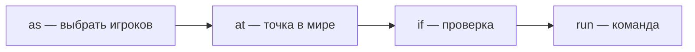

# Minecraft — команды и datapack

<div class="article-tags">
  <span class="tag tag-notrequired">НЕ ОБЯЗАТЕЛЬНО</span>
  <span class="tag tag-beginner">ДЛЯ НОВИЧКОВ</span>
</div>

Приветствую! Здесь вы наверняка найдете, что ищете. Примеры в лаборатории рассчитаны на то, что мы разбираем что-то конкретное.

Текущая статья посвящена команды Minecraft Java Edition с разбором каждой строки.

Поэтому за теорией по текущей теме вам — в [энциклопедию](/encyclopedia/intro).
Если ещё не погружались, то маршрут прост:

1. [Основы](/section/basics)
2. [Система и сеть](/section/system-network)
3. [Данные и разметка](/section/data-markup)
4. [Код и разработка](/section/code-dev)
5. [Языки](/section/languages)
6. [Искусственный интеллект](/section/ai)
7. [Проект](/section/project)
8. [Инфраструктура и безопасность](/section/infra-security)
9. [Спин-офф](/section/spinoff)

Обязательно пройдитесь.

А теперь приступим к нашему предмету.

<div class="callout callout--tip">
  <div class="callout-title">Теория и соседние материалы</div>

  <div class="callout-body">
  Моды, Python, ComputerCraft, сервер — [Разработка в Minecraft](/encyclopedia/9-spinoff/9-04-razrabotka-igr/21).

  Игры на Python вне мира — [Pygame](/lab/Примеры/1132), блоки Scratch — [Scratch](/lab/Примеры/112), Roblox Studio — [Luau](/lab/Примеры/1141).
</div>
</div>

---
<span id="chto-ishchut"></span>

## Навигация по примерам

| Типичный запрос | Куда на странице |
|-----------------|------------------|
| `команды minecraft как включить`, `читы minecraft` | [Включить команды](#vklyuchit) |
| `координаты minecraft f3`, `как узнать координаты` | [Координаты F3](#koordinaty) |
| `телепорт minecraft`, `tp minecraft`, `/tp @s` | [Телепорт](#tp) |
| `gamemode creative`, `режим творчества minecraft` | [Режим игры](#gamemode) |
| `give minecraft`, `выдать предмет командой` | [Give](#give) |
| `setblock`, `поставить блок командой` | [Setblock](#setblock) |
| `fill minecraft`, `залить область блоками` | [Fill — куб и пол](#fill-dom) |
| `tellraw minecraft`, `цветной текст в чате` | [Tellraw](#tellraw) |
| `scoreboard minecraft`, `счётчик убийств sidebar` | [Scoreboard](#scoreboard) |
| `execute minecraft`, `execute as at run` | [Execute](#execute) |
| `командный блок minecraft`, `цепочка command block` | [Командные блоки](#komandnye-bloki) |
| `datapack minecraft`, `как сделать datapack` | [Структура datapack](#struktura) |
| `pack.mcmeta`, `pack_format` | [pack.mcmeta](#pack-mcmeta) |
| `mcfunction`, `function minecraft` | [Первая функция](#pervaya-funkciya) |
| `load.json tick.json` | [load и tick](#load-tick) |
| `чекпоинт minecraft`, `spawnpoint команда` | [Чекпоинт паркура](#checkpoint) |
| `schedule function minecraft` | [Schedule вместо tick](#schedule-loop) |
| `ошибка unknown command`, `функция не найдена` | [Частые ошибки](#oshibki) |

---

## Оглавление по разделам

| Раздел | Содержание |
|--------|------------|
| [Включить команды](#vklyuchit) | одиночка, сервер, проверка `/say` |
| [Координаты F3](#koordinaty) | X Y Z, `~`, высота |
| [Обязательный минимум](#minimum) | шесть команд «на каждый урок» |
| [Стартовые команды](#startovye) | tp, дом, монеты, эффект |
| [Scoreboard](#scoreboard) | переменные, sidebar, условие |
| [Execute](#execute) | `as` / `at` / `if` / `run` |
| [Командные блоки](#komandnye-bloki) | impulse, chain, repeat |
| [Datapack целиком](#datapack-celikom) | все файлы пакета `tutorial` |
| [Чекпоинт паркура](#checkpoint) | мини-игра из 5 функций |
| [Ошибки](#oshibki) | симптом → решение |

---

## Основы — что такое «команда» в Minecraft

В чате строка с **`/`** в начале — это **не сообщение друзьям**, а запрос к **внутреннему интерпретатору мира** (как `print` в Python, только выполняет действие в 3D).

| Шаг урока | Аналогия в программировании |
|-----------|----------------------------|
| `/scoreboard objectives add coins dummy` | объявили переменную `coins` |
| `/scoreboard players add @s coins 1` | `coins += 1` |
| `/execute … if score … run say` | `if coins >= 5: print(..)` |
| файл `.mcfunction` | скрипт из нескольких строк |
| `datapacks/…/load.json` | `main()` при старте программы |

Один **игровой тик** = 1/20 секунды. Команды в `tick.json` срабатывают **20 раз в секунду** — отсюда лаги, если писать тяжёлую логику в tick.

---

<span id="vklyuchit"></span>

## Как включить команды

### Одиночная игра

1. **Создать мир** → **Дополнительные настройки мира**.
2. Включить **Разрешить читы** (Allow Cheats).
3. В мире **T** → ввод с `/`.

**Что увидите после включения:** в меню паузы появится «Открыть для LAN» с читами; в чате команды не краснеют как «неизвестный игрок» (при опечатке будет другая ошибка).

### Свой сервер

| Файл / действие | Зачем |
|-----------------|--------|
| `server.properties` → `enable-command-block=true` | разрешить командные блоки |
| `/op Ник` или запись в `ops.json` | право на опасные команды |

### Проверка — разбор `/say`

```mcfunction
/say Команды работают
```

**Что увидите:** в чате строка `<Сервер> Команды работают` (цвет серый, от имени «Сервер»).

| Часть | Смысл |
|-------|--------|
| `/` | режим команды |
| `say` | отправить текст **всем** |
| `Команды работают` | обычный текст; пробелы допустимы |

---

<span id="koordinaty"></span>

## Координаты — F3 и символ `~`

Нажмите **F3** (на ноутбуке часто **Fn+F3**) — слева появится отладочный экран.

| Буква | Ось | Пример |
|-------|-----|--------|
| **X** | восток / запад | растёт на восток |
| **Y** | высота | 64 — уровень моря в обычном мире |
| **Z** | юг / север | |

В командах:

| Запись | Значение |
|--------|----------|
| `100 70 -30` | абсолютная точка в мире |
| `~ ~ ~` | «здесь, где стоит цель команды» |
| `~ ~1 ~` | на один блок выше |
| `~-1` | на 1 меньше по этой оси |

**Учебный приём:** встаньте на место, запишите X Y Z из F3, подставьте в `/tp @s X Y Z` — вернётесь точно в «домашнюю» точку урока.

---

<span id="minimum"></span>

## Обязательный минимум — шесть команд на урок

Скопируйте по очереди в **творческом** мире с читами:

```mcfunction
/gamemode creative @s
/tp @s ~ ~10 ~
/give @s minecraft:command_block 1
/give @s minecraft:emerald_block 16
/scoreboard objectives add lesson dummy "Урок"
/scoreboard objectives setdisplay sidebar lesson
```

| № | Команда | Зачем на уроке |
|---|---------|----------------|
| 1 | `gamemode creative` | полёт, бесконечные блоки |
| 2 | `tp ~ ~10 ~` | подняться над землёй, не искать высоту |
| 3 | `give command_block` | автоматизация без чата |
| 4 | `give emerald_block` | маркеры чекпоинта паркура |
| 5–6 | scoreboard | «переменная» на экране справа |

---

<span id="startovye"></span>

## Стартовые команды

Простые сцены: один блок кода → видимый эффект. Каждый подраздел — **код**, **результат**, **разбор**.

---

<span id="tp"></span>

### Телепорт — `/tp`

```mcfunction
/tp @s 0 100 0
```

**Что увидите:** мгновенный перенос в точку X=0, Y=100, Z=0 (часто высоко в небе над миром).

| Часть | Смысл |
|-------|--------|
| `tp` | teleport |
| `@s` | **s**elf — вы, кто ввёл команду |
| `0` | координата X |
| `100` | высота Y |
| `0` | координата Z |

**К игроку по нику:**

```mcfunction
/tp @s Steve
```

| Часть | Смысл |
|-------|--------|
| `Steve` | ник второго игрока (латиница, как в лаунчере) |

**Относительный прыжок вверх** (удобно после падения в паркуре):

```mcfunction
/tp @s ~ ~5 ~
```

| Часть | Смысл |
|-------|--------|
| `~ ~5 ~` | X и Z не менять, Y +5 блоков |

---

<span id="gamemode"></span>

### Режим игры — `/gamemode`

```mcfunction
/gamemode creative @s
/gamemode survival @s
```

**Что увидите:** в creative — полёт (двойной прыжок), в инвентаре все блоки; в survival — шкала голода и добыча.

| Режим | Кратко |
|-------|--------|
| `creative` | строительство без лимита ресурсов |
| `survival` | классическое выживание |
| `adventure` | нельзя ломать блоки рукой (карты) |
| `spectator` | проход сквозь блоки, наблюдение |

| Часть команды | Смысл |
|---------------|--------|
| `gamemode` | сменить правила взаимодействия |
| `creative` | имя режима |
| `@s` | применить к себе |

---

<span id="give"></span>

### Выдать предмет — `/give`

```mcfunction
/give @s minecraft:diamond 8
```

**Что увидите:** 8 алмазов в инвентаре (или дроп, если инвентарь полон).

| Часть | Смысл |
|-------|--------|
| `give` | создать предметы у игрока |
| `@s` | кому |
| `minecraft:diamond` | ID предмета: пространство имён `minecraft` + имя |
| `8` | количество |

**Несколько стаков камня для стройки:**

```mcfunction
/give @s minecraft:stone 64
/give @s minecraft:oak_planks 64
```

---

<span id="setblock"></span>

### Один блок — `/setblock`

```mcfunction
/setblock ~ ~-1 ~ minecraft:gold_block
```

**Что увидите:** блок **под ногами** заменён на золотой.

| Часть | Смысл |
|-------|--------|
| `setblock` | поставить/заменить ровно один блок |
| `~ ~-1 ~` | смещение: под ногами (−1 по Y) |
| `minecraft:gold_block` | тип блока |

**Важно:** команда выполняется **от позиции цели**. В чате цель — вы (`@s` неявно). В `execute as @a at @s` цель — каждый игрок по очереди, `~` — под **его** ногами.

---

<span id="fill-dom"></span>

### Залить область — `/fill` (пол и «домик»)

**Площадка 5×5 под ногами:**

```mcfunction
/fill ~-2 ~-1 ~-2 ~2 ~-1 ~2 minecraft:stone
```

**Что увидите:** плоский каменный пол 5 блоков в сторону от вас.

| Часть | Смысл |
|-------|--------|
| `~-2 ~-1 ~-2` | первый угол параллелепипеда (левый-низ-зад) |
| `~2 ~-1 ~2` | противоположный угол (правый-низ-перед) |
| `minecraft:stone` | чем заполнить |

**Простые стены «домика»** (стоя на полу, смотрите на «фасад»):

```mcfunction
/fill ~-2 ~ ~-2 ~2 ~3 ~-2 minecraft:oak_planks
/fill ~-2 ~ ~2 ~2 ~3 ~2 minecraft:oak_planks
/fill ~-2 ~ ~-2 ~-2 ~3 ~2 minecraft:oak_planks
/fill ~2 ~ ~-2 ~2 ~3 ~2 minecraft:oak_planks
```

**Что увидите:** четыре стены; крышу можно `/fill ~-2 ~4 ~-2 ~2 ~4 ~2 minecraft:glass`.

| Параметр `fill` | Когда нужен |
|-----------------|-------------|
| (без режима) | заменить все блоки в коробке |
| `keep` | не трогать воздух — только заменить существующие |
| `outline` | только «коробка» без заливки внутри |
| `hollow` | полая коробка |

---

<span id="tellraw"></span>

### Цветной текст — `/tellraw`

```mcfunction
/tellraw @s {"text":"Урок начался","color":"green","bold":true}
```

**Что увидите:** сообщение **только вам**, зелёное и жирное (не в общем чате как `/say`).

| Поле JSON | Смысл |
|-----------|--------|
| `"text"` | строка |
| `"color"` | `red`, `gold`, `aqua`, … |
| `"bold":true` | жирный шрифт |

**Кликабельная кнопка** (продвинутый урок):

```mcfunction
/tellraw @a {"text":"[Старт]","color":"yellow","clickEvent":{"action":"run_command","value":"/function tutorial:hello"}}
```

| Часть | Смысл |
|-------|--------|
| `@a` | все игроки |
| `clickEvent` | по клику выполнить команду |
| `run_command` | как будто игрок ввёл `/function …` |

---

### Время, погода, эффект

```mcfunction
/time set day
/weather clear 1000
/effect give @s minecraft:speed 60 2 true
```

**Что увидите:** день, ясно ~1000 тиков, скорость III на 60 секунд без частиц (последний `true`).

| Команда | Разбор |
|---------|--------|
| `time set day` | фиксированное утро (~1000 тиков после полуночи) |
| `weather clear 1000` | без дождя 1000 тиков |
| `effect give @s minecraft:speed 60 2 true` | эффект, цель, тип, секунды, усиление (0=I), скрыть частицы |

---

<span id="scoreboard"></span>

## Scoreboard — переменные на экране

Scoreboard хранит **числа по игрокам** (и по «фиктивным» именам вроде `#global`). Это основа квестов, монет, этапов паркура.

### Создать цель и показать справа

```mcfunction
/scoreboard objectives add coins dummy "Монеты"
/scoreboard objectives setdisplay sidebar coins
/scoreboard players set @s coins 0
/scoreboard players add @s coins 1
```

**Что увидите:** справа табличка «Монеты» и число у вашего ника; после `add` число увеличится на 1.

| Строка | Разбор |
|--------|--------|
| `objectives add coins` | создать «столбец» с именем `coins` |
| `dummy` | тип: меняется **только командами**, сам не растёт |
| `"Монеты"` | подпись на экране (кириллица в кавычках) |
| `setdisplay sidebar` | показать справа |
| `players set @s coins 0` | обнулить ваш счёт |
| `players add @s coins 1` | `coins += 1` |

**Автоматический счётчик смертей** (ванильная статистика):

```mcfunction
/scoreboard objectives add deaths deathCount "Смерти"
/scoreboard objectives setdisplay list deaths
```

| Тип цели | Поведение |
|----------|-----------|
| `dummy` | только команды |
| `deathCount` | +1 при смерти игрока |
| `playerKillCount` | убийства игроков |
| `minecraft.used:minecraft.stone` | сколько раз использовали камень (пример критерия) |

### Условие «если монет ≥ 5»

```mcfunction
/execute as @a[scores={coins=5.}] run say У вас пять или больше монет!
```

**Что увидите:** сообщение только у тех, у кого `coins` от 5 и выше.

| Часть | Смысл |
|-------|--------|
| `execute as @a` | для **каждого** игрока |
| `[scores=&#123;coins=5.&#125;]` | фильтр: значение 5…∞ |
| `run say …` | выполнить `say` от имени этого игрока |

**Диапазоны:** `5.9` — от 5 до 9; `.3` — до 3 включительно; `10` — ровно 10.

---

<span id="execute"></span>

## Execute — главная «конструкция» 1.13+

Команда `/execute` связывает **кто**, **где**, **при каком условии** и **что выполнить**.



### Шаблон для копирования

```mcfunction
/execute as <цель> at @s <условия> run <команда>
```

| Слово | Роль |
|-------|------|
| `as` | «я — этот игрок» для следующих команд |
| `at @s` | позиция и поворот **этого** игрока (`@s` после `as`) |
| `if block …` | проверка блока в точке |
| `if score …` | проверка scoreboard |
| `run` | что выполнить при успехе |

---

### Пример 1 — золотой блок под каждым

```mcfunction
/execute as @a at @s run setblock ~ ~-1 ~ minecraft:gold_block
```

**Что увидите:** под ногами **каждого** онлайн-игрока появится золотой блок (один раз на выполнение).

| Шаг интерпретатора | Что происходит |
|--------------------|----------------|
| 1 | взять список `@a` |
| 2 | для Steve: встать в координаты Steve |
| 3 | `setblock` под Steve |
| 4 | повторить для Alex, … |

---

### Пример 2 — стоит на алмазе → свечение

```mcfunction
/execute as @a at @s if block ~ ~-1 ~ minecraft:diamond_block run effect give @s minecraft:glowing 5 0 true
```

**Что увидите:** стоя на алмазном блоке и введя команду (или в repeat-блоке) — краткая подсветка тела.

| Часть | Смысл |
|-------|--------|
| `if block ~ ~-1 ~ minecraft:diamond_block` | блок **под** ногами — алмаз |
| `effect give @s glowing` | эффект «свечение» 5 секунд |
| `0` | уровень I |
| `true` | без частиц |

---

### Пример 3 — зона спавна 20 блоков

```mcfunction
/execute as @a[x=100,y=70,z=-50,distance=.20] run title @s actionbar {"text":"Вы в зоне урока","color":"aqua"}
```

**Что увидите:** над хотбаром бирюзовая полоска текста, пока вы в сфере 20 блоков от точки (100, 70, −50).

| Часть | Смысл |
|-------|--------|
| `x=100,y=70,z=-50` | якорь зоны (подставьте свои F3) |
| `distance=.20` | радиус ≤ 20 |
| `title @s actionbar` | текст над инвентарём |

---

<span id="komandnye-bloki"></span>

## Командные блоки

Получить блок: `/give @s minecraft:command_block`.

| Режим в GUI | Англ. | Когда срабатывает |
|-------------|-------|-------------------|
| Импульсный | Impulse | раз по кнопке / редстоуну |
| Цепной | Chain | сразу после предыдущего в цепочке |
| Повторяющий | Repeat | каждый тик, пока включён |

**Настройки блока:** `Needs Redstone` — только с сигналом; `Always Active` у repeat — без рычага.

### Цепочка «монета + звук» — три блока

Поставьте **в линию** три командных блока, стрелки в одну сторону. Первый — **Impulse** + кнопка, остальные — **Chain**, `Auto`.

**Блок 1** (импульс):

```mcfunction
scoreboard players add @p coins 1
```

**Блок 2** (цепь):

```mcfunction
execute as @p if score @p coins matches 5. run say Пять монет!
```

**Блок 3** (цепь):

```mcfunction
playsound minecraft:entity.experience_orb.pickup master @p
```

**Что увидите:** каждое нажатие — +1 монета; на 5-й раз — фраза в чат и звук опыта.

| Блок | Разбор строки |
|------|----------------|
| 1 | `@p` — ближайший игрок к блоку; `add coins 1` |
| 2 | `matches 5.` — синтаксис сравнения scoreboard |
| 3 | `playsound` … `master @p` — звук только этому игроку |

<div class="callout callout--warning">
  <div class="callout-title">В командных блоках без `/`</div>

  <div class="callout-body">
  Внутри GUI блока пишут <code>scoreboard players add …</code> — <strong>без</strong> слэша в начале. В чате и в <code>.mcfunction</code> в datapack — тоже без <code>/</code>.
</div>
</div>

---

<span id="struktura"></span>

## Структура datapack

Datapack — папка внутри мира. Игра читает её при загрузке и по `/reload`.

**Windows (одиночка):**

```text
%APPDATA%\.minecraft\saves\ИМЯ_МИРА\datapacks\tutorial_pack\
```

**Linux:**

```text
~/.minecraft/saves/ИМЯ_МИРА/datapacks/tutorial_pack/
```

Дерево файлов учебного пакета:

```text
tutorial_pack/
  pack.mcmeta
  data/
    tutorial/
      functions/
        hello.mcfunction
        init.mcfunction
        tick_counter.mcfunction
        every_second.mcfunction
        parkour_init.mcfunction
        parkour_tick.mcfunction
        set_checkpoint.mcfunction
      tags/
        minecraft/
          functions/
            load.json
            tick.json
```

| Путь | Назначение |
|------|------------|
| `pack.mcmeta` | метаданные и `pack_format` |
| `data/tutorial/functions/*.mcfunction` | команды, **одна строка = одна команда** |
| `tags/../load.json` | что запустить при загрузке |
| `tags/../tick.json` | что запускать **каждый тик** |

`tutorial` — **namespace** (ваше имя пакета латиницей). Вызов функции: `tutorial:hello`.

---

<span id="pack-mcmeta"></span>

## pack.mcmeta — разбор файла

Создайте текстовый файл `pack.mcmeta` (кодировка UTF-8):

```json
{
  "pack": {
    "pack_format": 48,
    "description": "Учебный пак — команды и функции"
  }
}
```

| Поле | Смысл |
|------|--------|
| `"pack"` | корневой объект метаданных |
| `"pack_format": 48` | версия схемы; **должна совпадать** с версией Minecraft |
| `"description"` | подпись в меню datapack |

| Версия Java (ориентир) | pack_format |
|------------------------|-------------|
| 1.20.4 | 41 |
| 1.20.5–1.20.6 | 42–43 |
| 1.21.x | 48+ |

Таблица на вики: [Pack format](https://minecraft.wiki/w/Pack_format). После обновления игры число часто меняют — при жёлтом предупреждении в чате обновите одно число.

---

<span id="pervaya-funkciya"></span>

## Первая функция — `hello.mcfunction`

Файл: `data/tutorial/functions/hello.mcfunction`

```mcfunction
tellraw @a {"text":"Datapack tutorial: привет!","color":"green"}
playsound minecraft:block.note_block.pling master @a ~ ~ ~ 1 1
```

**Что увидите:** зелёная строка всем + звук нотного блока.

| Строка | Разбор |
|--------|--------|
| `tellraw @a {…}` | JSON-сообщение **всем** игрокам |
| `"color":"green"` | цвет текста |
| `playsound minecraft:block.note_block.pling` | звук |
| `master @a` | категория `master`, слышат все `@a` |
| `~ ~ ~` | координаты звука — у каждого игрока свои при `execute` нет; здесь глобально от (0,0,0) мира при прямом вызове — для урока достаточно |

**Подключить при загрузке** — `data/tutorial/tags/minecraft/functions/load.json`:

```json
{
  "values": [
    "tutorial:hello"
  ]
}
```

| Поле | Смысл |
|------|--------|
| `"values"` | список функций |
| `"tutorial:hello"` | namespace `tutorial`, файл `functions/hello.mcfunction` |

В игре после правок:

```mcfunction
/reload
```

**Что увидите в чате:** сообщение о перезагрузке datapack; если JSON верный — сработает `hello` (зелёный текст).

Ручной вызов:

```mcfunction
/function tutorial:hello
```

---

<span id="load-tick"></span>

## load и tick

### `init.mcfunction` — один раз при загрузке

```mcfunction
scoreboard objectives add tick_timer dummy
scoreboard players set #global tick_timer 0
tellraw @a {"text":"Счётчики готовы","color":"aqua"}
```

| Строка | Смысл |
|--------|--------|
| `objectives add tick_timer` | цель-счётчик тиков |
| `#global` | **фиктивный игрок** для «глобальных» чисел; `#` обязателен |
| `players set #global tick_timer 0` | обнулить счётчик |
| `tellraw @a` | сообщить всем, что init прошёл |

`load.json` (можно **два** значения — сначала init, потом hello):

```json
{
  "values": [
    "tutorial:init",
    "tutorial:hello"
  ]
}
```

---

### tick — раз в секунду без лагов

`data/tutorial/functions/tick_counter.mcfunction`:

```mcfunction
scoreboard players add #global tick_timer 1
execute if score #global tick_timer matches 20. run function tutorial:every_second
```

`data/tutorial/functions/every_second.mcfunction`:

```mcfunction
scoreboard players set #global tick_timer 0
title @a actionbar {"text":"1 секунда прошла","color":"yellow"}
```

`tick.json`:

```json
{
  "values": [
    "tutorial:tick_counter"
  ]
}
```

**Логика по шагам (каждый тик):**

| Тик | `#global tick_timer` | Действие |
|-----|----------------------|----------|
| 1 | 1 | только +1 |
| … | … | … |
| 20 | 20 | вызов `every_second`, сброс в 0, жёлтый actionbar |

<div class="callout callout--caution">
  <div class="callout-title">Не кладите тяжёлый fill в tick</div>

  <div class="callout-body">
  <code>fill</code> на большую область 20 раз в секунду — лаг мира. Тяжёлое — в <code>load</code>, по кнопке, или через <code>schedule</code>.
</div>
</div>

---

<span id="schedule-loop"></span>

### Schedule — цикл без `tick.json`

В `every_second.mcfunction` в конце можно добавить:

```mcfunction
schedule function tutorial:every_second 20t
```

Первый запуск из чата:

```mcfunction
/schedule function tutorial:every_second 20t
```

| Часть | Смысл |
|-------|--------|
| `schedule function` | отложить вызов функции |
| `tutorial:every_second` | какая функция |
| `20t` | через 20 тиков (1 секунда) |

**Смысл:** функция вызывает сама себя через 1 с — цикл **без** постоянного tick. Для уроков и слабых ПК — предпочтительнее.

---

<span id="datapack-celikom"></span>

## Собрать пакет `tutorial` с нуля — чеклист

| Шаг | Действие | Проверка |
|-----|----------|----------|
| 1 | Создать папку `tutorial_pack` в `datapacks` | путь существует |
| 2 | Записать `pack.mcmeta` | JSON без лишей запятой |
| 3 | Создать `data/tutorial/functions/` | |
| 4 | Положить `hello.mcfunction` | |
| 5 | Создать `load.json` с `"tutorial:hello"` | |
| 6 | В мире `/reload` | зелёный tellraw |
| 7 | `/datapack list` | `tutorial_pack` в списке |

Команда **списка пакетов:**

```mcfunction
/datapack list
```

---

<span id="checkpoint"></span>

## Чекпоинт паркура — мини-игра

**Задача:** наступил на **изумрудный блок** → запомнили точку возрождения, надпись, звук; повторно не срабатывает.

### Файл 1 — `parkour_init.mcfunction`

```mcfunction
scoreboard objectives add checkpoint dummy "Чекпоинт"
scoreboard players set @a checkpoint 0
```

| Строка | Смысл |
|--------|--------|
| `checkpoint` | имя переменной этапа |
| `set @a … 0` | всем игрокам этап «не пройден» |

Добавьте в `load.json` строку `"tutorial:parkour_init"` (после `init`).

### Файл 2 — `parkour_tick.mcfunction` (в `tick.json`)

```mcfunction
execute as @a at @s if block ~ ~-1 ~ minecraft:emerald_block if score @s checkpoint matches .0 run function tutorial:set_checkpoint
```

**Разбор цепочки `execute`:**

| Фрагмент | Смысл |
|----------|--------|
| `as @a` | проверяем каждого игрока |
| `at @s` | в его координатах |
| `if block ~ ~-1 ~ emerald` | под ногами изумруд |
| `if score @s checkpoint matches .0` | счёт 0 или «ещё не брал чекпоинт» |
| `run function tutorial:set_checkpoint` | вызвать функцию награды |

### Файл 3 — `set_checkpoint.mcfunction`

```mcfunction
scoreboard players set @s checkpoint 1
spawnpoint @s ~ ~ ~
title @s title {"text":"Чекпоинт!","color":"green"}
playsound minecraft:ui.toast.challenge_complete master @s
```

| Строка | Смысл |
|--------|--------|
| `set @s checkpoint 1` | больше не срабатывать на этом блоке |
| `spawnpoint @s ~ ~ ~` | точка возрождения **здесь** |
| `title @s title` | большой текст по центру |
| `playsound … challenge_complete` | звук «достижение» |

**Проверка в мире**

1. `/reload`
2. Поставьте ряд `emerald_block` на маршруте.
3. Пройдите по блоку — заголовок и звук.
4. Упадите и возродитесь — появитесь у чекпоинта.
5. Сброс урока: `/scoreboard players set @a checkpoint 0`

---

<span id="oshibki"></span>

## Частые ошибки новичков

| Симптом | Причина | Что сделать |
|---------|---------|-------------|
| Команда «не найдена» | Bedrock / старая версия | Java Edition 1.13+ |
| `Недостаточно прав` | читы выкл. / нет OP | включить читы или `/op` |
| В блоке «ничего» | написали `/` в командном блоке | убрать `/` |
| Функция не найдена | опечатка namespace | файл `tutorial/..` → `tutorial:имя` |
| После правки старое | не reload | `/reload` |
| JSON ошибка | запятая в конце, кавычки | проверить [jsonlint](https://jsonlint.com/) |
| Пакет жёлтый | неверный `pack_format` | таблица на вики |
| Лаги | тяжёлый `fill` в tick | `schedule` или редкий сенсор |
| `~` ставит блок не там | нет `at @s` в execute | добавить `at @s` |

**Лог:** **F3 + L** → папка мира → `logs/latest.log` — строки `Loaded … datapack` или текст ошибки парсера JSON.

---

<span id="dalsche"></span>

## Куда дальше

| Тема | Материал |
|------|----------|
| Моды, Python, API | [Разработка в Minecraft](/encyclopedia/9-spinoff/9-04-razrabotka-igr/21) |
| Игры на Python | [Pygame](/lab/Примеры/1132) |
| Roblox Studio | [Luau](/lab/Примеры/1141) |
| Git для папки пакета | [Шаблоны](/lab/Примеры/2) |
| Вики | [Commands](https://minecraft.wiki/w/Commands), [Function](https://minecraft.wiki/w/Function_(Java_Edition)) |

### Практика на неделю

| День | Задача | Критерий «готово» |
|------|--------|-------------------|
| 1 | F3, `/tp`, `/gamemode` | вернулись в точку по координатам |
| 2 | `/fill` пол 7×7, `/setblock` | площадка под паркур |
| 3 | scoreboard `coins`, sidebar | число растёт от команд |
| 4 | цепочка из 3 командных блоков | звук на 5 монет |
| 5 | пакет `hello` + `load.json` | tellraw после `/reload` |
| 6 | `init` + tick раз в секунду | actionbar раз в секунду |
| 7 | чекпоинт изумруд + `spawnpoint` | возрождение на маркере |

---

## Шпаргалка селекторов и scoreboard

**Селекторы**

| Запись | Кого выбирает |
|--------|----------------|
| `@s` | источник (вы / текущий в execute) |
| `@p` | ближайший игрок |
| `@a` | все игроки |
| `@e[type=minecraft:zombie]` | все зомби |
| `@a[distance=.10]` | игроки в 10 блоках |

**Сравнение score в execute**

| Запись | Значение |
|--------|----------|
| `matches 5` | ровно 5 |
| `matches 5.` | ≥ 5 |
| `matches .3` | ≤ 3 |
| `matches 5.10` | от 5 до 10 |

Сохраните страницу в закладки и идите по таблице [запросов](#chto-ishchut) — 

---
