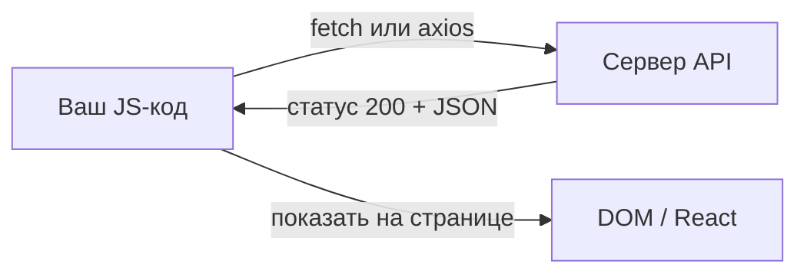

import ExternalCodeEmbed from '@site/src/components/ExternalCodeEmbed';


# Fetch / axios — типовые запросы

<div class="article-tags">
  <span class="tag tag-notrequired">НЕ ОБЯЗАТЕЛЬНО</span>
  <span class="tag tag-beginner">ДЛЯ НОВИЧКОВ</span>
</div>

Приветствую! Здесь вы наверняка найдете, что ищете. Примеры в лаборатории рассчитаны на то, что мы разбираем что-то конкретное.

Текущая статья посвящена HTTP-запросам на fetch и axios — GET, POST, JSON, токен, FormData и React.

Поэтому за теорией по текущей теме вам — в [энциклопедию](/encyclopedia/intro).
Если ещё не погружались, то маршрут прост:

1. [Основы](/section/basics)
2. [Система и сеть](/section/system-network)
3. [Данные и разметка](/section/data-markup)
4. [Код и разработка](/section/code-dev)
5. [Языки](/section/languages)
6. [Искусственный интеллект](/section/ai)
7. [Проект](/section/project)
8. [Инфраструктура и безопасность](/section/infra-security)
9. [Спин-офф](/section/spinoff)

Обязательно пройдитесь.

А теперь приступим к нашему предмету.

<div class="callout callout--tip">
  <div class="callout-title">Теория и соседние материалы</div>

  <div class="callout-body">
  Проверка API в терминале — [curl / fetch — API-запросы](/lab/Примеры/1133).

  Promise и async/await — [асинхронное программирование](/encyclopedia/5-languages/5-01-javascript/21).

  Каркас API-клиента — [практика JavaScript](/encyclopedia/5-languages/5-01-javascript/32).

  Отмена запросов — [AbortController](/encyclopedia/5-languages/5-01-javascript/37).

  Тот же GET в мобильном приложении — [Flutter + FutureBuilder](/lab/Примеры/1154#fetch).
</div>
</div>

---
## Как запустить любой пример

### Вариант 1 — консоль браузера (самый быстрый)

1. Откройте любой сайт или пустую вкладку.
2. Нажмите **F12** → вкладка **Console**.
3. Вставьте код с `await` — в современных браузерах top-level `await` в консоли **разрешён**.
4. Нажмите Enter. Ответ появится в консоли или во вкладке **Network**.

Если браузер ругается на `await` снаружи функции, оберните код:

```javascript
(async () => {
  const res = await fetch('https://jsonplaceholder.typicode.com/posts/1');
  console.log(await res.json());
})();
```

**Разбор обёртки:**

| Часть | Смысл |
|-------|--------|
| `(async () => { .. })()` | Создали **анонимную async-функцию** и сразу вызвали |
| Зачем | `await` работает только **внутри** `async`-функции |
| `console.log(await res.json())` | Печатаем разобранный JSON в консоль |

### Вариант 2 — Node.js 18+

1. Установите [Node.js](https://nodejs.org/) (LTS).
2. Создайте файл `request.mjs` (расширение **`.mjs`** — чтобы работал `import`).
3. Вставьте пример, сохраните.
4. В терминале в папке с файлом:

```bash
node request.mjs
```

### Вариант 3 — проект Vite / React

1. `npm create vite@latest my-app` → выберите React или Vanilla.
2. `cd my-app && npm install` — для axios ещё `npm install axios`.
3. Код fetch/axios — в `useEffect`, обработчик кнопки или отдельный файл `src/api/..`.

Учебные URL **бесплатны**: [jsonplaceholder.typicode.com](https://jsonplaceholder.typicode.com), [httpbin.org](https://httpbin.org).

---

## Что такое fetch и axios — простыми словами

**Сайт в браузере** обычно **запрашивает** у сервера данные по HTTP — как вы открываете страницу, только ответ приходит **JSON** (текст с `&#123; "ключ": "значение" &#125;`), а не готовая HTML-страница.



| Слово | Простое объяснение |
|-------|-------------------|
| **fetch** | Встроенная функция браузера и Node.js — «сходи по URL, принеси ответ» |
| **axios** | Библиотека npm — то же HTTP, но короче код и удобнее ошибки |
| **GET** | «Дай прочитать» — список постов, профиль пользователя |
| **POST** | «Прими новые данные» — форма, создание записи |
| **JSON** | Формат обмена: `&#123;"title":"hello","userId":1&#125;` |
| **Promise** | «Обещание результата потом» — поэтому нужен `await` |
| **401 / 404** | Код ответа: нет доступа / не найдено |

---

## Навигация по примерам

| Ищут в интернете | Раздел ниже |
|------------------|-------------|
| javascript fetch example / fetch api пример | [Обязательный шаблон fetch](#обязательный-шаблон-fetch) |
| fetch get json / как получить json fetch | [GET — один пост](#get-один-пост-по-id) |
| fetch post json / javascript post request | [POST с JSON](#post-с-json) |
| axios get request example / axios get пример | [Обязательный шаблон axios](#обязательный-шаблон-axios) |
| axios post example / axios post json | [POST с JSON](#post-с-json) |
| fetch query parameters / параметры в url | [Query-параметры](#query-параметры) |
| axios bearer token / authorization header | [Bearer-токен](#bearer-токен) |
| fetch timeout / abortcontroller fetch | [Таймаут](#таймаут) |
| axios interceptors / axios create instance | [Interceptors](#interceptors-в-axios) |
| react fetch useeffect / загрузка данных react | [React useEffect](#react-загрузка-в-useeffect) |
| fetch vs axios / чем отличается axios | [fetch и axios — когда что](#fetch-и-axios-когда-что) |
| failed to fetch cors / cors error | [CORS](#cors-failed-to-fetch) |
| javascript api request localhost | [localhost](#localhost) |

---

## Основы — с чего начать

<span id="обязательный-шаблон-fetch"></span>

### Обязательный шаблон fetch

Любой рабочий GET на fetch строится из **трёх шагов**:

1. **`fetch(url)`** — отправить запрос.
2. **Проверить `res.ok`** — убедиться, что сервер не вернул 404/500.
3. **`await res.json()`** — прочитать тело как JSON.

**Задача:** получить заголовок поста с id=1 и вывести в консоль.

```javascript
const res = await fetch('https://jsonplaceholder.typicode.com/posts/1');

if (!res.ok) {
  throw new Error(`HTTP ${res.status} ${res.statusText}`);
}

const data = await res.json();
console.log(data.title);
```

**Разбор построчно:**

| Строка | Что происходит | Зачем |
|--------|----------------|-------|
| `const res = await fetch('..')` | Браузер отправляет **GET** на URL и **ждёт** ответ | `fetch` возвращает Promise; `await` «останавливает» код до ответа |
| URL в кавычках | Адрес ресурса на сервере | `/posts/1` — пост с номером 1 |
| `if (!res.ok)` | Проверка: статус **не** из диапазона 200–299 | fetch **не считает** 404 ошибкой JavaScript — только `res.ok === false` |
| `throw new Error(..)` | Прерывает выполнение с текстом ошибки | В консоли красное сообщение `HTTP 404 Not Found` |
| `` `HTTP ${res.status}` `` | Шаблонная строка — подставляет число статуса | Удобно для отладки и отчёта |
| `const data = await res.json()` | Читает **тело** ответа и парсит JSON → объект JS | Второй `await`: чтение потока тоже асинхронное |
| `console.log(data.title)` | Печатает поле `title` из объекта | Так данные попадают на экран или в отладку |

**Что увидите в консоли** (фрагмент):

```text
sunt aut facere repellat provident occaecati excepturi optio reprehenderit
```

**Частая ошибка:** забыть `await` перед `res.json()` — в переменной окажется **Promise**, а не объект, и `data.title` будет `undefined`.

**Попробуйте:** URL `../posts/99999` — сработает `!res.ok`, увидите `HTTP 404`.

---

<span id="обязательный-шаблон-axios"></span>

### Обязательный шаблон axios

**axios** — отдельная библиотека. Её ставят через npm, JSON разбирается **автоматически**, HTTP-ошибки **бросают исключение**.

Установка (один раз в проекте):

```bash
npm install axios
```

**Задача:** тот же GET — заголовок поста id=1.

```javascript

import axios from 'axios';

const { data } = await axios.get('https://jsonplaceholder.typicode.com/posts/1');
console.log(data.title);
```

**Разбор построчно:**

| Строка | Что происходит | Зачем |
|--------|----------------|-------|
| `import axios from 'axios'` | Подключает модуль из `node_modules` | В браузере через Vite/Webpack; в Node — файл `.mjs` или `"type":"module"` |
| `axios.get(url)` | GET-запрос; внутри — тот же HTTP, что у fetch | Короткая запись вместо `fetch` + опций |
| `const &#123; data &#125; = await ..` | **Деструктуризация** — достаём поле `data` из ответа axios | axios **всегда** кладёт тело ответа в `.data` |
| `data.title` | Поле объекта, как у fetch | Структура JSON от сервера **та же** |

**Что увидите:** тот же заголовок поста, что и в примере с fetch.

**Разница с fetch при ошибке:**

```javascript
try {
  await axios.get('https://jsonplaceholder.typicode.com/posts/99999');
} catch (error) {
  console.log('Статус:', error.response?.status); // 404
}
```

| | fetch | axios |
|---|-------|-------|
| 404 | `res.ok === false`, код **не падает** | `catch`, `error.response.status === 404` |
| JSON | `await res.json()` вручную | уже в `data` |

**Попробуйте:** запустите блок `try/catch` выше — увидите статус 404 без ручной проверки `ok`.

---

<span id="fetch-и-axios-когда-что"></span>

### fetch и axios — когда что

| Критерий | fetch | axios |
|----------|-------|-------|
| Установка | Уже есть в браузере и Node 18+ | `npm install axios` |
| Строк кода на GET | ~5 с проверкой `ok` | ~2 |
| Ошибка 404/500 | Проверка `res.ok` | Автоматически `throw` |
| Таймаут | `AbortController` (~10 строк) | `timeout: 5000` |
| Токен на все запросы | Своя функция `apiRequest` | `interceptors` |
| Курсовая / лабораторная | Отлично — без зависимостей | Отлично — меньше boilerplate |
| Большой React-проект | Нужна обёртка | Частый выбор команды |

Для **первого знакомства** начните с **fetch** в консоли F12. Когда появится проект с `package.json` — добавьте **axios**.

---

## Стартовые запросы

<span id="get-один-пост-по-id"></span>

### GET — один пост по id

**Задача:** прочитать один ресурс по номеру — самый частый запрос в учебниках («получить пользователя», «получить товар»).

**fetch:**

```javascript
const res = await fetch('https://jsonplaceholder.typicode.com/posts/1');
if (!res.ok) throw new Error(`HTTP ${res.status}`);
const post = await res.json();
console.log(post.id, post.title);
```

**axios:**

```javascript

import axios from 'axios';

const { data: post } = await axios.get('https://jsonplaceholder.typicode.com/posts/1');
console.log(post.id, post.title);
```

**Разбор полей ответа:**

| Поле | Пример | Смысл |
|------|--------|--------|
| `id` | `1` | Номер записи в базе |
| `title` | строка | Заголовок поста |
| `body` | длинный текст | Текст поста |
| `userId` | `1` | Автор — связь с другим ресурсом `/users/1` |

**Что увидите в консоли:**

```text
1 sunt aut facere repellat provident occaecati excepturi optio reprehenderit
```

**Как проверить в DevTools:** F12 → **Network** → обновите или выполните код → клик по строке `posts/1` → вкладки **Headers** (статус 200) и **Response** (весь JSON).

**Попробуйте:** замените `1` на `99999` — fetch: `res.ok === false`; axios: ошибка в `catch`.

---

<span id="post-с-json"></span>

### POST с JSON

**Задача:** отправить **новый** объект на сервер — кнопка «Сохранить», форма регистрации, создание заметки.

**fetch:**

```javascript
const res = await fetch('https://jsonplaceholder.typicode.com/posts', {
  method: 'POST',
  headers: { 'Content-Type': 'application/json' },
  body: JSON.stringify({
    title: 'hello',
    body: 'text',
    userId: 1,
  }),
});

if (!res.ok) throw new Error(`HTTP ${res.status}`);
const created = await res.json();
console.log('Новый id:', created.id);
```

**Разбор построчно (fetch):**

| Строка | Что происходит | Зачем |
|--------|----------------|-------|
| второй аргумент `{ .. }` | Настройки запроса | Без него fetch делает только GET |
| `method: 'POST'` | HTTP-метод «создать / отправить» | GET тело обычно не несёт |
| `headers: &#123; 'Content-Type': 'application/json' &#125;` | Говорим серверу: «в теле JSON» | Без заголовка сервер может не понять формат |
| `JSON.stringify({..})` | Объект JS → **строка** для HTTP-тела | По сети летит текст, не «живой» объект |
| `title`, `body`, `userId` | Поля, которые ждёт jsonplaceholder | У вашего API список полей будет в документации |
| `created.id` | Сервер «притворяется», что создал запись и вернул id | Учебный API не сохраняет навсегда — id всё равно приходит в ответе |

**axios:**

```javascript

import axios from 'axios';

const { data: created } = await axios.post(
  'https://jsonplaceholder.typicode.com/posts',
  { title: 'hello', body: 'text', userId: 1 },
);
console.log('Новый id:', created.id);
```

**Разбор:** axios сам ставит `Content-Type: application/json` и вызывает `JSON.stringify` за вас — вторым аргументом `.post()` передаётся **обычный объект**.

**Что увидите:**

```text
Новый id: 101
```

(число может отличаться — jsonplaceholder возвращает фиктивный id.)

**Частая ошибка:** передать объект в `body` **без** `JSON.stringify` в fetch — сервер получит `[object Object]` и ответит **400 Bad Request**.

**Попробуйте:** во вкладке Network откройте запрос **posts** → **Payload** — там ваш JSON.

---

## Типовые запросы — углубление

<span id="query-параметры"></span>

### 1. Query-параметры

**Задача:** GET с фильтром — «все посты **пользователя 1**» (в URL после `?`).

**fetch:**

```javascript
const params = new URLSearchParams({ userId: '1' });
const url = `https://jsonplaceholder.typicode.com/posts?${params}`;

const res = await fetch(url);
if (!res.ok) throw new Error(`HTTP ${res.status}`);
const posts = await res.json();
console.log('Количество:', posts.length);
```

**Разбор построчно:**

| Строка | Что происходит | Зачем |
|--------|----------------|-------|
| `new URLSearchParams(&#123; userId: '1' &#125;)` | Строит строку параметров | Автоматически кодирует пробелы и спецсимволы |
| `` `..?${params}` `` | Склеивает базовый URL и `userId=1` | Итог: `../posts?userId=1` |
| `posts.length` | Длина **массива** | Ответ — список, не один объект |

**axios:**

```javascript

import axios from 'axios';

const { data: posts } = await axios.get('https://jsonplaceholder.typicode.com/posts', {
  params: { userId: 1 },
});
console.log('Количество:', posts.length);
```

**Разбор:** ключ `params` — axios сам добавит `?userId=1` к адресу. Число `1` можно писать без кавычек.

**Что увидите:** `Количество: 10` (у userId=1 десять постов на jsonplaceholder).

**Попробуйте:** `&#123; params: &#123; userId: 1, _limit: 3 &#125; &#125;` — вернётся только 3 поста.

---

### 2. PUT, PATCH и DELETE

**Задача:** для отчёта показать **все** методы REST на одном URL `/posts/1`.

| Метод | Смысл простыми словами | Тело запроса |
|-------|------------------------|--------------|
| **GET** | Прочитать | Обычно пусто |
| **POST** | Создать новый | Новый объект |
| **PUT** | Заменить **целиком** | Полный объект со всеми полями |
| **PATCH** | Изменить **часть** | Только изменённые поля |
| **DELETE** | Удалить | Обычно пусто |

**fetch — PUT:**

```javascript
const res = await fetch('https://jsonplaceholder.typicode.com/posts/1', {
  method: 'PUT',
  headers: { 'Content-Type': 'application/json' },
  body: JSON.stringify({
    id: 1,
    title: 'new title',
    body: 'new body',
    userId: 1,
  }),
});
const updated = await res.json();
console.log(updated.title);
```

**Разбор PUT:** сервер ожидает **все** поля ресурса. Отправили только `title` — в строгих API остальное может обнулиться.

**fetch — PATCH:**

```javascript
const res = await fetch('https://jsonplaceholder.typicode.com/posts/1', {
  method: 'PATCH',
  headers: { 'Content-Type': 'application/json' },
  body: JSON.stringify({ title: 'only title changed' }),
});
const patched = await res.json();
```

**Разбор PATCH:** «заплатка» — меняем **одно** поле, остальное сервер не трогает.

**fetch — DELETE:**

```javascript
const res = await fetch('https://jsonplaceholder.typicode.com/posts/1', {
  method: 'DELETE',
});
console.log('Статус:', res.status);
```

**Разбор DELETE:** тела обычно нет; успех — часто статус **200** или **204** (без тела).

**axios — все три метода:**

```javascript

import axios from 'axios';

const BASE = 'https://jsonplaceholder.typicode.com/posts/1';

await axios.put(BASE, { id: 1, title: 'new', body: 'new', userId: 1 });
await axios.patch(BASE, { title: 'only title changed' });
await axios.delete(BASE);
```

**Частая ошибка в лабораторных:** перепутать PUT и PATCH. В отчёте напишите: PUT — полная замена, PATCH — частичное изменение.

---

<span id="bearer-токен"></span>

### 3. Bearer-токен

**Задача:** передать **секрет** в заголовке — так работают JWT, API keys, «личный кабинет».

**fetch:**

```javascript
const TOKEN = 'your-token-here';

const res = await fetch('https://httpbin.org/bearer', {
  headers: {
    Authorization: `Bearer ${TOKEN}`,
  },
});
const data = await res.json();
console.log(data);
```

**Разбор построчно:**

| Строка | Что происходит | Зачем |
|--------|----------------|-------|
| `const TOKEN = '..'` | Переменная с секретом | В реальном проекте — из `.env`, **не** из Git |
| `headers: &#123; Authorization: .. &#125;` | HTTP-заголовок «кто вы» | Сервер читает его **до** тела запроса |
| `` `Bearer ${TOKEN}` `` | Формат: слово Bearer, пробел, токен | Стандарт OAuth2 / JWT |
| httpbin `/bearer` | Учебный сервер «эхо» | В ответе покажет, какой токен дошёл |

**axios:**

```javascript

import axios from 'axios';

const TOKEN = 'your-token-here';

const { data } = await axios.get('https://httpbin.org/bearer', {
  headers: { Authorization: `Bearer ${TOKEN}` },
});
console.log(data);
```

**Попробуйте:** `TOKEN = 'test123'` — в JSON ответа найдите `"test123"`.

<div class="callout callout--danger">
  <div class="callout-title">Токены в Git</div>

  <div class="callout-body">
  Никогда не коммитьте реальные ключи в репозиторий. В отчёте пишите: «токен берётся из переменной окружения <code>process.env.API_TOKEN</code>».
</div>
</div>

---

### 4. Форма и загрузка файла

**Задача:** отправить поля как HTML-форма (логин/пароль) или файл — `multipart/form-data`.

**fetch — FormData:**

```javascript
const form = new FormData();
form.append('login', 'user');
form.append('password', 'pass');
// form.append('avatar', fileInput.files[0]); // раскомментируйте с <input type="file">

const res = await fetch('https://httpbin.org/post', {
  method: 'POST',
  body: form,
});
const echo = await res.json();
console.log(echo.form);
```

**Разбор построчно:**

| Строка | Что происходит | Зачем |
|--------|----------------|-------|
| `new FormData()` | Контейнер «поля формы» | Как виртуальная `<form>` |
| `form.append('login', 'user')` | Пара имя=значение | Имя `login` увидит сервер |
| **нет** `Content-Type` | Браузер сам поставит `multipart/form-data` с boundary | Если поставить `application/json` вручную — сломается |
| `echo.form` | httpbin возвращает зеркало ваших полей | Проверка «дошло ли» |

**axios:**

```javascript

import axios from 'axios';

const form = new FormData();
form.append('login', 'user');
form.append('password', 'pass');

const { data } = await axios.post('https://httpbin.org/post', form);
console.log(data.form);
```

**Что увидите:**

```text
{ login: 'user', password: 'pass' }
```

(в консоли объект с вашими полями.)

---

<span id="таймаут"></span>

### 5. Таймаут

**Задача:** сервер «думает» слишком долго — **оборвать** запрос через 5 секунд, чтобы интерфейс не завис.

**fetch + AbortController:**


<ExternalCodeEmbed example="javascript/lab-1145-001" title="5. Таймаут" minHeight={336} />


**Разбор построчно:**

| Строка | Что происходит | Зачем |
|--------|----------------|-------|
| `async function fetchJson(..)` | Переиспользуемая функция | Один раз написали — вызываете из всего проекта |
| `&#123; timeoutMs = 5000 &#125; = &#123;&#125;` | Параметр по умолчанию 5 сек | Можно передать `&#123; timeoutMs: 10000 &#125;` |
| `new AbortController()` | Объект «кнопка отмены» | Стандарт браузера для прерывания fetch |
| `setTimeout(() => controller.abort ..)` | Через N мс нажать «отмена» | Если ответ не успел — запрос обрывается |
| `signal: controller.signal` | Связь fetch с контроллером | Без `signal` abort не сработает |
| `finally &#123; clearTimeout(timer) &#125;` | Убрать таймер, если ответ пришёл раньше | Иначе таймеры копятся и «стреляют» позже |

**axios:**

```javascript

import axios from 'axios';

const { data } = await axios.get('https://jsonplaceholder.typicode.com/posts/1', {
  timeout: 5000,
});
console.log(data.title);
```

**Разбор:** одна строка `timeout: 5000` — то же поведение, что ~15 строк с AbortController.

**Попробуйте:** `fetchJson('https://httpbin.org/delay/5', &#123; timeoutMs: 1000 &#125;)` — через 1 с в консоли **AbortError**.

---

### 6. Retry при сбое сервера

**Задача:** сервер на секунду «лежит» (502/503) — **повторить** запрос 2–3 раза с паузой.


<ExternalCodeEmbed example="javascript/lab-1145-002" title="6. Retry при сбое сервера" minHeight={372} />


**Разбор логики:**

| Шаг | Смысл |
|-----|--------|
| `for (let i = 0; i < attempts; i++)` | До 3 попыток |
| `status >= 500` | Вина **сервера** — можно повторить |
| `(no retry)` для 400/401/404 | Ошибка **клиента** — повтор бессмысленен |
| `baseMs * 2 &#42;&#42; i` | Пауза растёт: 300 мс → 600 → 1200 |
| `await new Promise((r) => setTimeout(r, ..))` | «Подождать» без блокировки вкладки |

**Попробуйте:** URL `https://httpbin.org/status/503` и `attempts: 2` — в Network две попытки.

---

<span id="interceptors-в-axios"></span>

### 7. Interceptors в axios

**Задача:** **один раз** прописать токен и обработку 401 — для **всех** запросов приложения.


<ExternalCodeEmbed example="javascript/lab-1145-003" title="7. Interceptors в axios" minHeight={720} />


**Разбор `..` (spread):** если `token` есть — в заголовки добавится `Authorization`; если нет — поле не попадёт в объект.

---

### 8. Параллельные запросы

**Задача:** загрузить **пост** и **комментарии** одновременно — быстрее, чем два раза подряд.

**fetch:**


<ExternalCodeEmbed example="javascript/lab-1145-004" title="8. Параллельные запросы" minHeight={336} />


**Разбор:**

| Строка | Смысл |
|--------|--------|
| `Promise.all([..])` | Запускает **оба** fetch **параллельно** |
| Первый `Promise.all` | Ждёт **HTTP-ответы** (заголовки) |
| Второй `Promise.all` | Параллельно читает **тела** JSON |
| `comments.length` | Комментарии — **массив** |

**axios:**

```javascript

import axios from 'axios';

const [postRes, commentsRes] = await Promise.all([
  axios.get('https://jsonplaceholder.typicode.com/posts/1'),
  axios.get('https://jsonplaceholder.typicode.com/posts/1/comments'),
]);

console.log(postRes.data.title, 'комментариев:', commentsRes.data.length);
```

**Что увидите:** заголовок поста и число комментариев (обычно 5).

---

<span id="react-загрузка-в-useeffect"></span>

### 9. React — загрузка в useEffect

**Задача:** открыли страницу `/post/1` → показали «Загрузка…» → заголовок или текст ошибки.


<ExternalCodeEmbed example="javascript/lab-1145-005" title="9. React — загрузка в useEffect" minHeight={696} />


**Разбор построчно:**

| Строка | Что происходит | Зачем |
|--------|----------------|-------|
| `useState(null)` | Три «ячейки памяти» компонента | post, loading, error — стандартный набор для API |
| `useEffect(.., [id])` | Запуск при монтировании и при **смене id** | Перешли с `/post/1` на `/post/2` — новый запрос |
| `async function load()` внутри effect | fetch нельзя передать «голым» async в useEffect | Обёртка — обычный паттерн React |
| `setLoading(true)` | Показать спиннер | Пользователь видит, что идёт загрузка |
| `&#123; signal: controller.signal &#125;` | Привязка к AbortController | Старый запрос отменится при смене id |
| `return () => controller.abort()` | **Cleanup** при размонтировании | Ушли со страницы — не обновлять state «в пустоту» |
| `e.name !== 'AbortError'` | Отмена — **не** ошибка для пользователя | Иначе мелькнёт «Ошибка: AbortError» |
| `if (loading) return ..` | Условный рендер | Три экрана: загрузка / ошибка / данные |

**Сценарий «гонка»:** пользователь быстро кликнул post/1 → post/2. Без `abort()` ответ от «1» может прийти **после** «2» и перезаписать экран. AbortController это предотвращает.

---

<span id="cors-failed-to-fetch"></span>

### 10. CORS — «Failed to fetch»

**Задача:** в Postman и curl всё работает, в React — красное **Failed to fetch**. Почему?

**Правило браузера:** JavaScript **не может прочитать** ответ с **другого домена**, если сервер не разрешил заголовком `Access-Control-Allow-Origin`.

| Инструмент | Проверяет CORS? |
|------------|-----------------|
| curl | Нет |
| Postman | Нет |
| Node.js fetch | Нет |
| **Браузер** | **Да** |

**Алгоритм отладки:**

1. Тот же URL в **curl** — [примеры](/lab/Примеры/1133). Если там 200 — бэкенд жив.
2. F12 → **Network** — запрос мог уйти, статус 200, но консоль красная.
3. Решение: настроить CORS на сервере **или** dev-proxy в Vite:

```javascript
// vite.config.js — пример
export default {
  server: {
    proxy: {
      '/api': 'http://127.0.0.1:8080',
    },
  },
};
```

**Разбор proxy:** браузер стучится на **тот же** origin (`localhost:5173/api/..`), Vite пересылает на бэкенд — CORS не мешает.

---

<span id="localhost"></span>

### 11. localhost — свой API на компьютере

**Задача:** бэкенд крутится у вас на `http://127.0.0.1:8080` — проверить из JS.

```javascript
const res = await fetch('http://127.0.0.1:8080/api/health');
console.log('Статус:', res.status);
console.log('Тело:', await res.text());
```

**Разбор:**

| Строка | Смысл |
|--------|--------|
| `127.0.0.1` | «Этот компьютер» — loopback |
| `:8080` | **Порт** — должен совпадать с тем, что слушает сервер |
| `await res.text()` | Если ответ не JSON, а plain text «OK» |

**Перед запуском:** сервер уже должен работать (`npm run dev`, `uvicorn`, `dotnet run`…). Иначе **Failed to fetch** — «ничего не слушает порт».

---

## Переиспользуемые базы

### Структура папок API-слоя

```text
src/
  api/
    http.js      # fetchJson или axios.create
    posts.js     # getPost, createPost
    users.js     # getUser
```

```javascript
// api/posts.js

import { apiRequest } from './http.js';

export function getPost(id) {
  return apiRequest(`/posts/${id}`);
}

export function createPost(body) {
  return apiRequest('/posts', { method: 'POST', body });
}
```

**Зачем так делать:**

- компоненты React **не знают** полный URL — только `getPost(1)`;
- токен и обработка ошибок — **в одном файле** `http.js`;
- в лабораторной легко показать: «слой API отделён от UI».

---

## Частые вопросы (коротко)

**Почему fetch не падает на 404?**  
Сеть ответила — Promise **выполнился**. HTTP 404 — это «ответ с ошибкой», не обрыв связи. Проверяйте `res.ok`.

**Зачем два await подряд?**  
Первый — ждём **заголовки** HTTP. Второй — читаем **тело** (JSON). Оба шага асинхронные.

**Как отправить POST с JSON?**  
fetch: `method: 'POST'`, заголовок `Content-Type: application/json`, `body: JSON.stringify(obj)`. axios: `axios.post(url, obj)`.

**fetch или axios для курсовой?**  
Оба зачтут. fetch — меньше зависимостей; axios — меньше строк и встроенный timeout.

**Где хранить API key?**  
Секреты — на **сервере**. В клиентском JS ключ виден любому в DevTools.

**Что такое `res.json()` vs `res.text()`?**  
`.json()` — парсит `{..}` в объект. `.text()` — сырая строка (HTML, plain text).

---

## Типичные ошибки

| Симптом | Частая причина | Что сделать |
|---------|----------------|-------------|
| `Failed to fetch` | CORS, сервер выключен, mixed HTTP/HTTPS | curl; проверить порт; proxy в Vite |
| `Unexpected token < in JSON` | Сервер вернул HTML-страницу ошибки | `res.text()` и посмотреть; проверить URL |
| `401 Unauthorized` | Нет заголовка Authorization | `Bearer $&#123;token&#125;` |
| `data` is undefined | Забыли `await` перед `res.json()` | Два await: fetch и json |
| `Cannot use import outside a module` | Node без ESM | Файл `.mjs` или `"type":"module"` |
| Старые данные на экране | Медленный ответ пришёл последним | AbortController в useEffect |
| Двойная отправка формы | Два клика по кнопке | `disabled=&#123;loading&#125;` на кнопке |

---

## Шпаргалка — скопировать в тетрадь


<ExternalCodeEmbed example="javascript/lab-1145-006" title="Шпаргалка — скопировать в тетрадь" minHeight={408} />


---

## Чек-лист перед сдачей лабораторной

- [ ] В отчёте есть **код** и **фрагмент ответа** (JSON или код статуса).
- [ ] Для POST указан JSON и правильный метод.
- [ ] Ошибки HTTP обработаны (`res.ok` или `try/catch`).
- [ ] Токены не в Git.
- [ ] При `Failed to fetch` — скрин **curl** с тем же URL.
- [ ] Указан таймаут или пояснение, зачем он нужен.

---

## Связанные материалы

| Тема | Ссылка |
|------|--------|
| curl, health-check, Python requests | [curl / fetch — API-запросы](/lab/Примеры/1133) |
| Массивы, debounce, общий JS | [Примеры JavaScript](/lab/Примеры/116) |
| DOM в браузере | [JavaScript DOM — 30 приёмов](/lab/Примеры/1144) |
| Promise, async/await | [Асинхронное программирование](/encyclopedia/5-languages/5-01-javascript/21) |
| Каркас API-клиента | [Практика JavaScript](/encyclopedia/5-languages/5-01-javascript/32) |
| AbortController, SSE | [Отмена запросов](/encyclopedia/5-languages/5-01-javascript/37) |
| React и данные | [React — о разделе](/encyclopedia/5-languages/5-01-javascript/27) |
| Формат галереи | Файлы и текст Python | [Python — файлы и текст](/lab/Примеры/1126) |

---
