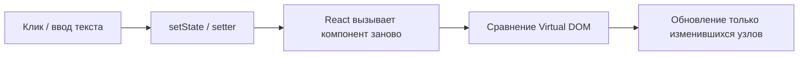

import ExternalCodeEmbed from '@site/src/components/ExternalCodeEmbed';


import ExternalPlayEmbed from '@site/src/components/ExternalPlayEmbed';


# React — компоненты-рецепты

<div class="article-tags">
  <span class="tag tag-notrequired">НЕ ОБЯЗАТЕЛЬНО</span>
  <span class="tag tag-beginner">ДЛЯ НОВИЧКОВ</span>
</div>

Приветствую! Здесь вы наверняка найдете, что ищете. Примеры в лаборатории рассчитаны на то, что мы разбираем что-то конкретное.

Текущая статья посвящена счётчик useState, todo list, форма, modal, fetch, Router. Готовый код для лабораторной, курсовой, react counter example и react todo app.

Поэтому за теорией по текущей теме вам — в [энциклопедию](/encyclopedia/intro).
Если ещё не погружались, то маршрут прост:

1. [Основы](/section/basics)
2. [Система и сеть](/section/system-network)
3. [Данные и разметка](/section/data-markup)
4. [Код и разработка](/section/code-dev)
5. [Языки](/section/languages)
6. [Искусственный интеллект](/section/ai)
7. [Проект](/section/project)
8. [Инфраструктура и безопасность](/section/infra-security)
9. [Спин-офф](/section/spinoff)

Обязательно пройдитесь.

А теперь приступим к нашему предмету.

<div class="callout callout--tip">
  <div class="callout-title">Теория и соседние материалы</div>

  <div class="callout-body">
  Обзор React — [библиотека для пользовательских интерфейсов](/encyclopedia/5-languages/5-01-javascript/27).

  Пошаговый старт — [Первая программа на React](/encyclopedia/5-languages/5-01-javascript/272).

  Справочник API — [Справочник по React](/encyclopedia/5-languages/5-01-javascript/271).

  HTTP-запросы — [Fetch / axios](/lab/Примеры/1145) и [curl / fetch](/lab/Примеры/1133).

  Стили — [HTML + CSS — макеты](/lab/Примеры/110), [Tailwind — готовые блоки](/lab/Примеры/1117), [UI-паттерны Uiverse (Galaxy)](/lab/Примеры/1155), [типовые элементы CSS](/encyclopedia/3-data-markup/3-10-css/113).

  Типы для props — [TypeScript и React](/encyclopedia/5-languages/5-10-typescript/21#типизация-ui-компонентов).

  Десктоп на Python — [Tkinter — окна и виджеты](/lab/Примеры/1124).

  Мобильный UI на Dart — [Flutter](/encyclopedia/5-languages/5-22-dart/311) и [Flutter — готовые виджеты](/lab/Примеры/1154).
</div>
</div>

---
1. Создайте проект **Vite + React** — команды в [каркасе](#karkas).
2. Скопируйте **весь** блок кода примера в `src/App.jsx` (или вынесите в `src/components/`).
3. Запустите `npm run dev`, откройте адрес из консоли (обычно `http://localhost:5173`).
4. Прочитайте **Разбор** и таблицу под кодом — там смысл строк и типичные ошибки.
5. Измените текст, цвета, начальные данные — так быстрее запоминается API.

---

## Навигация по примерам

| Раздел | Тема |
|--------|-----------------|
| [Каркас проекта](#karkas) | `vite react template`, `npm create vite react`, `react hello world` |
| [Кнопка с вариантами](#ui-button) | `react button component props`, `button variant primary outline` |
| [Skeleton-карточка](#ui-skeleton) | `react skeleton loading`, `react loading placeholder card` |
| [Switch темы](#ui-theme-switch) | `react dark mode toggle`, `localstorage theme react` |
| [Tooltip](#ui-tooltip) | `react tooltip component`, `aria-describedby tooltip` |
| [Те же UI на TypeScript](#ui-typescript) | `react typescript button props`, `react-ts vite template` |
| [Счётчик](#counter) | `react usestate counter`, `react onclick button`, `increment counter react` |
| [Приветствие](#greeting) | `react controlled input`, `react onchange input`, `react form name` |
| [Переключатель](#toggle) | `react toggle button`, `react boolean usestate` |
| [Настройки](#settings) | `react checkbox example`, `react radio button`, `controlled checkbox react` |
| [Todo](#todo) | `react todo list`, `react map key`, `todo app react hooks` |
| [Конвертер](#converter) | `react number input`, `react calculator example`, `temperature converter react` |
| [Модальное окно](#modal) | `react modal component`, `react dialog popup`, `conditional render modal` |
| [Вкладки](#tabs) | `react tabs component`, `active tab state react` |
| [Поиск по списку](#search) | `react filter list`, `react search input filter array` |
| [Форма входа](#login) | `react login form`, `react form validation`, `react preventdefault submit` |
| [Загрузка и ошибка](#loading) | `react loading spinner`, `react conditional render loading` |
| [Список с API](#fetch-list) | `react fetch useeffect`, `react get data from api`, `react useeffect empty array` |
| [Подъём state](#lift) | `react lifting state up`, `react props callback parent` |
| [Свой хук](#custom-hook) | `react custom hook`, `uselocalstorage react hook` |
| [Тема Context](#context) | `react context example`, `react dark mode context` |
| [Router](#router) | `react router v6 example`, `react routes link`, `react spa navigation` |
| [Лендинг](#composition) | `react component composition`, `react landing page sections` |

---

## Словарь React за 30 секунд

| Понятие | Зачем | Как в коде |
|---------|-------|------------|
| **Компонент** | Кусок UI — функция, возвращающая JSX | `function App() &#123; return <div>…</div> &#125;` |
| **JSX** | «HTML внутри JavaScript» | `<button onClick={…}>Текст</button>` |
| **Props** | Входные данные от родителя | `function Btn(&#123; label, onClick &#125;)` |
| **State** | Данные, меняющиеся со временем | `const [n, setN] = useState(0)` |
| **Setter** | Записать новое значение state | `setN(n + 1)` или `setN((x) => x + 1)` |
| **Controlled input** | Поле подчинено state | `value=&#123;text&#125;` + `onChange={…}` |
| **key** | ID элемента в списке | `&#123;items.map((x) => <li key=&#123;x.id&#125;>…` |
| **useEffect** | Побочный эффект после рендера | `fetch`, таймер, `document.title` |
| **children** | Содержимое между тегами компонента | `<Modal>…текст…</Modal>` |

**Односторонний поток данных:** state хранит владелец (обычно родитель). Детям передают **props** и **колбэки** (`onSave`, `onClick`). Менять props внутри ребёнка нельзя — только вызвать переданную функцию.

---

## Как работает React — цикл обновления

Браузер **не перезагружает** всю страницу при каждом клике. React пересчитывает, что изменилось, и обновляет DOM точечно.



Пользователь нажал «+» → `setCount` → React снова вызвал `App` с новым `count` → на экране обновилась только цифра в заголовке.

---

<span id="karkas"></span>

### Обязательный каркас

Любой пример ниже опирается на проект **Vite + React**. Запомните команды — как `import tkinter` и `mainloop()` в [Tkinter](/lab/Примеры/1124).

**Задача:** поднять пустой React-проект и убедиться, что dev-сервер работает.

```bash
npm create vite@latest my-react-app -- --template react
cd my-react-app
npm install
npm run dev
```

Для рецептов [Button / Skeleton / Switch / Tooltip на TypeScript](#ui-typescript):

```bash
npm create vite@latest my-react-ts -- --template react-ts
cd my-react-ts
npm install
npm run dev
```

| Команда | Что делает |
|---------|------------|
| `npm create vite@latest` | Скачивает шаблон проекта (быстрее старого create-react-app) |
| `npm install` | Ставит зависимости из `package.json` |
| `npm run dev` | Поднимает сервер; при сохранении файла страница обновляется |

Минимальный `src/App.jsx`:

```jsx

import './App.css';

export default function App() {
  return (
    <div className="app">
      <h1>Моё React-приложение</h1>
      {/* сюда вставляете код из примеров ниже */}
    </div>
  );
}
```

**Разбор:**

| Фрагмент | Смысл |
|----------|--------|
| `export default function App` | Корневой компонент — точка входа UI; Vite подключает его в `main.jsx` |
| `className="app"` | CSS-класс. В JSX пишут `className`, потому что `class` — зарезервированное слово в JavaScript |
| `return ( … )` | JSX — результат функции; React рисует это в DOM |
| `{/* … */}` | Комментарий внутри JSX |

**Типичные ошибки при старте:**

- Забыли `npm install` — команда `npm run dev` падает с «module not found».
- Редактируете не тот файл — рабочий код обычно в `src/App.jsx`, не в `index.html`.
- Порт занят — Vite предложит другой адрес в консоли, откройте его.

**Попробуйте:** добавьте `import &#123; useState &#125; from 'react'` и перейдите к [счётчику](#counter).

---

### Стартовые компоненты

Простые блоки «с нуля» — с них удобно начинать лабораторную или первый commit в GitHub.

<span id="counter"></span>

#### Счётчик

**Задача:** показать, что React хранит число в памяти и обновляет экран по клику — минимум для проверки установки. Классический **react counter example**.


<ExternalCodeEmbed example="javascript/lab-1146-001" title="Счётчик" minHeight={318} />


**Разбор:**

- `import &#123; useState &#125; from 'react'` — хук для локального state в функциональном компоненте.
- `useState(0)` создаёт пару: текущее значение `count` и функцию `setCount` для записи нового.
- `&#123;count&#125;` в JSX — **вставка JavaScript-выражения** в разметку; при изменении `count` React перерисует только этот текст.
- `onClick=&#123;() => setCount(count + 1)&#125;` — в обработчик передают **функцию**. Если написать `onClick=&#123;setCount(count + 1)&#125;`, setter вызовется **сразу при рендере** — типичная ошибка новичка.
- `type="button"` — кнопка внутри `<form>` случайно не отправит форму.

| Строка | Смысл |
|--------|--------|
| `useState(0)` | Начальное значение счётчика — ноль |
| `setCount(0)` | Явный сброс |
| `setCount((c) => c + 1)` | Безопаснее при частых кликах — берёт **предыдущее** значение |

**Попробуйте:** замените `setCount(count + 1)` на `setCount((c) => c + 1)`. Добавьте `useEffect`, меняющий `document.title` — см. [272](/encyclopedia/5-languages/5-01-javascript/272).

---

<span id="greeting"></span>

#### Поле имени и приветствие

**Задача:** прочитать текст из поля и показать результат на экране — типичная форма «введите имя». Основа **controlled input** в React.


<ExternalCodeEmbed example="javascript/lab-1146-002" title="Поле имени и приветствие" minHeight={426} />


**Разбор:**

- `value=&#123;name&#125;` делает input **контролируемым**: на экране только то, что лежит в state React.
- `onChange=&#123;(e) => setName(e.target.value)&#125;` — при каждом символе читаем текст из DOM (`e.target.value`) и кладём в state.
- `&#123;name.trim() && <h2>…&#125;` — **условный рендеринг**: блок `<h2>` рисуется, только если после `trim()` имя не пустое.
- `trim()` убирает пробелы по краям — иначе один пробел уже покажет «Привет».

| Без state | С state (React) |
|-----------|-----------------|
| Браузер сам хранит текст в `<input>` | React хранит текст в `name`, input его отображает |
| Читают через `ref` или DOM | Читают через `name` в коде — удобно для валидации и отправки |

**Попробуйте:** кнопка «Очистить» — `onClick=&#123;() => setName('')&#125;`. Поле «Фамилия» — второй `useState`.

---

<span id="toggle"></span>

#### Переключатель вкл/выкл

**Задача:** boolean state и смена подписи по клику — основа переключателей, «лайков», видимости блоков.


<ExternalCodeEmbed example="javascript/lab-1146-003" title="Переключатель вкл/выкл" minHeight={318} />


**Разбор:**

- `useState(false)` — начальное значение «выключено».
- `setOn((v) => !v)` переключает boolean от **предыдущего** значения — надёжнее, чем `setOn(!on)` при сложной логике.
- Тернарный оператор `on ? '…' : '…'` в JSX выбирает текст кнопки и статуса.

**Попробуйте:** добавьте `className=&#123;on ? 'active' : ''&#125;` на контейнер и стиль в `App.css`.

---

<span id="settings"></span>

#### Флажки и переключатели роли

**Задача:** несколько настроек «вкл/выкл» и выбор одного варианта из списка (роль, режим, тариф).


<ExternalCodeEmbed example="javascript/lab-1146-004" title="Флажки и переключатели роли" minHeight={720} />


**Разбор:**

- `checked=&#123;notify&#125;` + `onChange` с `e.target.checked` — контролируемый **checkbox** (галочка синхронизирована со state).
- У **radio** одно имя `name="role"`, разные `value`; в state хранится выбранная строка `'user'` или `'admin'`.
- `.filter(Boolean)` убирает `false` из массива — остаются только включённые опции для строки статуса.

**Попробуйте:** добавьте третий checkbox «Тёмная тема» и выводите его в `enabled`.

---

## Компоненты-рецепты

Типовые блоки интерфейса для лабораторных, портфолио и pet-проектов. Каждый можно вынести в `src/components/Имя.jsx`.

Стили ниже опираются на [типовые элементы CSS](/encyclopedia/3-data-markup/3-10-css/113) и [каталог Uiverse / Galaxy](/lab/Примеры/1155): сначала вёрстка в CSS, затем обёртка в React с **props** и state.

<span id="ui-button"></span>

#### Кнопка с вариантами (Button)

**Задача:** одна переиспользуемая кнопка с вариантами `primary` / `outline` / `danger` и состоянием загрузки — как в design system, по мотивам [кнопок в 113](/encyclopedia/3-data-markup/3-10-css/113#кнопки).

`src/components/Button.jsx`:


<ExternalCodeEmbed example="javascript/lab-1146-005" title="Кнопка с вариантами (Button)" minHeight={720} />


**Разбор:**

| Строка | Смысл |
|--------|--------|
| `VARIANT_CLASS` | Словарь «вариант → className» — без длинных `if` в JSX |
| `...rest` | Пробрасываем `onClick`, `className`, `aria-*` с проверкой в IDE при TS |
| `aria-busy` | Скринридер понимает, что кнопка в процессе |
| `loading \|\| undefined` | Атрибут снимается, когда загрузки нет |

Полный набор на `.tsx` — [ниже, TypeScript](#ui-typescript).

**Попробуйте:** `size="sm"` — третий ключ в словаре и модификатор `.button--sm`.

---

<span id="ui-skeleton"></span>

#### Skeleton-карточка и загрузка данных

**Задача:** пока `fetch` не завершился, показать [skeleton](/encyclopedia/3-data-markup/3-10-css/113#скелетон-загрузки-skeleton); после ответа — карточку с текстом.

`src/components/CardSkeleton.jsx`:

```jsx
export function CardSkeleton() {
  return (
    <article className="card-skeleton" aria-busy="true" aria-label="Загрузка карточки">
      <div className="card-skeleton__line card-skeleton__line--title" />
      <div className="card-skeleton__line" />
      <div className="card-skeleton__line card-skeleton__line--short" />
    </article>
  );
}
```

`src/components/ProfileCard.jsx`:


<ExternalCodeEmbed example="javascript/lab-1146-006" title="Skeleton-карточка и загрузка данных" minHeight={516} />


`src/App.jsx`:

```jsx

import { ProfileCard } from './components/ProfileCard';

export default function App() {
  return (
    <div className="app">
      <h1>Профиль</h1>
      <ProfileCard />
    </div>
  );
}
```

Стили shimmer — [Типовые элементы интерфейса](/encyclopedia/3-data-markup/3-10-css/113#скелетон-загрузки-skeleton) или [CSS-анимации — готовые эффекты — Skeleton](/lab/Примеры/1116#skeleton-shimmer).

**Разбор:**

- `CardSkeleton` — **презентационный** компонент без state; переиспользуется везде, где ждём API.
- `status === 'loading'` — тот же приём, что в [загрузке и ошибке](#loading); вместо `<p>Загрузка…</p>` — skeleton.
- `aria-busy` на skeleton снимается автоматически, когда компонент размонтирован после `ok`.

**Попробуйте:** замените `setTimeout` на `fetch`; при ошибке покажите `<p className="error">` вместо skeleton.

---

<span id="ui-theme-switch"></span>

#### Switch темы и localStorage

**Задача:** переключатель как в [Galaxy / Uiverse](/lab/Примеры/1155#переключатель-темы-has) — визуально switch, выбор **сохраняется** после перезагрузки ([когда нужен JS](/encyclopedia/5-languages/5-01-javascript/102#когда-достаточно-css-когда-нужен-javascript)).

`src/components/ThemeSwitch.jsx`:


<ExternalCodeEmbed example="javascript/lab-1146-007" title="Switch темы и localStorage" minHeight={720} />


`src/App.css`:

```css
:root { --bg: #f8f9fa; --fg: #212529; }
html.theme-dark { --bg: #1a1a2e; --fg: #eee; }
body { background: var(--bg); color: var(--fg); transition: background 0.3s, color 0.3s; }
/* стили .switch / .switch-track — из encyclopedia 3.10.113 */
```

**Разбор:**

| Часть | Смысл |
|-------|--------|
| `useState(() => …)` | **Ленивый** старт: читаем `localStorage` один раз при монтировании |
| `useEffect` + `document.documentElement` | Тема на корне документа — все страницы наследуют CSS-переменные |
| `role="switch"` + `checked` | Контролируемый input — React — источник правды |
| `aria-labelledby` | Подпись switch для доступности |

Глобальная тема для всего дерева без prop drilling — [Context](#context); здесь — минимальный вариант для одной страницы.

**Попробуйте:** синхронизировать с `prefers-color-scheme` при первом визите.

---

<span id="ui-tooltip"></span>

#### Tooltip (подсказка)

**Задача:** обёртка с подсказкой по hover и **фокусу с клавиатуры** — CSS-only из [UI-паттерны из Uiverse (Galaxy)](/lab/Примеры/1155#подсказки-tooltip) недостаточен для touch; в React управляем видимостью явно.

`src/components/Tooltip.jsx`:


<ExternalCodeEmbed example="javascript/lab-1146-008" title="Tooltip (подсказка)" minHeight={720} />


**Разбор:**

- `useId()` — уникальный `id` для `aria-describedby` без коллизий при нескольких tooltip на странице.
- `onFocus` / `onBlur` на обёртке — подсказка доступна с Tab, не только с мыши.
- `children` — любой элемент (кнопка, иконка, ссылка); паттерн **composition**.

**Попробуйте:** закрывать tooltip по `Escape` — `onKeyDown` на обёртке.

---

<span id="ui-typescript"></span>

#### Те же UI-компоненты на TypeScript (`.tsx`)

**Задача:** перенести [Button](#ui-button), [Skeleton](#ui-skeleton), [ThemeSwitch](#ui-theme-switch) и [Tooltip](#ui-tooltip) в проект **Vite + React + TypeScript** — типы ловят опечатки в `variant` и полях профиля до запуска. Теория — [TypeScript и React](/encyclopedia/5-languages/5-10-typescript/21), [типизация UI](/encyclopedia/5-languages/5-10-typescript/21#типизация-ui-компонентов).

**Каркас:**

```bash
npm create vite@latest my-ui-ts -- --template react-ts
cd my-ui-ts
npm install
npm run dev
```

Структура файлов (стили `App.css` — те же, что в JSX-рецептах выше):

```text
src/
├── components/
│   ├── Button.tsx
│   ├── CardSkeleton.tsx
│   ├── ProfileCard.tsx
│   ├── ThemeSwitch.tsx
│   └── Tooltip.tsx
├── types/
│   └── ui.ts
├── App.tsx
└── main.tsx
```

`src/types/ui.ts` — общие типы UI:

```tsx
export type ButtonVariant = 'primary' | 'outline' | 'danger';

export type Profile = {
  name: string;
  role: string;
};

export type ProfileLoadState =
  | { status: 'loading' }
  | { status: 'ok'; profile: Profile }
  | { status: 'error'; message: string };
```

`src/components/Button.tsx`:


<ExternalCodeEmbed example="text/lab-1146-009" title="Те же UI-компоненты на TypeScript (`.tsx`)" minHeight={720} />


**Разбор TypeScript:**

| Конструкция | Зачем |
|-------------|--------|
| `ButtonVariant` union | `variant="primry"` — **ошибка компиляции**, не опечатка в runtime |
| `Record<ButtonVariant, string>` | В словаре CSS обязаны быть **все** варианты |
| `ProfileLoadState` discriminated union | В ветке `status === 'ok'` TypeScript знает поле `profile` |
| `ChangeEvent<HTMLInputElement>` | Тип события checkbox/switch |
| `TooltipProps` + `ReactElement` | В tooltip — один дочерний элемент (кнопка), не произвольный текст |
| `import type { … }` | Типы не попадают в JS-бандл |

**Проверка типов без запуска браузера:**

```bash
npx tsc --noEmit
```

В шаблоне `react-ts` сборка обычно уже включает проверку: `npm run build`.

**Типичные ошибки:**

| Ошибка IDE / `tsc` | Причина | Исправление |
|--------------------|---------|-------------|
| `Property 'profile' does not exist` | Обращение к `profile` без проверки `status` | Сузить union: `if (state.status !== 'ok') return …` |
| `Type 'string' is not assignable to ButtonVariant` | Динамическая строка в `variant` | Приведите тип или проверьте значение guard-ом |
| Tooltip: `children` must be ReactElement | Передали текст напрямую | Оборачивайте в `<Button>…</Button>` |

**Попробуйте:** вынесите `ButtonProps` в отдельный файл и экспортируйте из `components/Button.tsx` для Storybook. Добавьте `size?: 'sm' | 'md'` в `ButtonProps` и класс `.button--sm`.

---

<span id="todo"></span>

#### Todo-список с фильтром

**Задача:** добавление задач, отметка «готово», фильтр «все / активные / выполненные» — **react todo list**, классика для GitHub-портфолио.


<ExternalCodeEmbed example="javascript/lab-1146-010" title="Todo-список с фильтром" minHeight={720} />


**Разбор:**

| Строка / конструкция | Смысл |
|----------------------|--------|
| `e.preventDefault()` | Форма **не перезагружает** страницу при Enter или клике «Добавить» |
| `setItems((prev) => [..prev, newItem])` | **Новый массив** — React видит изменение. `prev.push(x)` сломает обновление |
| `&#123; ..item, done: !item.done &#125;` | Копия объекта с одним изменённым полем — без мутации |
| `key=&#123;item.id&#125;` | Стабильный ключ для `.map()`. React сопоставляет строки между рендерами |
| `Date.now()` как `id` | Подходит для учебного проекта; в проде — id с сервера |

- `filter` в state и `.filter()` на массиве — **два разных «filter»**: первый — режим UI, второй — метод массива.
- `className=&#123;item.done ? 'done' : ''&#125;` — зачёркивание через CSS (`.done &#123; text-decoration: line-through; &#125;`).

**Попробуйте:** кнопка «Удалить выполненные» — `setItems(items.filter((x) => !x.done))`. Счётчик «Осталось: N» — `items.filter((x) => !x.done).length`.

---

<span id="converter"></span>

#### Конвертер °C → °F

**Задача:** ввод числа, формула, вывод результата — частое задание на информатике (аналог [конвертера в Tkinter](/lab/Примеры/1124)).


<ExternalCodeEmbed example="javascript/lab-1146-011" title="Конвертер °C → °F" minHeight={720} />


**Разбор:**

- `replace(',', '.')` — пользователь может ввести `25,5` с русской раскладкой.
- `Number.isNaN(celsius)` — проверка после преобразования; пустая строка даст `NaN`.
- Формула: $F = C \times \frac&#123;9&#125;&#123;5&#125; + 32$.
- `onKeyDown` + `Enter` — перевод по Enter без отдельной кнопки (удобно на формах).

**Попробуйте:** кнопка «Очистить» — `setRaw('')`, `setResult('—')`, `setError('')`.

---

<span id="modal"></span>

#### Модальное окно

**Задача:** показать диалог поверх страницы без библиотек — **react modal component** с нуля.


<ExternalCodeEmbed example="javascript/lab-1146-012" title="Модальное окно" minHeight={720} />


**Попробуйте:** второе модальное окно «Ошибка» с другим `title` и тем же компонентом `Modal`.

---

<span id="tabs"></span>

#### Вкладки

**Задача:** переключение блоков контента без перезагрузки — аналог вкладок в браузере или настройках приложения.


<ExternalCodeEmbed example="javascript/lab-1146-013" title="Вкладки" minHeight={642} />


**Разбор:**

- Массив `TABS` хранит id, подпись кнопки и текст вкладки — удобно расширять без копипасты JSX.
- `active` — id текущей вкладки; один state управляет и кнопками, и содержимым.
- `TABS.find((t) => t.id === active)` — объект текущей вкладки для вывода `body`.
- `current?.body` — optional chaining: если id не найден, ошибки нет.
- `aria-selected` — подсказка assistive tech, какая вкладка активна.

**Попробуйте:** добавьте четвёртую вкладку с JSX вместо строки — например, `<ul><li>Пункт</li></ul>` в поле `body` (тогда `body` станет React-узлом, не строкой).

---

<span id="search"></span>

#### Поиск по списку

**Задача:** фильтрация массива по подстроке в реальном времени — основа поиска в таблицах, каталогах, автодополнении.


<ExternalCodeEmbed example="javascript/lab-1146-014" title="Поиск по списку" minHeight={606} />


**Разбор:**

- `toLowerCase()` на обеих сторонах — поиск без учёта регистра (`моск` найдёт «Москва»).
- `.includes(q)` — подстрока где угодно в названии.
- Пустой `query` — показываем весь список `CITIES`.
- `key=&#123;city&#125;` допустим, потому что названия **уникальны**; при дубликатах нужен отдельный `id`.

**Попробуйте:** подсветка совпадения через `<mark>`. Для длинных списков — `useMemo` (см. [справочник](/encyclopedia/5-languages/5-01-javascript/271)).

---

<span id="login"></span>

#### Форма входа с проверкой

**Задача:** email, пароль, сообщения об ошибках — типичный экран **react login form** для учебного проекта.


<ExternalCodeEmbed example="javascript/lab-1146-015" title="Форма входа с проверкой" minHeight={720} />


**Разбор:**

| Часть | Смысл |
|-------|--------|
| `onSubmit=&#123;onSubmit&#125;` | Отправка формы перехватывается JavaScript |
| `e.preventDefault()` | Страница **не перезагружается** (иначе state пропадёт) |
| `noValidate` | Отключаем встроенную HTML-валидацию — показываем свои сообщения |
| Объект `errors` | Ключ = поле, значение = текст ошибки; пустой объект = всё OK |
| `type="password"` | Символы скрыты; в учебном примере пароль только в state, без отправки на сервер |

**Попробуйте:** блокировать кнопку «Войти», пока поля пустые — `disabled=&#123;!email || !password&#125;`.

---

<span id="loading"></span>

#### Загрузка, ошибка, пустой список

**Задача:** три состояния UI при асинхронной работе — **loading**, **error**, **data**. Шаблон для любого `fetch`.


<ExternalCodeEmbed example="javascript/lab-1146-016" title="Загрузка, ошибка, пустой список" minHeight={606} />


**Разбор:**

- Ранний `return` для каждого состояния — читаемый **условный рендеринг** без вложенных тернарников.
- `useEffect(.., [])` — эффект **один раз** после первого появления компонента на экране.
- `return () => clearTimeout(timer)` — **cleanup**: если компонент исчезнет до срабатывания таймера, таймер отменится (нет утечки).
- В реальном проекте вместо `setTimeout` — `fetch`; логика состояний та же.

**Попробуйте:** замените таймер на `fetch('https://jsonplaceholder.typicode.com/users')` и `.then((r) => r.json())`.

---

<span id="fetch-list"></span>

#### Список заметок с API

**Задача:** загрузить JSON с сервера и отрисовать список — связка **`useEffect` + `fetch`**, как в [272](/encyclopedia/5-languages/5-01-javascript/272).


<ExternalCodeEmbed example="javascript/lab-1146-017" title="Список заметок с API" minHeight={606} />


**Разбор:**

| Строка | Смысл |
|--------|--------|
| `useState([])` | Пока данных нет — пустой массив |
| `useEffect(.., [])` | Запрос **один раз** при монтировании; без `[]` — бесконечные запросы |
| `if (!res.ok)` | HTTP 404/500 — ошибка до парсинга JSON |
| `.then(setNotes)` | `setNotes` получит готовый массив из `.json()` |
| `.finally(() => setLoading(false))` | Спиннер скрывается и при успехе, и при ошибке |
| `key=&#123;n.id&#125;` | Стабильный ключ из данных API |

Подключите в `App.jsx`: `<NotesList />` под другими блоками.

CORS и прокси Vite — [Fullstack на JavaScript — API и фронтенд](/encyclopedia/5-languages/5-01-javascript/264). Node API — [Первая программа на Node.js](/encyclopedia/5-languages/5-01-javascript/262). Готовые шаблоны `fetch` — [Fetch / axios — типовые запросы](/lab/Примеры/1145).

**Попробуйте:** POST-заметку через `fetch` с `method: 'POST'` и `JSON.stringify(&#123; text &#125;)`.

---

<span id="lift"></span>

#### Подъём state — переиспользуемый Counter

**Задача:** вынести кнопки в отдельный компонент, а число хранить в родителе — паттерн **lifting state up**.

`src/components/Counter.jsx`:

```jsx
export function Counter({ value, onIncrement, onDecrement, onReset }) {
  return (
    <section className="counter">
      <h2>Счётчик: {value}</h2>
      <button type="button" onClick={onDecrement}>−</button>
      <button type="button" onClick={onReset}>Сброс</button>
      <button type="button" onClick={onIncrement}>+</button>
    </section>
  );
}
```

`src/App.jsx`:


<ExternalCodeEmbed example="javascript/lab-1146-018" title="Подъём state — переиспользуемый Counter" minHeight={336} />


**Разбор:**

- `Counter` **не** вызывает `useState` — только отображает props и вызывает колбэки.
- Родитель **владеет** `count` — один источник правды для всего дерева.
- `value=&#123;count&#125;` — данные **вниз** (props).
- `onIncrement={() => …}` — события **вверх** (колбэки).
- Так один state можно разделить между несколькими детьми (например, счётчик и график).

**Попробуйте:** второй `Counter` с тем же `count` — оба синхронизированы автоматически.

---

<span id="custom-hook"></span>

#### Свой хук `useLocalStorage`

**Задача:** сохранить значение между перезагрузками вкладки (F5) — типичный **custom hook**.

`src/hooks/useLocalStorage.js`:


<ExternalCodeEmbed example="javascript/lab-1146-019" title="Свой хук `useLocalStorage`" minHeight={390} />


Использование в `App.jsx`:

```jsx

import { useLocalStorage } from './hooks/useLocalStorage';

export default function App() {
  const [name, setName] = useLocalStorage('username', '');

  return (
    <input
      value={name}
      onChange={(e) => setName(e.target.value)}
      placeholder="Имя сохранится после F5"
    />
  );
}
```

**Разбор:**

- Имя хука **обязательно** начинается с `use` — правило React для хуков.
- `useState(() => …)` — **ленивая инициализация**: чтение `localStorage` один раз при первом рендере.
- `useEffect` записывает в storage при каждом изменении `value`.
- `JSON.stringify` / `parse` — работает со строками и числами; для сложных объектов следите за форматом.
- `try/catch` — если в storage мусор, вернётся `initial`.

**Попробуйте:** сохранить тему `'light' | 'dark'` тем же хуком.

---

<span id="context"></span>

#### Тёмная тема через Context

**Задача:** передать настройку темы глубоко в дерево **без** «проброса» props через каждый уровень.

`src/theme/ThemeContext.jsx`:


<ExternalCodeEmbed example="javascript/lab-1146-020" title="Тёмная тема через Context" minHeight={720} />


**Разбор:**

- `createContext` — «канал» для данных.
- `Provider value={…}` — все потомки могут прочитать value через `useContext`.
- `useMemo` для объекта `value` — меньше лишних перерисовок дочерних компонентов.
- шаблон `className` с префиксом `theme-` — переключение CSS-класса на корне (класс `.theme-dark` задаёт фон и цвет текста).

**Попробуйте:** обернуть только часть страницы — увидите, что `useTheme` снаружи `Provider` выбросит ошибку.

---

<span id="router"></span>

#### React Router — минимальная навигация

**Задача:** несколько «страниц» в одностраничном приложении (SPA) без полной перезагрузки документа.

```bash
npm install react-router-dom
```


<ExternalCodeEmbed example="javascript/lab-1146-021" title="React Router — минимальная навигация" minHeight={606} />


**Разбор:**

| Элемент | Назначение |
|---------|------------|
| `BrowserRouter` | Связывает URL в адресной строке с деревом React |
| `Link to="/about"` | Переход **без** перезагрузки HTML-документа |
| `NavLink` | Как `Link`, плюс класс `active` для текущего маршрута |
| `Routes` / `Route` | Какой компонент показать при каком `path` |
| `path="*"` | Fallback — страница 404 для неизвестных адресов |

Подробнее — [272 — Router](/encyclopedia/5-languages/5-01-javascript/272#react-router-v6--минимум). Для SEO и серверного HTML — [Next.js](/encyclopedia/5-languages/5-01-javascript/2731).

**Попробуйте:** маршрут `/users/:id` и `useParams()` в компоненте профиля.

---

<span id="composition"></span>

#### Лендинг из секций

**Задача:** показать архитектуру страницы — каждый блок в своём файле, `App` только собирает порядок.


<ExternalCodeEmbed example="javascript/lab-1146-022" title="Лендинг из секций" minHeight={408} />


**Разбор:**

- Фрагмент `<>…</>` группирует несколько корневых узлов **без** лишнего `<div>`.
- `App` — **компоновщик**: задаёт layout и порядок секций.
- Каждая секция — отдельный файл → параллельная работа в команде, удобнее сопровождать код.
- HTML-разметку секций можно взять из [HTML + CSS — макеты](/lab/Примеры/110) или [Tailwind — готовые блоки](/lab/Примеры/1117) и перенести в JSX (заменить `class` на `className`, закрыть все теги).

**Попробуйте:** вынесите `Hero` в отдельный файл с props `title` и `subtitle`.

---

## Переиспользуемые базы

### Шаблон компонента с props по умолчанию

```jsx
export function Card({ title = 'Без названия', children }) {
  return (
    <article className="card">
      <h3>{title}</h3>
      <div>{children}</div>
    </article>
  );
}
```

**Разбор:** `title = '…'` в деструктуризации — значение по умолчанию, если prop не передали. `children` — всё между `<Card>…</Card>`.

---

### Сброс формы

```jsx
function resetForm(setEmail, setPassword, setErrors) {
  setEmail('');
  setPassword('');
  setErrors({});
}
```

Вызывайте после успешной отправки или по кнопке «Очистить».

---

## Частые ошибки

| Симптом | Причина | Что сделать |
|---------|---------|-------------|
| `Too many re-renders` | `setCount(1)` или `setCount(count+1)` в **теле** компонента | Setter только в обработчике или `useEffect` |
| Кнопка срабатывает при загрузке | `onClick=&#123;handle()&#125;` со скобками | `onClick=&#123;handle&#125;` или `onClick=&#123;() => handle()&#125;` |
| Input «не печатает» | Есть `value`, нет `onChange` | Добавить controlled-пару |
| Список «ломается» при удалении | `key=&#123;index&#125;` | Стабильный `id` из данных |
| Бесконечный `useEffect` | Объект/массив в deps создаётся заново каждый рендер | Уточнить deps или `useMemo` |
| `fetch` failed / CORS | API выключен или нет заголовков CORS | [Fullstack на JavaScript — API и фронтенд](/encyclopedia/5-languages/5-01-javascript/264), прокси в Vite |
| State «не обновился» | Мутация: `arr.push(x)`, `obj.field = 1` | Новая ссылка: `[..arr, x]`, `&#123; ..obj, field: 1 &#125;` |
| Белый экран после правки | Синтаксическая ошибка JSX | Смотрите красный текст в терминале `npm run dev` |

Полный список — [справочник React](/encyclopedia/5-languages/5-01-javascript/271#типичные-ошибки).

---

## Что попробовать дальше

| Уровень | Задание | Материал |
|---------|---------|----------|
| Начальный | Todo с удалением и фильтром «активные» | блок [Todo](#todo) |
| Начальный | Заметки с POST и DELETE | [272 — задание «Заметки»](/encyclopedia/5-languages/5-01-javascript/272) |
| Начальный | Калькулятор на несколько кнопок | [счётчик](#counter) + несколько `useState` |
| Средний | Погода или поиск фильмов по API | `useEffect` + [Fetch / axios — типовые запросы](/lab/Примеры/1145) |
| Средний | Десктоп на Electron | [Первая программа Electron с React](/encyclopedia/4-code-dev/4-11-desktopnye-prilozheniya/118) |
| Средний | TypeScript + типы props | [TypeScript — TypeScript и React](/encyclopedia/5-languages/5-01-javascript/30), [TypeScript и React — типизация UI](/encyclopedia/5-languages/5-10-typescript/21#типизация-ui-компонентов) |
| Средний | UI из Galaxy → React | [UI-паттерны из Uiverse (Galaxy)](/lab/Примеры/1155), рецепты [Button](#ui-button), [Skeleton](#ui-skeleton) |
| Экзамен | 200 вопросов для самопроверки | [200 вопросов по React](/lab/Вопросы/133) |

---

## Связанные материалы

- [React — обзор](/encyclopedia/5-languages/5-01-javascript/27) — карта тем и Virtual DOM
- [Первая программа на React](/encyclopedia/5-languages/5-01-javascript/272) — Vite, хуки, Router, задание «Заметки»
- [Справочник по React](/encyclopedia/5-languages/5-01-javascript/271) — API, HOC, тесты
- [Fetch / axios — типовые запросы](/lab/Примеры/1145) — шаблоны HTTP рядом с React
- [Vue и Svelte — готовые компоненты](/lab/Примеры/1147) — те же задачи на Vue/Svelte
- [200 вопросов по React](/lab/Вопросы/133) — самопроверка перед зачётом
- [Tkinter — окна и виджеты](/lab/Примеры/1124) — те же задачи на Python
- [Java Swing — окна и кнопки](/lab/Примеры/1143) — те же задачи на Java
- [HTML + CSS — готовые макеты](/lab/Примеры/110) — вёрстка секций для лендинга
- [Tailwind — готовые блоки](/lab/Примеры/1117) — hero, pricing, navbar на utility-классах
- [UI-паттерны из Uiverse (Galaxy)](/lab/Примеры/1155) — CSS-сниппеты и техники
- [Типовые элементы интерфейса](/encyclopedia/3-data-markup/3-10-css/113) — кнопки, skeleton, switch, tooltip
- [TypeScript и React — типизация UI](/encyclopedia/5-languages/5-10-typescript/21#типизация-ui-компонентов)
