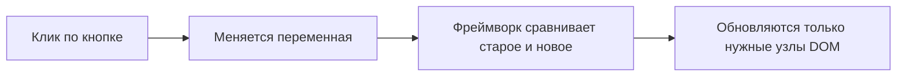

import ExternalCodeEmbed from '@site/src/components/ExternalCodeEmbed';


# Vue и Svelte — готовые компоненты

<div class="article-tags">
  <span class="tag tag-notrequired">НЕ ОБЯЗАТЕЛЬНО</span>
  <span class="tag tag-beginner">ДЛЯ НОВИЧКОВ</span>
</div>

Приветствую! Здесь вы наверняка найдете, что ищете. Примеры в лаборатории рассчитаны на то, что мы разбираем что-то конкретное.

Текущая статья посвящена примерам: Vue 3 и Svelte 5 с построчным разбором.

Поэтому за теорией по текущей теме вам — в [энциклопедию](/encyclopedia/intro).
Если ещё не погружались, то маршрут прост:

1. [Основы](/section/basics)
2. [Система и сеть](/section/system-network)
3. [Данные и разметка](/section/data-markup)
4. [Код и разработка](/section/code-dev)
5. [Языки](/section/languages)
6. [Искусственный интеллект](/section/ai)
7. [Проект](/section/project)
8. [Инфраструктура и безопасность](/section/infra-security)
9. [Спин-офф](/section/spinoff)

Обязательно пройдитесь.

А теперь приступим к нашему предмету.

<div class="callout callout--tip">
  <div class="callout-title">Теория и соседние материалы</div>

  <div class="callout-body">
  Пошаговый tutorial Vue — [первая программа на Vue.js](/encyclopedia/5-languages/5-01-javascript/282).

  Обзор фреймворка — [Vue.js](/encyclopedia/5-languages/5-01-javascript/28).

  React для сравнения — [первая программа на React](/encyclopedia/5-languages/5-01-javascript/272) и [готовые React-компоненты](/lab/Примеры/1146).

  Мобильный UI на Dart — [Flutter](/encyclopedia/5-languages/5-22-dart/311) и [готовые виджеты](/lab/Примеры/1154).

  Запросы к серверу — [fetch / axios](/lab/Примеры/1145) и [Fullstack](/encyclopedia/5-languages/5-01-javascript/264).

  Каркас страницы — [HTML + CSS](/lab/Примеры/110).

  После сборки — [Nginx под SPA](/lab/Примеры/11112).
</div>
</div>

---
## Основы Vue и Svelte в браузере

---

### Навигация по примерам

| Ищут в интернете | Раздел ниже |
|------------------|-------------|
| vue 3 counter example ref | [Счётчик и имя — Vue](#vue-counter) |
| svelte 5 counter button onclick | [Счётчик и имя — Svelte](#svelte-counter) |
| vue todo list v-for example | [Список задач — Vue](#vue-todo) |
| svelte each block todo | [Список задач — Svelte](#svelte-todo) |
| vue fetch onmounted api | [Загрузка с API — Vue](#vue-fetch) |
| svelte onmount fetch json | [Загрузка с API — Svelte](#svelte-fetch) |
| vue defineprops defineemits child | [Дочерний компонент — Vue](#vue-child) |
| svelte component props callback | [Дочерний компонент — Svelte](#svelte-child) |
| npm create vue latest vite | [Создание проекта](#create-project) |
| vue mustache not working raw &#123;&#123; &#125;&#125; | [Частые ошибки](#errors) |

---

### Базовые термины

| Термин | Простыми словами |
|--------|------------------|
| **SPA** | Одна HTML-страница; при кликах контент меняет JavaScript, без полной перезагрузки |
| **Компонент** | Файл с разметкой + логикой + стилями (как отдельный «виджет») |
| **Реактивность** | Изменили переменную в коде — экран обновился сам |
| **`ref` (Vue)** | Реактивная «коробка»; в script меняют через **`.value`** |
| **`$state` (Svelte 5)** | Реактивная переменная; присвоение `count = 5` обновляет UI |
| **`v-model` (Vue)** | Связь поля ввода и переменной в обе стороны |
| **`bind:value` (Svelte)** | То же, что `v-model` для input |
| **Vite** | Dev-сервер и сборка; при сохранении файла страница обновляется (**HMR**) |
| **`mount('#app')`** | «Включить» Vue/Svelte в `<div id="app">` на странице |

---

### Зачем фреймворк, если есть DOM

На чистом DOM вы пишете так:

```javascript
const btn = document.getElementById('plus');
const span = document.getElementById('count');
let n = 0;
btn.addEventListener('click', () => {
  n += 1;
  span.textContent = String(n);
});
```

**Смысл:** число `n` живёт в JavaScript, а `textContent` — ваша обязанность **вручную** синхронизировать экран. В списке из 20 полей таких строк становится десятки. Подробнее приёмы без фреймворка — [30 приёмов DOM](/lab/Примеры/1144).

Во **Vue** и **Svelte** вы описываете **что показать**, а фреймворк обновляет DOM при смене данных.



---

### Как запустить пример за 2 минуты

1. Установите [Node.js LTS](https://nodejs.org/) — в терминале `node -v` и `npm -v` показывают версии.
2. Выполните команды из [Создание проекта](#create-project).
3. Откройте `src/App.vue` (Vue) или `src/routes/+page.svelte` (SvelteKit).
4. **Удалите** шаблонный код, вставьте пример **целиком** (включая `<style>`, если он в блоке).
5. `npm run dev` — откройте ссылку из терминала (часто `http://localhost:5173`).
6. Сохранили файл — страница обновилась (**HMR**).

| Где | Плюсы |
|-----|-------|
| Локально + Vite | Как на работе: HMR, сборка `dist/` |
| [StackBlitz](https://stackblitz.com/) | Без установки Node |
| [Vue SFC Playground](https://play.vuejs.org/) | Только `.vue` в браузере |

---

<span id="create-project"></span>

## Создание проекта

### Vue 3 + Vite

**Задача:** получить пустой проект с горячей перезагрузкой.

```bash
node -v
npm -v
npm create vue@latest my-vue-lab
cd my-vue-lab
npm install
npm run dev
```

**Разбор команд:**

| Команда | Смысл |
|---------|--------|
| `node -v` | Проверка, что Node установлен |
| `npm create vue@latest my-vue-lab` | Официальный генератор Vue 3 + Vite |
| `cd my-vue-lab` | Все следующие команды — из папки проекта |
| `npm install` | Скачать зависимости в `node_modules/` |
| `npm run dev` | Dev-сервер; URL в терминале |

| Вопрос мастера | На лабораторную |
|----------------|-----------------|
| TypeScript | можно No |
| Vue Router | Yes, если нужны две «страницы» |
| Pinia | No на старте |

### Svelte 5 + SvelteKit

```bash
npm create svelte@latest my-svelte-lab
cd my-svelte-lab
npm install
npm run dev
```

**Разбор:** генератор создаёт SvelteKit; главный UI обычно в `src/routes/+page.svelte`.

Production: `npm run build` → папка **`dist/`** или **`.svelte-kit/output`** (зависит от шаблона). Статика на хостинг — [Nginx SPA](/lab/Примеры/11112).

---

<span id="vue-karkas"></span>

## Обязательный каркас Vue

**Задача:** понять три блока `.vue` и точку входа `main.js`.

### `src/main.js`

```javascript

import { createApp } from 'vue'
import App from './App.vue'

createApp(App).mount('#app')
```

**Разбор построчно:**

| Строка | Смысл |
|--------|--------|
| `import &#123; createApp &#125; from 'vue'` | Фабрика приложения Vue |
| `import App from './App.vue'` | Корневой компонент — ваш экран |
| `createApp(App)` | Связать приложение с компонентом |
| `.mount('#app')` | Отрисовать внутри `<div id="app">` из `index.html` |

### Минимальный `src/App.vue`


<ExternalCodeEmbed example="vue/lab-1147-001" title="Минимальный `src/App.vue`" minHeight={444} />


**Разбор — script:**

| Строка | Смысл |
|--------|--------|
| `<script setup>` | Composition API: переменные видны в template |
| `ref('…')` | Реактивная строка; в script — `message.value` |
| `import &#123; ref &#125; from 'vue'` | Импорт из пакета `vue` |

**Разбор — template:**

| Строка | Смысл |
|--------|--------|
| `&#123;&#123; message &#125;&#125;` | Подстановка текста; **без** `.value` в шаблоне |
| `<style scoped>` | CSS только для этого компонента |

**Что увидите:** заголовок «Привет, Vue!» по центру.

**Попробуйте:** в script после объявления: `message.value = 'Лабораторная №3'`.

---

<span id="svelte-karkas"></span>

## Обязательный каркас Svelte


<ExternalCodeEmbed example="svelte/lab-1147-002" title="Обязательный каркас Svelte" minHeight={336} />


**Разбор построчно:**

| Строка | Смысл |
|--------|--------|
| `$state('…')` | Реактивность Svelte 5 (runes) |
| `&#123;message&#125;` | Интерполяция — одни фигурные скобки, не двойные как во Vue |
| `<style>` | Стили локальны для файла по умолчанию |

---

## Стартовые интерфейсы

Три задачи, которые чаще всего ищут: **счётчик**, **список задач**, **загрузка JSON**.

---

<span id="vue-counter"></span>

### Счётчик и поле имени — Vue

**Задача:** `vue 3 counter ref example`, `vue v-model input greeting`

**Задача:** кнопки ±1, сброс, приветствие по имени.

Вставьте в **`src/App.vue`**:


<ExternalCodeEmbed example="vue/lab-1147-003" title="Счётчик и поле имени — Vue" minHeight={720} />


**Разбор — script:**

| Строка | Смысл |
|--------|--------|
| `ref(0)` | Реактивное число, старт 0 |
| `count.value++` | В script у `ref` **обязателен** `.value` — главная ошибка новичков |
| `() => { … }` | Функция передаётся в `@click`, не вызывается сразу |

**Разбор — template:**

| Синтаксис | Смысл |
|-----------|--------|
| `v-model="name"` | Двусторонняя связь с input |
| `v-if="name"` | Показать `<h2>`, только если строка не пустая |
| `@click="increment"` | Сокращение `v-on:click` |
| `type="button"` | Кнопка не отправляет форму |

**Что увидите:** поле имени, приветствие при вводе, три кнопки счётчика.

**Попробуйте:** кнопка ×2 — `const double = () => &#123; count.value *= 2 &#125;` и `@click="double"`.

---

<span id="svelte-counter"></span>

### Счётчик и поле имени — Svelte


<ExternalCodeEmbed example="svelte/lab-1147-004" title="Счётчик и поле имени — Svelte" minHeight={720} />


**Сравнение с Vue:**

| Идея | Vue | Svelte |
|------|-----|--------|
| Состояние | `ref(0)` + `.value` | `$state(0)` + `count += 1` |
| Input | `v-model="name"` | `bind:value=&#123;name&#125;` |
| Условие | `v-if="name"` | `&#123;#if name&#125; … &#123;/if&#125;` |
| Клик | `@click="fn"` | `onclick=&#123;fn&#125;` |

---

<span id="vue-todo"></span>

### Список задач — Vue

**Задача:** `vue todo list v-for v-model`


<ExternalCodeEmbed example="vue/lab-1147-005" title="Список задач — Vue" minHeight={720} />


**Разбор построчно:**

| Строка | Смысл |
|--------|--------|
| `tasks = ref([..])` | Массив объектов в реактивной обёртке |
| `trim()` + `if (!text) return` | Пустые задачи не добавляем |
| `@submit.prevent` | Enter в поле добавляет задачу **без** перезагрузки страницы |
| `v-for` + `:key="task.id"` | Список; ключ нужен для корректного обновления DOM |
| `v-model="task.done"` | Чекбокс меняет поле объекта в массиве |
| `:class="&#123; done: task.done &#125;"` | Зачёркивание через CSS-класс |
| `filter` в `removeTask` | Новый массив без удалённой строки |

---

<span id="svelte-todo"></span>

### Список задач — Svelte


<ExternalCodeEmbed example="svelte/lab-1147-006" title="Список задач — Svelte" minHeight={720} />


**Разбор:**

| Строка | Смысл |
|--------|--------|
| `tasks = [..tasks, item]` | Новая ссылка на массив — явное обновление |
| `&#123;#each tasks as task (task.id)&#125;` | Цикл; `(task.id)` — ключ, как `:key` во Vue |
| `class:done=&#123;task.done&#125;` | Условный класс в Svelte |

---

<span id="vue-fetch"></span>

### Загрузка с API — Vue

**Задача:** `vue 3 fetch onmounted example`

**Задача:** при открытии страницы запросить JSON и показать список или ошибку.

Для теста без своего сервера — публичный API. Для курсовой с Node — [API «Заметки»](/encyclopedia/5-languages/5-01-javascript/262) и [Fullstack 264](/encyclopedia/5-languages/5-01-javascript/264).


<ExternalCodeEmbed example="vue/lab-1147-007" title="Загрузка с API — Vue" minHeight={642} />


**Разбор построчно:**

| Строка | Смысл |
|--------|--------|
| `onMounted` | Код после появления компонента в DOM |
| `await fetch` | GET по умолчанию |
| `!res.ok` | 404/500 — fetch **не** бросает ошибку сам |
| `notes.value = await res.json()` | Массив в реактивное состояние |
| `finally` | Снять «Загрузка…» всегда |
| `v-if` / `v-else-if` / `v-else` | Три экрана: ждём, ошибка, данные |

Шаблоны `fetch` — [Fetch / axios — типовые запросы](/lab/Примеры/1145).

---

<span id="svelte-fetch"></span>

### Загрузка с API — Svelte


<ExternalCodeEmbed example="svelte/lab-1147-008" title="Загрузка с API — Svelte" minHeight={678} />


**Разбор:** `onMount` из `svelte` — аналог `onMounted`. `&#123;:else if&#125;` — цепочка условий.

---

<span id="vue-child"></span>

### Дочерний компонент — Vue

**Задача:** `vue defineprops defineemits example`

**Задача:** вынести счётчик в файл; родитель хранит число, ребёнок шлёт события.

**`src/components/Counter.vue`:**


<ExternalCodeEmbed example="vue/lab-1147-009" title="Дочерний компонент — Vue" minHeight={660} />


**Разбор:**

| Место | Смысл |
|-------|--------|
| `defineProps` | Данные **вниз** от родителя |
| `defineEmits` | События **вверх** |
| `:value="count"` | Привязка prop (`v-bind:value`) |
| `@increment="count++"` | Родитель — единственный источник истины |

Тот же паттерн в React — [React — компоненты-рецепты](/lab/Примеры/1146).

---

<span id="svelte-child"></span>

### Дочерний компонент — Svelte

**`src/lib/Counter.svelte`:**

```svelte
<script>
  let { value = 0, onincrement, ondecrement, onreset } = $props()
</script>

<section class="counter">
  <h2>Счётчик: {value}</h2>
  <button type="button" onclick={ondecrement}>−</button>
  <button type="button" onclick={onreset}>Сброс</button>
  <button type="button" onclick={onincrement}>+</button>
</section>
```

**Родитель:**

```svelte
<script>
  import Counter from './lib/Counter.svelte'
  let count = $state(0)
</script>

<Counter
  value={count}
  onincrement={() => count++}
  ondecrement={() => count--}
  onreset={() => { count = 0 }}
/>
```

**Разбор:** в Svelte 5 колбэки `onincrement` вместо `emit` из Svelte 4.

---

<span id="vue-form"></span>

### Форма с проверкой — Vue


<ExternalCodeEmbed example="vue/lab-1147-010" title="Форма с проверкой — Vue" minHeight={678} />


**Разбор:**

| Строка | Смысл |
|--------|--------|
| `submitted` | Ошибку показываем только после первой отправки |
| `computed` | Пересчёт при смене `email` или `submitted` |
| `emailError.value` в `onSubmit` | У computed в script тоже `.value` |

---

## Vue и Svelte — что выбрать на курсовой

| Критерий | Vue 3 | Svelte 5 |
|----------|-------|----------|
| Синтаксис | HTML + `v-*` | HTML + `{#…}` |
| После HTML/CSS | Обычно привычнее | Мягкий вход |
| Вакансии | Много | Меньше, растёт |
| Учебник | [282](/encyclopedia/5-languages/5-01-javascript/282) | [экосистема JS](/encyclopedia/5-languages/5-01-javascript/25) |

Один фреймворк на проект до рабочего pet-приложения — достаточно для зачёта.

---

<span id="errors"></span>

## Частые ошибки

| Симптом | Причина | Решение |
|---------|---------|---------|
| Счётчик не меняется (Vue) | `count++` без `.value` | `count.value++` в script |
| Сырой `&#123;&#123; count &#125;&#125;` на странице | Нет `mount('#app')` | Проверить `main.js`, консоль F12 |
| `Failed to fetch` | CORS или API выключен | [Fullstack на JavaScript — API и фронтенд](/encyclopedia/5-languages/5-01-javascript/264), прокси Vite |
| Предупреждение про `key` | Нет `:key` в `v-for` | `task.id` |
| Svelte: список «застыл» | Мутация без новой ссылки | `tasks = [..tasks, x]` |
| 404 на `/about` после build | SPA без fallback | [Nginx SPA](/lab/Примеры/11112) |

<div class="callout callout--warning">
  <div class="callout-title">Один UI-стек в репозитории</div>

  <div class="callout-body">
  На старте достаточно **Vue или Svelte** (или [React](/lab/Примеры/1146) — отдельная статья).

  Три фреймворка в одной папке ломают сборку.

  Сравнение синтаксиса — здесь; курсовой проект — в одном выбранном стеке.
</div>
</div>

---

## Практика — что добавить для зачёта

| Усложнение | Vue | Svelte |
|------------|-----|--------|
| Фильтр задач | `computed` | `$derived` |
| Таймер | `onMounted` + `onUnmounted` | `onMount` + cleanup |
| POST на API | `fetch` + `method: 'POST'` | то же |
| Две страницы | Vue Router | SvelteKit routes |

---

## Чек-лист перед сдачей лабораторной

- [ ] `npm run dev` без ошибок, UI виден в браузере.
- [ ] В Vue в script у `ref` при изменении есть `.value`.
- [ ] У `v-for` / `&#123;#each&#125;` есть ключ.
- [ ] `fetch` проверяет `res.ok`.
- [ ] `npm run build` проходит успешно.

---

## Куда двигаться дальше

| Задача | Материал |
|--------|----------|
| Tutorial Vue | [282](/encyclopedia/5-languages/5-01-javascript/282) |
| React-рецепты | [React — компоненты-рецепты](/lab/Примеры/1146) |
| DOM без фреймворка | [JavaScript DOM — 30 приёмов](/lab/Примеры/1144) |
| fetch, axios | [Fetch / axios — типовые запросы](/lab/Примеры/1145) |
| Turtle / p5 | [Примеры фигур Turtle на Python](/lab/Примеры/111) · [Примеры фигур на Processing/p5.js](/lab/Примеры/1114) |

---
