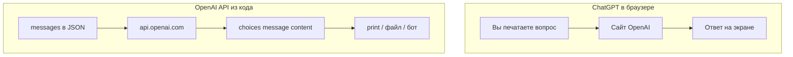

import ExternalCodeEmbed from '@site/src/components/ExternalCodeEmbed';


# OpenAI / API — готовые промпты и вызовы

<div class="article-tags">
  <span class="tag tag-notrequired">НЕ ОБЯЗАТЕЛЬНО</span>
  <span class="tag tag-beginner">ДЛЯ НОВИЧКОВ</span>
</div>

Приветствую! Здесь вы наверняка найдете, что ищете. Примеры в лаборатории рассчитаны на то, что мы разбираем что-то конкретное.

Текущая статья посвящена OpenAI API — chat completions, system prompt, streaming, JSON mode и curl.

Поэтому за теорией по текущей теме вам — в [энциклопедию](/encyclopedia/intro).
Если ещё не погружались, то маршрут прост:

1. [Основы](/section/basics)
2. [Система и сеть](/section/system-network)
3. [Данные и разметка](/section/data-markup)
4. [Код и разработка](/section/code-dev)
5. [Языки](/section/languages)
6. [Искусственный интеллект](/section/ai)
7. [Проект](/section/project)
8. [Инфраструктура и безопасность](/section/infra-security)
9. [Спин-офф](/section/spinoff)

Обязательно пройдитесь.

А теперь приступим к нашему предмету.

<div class="callout callout--tip">
  <div class="callout-title">Теория и соседние материалы</div>

  <div class="callout-body">
  Как устроены LLM — [большие языковые модели и ChatGPT](/encyclopedia/6-ai/6-04-modeli-i-instrumenty/1).

  Роль, контекст и окно токенов — [контекст](/encyclopedia/6-ai/6-01-vvedenie-v-ii/113).

  Temperature, top_p, max_tokens — [параметры генерации](/encyclopedia/6-ai/6-04-modeli-i-instrumenty/118).

  Промышленная обёртка — [интеграция ИИ в Python](/encyclopedia/6-ai/6-05-razrabotka-ii/112).

  Локально без облака — [Ollama](/encyclopedia/6-ai/6-05-razrabotka-ii/113).

  HTTP в терминале — [curl / fetch](/lab/Примеры/1133).
</div>
</div>

---
1. Пройдите [подготовку окружения](#setup) — ключ, `pip install openai`.
2. Запустите [минимальный Python-пример](#minimal-python) — убедитесь, что ответ приходит.
3. Скопируйте нужный блок (промпт или вызов) в свой файл.
4. Прочитайте **Разбор построчно** и блок **Частая ошибка** под кодом.
5. Измените текст промпта или `temperature` — так быстрее запоминается API.

---

## Навигация по примерам

| Ищут в интернете | Раздел ниже |
|------------------|-------------|
| openai api python example / chat completions python | [Минимальный вызов Python](#minimal-python) |
| chatgpt api python / how to use openai api | [Обязательный шаблон ask.py](#ask-template) |
| openai api curl example / chatgpt api curl | [Тот же запрос через curl](#curl-chat) |
| openai api javascript / fetch openai node | [Вызов из Node.js](#node-fetch) |
| openai api key environment variable | [Подготовка окружения](#setup) |
| system prompt openai example | [Роль system](#system-role) |
| openai json mode python / response_format | [Ответ в JSON](#json-mode) |
| openai streaming python example | [Потоковый ответ](#streaming) |
| openai embeddings python | [Embeddings](#embeddings) |
| openai api 401 / invalid api key | [Типичные ошибки](#errors) |
| openai temperature max_tokens example | [Параметры генерации](#params) |
| chatgpt prompt template code review | [Готовые промпты](#prompts) |
| chatgpt api vs website / разница api и chatgpt | [ChatGPT и API](#chatgpt-vs-api) |

---

<span id="chatgpt-vs-api"></span>

## ChatGPT в браузере и OpenAI API

| | ChatGPT (сайт) | OpenAI API (код) |
|---|----------------|------------------|
| **Кто нажимает** | Вы в чате | Ваша программа, бот, сайт |
| **Оплата** | Подписка Plus / бесплатный лимит | Оплата за **токены** (объём текста) |
| **Формат** | Окно браузера | HTTP POST + JSON |
| **Автоматизация** | Вручную | Цикл, база данных, Telegram-бот |

**Смысл API:** вы отправляете **тот же тип сообщений** (`system`, `user`, `assistant`), что видит модель в ChatGPT, только из Python, JavaScript или curl. Ответ приходит **строкой текста** (или JSON) — её можно сохранить в файл, показать на сайте или отправить в Telegram.



---

## Словарь за 30 секунд

| Термин | Простыми словами | Как в коде |
|--------|------------------|------------|
| **API** | «Дверь» для программ к серверу модели | `POST https://api.openai.com/v1/chat/completions` |
| **Chat Completions** | Метод «диалог» — список реплик | `client.chat.completions.create(..)` |
| **Промпт** | Текст запроса | `"content": "Объясни цикл for"` |
| **system** | Правила для модели на весь чат | `"role": "system"` |
| **user** | Вопрос или данные пользователя | `"role": "user"` |
| **assistant** | Прошлый ответ модели | `"role": "assistant"` |
| **model** | Какая нейросеть отвечает | `"model": "gpt-4o-mini"` |
| **token** | Кусок текста (~слово/часть слова) | Поле `usage` в ответе |
| **streaming** | Ответ по буквам, как в ChatGPT | `stream=True` |
| **embedding** | Вектор чисел «смысла» текста | `client.embeddings.create(..)` |

---

<span id="setup"></span>

## Как подготовить окружение

### Шаг 1 — API key и переменная окружения

1. Зарегистрируйтесь у провайдера (OpenAI или совместимый сервис).
2. В личном кабинете создайте **API key** — строка вида `sk-proj-..`.
3. Задайте переменную окружения **до** запуска Python.

**Windows PowerShell:**

```powershell
$env:OPENAI_API_KEY = "sk-proj-ВАШ_КЛЮЧ"
```

**Linux / macOS:**

```bash
export OPENAI_API_KEY="sk-proj-ВАШ_КЛЮЧ"
```

**Разбор команд:**

| Команда | Что делает | Зачем |
|---------|------------|-------|
| `$env:OPENAI_API_KEY = ".."` | Записывает ключ в переменную **только для текущего окна** PowerShell | SDK читает ключ автоматически; его нет в коде |
| `export OPENAI_API_KEY=..` | То же в bash/zsh | Стандарт для Linux-серверов и macOS |
| Кавычки вокруг ключа | Защита от спецсимволов | Без кавычек shell может обрезать строку |

**Проверка (Python):**

```bash
python -c "import os; print('OK' if os.getenv('OPENAI_API_KEY') else 'Нет ключа')"
```

**Частая ошибка:** ключ прописан в `.py` файле и случайно залит на GitHub — боты крадут такие ключи за минуты. Храните только в окружении или `.env` + [`.gitignore`](/lab/Примеры/2#минимальный-gitignore).

---

### Шаг 2 — установка Python SDK

```bash
pip install openai
```

**Разбор:**

| Часть | Смысл |
|-------|--------|
| `pip` | Менеджер пакетов Python |
| `install openai` | Официальная библиотека OpenAI — обёртка над HTTP |
| После установки | В коде `from openai import OpenAI` |

Проверка версии:

```bash
python -c "import openai; print(openai.__version__)"
```

---

### Шаг 3 — как запустить любой пример

**Вариант A — файл `ask.py` (удобнее всего)**

1. Создайте папку, например `gpt-lab`.
2. Сохраните код примера в `ask.py`.
3. В терминале в этой папке:

```bash
python ask.py
```

**Вариант B — интерактивный Python**

```bash
python
```

Вставьте код **без** строк `if __name__ == "__main__"`. После `client = OpenAI()` можно вызывать `create` построчно.

**Вариант C — curl без Python**

См. раздел [curl](#curl-chat) — полезно для проверки ключа и отладки JSON.

**Вариант D — Node.js**

См. раздел [Node fetch](#node-fetch) — файл `script.mjs`, команда `node script.mjs`.

---

<span id="minimal-python"></span>

## Минимальный вызов — Python

### Обязательный шаблон

Любой рабочий скрипт с OpenAI API строится из **четырёх шагов** —  **Импорт** и создание клиента `OpenAI()`.
2. **Массив `messages`** — минимум одна реплика `user`.
3. **Вызов** `chat.completions.create` с полем `model`.
4. **Чтение** текста из `response.choices[0].message.content`.

**Задача:** задать один вопрос модели и вывести ответ в консоль.

```python

import os

from openai import OpenAI

client = OpenAI()

response = client.chat.completions.create(
    model="gpt-4o-mini",
    messages=[
        {"role": "user", "content": "Объясни рекурсию в двух предложениях на русском."},
    ],
)

print(response.choices[0].message.content)
```

**Разбор построчно:**

| Строка | Что происходит | Зачем |
|--------|----------------|-------|
| `import os` | Подключает модуль для работы с ОС | Ниже можно проверить `OPENAI_API_KEY` (в расширенных примерах) |
| `from openai import OpenAI` | Класс клиента из официального SDK | Без SDK пришлось бы вручную собирать HTTP POST |
| `client = OpenAI()` | Создаёт клиент с настройками по умолчанию | Ключ берётся из переменной `OPENAI_API_KEY` |
| `client.chat.completions.create(` | Метод «создать ответ в чате» | Внутри — запрос на `/v1/chat/completions` |
| `model="gpt-4o-mini"` | Имя модели на сервере | Дешёвая и быстрая модель для учёбы и тестов |
| `messages=[ .. ]` | Список реплик диалога | Модель читает их **сверху вниз** как историю |
| `"role": "user"` | Роль «пользователь» | Стандарт Chat Completions API |
| `"content": "Объясни.."` | Текст вопроса — ваш **промпт** | Можно менять на любой текст |
| `response = ..` | Объект ответа целиком | Внутри — текст, статистика токенов, id запроса |
| `response.choices[0]` | Первый (и обычно единственный) вариант ответа | При `n=2` вариантов будет два |
| `.message.content` | Строка с текстом от модели | Именно её показывают пользователю |
| `print(..)` | Вывод в консоль | В боте вместо print — отправка в Telegram / на сайт |

**Что увидите в консоли** (пример, текст каждый раз чуть разный):

```text
Рекурсия — это когда функция вызывает сама себя, передавая задачу «меньшего» размера.
Базовый случай останавливает цепочку вызовов, иначе программа зациклится.
```

**Частые ошибки:**

| Ошибка в консоли | Причина | Исправление |
|------------------|---------|-------------|
| `AuthenticationError: 401` | Нет или неверный `OPENAI_API_KEY` | Задать ключ в том же окне терминала, где запускаете `python` |
| `RateLimitError: 429` | Лимит запросов или нулевой баланс | Подождать, пополнить billing или сменить модель |
| `ModuleNotFoundError: openai` | SDK не установлен | `pip install openai` |
| `AttributeError: .. content` | Обращение к пустому `choices` | Проверить `response.choices` — возможен фильтр контента |

**Попробуйте:** замените вопрос на «Напиши функцию Python, которая складывает два числа» — ответ будет с кодом. Поставьте `temperature=0.2` — ответ станет стабильнее.

---

### Что возвращает сервер — структура JSON

Полезно один раз увидеть «сырой» ответ (как в [curl](/lab/Примеры/1133)). Главные поля:


<ExternalCodeEmbed example="json/lab-1149-001" title="Что возвращает сервер — структура JSON" minHeight={408} />


| Поле | Смысл |
|------|--------|
| `choices[0].message.content` | **Готовый текст** — его читает ваш код |
| `finish_reason: stop` | Модель закончила нормально |
| `finish_reason: length` | Обрезка по `max_tokens` — ответ неполный |
| `usage.total_tokens` | Сколько токенов списали — для контроля бюджета |

В Python можно напечатать usage:

```python
print(response.usage.prompt_tokens, response.usage.completion_tokens)
```

---

<span id="curl-chat"></span>

## Тот же запрос через curl

**Задача:** отправить **тот же** JSON, что и Python SDK, но из терминала — удобно для лабораторной «скриншот запроса и ответа».

```bash
curl https://api.openai.com/v1/chat/completions \
  -H "Content-Type: application/json" \
  -H "Authorization: Bearer $OPENAI_API_KEY" \
  -d '{
    "model": "gpt-4o-mini",
    "messages": [
      {"role": "user", "content": "Назови три языка программирования для новичка."}
    ]
  }'
```

**Разбор построчно:**

| Строка | Что происходит | Зачем |
|--------|----------------|-------|
| `curl https://api.openai.com/v1/chat/completions` | HTTP **POST** по умолчанию при `-d` | Адрес метода Chat Completions |
| `\` в конце строки | Перенос команды в bash | Одна длинная команда на несколько строк |
| `-H "Content-Type: application/json"` | Заголовок «тело — JSON» | Сервер парсит `-d` как JSON |
| `-H "Authorization: Bearer $OPENAI_API_KEY"` | Секретный ключ в заголовке | `$OPENAI_API_KEY` подставляется из окружения |
| `-d '{ .. }'` | Тело запроса | Те же поля, что в Python: `model`, `messages` |
| `"role": "user"` | Реплика пользователя | Совпадает с Python-примером выше |

**Windows PowerShell** — сохраните тело в `body.json`:

```json
{
  "model": "gpt-4o-mini",
  "messages": [
    {"role": "user", "content": "Назови три языка программирования для новичка."}
  ]
}
```

```powershell
curl.exe https://api.openai.com/v1/chat/completions `
  -H "Content-Type: application/json" `
  -H "Authorization: Bearer $env:OPENAI_API_KEY" `
  -d "@body.json"
```

**Частая ошибка:** в PowerShell `$OPENAI_API_KEY` без `env:` — переменная пустая, приходит `401`.

---

<span id="node-fetch"></span>

## Вызов из Node.js (fetch)

**Задача:** вызвать OpenAI из JavaScript — полезно, если уже проходили [Fetch / axios](/lab/Примеры/1145).

Создайте файл `openai.mjs`:


<ExternalCodeEmbed example="javascript/lab-1149-002" title="Вызов из Node.js (fetch)" minHeight={390} />


**Разбор построчно:**

| Строка | Что происходит | Зачем |
|--------|----------------|-------|
| `await fetch('https://..')` | Асинхронный HTTP-запрос | Node 18+ и браузер умеют `fetch` нативно |
| `method: 'POST'` | Метод POST | GET не передаёт JSON-тело с messages |
| `'Content-Type': 'application/json'` | Тип тела | Сервер ожидает JSON |
| `` Authorization: `Bearer ${..}` `` | Ключ из переменной окружения | Тот же заголовок, что у curl |
| `JSON.stringify(&#123; model, messages &#125;)` | Объект JS → строка JSON | В Python это делает SDK сам |
| `if (!res.ok)` | Статус не 2xx | fetch **не бросает** ошибку на 401/429 — проверяем вручную |
| `await res.text()` в ошибке | Тело ответа при сбое | Там часто `&#123; "error": &#123; "message": ".." &#125; &#125;` |
| `await res.json()` | Разбор успешного JSON | Аналог `response.json()` в браузере |
| `data.choices[0].message.content` | Текст от модели | Тот же путь, что в Python |

Запуск:

```bash
export OPENAI_API_KEY="sk-.."
node openai.mjs
```

**Частая ошибка:** ключ в `.env`, но Node его **не читает** сам — нужен `export` или пакет `dotenv`.

---

<span id="system-role"></span>

## Роль system в messages

**Задача:** задать модели «характер» и формат ответа через **system**, а конкретный вопрос — через **user**.


<ExternalCodeEmbed example="python/lab-1149-003" title="Роль system в messages" minHeight={498} />


**Разбор ключевых строк:**

| Строка | Смысл | Зачем |
|--------|-------|-------|
| `"role": "system"` | Инструкция для модели | Не показывается пользователю на сайте, но влияет на каждый ответ |
| Многострочный `content` в скобках `(..)` | Склеенная строка без `\` | Удобно читать длинный system prompt |
| `"role": "user"` | Вопрос ученика | Меняется каждый раз; system остаётся |
| `temperature=0.3` | Низкая «креативность» | Для объяснений и фактов — меньше выдумок |

| Роль | Когда использовать | Пример content |
|------|---------------------|----------------|
| **system** | Правила на весь диалог | «Отвечай только на русском», «Формат — markdown» |
| **user** | Вопрос, код, документ | «Исправь ошибку в коде ниже…» |
| **assistant** | Прошлый ответ модели | Нужен для [истории диалога](#history) |

**Попробуйте:** уберите блок `system` — ответ станет длиннее и «академичнее». Верните system с «максимум 3 предложения» — ответ укоротится.

---

<span id="params"></span>

## Параметры генерации в запросе

**Задача:** управлять длиной и «креативностью» ответа без смены промпта. Подробная теория — [параметры генерации LLM](/encyclopedia/6-ai/6-04-modeli-i-instrumenty/118).

```python
response = client.chat.completions.create(
    model="gpt-4o-mini",
    messages=[{"role": "user", "content": "Придумай название для бота-помощника по математике."}],
    max_tokens=150,
    temperature=0.8,
    top_p=0.9,
    frequency_penalty=0.3,
    presence_penalty=0.0,
)
```

**Разбор параметров:**

| Параметр | Что делает | Когда ставить |
|----------|------------|---------------|
| `max_tokens=150` | Лимит длины **ответа** | Короткий заголовок — 50–100; эссе — 500+ |
| `temperature=0.8` | Выше — разнообразнее формулировки | Имена, идеи — 0.7–1.0; код — 0.1–0.3 |
| `top_p=0.9` | Обрезает «хвост» маловероятных слов | Часто 0.9–0.95 вместе с temperature |
| `frequency_penalty=0.3` | Штраф за повтор одних слов | Длинные тексты, чтобы не зацикливалась |
| `presence_penalty=0.0` | Штраф, если слово уже было | Поднимайте, если модель топчется на одной теме |

**Пример для кода (детерминированнее):**

```python
response = client.chat.completions.create(
    model="gpt-4o-mini",
    messages=[{"role": "user", "content": "Напиши функцию Python: факториал n."}],
    temperature=0.1,
    max_tokens=512,
)
```

**Частая ошибка:** `max_tokens=10` для объяснения темы — ответ обрежется посередине (`finish_reason: length`).

---

<span id="prompts"></span>

## Готовые промпты — шаблоны с разбором

Каждый промпт — это текст в `content`. Хороший промпт отвечает на три вопроса: **кто ты**, **что сделать**, **в каком формате**.

### Объяснение кода для новичка

**System:**

```text
Ты терпеливый преподаватель программирования. Объясняй код построчно.
Используй простые аналогии. Не переписывай код целиком без просьбы.
```

**User:**

```text
Объясни этот фрагмент Python для ученика 9 класса:

    for i in range(3):
        print(i * i)
```

| Часть промпта | Зачем так |
|---------------|-----------|
| «построчно» | Модель идёт по строкам, а не даёт общую лекцию |
| «9 класса» | Уровень сложности — без лишней теории |
| «Не переписывай код» | Иначе ответ — только новый код без объяснения |
| Код с отступом | Чётко отделён от инструкции |

---

### Рефакторинг с чек-листом

```text
Роль: senior Python-разработчик.
Задача: улучшить читаемость функции ниже, сохранив поведение.
Формат ответа:
1) Краткий список проблем (маркированный список).
2) Улучшенный код в отдельном блоке python.
3) Что изменилось — три пункта.

Код:

    def f(x):
        r=[]
        for i in x:
            if i%2==0: r.append(i*2)
        return r
```

| Приём | Эффект |
|-------|--------|
| «Роль: senior…» | Стиль ответа ближе к код-ревью |
| Нумерованный **формат ответа** | Модель не «размазывает» текст |
| «сохранив поведение» | Меньше риск, что логика изменится |

---

### Перевод с сохранением терминов

```text
Переведи на английский текст ниже. Термины API, HTTP, JSON оставь на английском.
Верни только перевод, без комментариев.

Текст: «Клиент отправляет POST-запрос с JSON-телом на эндпоинт /v1/chat/completions.»
```

**Зачем «только перевод»:** без этой строки модель часто добавляет «Sure! Here is…».

---

### Резюме длинного текста

```text
Сожми текст в 5 маркированных пунктов. Каждый пункт — одно предложение.
Если в тексте нет фактов — напиши «мало данных».

Текст:
…
```

Подставьте вместо `…` абзац из [работы с файлами](/lab/Примеры/1126) — `open("article.txt").read()`.

---

### Генерация тестовых вопросов

```text
По теме «HTTP: методы GET и POST» составь 5 вопросов для самопроверки.
Формат: нумерованный список. После списка — блок «Ответы» с краткими ответами.
Уровень: школьник, первый курс.
```

Подходит для подготовки к зачёту по [сетям](/encyclopedia/2-system-network/2-03-set-i-internet/intro).

---

### JSON без лишнего текста

```text
Верни только валидный JSON без markdown и пояснений.
Схема: {"title": string, "tags": string[], "reading_minutes": number}
Тема статьи: «Как работает DNS».
```

Используйте вместе с [JSON mode](#json-mode) — двойная страховка от «Here is your JSON:».

---

### Разбор ошибки из traceback

```text
Ниже traceback Python. Определи:
1) тип ошибки;
2) строку, где она возникла;
3) вероятную причину;
4) минимальное исправление (один фрагмент кода).

Traceback:
…
```

**Совет:** вставляйте **полный** traceback из консоли — последняя строка `NameError: ..` критична.

---

<span id="json-mode"></span>

## Ответ в JSON (response_format)

**Задача:** получить **словарь Python**, а не текст с пояснениями — удобно для скриптов и лабораторных.


<ExternalCodeEmbed example="python/lab-1149-004" title="Ответ в JSON (response_format)" minHeight={552} />


**Разбор построчно:**

| Строка | Что происходит | Зачем |
|--------|----------------|-------|
| `import json` | Стандартный парсер JSON | Превращает строку в `dict` |
| system «только JSON» | Инструкция модели | Без markdown-обёртки ```json |
| `response_format=&#123;"type": "json_object"&#125;` | Режим API | Сервер просит модель вернуть объект JSON |
| `temperature=0.2` | Низкая случайность | Стабильные ключи `city`, `country` |
| `raw = ..content` | Строка вида `&#123;"city": "Казань", ..&#125;` | Ещё не dict — только текст |
| `json.loads(raw)` | Парсинг | После этого `data["city"]` работает |
| `print(data["city"], ..)` | Доступ по ключам | Так данные идут в БД или на сайт |

**Пример вывода:**

```text
Казань Столица Tatarstan, город на слиянии Волги и Казанки.
```

**Частая ошибка:** забыть `json.loads` — `data["city"]` на строке даст ошибку или неверный доступ.

---

<span id="streaming"></span>

## Потоковый ответ (streaming)

**Задача:** печатать ответ **по мере генерации** — как в ChatGPT, когда текст появляется постепенно.


<ExternalCodeEmbed example="python/lab-1149-005" title="Потоковый ответ (streaming)" minHeight={336} />


**Разбор построчно:**

| Строка | Что происходит | Зачем |
|--------|----------------|-------|
| `stream=True` | Режим потока | Сервер шлёт много маленьких JSON вместо одного большого |
| `for chunk in stream` | Цикл по кускам | Каждый `chunk` — часть ответа |
| `chunk.choices[0].delta` | **Приращение**, не полное сообщение | В обычном режиме было бы `.message` |
| `.delta.content` | Фрагмент текста или `None` | `None` — служебный chunk без текста |
| `if part:` | Пропуск пустых | Без проверки иногда печатается `None` |
| `print(part, end="", flush=True)` | Без перевода строки после каждой буквы | `flush=True` — сразу видно в консоли |
| Финальный `print()` | Перевод строки в конце | Красивый вывод перед следующей командой |

| Режим | Когда использовать |
|-------|---------------------|
| Обычный (`stream=False`) | Скрипты, где нужен целый текст сразу |
| Streaming | CLI-чат, UX «модель печатает» |

---

<span id="embeddings"></span>

## Embeddings — векторы для поиска

**Задача:** превратить текст в массив чисел и **найти похожие по смыслу** фразы — основа RAG и семантического поиска.

### Один текст → один вектор

```python
from openai import OpenAI

client = OpenAI()

response = client.embeddings.create(
    model="text-embedding-3-small",
    input="OpenAI API позволяет вызывать языковые модели по HTTP.",
)

vector = response.data[0].embedding
print(len(vector), vector[:5])
```

**Разбор:**

| Строка | Смысл |
|--------|--------|
| `embeddings.create` | Эндпоинт векторизации, отдельный от chat completions |
| `text-embedding-3-small` | Компактная модель embeddings | Дешевле для учебных проектов |
| `input=".."` | Одна строка или список строк | Один запрос — один или много векторов |
| `response.data[0].embedding` | Список float, длина ~1536 | Координаты «смысла» текста |
| `len(vector)` | Размерность | Должна быть одинаковой для сравнения |
| `vector[:5]` | Первые 5 чисел | Для отладки — не для человека |

**Пример вывода:**

```text
1536 [0.012, -0.034, 0.056, -0.001, 0.028]
```

---

### Поиск ближайшего текста по смыслу


<ExternalCodeEmbed example="python/lab-1149-006" title="Поиск ближайшего текста по смыслу" minHeight={534} />


**Разбор логики:**

| Шаг | Смысл |
|-----|--------|
| `cosine(a, b)` | Чем ближе к **1.0**, тем похожее тексты по смыслу |
| `input=texts` | Три embedding за один запрос — дешевле трёх отдельных |
| `query_vec` | Вектор **запроса** пользователя |
| `zip(texts, vectors)` | Пара «фраза — её вектор» |
| `sorted(.., reverse)` | Сначала самые похожие |

**Пример вывода** (числа могут отличаться):

```text
0.842 — REST-запрос к языковой модели
0.791 — Как вызвать Chat Completions API
0.312 — Рецепт борща на кастрюлю
```

---

<span id="history"></span>

## Диалог с историей

**Задача:** второй вопрос опирается на первый — как в ChatGPT, где модель «помнит» переписку.


<ExternalCodeEmbed example="python/lab-1149-007" title="Диалог с историей" minHeight={390} />


**Разбор по шагам:**

| Шаг | Что происходит | Зачем |
|-----|----------------|-------|
| `history = [..]` | Список сообщений | Единая «лента» диалога |
| Первый `create(messages=history)` | Модель видит system + user | Ответ про игры |
| `history.append assistant` | Добавили **ответ модели** | Без этого второй вопрос «с нуля» |
| Второй `user` | Уточняющий вопрос | «веб» связывается с «играми» из контекста |
| Второй `create` | Тот же список, но длиннее | API **не хранит** историю — вы шлёте её каждый раз |

<div class="callout callout--warning">
  <div class="callout-title">Лимит контекста</div>

  <div class="callout-body">
  Каждое сообщение ест токены. Длинный чат обрежется или подорожает. Храните последние 10–20 реплик или сжимайте старое отдельным запросом «кратко перескажи диалог». Подробнее — <a href="/encyclopedia/6-ai/6-01-vvedenie-v-ii/113">контекст</a>.
</div>
</div>

---

## OpenAI-совместимые серверы (Ollama)

**Задача:** запустить **локальную** модель с тем же кодом — без облачного ключа.

```python
from openai import OpenAI

client = OpenAI(
    base_url="http://localhost:11434/v1",
    api_key="ollama",
)

response = client.chat.completions.create(
    model="llama3.2",
    messages=[{"role": "user", "content": "Привет! Ответь одним предложением."}],
)

print(response.choices[0].message.content)
```

**Разбор:**

| Строка | Смысл |
|--------|--------|
| `base_url="http://localhost:11434/v1"` | Адрес [Ollama](/encyclopedia/6-ai/6-05-razrabotka-ii/113) вместо OpenAI |
| `api_key="ollama"` | Заглушка — Ollama ключ не проверяет |
| `model="llama3.2"` | Имя модели **в Ollama** (`ollama pull llama3.2`) |
| Остальной код | Тот же `messages` и `choices[0].message.content` |

Перед запуском: `ollama serve` и скачанная модель.

---

<span id="errors"></span>

## Типичные ошибки — симптом, причина, код

| Симптом | Причина | Что сделать |
|---------|---------|-------------|
| `401 Unauthorized` | Пустой или неверный ключ | `echo $OPENAI_API_KEY` / `$env:OPENAI_API_KEY` |
| `429 Too Many Requests` | Лимит RPM или billing | Пауза, другая модель, пополнить счёт |
| `400 Bad Request` | Опечатка в `model` или JSON | Сверить имя модели в документации |
| Пустой `content` | Фильтр или сбой | Смотреть `finish_reason`, смягчить промпт |
| `JSONDecodeError` | Текст вокруг JSON | `response_format`, temperature 0.1–0.2 |
| Счёт растёт | Длинные промпты в цикле | Логировать `usage`, лимит `max_tokens` |

**Проверка ключа перед работой:**

```python

import os
import sys

if not os.getenv("OPENAI_API_KEY"):
    sys.exit("Задайте OPENAI_API_KEY в терминале перед запуском.")
```

**Обработка ошибки API в Python:**


<ExternalCodeEmbed example="python/lab-1149-008" title="Типичные ошибки — симптом, причина, код" minHeight={318} />


---

<span id="ask-template"></span>

## Обязательный шаблон — файл ask.py


<ExternalCodeEmbed example="python/lab-1149-009" title="Обязательный шаблон — файл ask.py" minHeight={444} />


**Разбор построчно:**

| Строка | Что происходит | Зачем |
|--------|----------------|-------|
| `def ask(prompt, system=..)` | Функция-обёртка | Один раз написали — много раз вызываете |
| `-> str` | Аннотация «вернёт строку» | Подсказка в IDE и для отчёта |
| `OpenAI()` внутри функции | Клиент на каждый вызов | В учебном скрипте проще; в prod — один клиент на модуль |
| `os.environ.get("OPENAI_MODEL", "gpt-4o-mini")` | Модель из env или default | Смена модели без правки кода: `export OPENAI_MODEL=gpt-4o` |
| `messages=[system, user]` | Стандартный диалог | system задаёт язык и стиль |
| `temperature=0.3` | Умеренная стабильность | Для фактов и объяснений |
| `return ..content` | Только текст наружу | Вызывающий код не знает про `choices` |
| `if __name__ == "__main__"` | Блок «если файл запущен напрямую» | При `import ask` тест не выполнится |
| `sys.exit("..")` | Выход с сообщением | Понятная ошибка вместо `401` из SDK |

Запуск:

```bash
export OPENAI_API_KEY="sk-.."
python ask.py
```

**Расширение для лабораторной — вопрос из input:**

```python
if __name__ == "__main__":
    if not os.environ.get("OPENAI_API_KEY"):
        sys.exit("Задайте OPENAI_API_KEY")
    q = input("Ваш вопрос: ")
    print(ask(q))
```

---

## ChatGPT API и лабораторная — чек-лист сдачи

| Пункт | Что показать преподавателю |
|-------|----------------------------|
| Ключ | Скрин **переменной окружения**, не строки в коде |
| Запрос | Листинг `messages` или curl с JSON |
| Ответ | Вывод программы или фрагмент `choices[0].message.content` |
| Параметры | Хотя бы `model` и `temperature` с пояснением |
| Ошибка | Пример обработки `401` или `429` (блок `try/except`) |

---

## Куда идти дальше

| Цель | Материал |
|------|----------|
| Retry, очереди, prod-клиент | [Интеграция на Python](/encyclopedia/6-ai/6-05-razrabotka-ii/112) |
| Локально без облака | [Ollama](/encyclopedia/6-ai/6-05-razrabotka-ii/113) |
| HTTP с сайта | [Fetch / axios](/lab/Примеры/1145) — ключ **только** на backend |
| Промпт из файла | [Python — файлы и текст](/lab/Примеры/1126) |
| Парсинг логов API | [Regex — паттерны](/lab/Примеры/615) |
| Каркас `.env` и Git | [Шаблоны](/lab/Примеры/2) |

---
