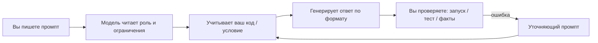

import ExternalPlayEmbed from '@site/src/components/ExternalPlayEmbed';


# Prompt engineering — библиотека промптов

<div class="article-tags">
  <span class="tag tag-notrequired">НЕ ОБЯЗАТЕЛЬНО</span>
  <span class="tag tag-beginner">ДЛЯ НОВИЧКОВ</span>
</div>

Приветствую! Здесь вы наверняка найдете, что ищете. Примеры в лаборатории рассчитаны на то, что мы разбираем что-то конкретное.

Текущая статья посвящена готовым промпты ChatGPT с построчным разбором.

Поэтому за теорией по текущей теме вам — в [энциклопедию](/encyclopedia/intro).
Если ещё не погружались, то маршрут прост:

1. [Основы](/section/basics)
2. [Система и сеть](/section/system-network)
3. [Данные и разметка](/section/data-markup)
4. [Код и разработка](/section/code-dev)
5. [Языки](/section/languages)
6. [Искусственный интеллект](/section/ai)
7. [Проект](/section/project)
8. [Инфраструктура и безопасность](/section/infra-security)
9. [Спин-офф](/section/spinoff)

Обязательно пройдитесь.

А теперь приступим к нашему предмету.

<div class="callout callout--tip">
  <div class="callout-title">Теория и соседние материалы</div>

  <div class="callout-body">
  Что такое LLM и как устроен запрос — [Большие языковые модели](/encyclopedia/6-ai/6-04-modeli-i-instrumenty/1).

  Вызовы API с кодом — [OpenAI / API — готовые промпты и вызовы](/lab/Примеры/1149).

  Рабочий цикл с кодом и сравнение сервисов — [Генерация кода](/encyclopedia/6-ai/6-04-modeli-i-instrumenty/117).

  Temperature, top_p, лимиты — [Параметры генерации](/encyclopedia/6-ai/6-04-modeli-i-instrumenty/118).

  Риск «копировать без review» — [Вайб-кодинг](/encyclopedia/6-ai/6-07-vayb-koding-i-neurokontent/1).

  Промпты в проде версионируют в git — [AgentOps](/encyclopedia/6-ai/6-08-agentops/1).
</div>
</div>

---
1. Найдите задачу в оглавлении или в оглавлении слева на сайте.
2. Скопируйте **весь** серый блок `text` (от «Роль:» до последней строки).
3. Замените `<вставка …>` на свой код, условие задачи или текст лекции.
4. Отправьте промпт **одним сообщением** (не дробите на десять реплик без нужды).
5. Прочитайте **Разбор** под блоком — там смысл строк и типичные ошибки.
6. Если ответ «почти тот» — используйте [шаблон уточнения](#follow-up), не переписывайте промпт с нуля.

---

## Навигация по примерам

<span id="google-index"></span>

| Раздел | Тема |
|--------|-----------------|
| [Каркас промпта](#karkas) | `prompt template`, `system prompt example`, `структура промпта` |
| [Объяснение темы](#explain-simple) | `chatgpt explain simply`, `объясни простыми словами`, `промпт для конспекта` |
| [Ошибка Python](#fix-traceback) | `chatgpt fix python error`, `traceback chatgpt`, `исправь код python` |
| [Функция Python](#python-function) | `chatgpt write python function`, `промпт для кода python`, `pytest chatgpt` |
| [Домашка / лаба](#homework) | `chatgpt programming homework hint`, `не решай за меня chatgpt` |
| [Реферат / доклад](#essay) | `chatgpt essay outline`, `план реферата chatgpt`, `структура доклада` |
| [ЕГЭ / олимпиада](#ege) | `chatgpt informatics hint`, `подсказка к задаче егэ` |
| [Объясни код](#explain-code) | `explain code line by line`, `разбери код построчно` |
| [Few-shot](#few-shot) | `few shot prompting example`, `примеры в промпте` |
| [RAG](#rag) | `rag prompt template`, `ответ только по контексту` |
| [Уточнение](#follow-up) | `chatgpt refine answer`, `переделай ответ` |

---

## Словарь промптов за 30 секунд

| Термин | Зачем | Как в этой статье |
|--------|-------|-------------------|
| **Промпт** | Всё, что вы отправляете модели | Блоки в `text` ниже |
| **System** | Правила «кто ты и как отвечаешь» | Строка `Роль:` или блок `System:` в RAG |
| **User** | Конкретная задача и данные | `Задача:`, `Вход:`, вопрос пользователя |
| **Контекст** | Факты о проекте, стек, ограничения | `Контекст:`, фрагмент кода |
| **Zero-shot** | Без примеров «вход → выход» | Стартовые промпты в начале |
| **Few-shot** | 2–3 образца ответа в промпте | [раздел Few-shot](#few-shot) |
| **Токен** | Кусок текста для модели | Длинный лог обрезается — вставляйте фрагмент |
| **Галлюцинация** | Уверенный выдуманный факт | Запрет «не выдумывай лог/ссылки» |
| **Temperature** | «Креативность» ответа | Для кода низкая — [параметры](/encyclopedia/6-ai/6-04-modeli-i-instrumenty/118) |

**Главная идея:** модель не «знает ваш проект». Она **догадывается** по тексту промпта. Чем точнее спецификация, тем меньше переделок.

---

## Как работает один запрос к ChatGPT



Вы нажали Enter → модель подобрала **наиболее правдоподобное** продолжение текста. Проверка запуском, тестом или учебником остаётся на вас — 

**Prompt engineering** — подбор формулировок, роли, контекста и формата ответа под задачу **без** переобучения весов модели. Хороший промпт работает как краткая спецификация: модель чаще попадает в ваш стек, стиль и критерии «готово».

<ExternalPlayEmbed example="ai/prompt-pipeline-demo" title="Пайплайн промптов" />

Ниже — шаблоны, которые можно вставить в чат или в system-инструкции агента. Замените текст в угловых скобках на свои данные.

---

## Разбор промпта по частям

Запрос к LLM обычно собирают из «кирпичиков». В таблице — что означает каждый блок и типичная ошибка.

| Блок | Смысл | Пример формулировки | Частая ошибка |
|------|--------|---------------------|---------------|
| **Роль** | Стиль и глубина ответа | «Ты senior Python-разработчик» | Роль без задачи — «красивый», но бесполезный текст |
| **Контекст** | Стек, версии, ограничения проекта | «Python 3.12, только stdlib» | «Сделай на Python» без версии и зависимостей |
| **Задача** | Одно действие | «Напиши функцию validate_email» | Три задачи в одном абзаце |
| **Вход** | Данные, код, лог | «Фрагмент файла: …» | Весь репозиторий без отбора |
| **Выход** | Формат ответа | «Только код + 3 теста» | «Объясни и напиши эссе» — модель раздувает ответ |
| **Граничные случаи** | Edge cases | «Если s is None — ValueError» | Их не перечисляют — код «ломается на null» |
| **Запреты** | Безопасность и стиль | «Без API-ключей в ответе» | Секреты prod в промпте |

**Два режима** — запомните в первую очередь:

| Режим | Когда | Подсказка в промпте |
|-------|--------|---------------------|
| **Черновик** | Идея, объяснение, учёба | Допустимы пояснения и примеры |
| **Патч в репозиторий** | Код пойдёт в merge | «Только diff», «без вступления», список файлов |

---

<span id="karkas"></span>

### Обязательный каркас промпта

 Запомните семь полей, и ответы станут стабильнее.

**Задача:** не забыть ни одного важного куска спецификации перед отправкой в чат.

```text
Роль: <кто отвечает — язык, уровень, домен>
Контекст: <стек, версии, что уже есть в проекте>
Задача: <одно предложение — что сделать>
Вход: <код, лог, ТЗ — только нужный фрагмент>
Ограничения: <зависимости, стиль, запреты>
Формат ответа: <код / diff / JSON / таблица>
Граничные случаи: <null, пустая строка, ошибки сети>
```

**Разбор построчно:**

| Строка | Смысл | Если пропустить |
|--------|--------|------------------|
| `Роль:` | Задаёт тон и глубину («учитель», «senior Python») | Ответ как «энциклопедия для всех» — слишком длинно или слишком детски |
| `Контекст:` | Версия Python, фреймворк, «учебный проект без pip» | Модель предложит библиотеки, которых у вас нет |
| `Задача:` | Одно действие | Три задачи в одном сообщении → выполнится первая, остальное забудут |
| `Вход:` | Факты: код, traceback, условие | Модель **придумает** ваш код или ошибку |
| `Ограничения:` | Запреты и стиль | Появятся лишние зависимости, английские комментарии, «улучшения» |
| `Формат ответа:` | Скелет вывода | Проза на три экрана вместо кода в один блок |
| `Граничные случаи:` | `None`, пустая строка, 0, деление | Код «работает на демо», падает на сдаче |

**Попробуйте:** возьмите любой шаблон ниже и проверьте — есть ли все семь полей (или явная причина, почему поле пустое).

---

## Стартовые промпты

Пять коротких шаблонов — с них удобно начинать, если вы впервые формулируете запрос к ИИ.

---

<span id="explain-simple"></span>

### 1. Объяснение темы простыми словами

**Задача:** понять концепцию для урока, доклада или подготовки к контрольной — без углубления в RFC и учебник на 400 страниц.

```text
Роль: преподаватель информатики для старшеклассника.
Тема: TCP и UDP — в чём разница на примере браузера и онлайн-игры.
Ограничения: до 300 слов, без формул, одна аналогия из быта.
Формат: три абзаца + таблица «когда TCP / когда UDP» из двух колонок.
```

**Разбор:**

| Строка | Смысл |
|--------|--------|
| `Роль: преподаватель…` | Модель упростит язык, добавит примеры из жизни |
| `Тема: TCP и UDP…` | Привязка к **знакомым** сценариям — браузер, игра |
| `до 300 слов` | Жёсткий лимит — иначе ChatGPT пишет «простыню» |
| `без формул` | Отсекает матан и формулы вероятности |
| `одна аналогия` | Один запоминающийся образ (почта, очередь в магазине) |
| `таблица … двух колонок` | Готовый фрагмент для тетради или слайда |

**Что получите:** короткий конспект, который можно пересказать своими словами на уроке.

**Типичные ошибки:**

- Написали только «объясни TCP» — ответ слишком общий.
- Не указали класс/уровень — слишком академично или слишком детско.
- Попросили «как в Википедии» и «простыми словами» в одном промпте — стиль смешается.

**Попробуйте:** замените тему на «DNS — зачем нужен домен example.com» или «что такое ОЗУ и SSD».

---

<span id="fix-traceback"></span>

### 2. Исправление ошибки по traceback

**Задача:** программа упала в IDLE, PyCharm или на сервере — нужна **причина** и **минимальная** правка, а не переписывание всего файла.

```text
Роль: отладчик Python.
Контекст: учебный скрипт, без установки новых пакетов.
Traceback:
<вставка полного traceback>

Код вокруг строки ошибки:
<10–25 строк>

Задача: назови причину на русском, предложи минимальный патч.
Формат: 1) причина в одном предложении; 2) исправленный фрагмент; 3) как проверить запуском.
```

**Разбор:**

| Строка | Смысл |
|--------|--------|
| `отладчик Python` | Фокус на синтаксисе и типичных ошибках новичка |
| `без установки новых пакетов` | Модель не предложит `pip install …` |
| `Traceback:` + полный текст | Последняя строка traceback — **где** упало; без неё — угадывание |
| `10–25 строк` вокруг ошибки | Достаточно контекста, не весь файл на 500 строк |
| `минимальный патч` | Одна-две строки, а не «перепиши проект» |
| `как проверить запуском` | Команда или входные данные для проверки |

**Пример вставки traceback** (учебный):

```text
Traceback (most recent call last):
  File "main.py", line 4, in <module>
    print(names[3])
IndexError: list index out of range
```

**Что получите:** объяснение «индекс 3 при длине списка 2» и правка `names[2]` или проверка длины.

**Типичные ошибки:**

- Скриншот без текста — модель не видит мелкий шрифт; копируйте **текст** из консоли.
- Вставили только `IndexError` без строки файла — неясно, **какая** переменная.
- Попросили «исправь всё» — придёт другой алгоритм, не ваш стиль.

**Попробуйте:** после ответа запустите скрипт сами. Если снова ошибка — отправьте [уточнение](#follow-up) с новым traceback.

---

### 3. Краткое резюме длинного текста

**Задача:** сжать главу учебника, статью или лекцию перед экзаменом.

```text
Роль: редактор технической статьи.
Вход: текст ниже (статья, глава, транскрипт лекции).
Задача: резюме на русском для занятого разработчика.
Формат:
- 5 буллетов «главное»;
- 3 термина с однострочным определением;
- 1 вопрос для самопроверки.
Объём резюме: не больше 15% от исходника.
<вставка текста>
```

**Разбор:**

| Строка | Смысл |
|--------|--------|
| `5 буллетов «главное»` | Структура ответа — не сплошной абзац |
| `3 термина` | Мини-словарь для повторения |
| `вопрос для самопроверки` | Проверка, поняли ли суть |
| `15% от исходника` | Защита от сокращения «в три слова» или копирования всего текста |

**Типичные ошибки:** вставили полкниги — обрежется лимит контекста чата; возьмите **одну главу** или раздел.

---

### 4. План действий перед кодом

**Задача:** спроектировать API или программу **до** написания кода — меньше хаоса в лабораторной.

```text
Задача: спроектировать REST API для заметок (CRUD) без написания кода.
Контекст: FastAPI, SQLite, JWT позже — сейчас только заглушка auth.
Формат ответа:
1) список эндпоинтов (метод, путь, тело);
2) схема таблицы notes;
3) порядок из 5 шагов реализации;
4) риски (безопасность, миграции).
Не пиши код — только план.
```

**Разбор:**

| Строка | Смысл |
|--------|--------|
| `без написания кода` | Явный запрет — иначе модель сразу выдаст 200 строк |
| `CRUD` | Create, Read, Update, Delete — полный набор операций |
| `5 шагов` | Ограниченный roadmap, удобно для отчёта |
| `риски` | Напоминание про SQL-инъекции, пароли — плюс на защите |

План снижает число итераций «переделай всё» после первого черновика кода.

---

### 5. Сравнение двух подходов

**Задача:** курсовой раздел «сравнение технологий» или выбор для pet-проекта.

```text
Роль: архитектор бэкенда.
Сравни: хранить сессии в Redis и JWT в cookie для SPA.
Критерии: масштаб до 10k пользователей, отзыв сессии, ops-нагрузка.
Формат: таблица критерий × вариант (плюс/минус одной фразой) + рекомендация для MVP.
Объём: до 400 слов.
```

**Разбор:** `Критерии:` заставляет сравнивать **по делу**, а не писать рекламу Redis. `MVP` — ответ приземлённый, для первой версии сайта.

---

## Библиотека по задачам

Готовые промпты для частых запросов — каждый с блоком **Разбор**, **Что получите** и **Типичные ошибки**.

---

<span id="python-function"></span>

### 1. Новая функция на Python

**Задача:** лабораторная «написать функцию», проверка email/пароля, разбор строки — с **type hints** и **pytest**, как требует преподаватель.

```text
Роль: senior Python-разработчик.
Контекст: Python 3.12, только stdlib, pytest уже в проекте.
Задача: функция validate_email(s: str) -> bool — упрощённая проверка по RFC 5322.
Ограничения:
- type hints обязательны;
- docstring на русском (один абзац);
- если s is None — ValueError с текстом "email must be str".
Формат ответа:
1) код функции в одном блоке;
2) три pytest-теста (валидный, невалидный, None).
Без пояснений вне кода.
```

**Разбор построчно:**

| Строка / блок | Смысл |
|--------------|--------|
| `senior Python-разработчик` | Стиль «как в индустрии» — hints, docstring, явные исключения |
| `Python 3.12` | Версия влияет на синтаксис (`str \| None` vs `Optional`) |
| `только stdlib` | Без `pip install email-validator` |
| `pytest уже в проекте` | Тесты в формате `def test_..` |
| `упрощённая проверка по RFC 5322` | Честное ожидание — не идеальная валидация всех edge cases почты |
| `ValueError` при `None` | Явное требование — иначе модель вернёт `False` или упадёт иначе |
| `три pytest-теста` | Готовый каркас для сдачи |
| `Без пояснений вне кода` | Один блок для копирования в `solution.py` |

**Что получите:** файл `validate_email.py` и `test_validate_email.py`, которые можно запустить:

```bash
pytest -q
```

**Типичные ошибки:**

- Не запустили тесты — на защите падает тест преподавателя.
- Скопировали код с «умными» импортами — `from email_validator import …` при запрете stdlib.
- Попросили «самый лучший email regex» — получите нечитаемую простыню; для учёбы достаточно упрощённой проверки.

**Попробуйте:** замените задачу на `is_palindrome(s: str) -> bool` или `count_words(text: str) -> int`.

---

<span id="homework"></span>

### Домашка по программированию — подсказки без готового решения

**Задача:** вы застряли на задаче, но нужно **понять**, а не сдать чужой код (важно для школы и вуза).

```text
Роль: репетитор по программированию на Python.
Контекст: ученик 10–11 класс, сдаёт домашку сам.
Условие задачи:
<вставка условия с сайта олимпиады / учебника>

Мой код (если есть):
<вставка — можно пусто>

Задача:
1) пересказ условия своими словами;
2) с чего начать (первый шаг, без полного кода);
3) одна подсказка — наводящий вопрос;
4) пример входа/выхода для самопроверки.
Запрет: не писать полное решение и не давать готовую программу целиком.
```

**Разбор:**

| Строка | Смысл |
|--------|--------|
| `репетитор` | Мягкий тон, обучение |
| `сдаёт домашку сам` | Этическая рамка для модели |
| `Запрет: не писать полное решение` | Главная строка — без неё ChatGPT часто выдаёт весь код |
| `наводящий вопрос` | Толчок к мысли («что хранить в переменной?») |

**Типичные ошибки:** написали «решите задачу 5» без условия — модель выдумает другую задачу 5.

См. также [ЕГЭ / олимпиада](#ege) и [алгоритмы на Python](/lab/Примеры/1122).

---

<span id="essay"></span>

### План реферата или доклада

**Задача:** структура на 5–15 минут выступления или текст на 2–3 страницы — **план**, а не готовый списанный реферат.

```text
Роль: методист, помогает структурировать доклад.
Тема: Кибербезопасность в школе — основные угрозы и привычки.
Аудитория: 9 класс, 10 минут устно.
Задача: план доклада без готового сплошного текста.
Формат:
- цель доклада (1 предложение);
- план из 5 разделов с подпунктами (2–3 буллета на раздел);
- 3 термина с простыми определениями;
- 2 вопроса для класса в конце;
- список из 3 типов источников (книга, сайт, видео) — без выдуманных URL.
Объём плана: до 400 слов.
```

**Разбор:** `без готового сплошного текста` и `без выдуманных URL` снижают списывание и ложные ссылки. `вопросы для класса` — готовый блок для презентации.

---

### 2. Отладка по логу

**Задача:** сервер или учебный backend пишет лог — найти причину 500 или `ERROR`.

```text
Роль: SRE, разбор инцидента.
Контекст: микросервис на Node 20, PostgreSQL 16.
Симптом: HTTP 500 на POST /api/orders при amount=0.
Фрагмент лога (20 строк вокруг ошибки):
<вставка>

Задача:
1) гипотеза причины (1–2 предложения);
2) что проверить в коде (список из 3 пунктов);
3) временный workaround для прода (если есть) — с пометкой «временно».
Не выдумывай строки лога — опирайся только на вставку.
```

**Разбор:**

| Строка | Смысл |
|--------|--------|
| `Симптом: HTTP 500 … amount=0` | Конкретный запрос и параметр — модель ищет деление на ноль, CHECK в БД |
| `20 строк вокруг` | Достаточно stack trace, без мегабайта лога |
| `Не выдумывай строки лога` | Без этой строки модель «дорисует» несуществующий `NullPointer` |
| `workaround … временно` | Отделяет костыль от нормального фикса |

Фильтрация логов в файле — [Python — работа с файлами и текстом](/lab/Примеры/1126#82-фильтр-строк-лога-по-уровню).

---

<span id="explain-code"></span>

### Разбор кода построчно

**Задача:** учитель дал чужой код, лекция с примером на GitHub — нужно **понять каждую строку**.

```text
Роль: преподаватель Python для новичка.
Контекст: ученик видит код впервые, знает только переменные и if/for.
Код:
<вставка 15–40 строк>

Задача: разбор построчно.
Формат для каждой значимой строки:
- номер строки;
- что делает (одно предложение простыми словами);
- зачем в общей логике программы.
В конце: что выведет программа при запуске (если можно вывести без input).
Не переписывай код — только объяснение.
```

**Разбор:**

| Строка | Смысл |
|--------|--------|
| `знает только переменные и if/for` | Ограничивает объяснение — без декораторов и метаклассов |
| `номер строки` | Удобно сопоставлять с редактором |
| `что выведет программа` | Проверка понимания — запустите сами и сверьте |

**Попробуйте:** вставьте свой код после [Turtle](/lab/Примеры/111) и спросите, зачем `t.left(120)` в цикле.

---

### 3. Рефакторинг с сохранением поведения

**Задача:** курсовой на React — вынести логику в хук, не сломав тесты.

```text
Контекст: React 18 + TypeScript, Vite.
Файл (фрагмент):
<вставка кода>

Задача: вынести логику фильтрации заказов в хук useOrderFilter.
Сохранить поведение: тесты ниже должны проходить без изменений.
<вставка тестов>

Формат ответа: только unified diff, без пояснений.
```

**Разбор:**

| Строка | Смысл |
|--------|--------|
| `React 18 + TypeScript` | Типы в хуке, не JavaScript |
| `тесты ниже должны проходить` | Контракт — модель не меняет поведение |
| `только unified diff` | Патч для `git apply`, без лишней прозы |

Тот же шаблон в [Генерации кода](/encyclopedia/6-ai/6-04-modeli-i-instrumenty/117#промпт-шаблон-для-рефакторинга). UI-рецепты — [React](/lab/Примеры/1146).

---

### 4. Генерация unit-тестов

**Задача:** преподаватель требует JUnit / pytest — написать тесты к уже готовому классу.

```text
Роль: инженер по качеству.
Контекст: Java 21, JUnit 5, Mockito не подключать.
Модуль под тест:
<вставка класса>

Задача: unit-тесты на публичные методы.
Покрыть: happy path, пустой ввод, граничное значение, одна ожидаемая ошибка.
Формат: один класс *Test.java, имена методов на английском, комментарии Given/When/Then на русском — одна строка на блок.
```

**Разбор:**

| Строка | Смысл |
|--------|--------|
| `happy path` | Обычный успешный сценарий |
| `пустой ввод` | `""`, пустой список — частый баг |
| `граничное значение` | 0, max, граница массива |
| `ожидаемая ошибка` | `assertThrows` — исключение там, где нужно |
| `Mockito не подключать` | В учебном проекте без лишних jar |

---

### 5. Code review диффа

**Задача:** перед сдачей лабораторной в Git — быстрый просмотр своего diff.

```text
Роль: ревьюер с фокусом на безопасность и сопровождаемость.
Diff:
<вставка unified diff>

Задача: ревью для автора PR.
Формат:
- BLOCKER — что нельзя мержить;
- WARNING — что исправить до релиза;
- NIT — стиль, по желанию;
- вопросы автору (не больше 3).
Не переписывай весь патч — только замечания.
```

**Разбор:** `BLOCKER` / `WARNING` / `NIT` — приоритеты как в GitHub/GitLab. `не больше 3` вопросов — фокус, без простыни.

---

### 6. Документация и README

```text
Роль: технический писатель.
Контекст: open-source CLI на Go 1.22, команда `mytool sync`.
Аудитория: разработчик, первый запуск за 5 минут.
Задача: черновик README.md.
Обязательные секции: Установка, Быстрый старт, Примеры команд, Переменные окружения, Лицензия MIT.
Тон: нейтральный, без маркетинговых штампов.
Формат: готовый markdown, без вступления «вот README».
```

Шаблоны для `.gitignore` и структуры репозитория — [Шаблоны](/lab/Примеры/2).

---

### 7. Regexp по описанию на русском

```text
Роль: автор учебника по регулярным выражениям.
Задача: шаблон для проверки российского мобильного +7XXXXXXXXXX в форме (вся строка).
Дай: шаблон, разбор по частям (таблица), примеры Python re.fullmatch — 3 строки «строка → да/нет».
Ссылка на углубление: готовые паттерны в /lab/Примеры/615.
```

Готовая галерея — [Regex — готовые паттерны](/lab/Примеры/615).

---

<span id="rag"></span>

### 8. RAG — ответ только по контексту

**Задача:** бот по учебнику, регламенту компании или вашей [энциклопедии](/encyclopedia/6-ai/6-04-modeli-i-instrumenty/1) — отвечать **только** по вставленным фрагментам.

```text
System:
Ты помощник по внутренней базе знаний компании.
Отвечай ТОЛЬКО на основе блоков «Контекст» ниже.
Если ответа нет в контексте — напиши: «В предоставленных документах этого нет» и предложи, что уточнить у человека.
Не придумывай ссылки и номера статей.

User:
Вопрос: <вопрос пользователя>

Контекст:
---
<чанк 1>
---
<чанк 2>
---

Формат ответа: краткий ответ (до 120 слов) + список цитат (название документа, абзац).
```

**Разбор построчно:**

| Блок | Смысл |
|------|--------|
| `System:` | Правила на всю сессию — «не фантазируй» |
| `ТОЛЬКО на основе блоков` | Запрет дополнять из «памяти» модели |
| Фраза «в документах этого нет» | Готовая формулировка отказа — меньше выдуманных фактов |
| `---` между чанками | Визуально разные источники — проще ссылаться |
| `список цитат` | Проверка: откуда взята каждая мысль |
| `до 120 слов` | Короткий ответ для виджета на сайте |

**Учебный мини-пример чанка:** вставьте два абзаца из своего конспекта и спросите то, чего **нет** во втором абзаце — модель должна ответить отказом.

Версионирование промптов в git — [AgentOps](/encyclopedia/6-ai/6-08-agentops/1).

---

### 9. Структурированный JSON

**Задача:** из письма или отзыва сделать JSON для таблицы Excel / базы — без ручного разбора.

```text
Роль: парсер заявок в службу поддержки.
Вход: письмо пользователя (plain text):
<вставка>

Задача: извлечь поля в JSON.
Схема (строго эти ключи, без лишних):
{
  "topic": "billing|tech|other",
  "urgency": "low|medium|high",
  "summary": "string до 200 символов",
  "needs_human": boolean
}

Формат ответа: один JSON-объект, без markdown-ограждений, без комментариев.
Если поле неизвестно — null для строк, false для needs_human только если явно не требуется человек.
```

**Разбор:**

| Строка | Смысл |
|--------|--------|
| `billing\|tech\|other` | Закрытый список — модель не придумает `spam` |
| `до 200 символов` | Ограничение summary для UI |
| `без markdown-ограждений` | Чистый JSON для `json.loads()` в Python |
| `null` / `false` | Правила для неполных данных — меньше выдуманных полей |

Код вызова API с `response_format` — [OpenAI / API](/lab/Примеры/1149), параметры — [Параметры генерации LLM — напоминалка](/encyclopedia/6-ai/6-04-modeli-i-instrumenty/118).

---

<span id="ege"></span>

### 10. Учёба — задача ЕГЭ / олимпиада

**Задача:** задача 5–27 ЕГЭ по информатике или олимпиадный блок — **ступени подсказок**, как на разборе у репетитора.

```text
Роль: репетитор по информатике, не решай задачу целиком за ученика.
Условие:
<вставка>

Задача:
1) пересказ условия своими словами;
2) подсказка 1 (наводящий вопрос, без кода);
3) подсказка 2 (идея алгоритма, без полной программы);
4) самопроверка — 2 тестовых примера вход/выход.
Формат: без готового кода решения.
```

**Разбор:**

| Пункт | Смысл |
|-------|--------|
| `пересказ условия` | Проверка, что вы поняли, **что дано** и **что найти** |
| `подсказка 1` | Вопрос («что если отсортировать?») |
| `идея алгоритма` | Жадность, два указателя, DP — без реализации |
| `2 тестовых примера` | Ручная прогонка на бумаге |
| `без готового кода` | Этика и реальная подготовка к экзамену |

**Типичные ошибки:** вставили только номер задачи с сайта без текста — модель угадает другое условие. Скопируйте **полное** условие.

Готовые алгоритмы на Python — [ЕГЭ и олимпиадка](/lab/Примеры/1122).

---

<span id="follow-up"></span>

## Второй запрос — когда первый ответ «почти тот»

Не переписывайте весь промпт. Добавьте **одно** уточнение с фактом — traceback, текст теста, «слишком длинно».

```text
Уточнение к предыдущему ответу.
Проблема: <одно предложение — что не так>
Факт: <traceback / вывод pytest / фрагмент ответа модели>
Задача: исправь только <функцию X / абзац 2 / тест Y>, остальное не меняй.
Формат: <тот же, что в первом промпте>.
```

**Разбор:**

| Строка | Смысл |
|--------|--------|
| `к предыдущему ответу` | Модель использует контекст чата |
| `исправь только …` | Меньше «переписали весь проект» |
| `Факт:` | Конкретика вместо «не работает» |

**Пример для pytest:**

```text
Уточнение к предыдущему ответу.
Проблема: тест test_none падает.
Факт: AssertionError: did not raise ValueError
Задача: исправь только validate_email и test_none, остальное не меняй.
Формат: два блока кода без пояснений.
```

---

## Техники prompt engineering

Краткий справочник приёмов — **добавляйте** к шаблонам выше, .

| Техника | Что добавить в промпт | Когда помогает |
|---------|----------------------|----------------|
| **Zero-shot** | Только задача и формат | Простые запросы, экономия токенов |
| **Few-shot** | 2–3 примера «вход → выход» | Единый стиль, классификация, парсинг |
| **Chain-of-thought** | «Сначала шаги рассуждения, потом ответ» | Математика, сложная логика |
| **Роль** | «Ты …» | Тон, глубина, домен |
| **Ограничение формата** | «Только таблица / только diff» | Меньше лишнего текста |
| **Негативные примеры** | «Не делай X» | Запрет секретов, лишних зависимостей |

<span id="few-shot"></span>

### Few-shot — пример с разбором

**Задача:** классифицировать обращения в поддержку или тип вопроса в чате куратора.

```text
Классифицируй тикет в одну метку: bug, feature, question.

Примеры:
Вход: "приложение падает после входа" → bug
Вход: "добавьте тёмную тему" → feature
Вход: "где скачать счёт?" → question

Вход: "не приходит SMS код второй день"
Ответ (одно слово):
```

**Разбор построчно:**

| Строка | Смысл |
|--------|--------|
| `одну метку: bug, feature, question` | Закрытый список — модель не придумает `urgent` |
| `Примеры:` + три строки | **Образец** формата «вход → метка» |
| `→ bug` | Стрелка фиксирует шаблон ответа |
| Последний `Вход:` без ответа | Модель **продолжает паттерн** на ваших данных |
| `одно слово` | Ответ `bug`, а не абзац объяснения |

**Что получите:** одно слово для автоматической маршрутизации или тега в таблице.

### Chain-of-thought — фрагмент

```text
Реши задачу. Сначала выпиши шаги рассуждения нумерованным списком, затем финальный ответ в отдельной строке «Ответ: …».
```

**Разбор:** разделение «ход мысли» и «итог» помогает проверить логику на контрольной. Для сдачи кода в проде часто достаточно тестов без публикации рассуждений.

Параметры `temperature` и reasoning-модели — [Параметры генерации LLM — напоминалка](/encyclopedia/6-ai/6-04-modeli-i-instrumenty/118).

---

## Промпт для IDE-агента (Cursor и аналоги)

Чат и агент решают разные задачи. В репозитории правила в `.cursor/rules` или `AGENTS.md` — это **долгоживущий system-промпт**.

```text
Проект: учебный сайт на Docusaurus 3, React 18.
Стиль кода: функциональные компоненты, без default export в новых файлах.
Запреты: не добавлять зависимости без согласования; не трогать package-lock вручную.
При правке docs/*.md: пустая строка после frontmatter ---; callout только HTML (см. правила репозитория).
Перед коммитом: npm run build должен проходить.
```

| Действие | Чат | Агент |
|----------|-----|-------|
| Объяснить ошибку | ✓ | избыточно |
| Правка 12 файлов + тесты | частично | ✓ с лимитами |
| `npm install` без review | ✗ | только с подтверждением |

Подробнее — [Генерация кода, связка с IDE](/encyclopedia/6-ai/6-04-modeli-i-instrumenty/117#связка-с-ide-агентом-cursor-и-аналоги).

---

## Типичные ошибки

| Ошибка | Что происходит | Как исправить |
|--------|----------------|---------------|
| Размытая задача | «Сделай сайт» → общий шаблон | Вход, выход, стек, критерии готовности |
| «Реши домашку» без запрета | Готовый код на 80 строк | Строка «без полного решения» как в [1б](#homework) |
| Секреты в промпте | Утечка в логи провайдера | Env, секрет-хранилище, локальная модель |
| Весь репозиторий в чат | Обрезка контекста, путаница | 30–80 строк эталона + путь к файлу |
| Нет формата ответа | Проза вместо кода | «Только блок кода» / «только diff» |
| Нет проверки | «Зелёный» чат, красный на защите | Запуск, pytest, вопросы преподавателю |
| Один промпт на всё | Разный стиль ответов | Отдельные шаблоны из этой статьи |
| Слепое копирование | Плагиат, бан на экзамене | Пересказ своими словами, ссылка на источник |

<div class="callout callout--warning">
  <div class="callout-title">Секреты и персональные данные</div>

  <div class="callout-body">
  API-ключи, пароли prod, ФИО и медданные клиентов в публичный чат не отправляйте. Для корпоративного кода — одобренный тенант (Copilot Enterprise, Vertex с DPA, Ollama on-prem). Подробнее — [ответственное использование ИИ](/encyclopedia/6-ai/6-06-primenenie-ii/3).
  </div>
</div>

---

## Практика — пять мини-заданий

Подходит для самостоятельной работы или занятия в кружке — .

1. **Объяснение.** Промпт [«Объяснение темы»](#explain-simple), тема «DNS и IP-адрес». Сравните ответ с лимитом 300 слов и без лимита.
2. **Код.** Шаблон [«Новая функция»](#python-function) для `is_prime(n)`. Запустите pytest, при падении — [уточнение](#follow-up).
3. **Ошибка.** Специально сломайте индекс в списке, вставьте traceback в [промпт 2](#fix-traceback).
4. **RAG.** Два абзаца конспекта, вопрос вне второго абзаца — ждите отказ [по шаблону 8](#rag).
5. **ЕГЭ.** Условие с [kompege.ru](https://kompege.ru/) или учебника — только подсказки [раздела 10](#ege).

---

## Чек-лист перед отправкой промпта

- [ ] Одна главная задача в одном сообщении (или явно пронумерованные подзадачи).
- [ ] Указаны стек и версии, если речь о коде.
- [ ] Вставлен только нужный фрагмент кода/лога, без секретов.
- [ ] Задан формат ответа (код, diff, JSON, таблица).
- [ ] Перечислены граничные случаи или тесты «должны пройти».
- [ ] Для merge — план проверки (pytest, eslint, `npm run build`).

Осознанный цикл «промпт → проверка → merge» разобран в [вайб-кодинге](/encyclopedia/6-ai/6-07-vayb-koding-i-neurokontent/1) — там же, чем помогает prompt engineering при размытых запросах.

---

## Связанные материалы

| Материал | Зачем открыть |
|----------|---------------|
| [Большие языковые модели](/encyclopedia/6-ai/6-04-modeli-i-instrumenty/1) | теория LLM, токены, обучение |
| [Генерация кода](/encyclopedia/6-ai/6-04-modeli-i-instrumenty/117) | ChatGPT, Gemini, DeepSeek, цикл review |
| [Параметры генерации](/encyclopedia/6-ai/6-04-modeli-i-instrumenty/118) | temperature, top_p, JSON mode |
| [OpenAI / API — вызовы](/lab/Примеры/1149) | Python, curl, streaming, JSON mode |
| [Вайб-кодинг](/encyclopedia/6-ai/6-07-vayb-koding-i-neurokontent/1) | антипаттерны без контроля |
| [AgentOps](/encyclopedia/6-ai/6-08-agentops/1) | промпты в git, eval перед prod |
| [Regex — готовые паттерны](/lab/Примеры/615) | шаблоны для полей форм |
| [Шаблоны](/lab/Примеры/2) | README, .gitignore, SQL |
| [ЕГЭ Python](/lab/Примеры/1122) | алгоритмы после подсказок из промпта |

---

## Использование в учебном курсе

Статью можно давать как **шпаргалку промптов** на занятии по ИИ или информатике: ученики выбирают шаблон под задачу, меняют `<вставка>`, сдают **свой** пересказ или код с прогоном. В задании укажите: «приложить скрин промпта и свой итог после проверки» — так видно работу с ИИ, а не списывание.

---