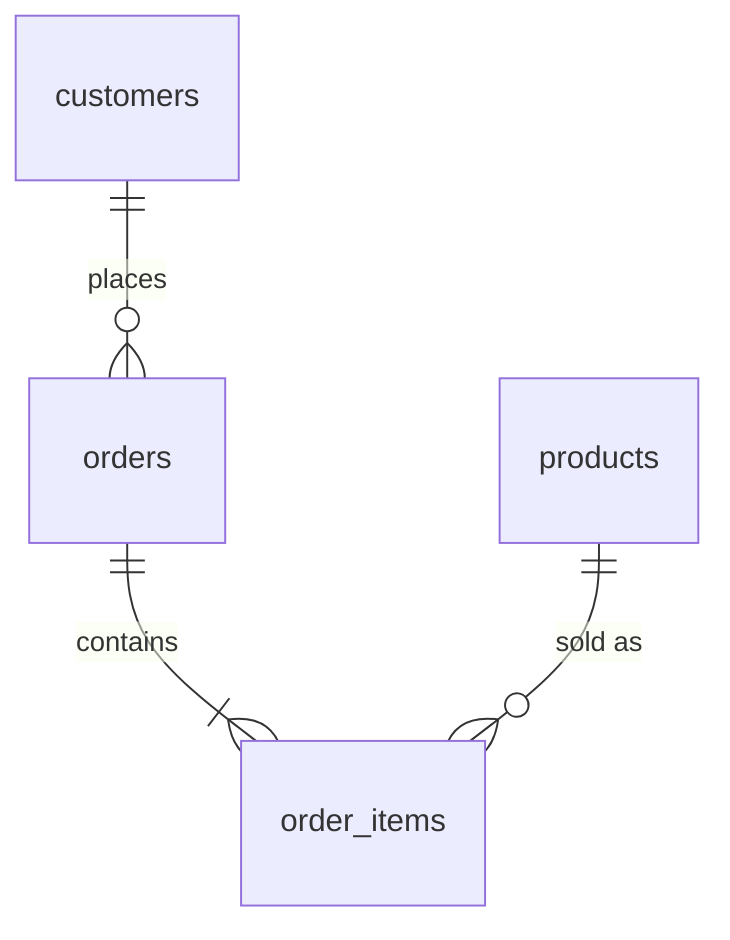

import ExternalPlayEmbed from '@site/src/components/ExternalPlayEmbed';


# SQL — реальные кейсы

<div class="article-tags">
  <span class="tag tag-notrequired">НЕ ОБЯЗАТЕЛЬНО</span>
  <span class="tag tag-beginner">ДЛЯ НОВИЧКОВ</span>
</div>

Приветствую! Здесь вы наверняка найдете, что ищете. Примеры в лаборатории рассчитаны на то, что мы разбираем что-то конкретное.

Текущая статья посвящена готовым примеры SQL с разбором каждой строки.

Поэтому за теорией по текущей теме вам — в [энциклопедию](/encyclopedia/intro).
Если ещё не погружались, то маршрут прост:

1. [Основы](/section/basics)
2. [Система и сеть](/section/system-network)
3. [Данные и разметка](/section/data-markup)
4. [Код и разработка](/section/code-dev)
5. [Языки](/section/languages)
6. [Искусственный интеллект](/section/ai)
7. [Проект](/section/project)
8. [Инфраструктура и безопасность](/section/infra-security)
9. [Спин-офф](/section/spinoff)

Обязательно пройдитесь.

А теперь приступим к нашему предмету.

<div class="callout callout--tip">
  <div class="callout-title">Теория и соседние материалы</div>

  <div class="callout-body">
  Маршрут с нуля — [SQL — о разделе](/encyclopedia/3-data-markup/3-07-sql/intro) и [первые шаги](/encyclopedia/3-data-markup/3-07-sql/101).

  Тот же тренажёр в теории — [SQL — язык](/encyclopedia/3-data-markup/3-07-sql/1).

  Шпаргалка без разбора — [типичные задачи](/encyclopedia/3-data-markup/3-07-sql/885).

  Таблицы в Python — [Pandas](/lab/Примеры/1113), формулы — [Excel](/lab/Примеры/1139).

  PostgreSQL в Docker — [compose-стеки](/lab/Примеры/11111).

  Минимальный CRUD — [шаблоны](/lab/Примеры/2).
</div>
</div>

---
Подборка **готовых SQL-запросов** с построчным разбором — Схема — учебный **интернет-магазин** (клиенты, товары, заказы, позиции чека).

Материал заточен под запросы вроде **«sql примеры join»**, **«sql group by sum»**, **«как посчитать сумму заказа sql»**, **«sql выборка where»**, **«лабораторная работа база данных sql»**, **«sql insert update пример»** — когда нужен рабочий текст запроса и объяснение, а не только синтаксис из учебника.

---

## Навигация по примерам

| Раздел | Типичный запрос (RU / EN) |
|--------|---------------------------|
| [Разбор запроса](#анатомия-запроса) | синтаксис SELECT |
| [Схема магазина](#схема-учебного-магазина) | `sql схема базы данных пример`, `foreign key sql` |
| [Каркас SELECT](#обязательный-каркас-select) | `sql select from where`, `структура sql запроса` |
| [Стартовые выборки](#стартовые-выборки) | `sql выборка where`, `sql сортировка order by` |
| [1. Сумма заказа](#1-выручка-и-сумма-заказа) | `sql sum join`, `сумма заказа sql`, `group by sql пример` |
| [2. Топ товаров](#2-топ-товаров-по-продажам) | `sql топ товаров`, `count group by` |
| [3. Клиенты без заказов](#3-клиенты-без-заказов) | `left join sql пример`, `клиенты без заказов sql` |
| [4. Склад](#4-склад-нулевой-остаток) | `sql where остаток`, `выборка товаров sql` |
| [5. Статусы](#5-заказы-по-статусу) | `sql count group by`, `средний чек sql` |
| [6. JOIN справочник](#6-сотрудники-и-справочник-городов) | `sql inner join две таблицы`, `sql join example` |
| [7. DML](#7-изменение-данных-dml) | `sql insert пример`, `sql update set` |
| [8. Ошибки](#8-частые-ошибки) | `sql group by error`, `ambiguous column sql` |

---

<span id="анатомия-запроса"></span>

## Разбор SQL-запроса

Любой запрос читают **сверху вниз** как инструкцию для СУБД. Сначала «откуда взять строки», потом «что отфильтровать», потом «что показать».

**Пример одной фразы:**

```sql
SELECT name FROM products WHERE price > 500;
```

| Часть | Роль | Аналог в Excel |
|-------|------|----------------|
| `SELECT name` | Какие **столбцы** попадут в ответ | Выделили столбец «Название» |
| `FROM products` | Из **какой таблицы** | Лист «Товары» |
| `WHERE price > 500` | Какие **строки** оставить | Автофильтр «цена > 500» |
| `;` | Конец команды (в тренажёре можно без неё) | — |

**Типы команд в этой статье:**

| Команда | Зачем | Меняет данные? |
|---------|-------|----------------|
| `SELECT` | Прочитать, посчитать отчёт | Нет |
| `INSERT` | Добавить строки | Да |
| `UPDATE` | Изменить строки | Да |
| `DELETE` | Удалить строки | Да |

---

<span id="схема-учебного-магазина"></span>

## Схема учебного магазина

Четыре таблицы — типичный **интернет-магазин**. Одна строка в `order_items` — одна позиция в чеке (как строка в кассовом чеке).



| Таблица | Роль | Ключевые столбцы |
|---------|------|------------------|
| `customers` | Покупатели | `customer_id`, `full_name`, `email`, `city` |
| `products` | Каталог | `product_id`, `name`, `price`, `category`, `stock_qty` |
| `orders` | Заказ | `order_id`, `customer_id`, `order_date`, `status` |
| `order_items` | Позиция чека | `order_id`, `product_id`, `quantity`, `unit_price` |

**Зачем `unit_price` в позиции:** в чеке фиксируют цену **на момент покупки**. Поле `products.price` могли изменить завтра — сумма старого заказа от этого не меняется.

В тренажёре также есть `users` и `cities` — [раздел 6](#6-сотрудники-и-справочник-городов).

На **PostgreSQL** те же таблицы в схеме `shop_data` — пишут `shop_data.customers`. В браузерном тренажёре префикс **не нужен**.

### Демо-данные — сверяйте с ними ответы

Выполните в тренажёре `SELECT * FROM products;` — увидите те же строки.

**`products` (фрагмент):**

| product_id | name | price | category | stock_qty |
|------------|------|-------|----------|-----------|
| 1 | Алгоритмы | 799 | Книги | 15 |
| 2 | SQL для профессионалов | 1299 | Книги | **0** |
| 3 | USB-кабель | 299 | Аксессуары | 42 |
| 5 | Блокнот | 99 | Канцелярия | 120 |

**`orders`:**

| order_id | customer_id | order_date | status |
|----------|-------------|------------|--------|
| 1 | 1 (Анна) | 2024-05-01 | completed |
| 2 | 1 (Анна) | 2024-05-10 | new |
| 3 | 2 (Борис) | 2024-05-12 | processing |
| 4 | 3 (Елена) | 2024-05-15 | completed |

**`order_items` — отсюда берутся суммы в примерах:**

| order_id | product_id | quantity | unit_price | Строка чека |
|----------|------------|----------|------------|-------------|
| 1 | 1 | 1 | 799 | 799 |
| 1 | 3 | 2 | 299 | 598 |
| 2 | 2 | 1 | 1299 | 1299 |
| 3 | 4 | 1 | 1499 | 1499 |
| 4 | 5 | 3 | 99 | 297 |

**Суммы заказов вручную (для проверки GROUP BY):**

| order_id | Расчёт | order_total |
|----------|--------|-------------|
| 1 | 799 + 2×299 | **1397** |
| 2 | 1299 | **1299** |
| 3 | 1499 | **1499** |
| 4 | 3×99 | **297** |

---

## Основы — от задачи к запросу

Перед кодом сформулируйте задачу **словами**:

1. **Какие таблицы** нужны? (клиенты, заказы, позиции…)
2. **Как они связаны?** (`customer_id`, `order_id`…)
3. **Какой фильтр?** (статус, дата, город…)
4. **Что в ответе?** (список имён, сумма, количество…)
5. **Сортировка?** (сначала самые дорогие, старые заказы первыми…)

На лабораторной и собеседовании эту цепочку часто просят проговорить **до** написания SQL.

---

<span id="обязательный-каркас-select"></span>

## Основы SELECT

### Обязательный каркас

Минимальная программа в мире SQL — один `SELECT`. Полный «скелет» отчёта:

```sql
SELECT столбцы_или_выражения     -- ЧТО показать
FROM таблица                     -- ОТКУДА строки
JOIN другая ON связь             -- ДОБАВИТЬ связанные строки
WHERE условие_на_строки          -- ФИЛЬТР до группировки
GROUP BY столбцы_группы          -- СВЕРНУТЬ в группы
HAVING условие_на_группы         -- ФИЛЬТР после группировки
ORDER BY сортировка              -- ПОРЯДОК строк в ответе
LIMIT число;                     -- СКОЛЬКО строк вернуть
```

**Порядок выполнения СУБД** (упрощённо — для понимания, не для заучивания порядка написания):

| Шаг | Клауза | Что происходит |
|-----|--------|----------------|
| 1 | `FROM` / `JOIN` | Склеивают таблицы; получается длинный список строк |
| 2 | `WHERE` | Отбрасывают лишние строки |
| 3 | `GROUP BY` | Объединяют строки в группы (например, по `order_id`) |
| 4 | `HAVING` | Отбрасывают целые группы |
| 5 | `SELECT` | Считают `SUM`, `COUNT`, выводят столбцы |
| 6 | `ORDER BY` / `LIMIT` | Сортируют и обрезают результат |

Теория — [принципы SQL-движка](/encyclopedia/3-data-markup/3-07-sql/2).

---

### Шаблон — клиент и его завершённые заказы

**Задача:** список имён и дат только по заказам со статусом `completed`.

```sql
SELECT
    c.full_name,
    o.order_id,
    o.order_date
FROM customers c
INNER JOIN orders o ON o.customer_id = c.customer_id
WHERE o.status = 'completed'
ORDER BY o.order_date DESC;
```

**Разбор по строкам:**

| Строка | Код | Смысл |
|--------|-----|-------|
| 1–4 | `SELECT c.full_name, o.order_id, o.order_date` | Три столбца в результате; префикс `c.` / `o.` — из какой таблицы столбец |
| 5 | `FROM customers c` | Главная таблица — клиенты; `c` — короткий псевдоним |
| 6 | `INNER JOIN orders o ON o.customer_id = c.customer_id` | К каждому клиенту подтянуть **только** его заказы по совпадению id |
| 7 | `WHERE o.status = 'completed'` | Оставить строки, где статус заказа — завершён |
| 8 | `ORDER BY o.order_date DESC` | Сначала свежие даты (`DESC` — по убыванию) |

**Пример результата (смысл):**

| full_name | order_id | order_date |
|-----------|----------|------------|
| Анна Иванова | 1 | 2024-05-01 |
| Елена Смирнова | 4 | 2024-05-15 |

Заказ Анны №2 (`new`) и заказ Бориса **не попадут** — фильтр `completed`.

**Частая ошибка:** писать `status = completed` без кавычек — СУБД воспримет `completed` как имя столбца, будет ошибка.

**Попробуйте:** замените `INNER JOIN` на `LEFT JOIN` — появятся ли клиенты без заказов? (да, с `NULL` в столбцах заказа).

---

<span id="стартовые-выборки"></span>

### Стартовые выборки

Простые запросы **без JOIN** — как первый квадрат в Turtle: одна таблица, один навык.

---

#### Все товары — проверка связи с БД

**Задача:** убедиться, что запрос выполняется (аналог `print("Hello")`).

```sql
SELECT * FROM products;
```

| Строка | Смысл |
|--------|--------|
| `SELECT *` | Все столбцы всех строк |
| `FROM products` | Таблица каталога |

**Попробуйте:** `SELECT name, price FROM products;` — только два столбца.

---

#### Каталог дороже 500 ₽

**Задача:** витрина «дорогие товары» для сайта.

```sql
SELECT product_id, name, price, category
FROM products
WHERE price > 500
ORDER BY price DESC;
```

**Разбор по строкам:**

| Строка | Код | Смысл |
|--------|-----|-------|
| 1 | `SELECT product_id, name, price, category` | Явный список столбцов — лучше, чем `*`, в реальных проектах |
| 2 | `FROM products` | Источник — каталог |
| 3 | `WHERE price > 500` | Число **без** кавычек; сравнение столбца с константой |
| 4 | `ORDER BY price DESC` | Сортировка по убыванию цены |

**Пример результата:**

| product_id | name | price | category |
|------------|------|-------|----------|
| 2 | SQL для профессионалов | 1299 | Книги |
| 4 | Power bank | 1499 | Аксессуары |
| 1 | Алгоритмы | 799 | Книги |

Блокнот (99) и USB-кабель (299) **отфильтрованы** условием `> 500`.

**Попробуйте:** `AND category = 'Книги'` в той же строке `WHERE`.

---

#### Клиенты из Москвы

**Задача:** выгрузка для региональной рассылки.

```sql
SELECT full_name, email, city
FROM customers
WHERE city = 'Москва';
```

**Разбор:**

| Строка | Смысл |
|--------|--------|
| `WHERE city = 'Москва'` | Текст в **одинарных** кавычках; пробел и регистр должны совпасть с данными |
| Без `JOIN` | Одна таблица — проще всего для первой лабораторной |

**Пример результата:** Анна Иванова и Елена Смирнова (в демо у обеих город Москва).

**Частая ошибка:** `WHERE city = Москва` — СУБД ищет столбец с именем `Москва`.

---

#### Заказы за май 2024

**Задача:** отчёт за календарный месяц.

```sql
SELECT order_id, customer_id, order_date, status
FROM orders
WHERE order_date >= '2024-05-01'
  AND order_date < '2024-06-01';
```

**Разбор:**

| Строка | Смысл |
|--------|--------|
| `>= '2024-05-01'` | С 1 мая включительно |
| `AND order_date < '2024-06-01'` | До 1 июня **не включая** — весь май |
| `AND` | Оба условия должны выполняться |

Так задают диапазон дат в SQL чаще, чем `BETWEEN` (с `BETWEEN` легко ошибиться с последним днём месяца).

**Пример результата:** все четыре демо-заказа (даты с 2024-05-01 по 2024-05-15).

**Попробуйте:** оставьте только `status = 'new'` — останется заказ №2.

---

#### Поиск по подстроке в названии (LIKE)

**Задача:** найти товары со словом «кабель» в имени.

```sql
SELECT name, price
FROM products
WHERE name LIKE '%кабель%';
```

| Часть | Смысл |
|-------|--------|
| `LIKE` | Сравнение с **шаблоном**, не с точным равенством |
| `%` | Любое количество любых символов до и после |
| `'%кабель%'` | «кабель» где угодно внутри строки |

**Пример результата:** USB-кабель.

В PostgreSQL для регистронезависимого поиска — `ILIKE '%кабель%'`.

---

## Примеры из практики

<ExternalPlayEmbed example="lab/sql-trainer" title="SQL-тренажёр" minHeight={480} />


Кейсы ниже — типичные задания лабораторных, стажировок и джуниор-позиций. Каждый блок: **задача → код → разбор по строкам → пример результата → попробуйте**.

Все запросы проверены в **тренажёре** на этой странице.

---

<span id="1-выручка-и-сумма-заказа"></span>

### 1. Выручка и сумма заказа

#### 1.1. Сумма каждого заказа (GROUP BY + SUM + JOIN)

**Задача:** для каждого `order_id` посчитать **итог чека** — сумма `quantity * unit_price` по всем позициям.

**Какие таблицы:** `orders` + `order_items` (без клиентов — только чеки).

```sql
SELECT
    o.order_id,
    o.order_date,
    o.status,
    SUM(oi.quantity * oi.unit_price) AS order_total
FROM orders o
INNER JOIN order_items oi ON oi.order_id = o.order_id
GROUP BY o.order_id, o.order_date, o.status
ORDER BY order_total DESC;
```

**Разбор по строкам:**

| Строка | Код | Смысл |
|--------|-----|-------|
| 1–5 | `SELECT … SUM(oi.quantity * oi.unit_price) AS order_total` | Для каждой группы сложить произведения «кол-во × цена в чеке» |
| 5 | `SUM(..)` | Агрегатная функция — одно число на группу |
| 5 | `AS order_total` | Имя столбца в результате (удобно в отчёте и API) |
| 6 | `FROM orders o` | Заказы — «хребет» отчёта |
| 7 | `INNER JOIN order_items oi ON oi.order_id = o.order_id` | Приклеить строки чека к заказу |
| 8 | `GROUP BY o.order_id, o.order_date, o.status` | Одна группа = один заказ; в PostgreSQL все неагрегированные столбцы из SELECT должны быть здесь |
| 9 | `ORDER BY order_total DESC` | Сначала самые крупные чеки |

**Почему нельзя забыть GROUP BY:** без него `SUM` попытается сложить **все** позиции **всех** заказов в одно число.

**Пример результата (сверка с таблицей сумм выше):**

| order_id | order_date | status | order_total |
|----------|------------|--------|-------------|
| 1 | 2024-05-01 | completed | 1397 |
| 3 | 2024-05-12 | processing | 1499 |
| 2 | 2024-05-10 | new | 1299 |
| 4 | 2024-05-15 | completed | 297 |

Порядок строк после `ORDER BY order_total DESC` именно такой (1397 сверху).

**Связь с Excel:** на листе «Позиции» столбец «Сумма строки» = `quantity * price`, затем сводная таблица по `order_id` с полем «Сумма». В Pandas — `df.groupby('order_id').apply(..)`, см. [Pandas — типовые операции](/lab/Примеры/1113).

**Попробуйте:** добавьте `WHERE o.status = 'completed'` **перед** `GROUP BY` — останутся только заказы 1 и 4.

---

#### 1.2. Выручка по клиентам за всё время

**Задача:** кто сколько потратил — для CRM, бонусов, «топ покупателей».

**Какие таблицы:** цепочка `customers` → `orders` → `order_items`.

```sql
SELECT
    c.customer_id,
    c.full_name,
    SUM(oi.quantity * oi.unit_price) AS revenue
FROM customers c
INNER JOIN orders o ON o.customer_id = c.customer_id
INNER JOIN order_items oi ON oi.order_id = o.order_id
GROUP BY c.customer_id, c.full_name
ORDER BY revenue DESC;
```

**Разбор по строкам:**

| Строка | Смысл |
|--------|--------|
| `FROM customers c` | Старт с покупателей — в отчёте будет **каждый клиент, у кого есть хотя бы одна позиция в заказе** |
| Первый `JOIN orders` | Подтянуть заказы клиента |
| Второй `JOIN order_items` | Подтянуть позиции этих заказов |
| `GROUP BY c.customer_id, c.full_name` | Свернуть все позиции всех заказов клиента в **одну сумму** |

**Пример результата (ручная проверка):**

| full_name | revenue | Откуда цифра |
|-----------|---------|--------------|
| Анна Иванова | 2696 | заказ 1 (1397) + заказ 2 (1299) |
| Борис Петров | 1499 | заказ 3 |
| Елена Смирнова | 297 | заказ 4 |

Клиент **Дмитрий Козлов** (без заказов в демо) **не появится** — сработал `INNER JOIN`.

**Попробуйте:** `LEFT JOIN` вместо первого `JOIN` с `orders` и фильтр — отдельный кейс [«Клиенты без заказов»](#3-клиенты-без-заказов).

---

<span id="2-топ-товаров-по-продажам"></span>

### 2. Топ товаров по продажам

#### 2.1. Сколько штук продали (не рубли)

**Задача:** рейтинг товаров по **количеству** проданных единиц.

```sql
SELECT
    p.product_id,
    p.name,
    SUM(oi.quantity) AS units_sold
FROM products p
INNER JOIN order_items oi ON oi.product_id = p.product_id
GROUP BY p.product_id, p.name
ORDER BY units_sold DESC;
```

**Разбор:**

| Строка | Смысл |
|--------|--------|
| `SUM(oi.quantity)` | Складываем штуки, а не деньги |
| `INNER JOIN` | Товары **без** продаж в отчёт **не попадут** |

**Пример результата:**

| name | units_sold |
|------|------------|
| Блокнот | 3 |
| USB-кабель | 2 |
| Алгоритмы, SQL…, Power bank | по 1 |

---

#### 2.2. Товары, которые ни разу не продавали

**Задача:** кандидаты на распродажу или снятие с витрины.

```sql
SELECT
    p.product_id,
    p.name,
    p.stock_qty
FROM products p
LEFT JOIN order_items oi ON oi.product_id = p.product_id
WHERE oi.order_item_id IS NULL;
```

**Разбор по строкам:**

| Строка | Смысл |
|--------|--------|
| `LEFT JOIN` | Взять **все** товары из `products` |
| `WHERE oi.order_item_id IS NULL` | Оставить только те, для кого **не нашлось** строки в `order_items` |
| Проверка по `order_item_id` | Любой столбец из правой таблицы будет `NULL`, если совпадения не было |

В **текущих** демо-данных все 5 товаров хотя бы раз продавались — результат **пустой**. Это нормально: запрос верный, данных под условие нет.

**Попробуйте:** выполните `INSERT` нового товара без заказов (раздел [7](#7-изменение-данных-dml)) и повторите запрос.

---

#### 2.3. Топ с нулевыми продажами (LEFT JOIN + COALESCE)

**Задача:** в одной таблице — и проданные, и непроданные; у непроданных — 0.

```sql
SELECT
    p.name,
    COALESCE(SUM(oi.quantity), 0) AS units_sold
FROM products p
LEFT JOIN order_items oi ON oi.product_id = p.product_id
GROUP BY p.product_id, p.name
ORDER BY units_sold DESC;
```

| Часть | Смысл |
|-------|--------|
| `LEFT JOIN` | Все товары остаются в группах |
| `COALESCE(SUM(..), 0)` | `SUM` по пустой группе даёт `NULL` — заменяем на 0 |

---

<span id="3-клиенты-без-заказов"></span>

### 3. Клиенты без заказов

#### 3.1. LEFT JOIN + IS NULL

**Задача:** кому отправить письмо «вы забыли корзину».

```sql
SELECT c.customer_id, c.full_name, c.email
FROM customers c
LEFT JOIN orders o ON o.customer_id = c.customer_id
WHERE o.order_id IS NULL;
```

**Разбор:**

| Строка | Смысл |
|--------|--------|
| `LEFT JOIN orders` | Все клиенты + их заказы, если есть |
| `WHERE o.order_id IS NULL` | Строки, где заказ **не подтянулся** — у клиента 0 заказов |

**Попробуйте:** `INSERT INTO customers ..` без заказов для нового id — увидите строку в результате.

---

#### 3.2. NOT EXISTS (часто на экзаменах)

```sql
SELECT c.customer_id, c.full_name
FROM customers c
WHERE NOT EXISTS (
    SELECT 1
    FROM orders o
    WHERE o.customer_id = c.customer_id
);
```

| Часть | Смысл |
|-------|--------|
| `EXISTS (подзапрос)` | Истина, если подзапрос вернул **хотя бы одну** строку |
| `NOT EXISTS` | Истина, если заказов **нет** |
| `SELECT 1` | В подзапросе важен **факт наличия** строки, а не значение столбца |

Теория — [подзапросы и EXISTS](/encyclopedia/3-data-markup/3-07-sql/108).

---

#### 3.3. Email для рассылки

```sql
SELECT full_name, email
FROM customers
WHERE email IS NOT NULL;
```

**Разбор:**

| Неправильно | Правильно |
|-------------|-----------|
| `email = NULL` | `email IS NULL` |
| `email != NULL` | `email IS NOT NULL` |

**Пример:** Дмитрий Козлов с `email = NULL` **не попадёт** в рассылку.

---

<span id="4-склад-нулевой-остаток"></span>

### 4. Склад — нулевой и низкий остаток

#### 4.1. Нет на складе

```sql
SELECT product_id, name, category, stock_qty
FROM products
WHERE stock_qty = 0
ORDER BY category, name;
```

**Пример результата:** «SQL для профессионалов», `stock_qty = 0`.

---

#### 4.2. Мало на складе (меньше 10, но больше 0)

```sql
SELECT name, category, stock_qty
FROM products
WHERE stock_qty > 0 AND stock_qty < 10
ORDER BY stock_qty ASC;
```

**Разбор:** `AND` объединяет два условия; `ORDER BY stock_qty ASC` — сначала критичные остатки (Power bank, 8 шт.).

---

<span id="5-заказы-по-статусу"></span>

### 5. Заказы по статусу

#### 5.1. Сколько заказов в каждом статусе

```sql
SELECT status, COUNT(*) AS cnt
FROM orders
GROUP BY status
ORDER BY cnt DESC;
```

**Разбор:**

| Строка | Смысл |
|--------|--------|
| `COUNT(*)` | Число строк в группе = число заказов |
| `GROUP BY status` | Группа = одно значение статуса |

**Пример результата:** по одному заказу в статусах `completed`, `new`, `processing` (cnt = 1), если в демо по одному заказу каждого типа.

---

#### 5.2. Очередь «новых» заказов (FIFO)

```sql
SELECT o.order_id, c.full_name, o.order_date
FROM orders o
INNER JOIN customers c ON c.customer_id = o.customer_id
WHERE o.status = 'new'
ORDER BY o.order_date ASC;
```

**Пример:** заказ №2, Анна Иванова, 2024-05-10.

---

#### 5.3. Средний чек по завершённым заказам

**Задача:** одно число — средняя сумма **завершённого** чека.

**Идея в два шага:** (1) посчитать сумму каждого заказа; (2) взять среднее от этих сумм.

```sql
SELECT AVG(order_total) AS avg_check
FROM (
    SELECT
        o.order_id,
        SUM(oi.quantity * oi.unit_price) AS order_total
    FROM orders o
    INNER JOIN order_items oi ON oi.order_id = o.order_id
    WHERE o.status = 'completed'
    GROUP BY o.order_id
) t;
```

**Разбор:**

| Уровень | Смысл |
|---------|--------|
| Внутренний `SELECT` | Таблица из двух строк: заказы 1 (1397) и 4 (297) |
| `WHERE o.status = 'completed'` | Только завершённые **до** группировки |
| Внешний `AVG(order_total)` | (1397 + 297) / 2 = **847** |
| `t` | Псевдоним подзапроса в `FROM` — обязателен |

В PostgreSQL то же читается проще с `WITH` — [CTE](/encyclopedia/3-data-markup/3-07-sql/551).

---

<span id="6-сотрудники-и-справочник-городов"></span>

### 6. Сотрудники и справочник городов

Учебный кейс **«факт + справочник»** — как `orders` + `customers`, но про HR.

#### 6.1. INNER JOIN — только с заполненным городом

```sql
SELECT u.name AS employee, c.name AS city_name, c.region
FROM users u
INNER JOIN cities c ON u.city_id = c.id
ORDER BY c.region, u.name;
```

**Разбор:**

| Строка | Смысл |
|--------|--------|
| `u.city_id = c.id` | Условие связи: внешний ключ → первичный ключ справочника |
| `AS employee` | Псевдоним **столбца** в результате |
| `u`, `c` | Псевдонимы **таблиц** |

---

#### 6.2. LEFT JOIN — показать всех, даже без города

```sql
SELECT u.name, c.name AS city_name
FROM users u
LEFT JOIN cities c ON u.city_id = c.id;
```

Если у сотрудника `city_id` пустой — в `city_name` будет `NULL`.

---

#### 6.3. UNION — список городов из двух источников

```sql
SELECT city AS place FROM customers
UNION
SELECT city AS place FROM users;
```

| Команда | Смысл |
|---------|--------|
| `UNION` | Объединить результаты и **убрать дубликаты** |
| `UNION ALL` | Объединить **с** дубликатами (быстрее, если дубли допустимы) |
| Одинаковые имена столбцов | В обеих частях первый столбец логически «место» |

---

<span id="7-изменение-данных-dml"></span>

### 7. Изменение данных (DML)

В тренажёре команды **меняют демо-базу** до кнопки «Сброс». На сервере используют [транзакции](/encyclopedia/3-data-markup/3-07-sql/77).

#### 7.1. Пополнить склад

```sql
UPDATE products
SET stock_qty = stock_qty + 50
WHERE category = 'Книги';
```

**Разбор по строкам:**

| Строка | Смысл |
|--------|--------|
| `UPDATE products` | Какую таблицу меняем |
| `SET stock_qty = stock_qty + 50` | Новое значение = старое + 50 (атомарно на сервере) |
| `WHERE category = 'Книги'` | Только книги; без WHERE обновятся **все** строки |

После выполнения у «SQL для профессионалов» остаток станет 50 (был 0).

---

#### 7.2. Новый товар

```sql
INSERT INTO products (name, price, category, stock_qty)
VALUES ('Наушники', 2499, 'Аксессуары', 10);
```

| Строка | Смысл |
|--------|--------|
| Список в скобках после `products` | В какие столбцы пишем (остальные — default или NULL) |
| `VALUES (..)` | Одна новая строка |

Проверка:

```sql
SELECT * FROM products WHERE name = 'Наушники';
```

---

#### 7.3. Сменить статус заказов

```sql
UPDATE orders
SET status = 'cancelled'
WHERE status = 'new';
```

**Пример:** отменится заказ №2 (единственный `new` в демо).

---

#### 7.4. Удаление (осторожно)

```sql
DELETE FROM orders WHERE status = 'new';
```

<div class="callout callout--warning">
  <div class="callout-title">DELETE без WHERE</div>

  <div class="callout-body">
  `DELETE FROM orders` удалит **все** заказы. В тренажёре — «Сброс»

  на сервере — бэкап, см. [резервное копирование](/encyclopedia/3-data-markup/3-07-sql/106).
</div>
</div>

---

#### 7.5. Безопасный ввод из приложения (SQL-инъекции)

**Нельзя** собирать запрос так:

```python
# ОПАСНО — так не делают
query = f"SELECT * FROM customers WHERE email = '{user_input}'"
```

**Нужно** передавать значения отдельно:

```python
cur.execute(
    "SELECT * FROM customers WHERE email = %s",
    (user_email,),
)
```

```javascript
await pool.query('SELECT * FROM customers WHERE email = $1', [userEmail]);
```

СУБД отделит **код** запроса от **данных**. Подробнее — [SQL-инъекции](/encyclopedia/8-infra-security/8-07-informatsionnaya-bezopasnost/123#sql-injection-tautology).

---

<span id="8-частые-ошибки"></span>

## Частые ошибки

| Симптом | Причина | Что сделать |
|---------|---------|-------------|
| `column must appear in GROUP BY` | В `SELECT` столбец без агрегата, его нет в `GROUP BY` | Добавить в `GROUP BY` или `MAX(столбец)` |
| `ambiguous column` | `id` есть в двух таблицах | Писать `c.customer_id`, `o.order_id` |
| Пустой отчёт при JOIN | Стоит `INNER` вместо `LEFT` | Поменять тип JOIN или проверить ключи в `ON` |
| `email = NULL` не работает | Сравнение с `NULL` | Только `IS NULL` / `IS NOT NULL` |
| Одна гигантская сумма | Забыли `GROUP BY order_id` | Группировать по заказу |
| Строк дублируется в 2× | Лишний JOIN | Убрать лишнюю таблицу или уточнить `ON` |
| В тренажёре ошибка на `WITH` | Движок тренажёра проще сервера | Выполнить в PostgreSQL — [Практикум shop_data](/encyclopedia/3-data-markup/3-07-sql/111) |
| Цифры не как в статье | Данные меняли INSERT/DELETE | «Сброс» в тренажёре |

---

## Шпаргалка одной страницей

| Нужно | Шаблон |
|-------|--------|
| Все строки таблицы | `SELECT * FROM имя;` |
| Фильтр | `WHERE столбец = значение` |
| Диапазон дат | `WHERE d >= '2024-05-01' AND d < '2024-06-01'` |
| Связать 2 таблицы | `FROM a JOIN b ON a.id = b.a_id` |
| Сумма по группам | `SELECT ключ, SUM(…) FROM … GROUP BY ключ` |
| Клиенты без заказов | `LEFT JOIN` + `WHERE заказ.id IS NULL` |
| Добавить строку | `INSERT INTO t (cols) VALUES (…);` |
| Изменить | `UPDATE t SET col = … WHERE …;` |

---

## Что дальше

| Тема | Куда идти |
|------|-----------|
| JOIN, CTE, окна | [дорожная карта SQL](/encyclopedia/3-data-markup/3-07-sql/intro) |
| Тот же магазин на сервере | [практикум shop_data](/encyclopedia/3-data-markup/3-07-sql/111) |
| Рецепты без построчного разбора | [шпаргалка 885](/encyclopedia/3-data-markup/3-07-sql/885) |
| PostgreSQL в Docker | [compose-стеки](/lab/Примеры/11111) |
| Таблицы в Python | [Pandas — примеры](/lab/Примеры/1113) |
| Визуальные примеры кода 
Скопируйте один кейс, выполните в тренажёре, измените одно условие в `WHERE` — так SQL запоминается так же, как короткие программы на Turtle: **руками**, а не только чтением.