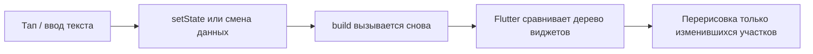

import ExternalCodeEmbed from '@site/src/components/ExternalCodeEmbed';


# Flutter — готовые виджеты

<div class="article-tags">
  <span class="tag tag-notrequired">НЕ ОБЯЗАТЕЛЬНО</span>
  <span class="tag tag-beginner">ДЛЯ НОВИЧКОВ</span>
</div>

Приветствую! Здесь вы наверняка найдете, что ищете. Примеры в лаборатории рассчитаны на то, что мы разбираем что-то конкретное.

Текущая статья посвящена примерам: Flutter на Dart с построчным разбором.

Поэтому за теорией по текущей теме вам — в [энциклопедию](/encyclopedia/intro).
Если ещё не погружались, то маршрут прост:

1. [Основы](/section/basics)
2. [Система и сеть](/section/system-network)
3. [Данные и разметка](/section/data-markup)
4. [Код и разработка](/section/code-dev)
5. [Языки](/section/languages)
6. [Искусственный интеллект](/section/ai)
7. [Проект](/section/project)
8. [Инфраструктура и безопасность](/section/infra-security)
9. [Спин-офф](/section/spinoff)

Обязательно пройдитесь.

А теперь приступим к нашему предмету.

<div class="callout callout--tip">
  <div class="callout-title">Теория и соседние материалы</div>

  <div class="callout-body">
  [Flutter](/encyclopedia/5-languages/5-22-dart/311)

  [Первая программа на Dart](/encyclopedia/5-languages/5-22-dart/7)

  [Dart — о разделе](/encyclopedia/5-languages/5-22-dart/intro)

  [Мобильные приложения — о разделе](/encyclopedia/4-code-dev/4-12-mobilnye-prilozheniya/intro)

  [Tkinter — окна и виджеты](/lab/Примеры/1124)

  [Java Swing — окна и кнопки](/lab/Примеры/1143).
</div>
</div>

---
## Основы UI во Flutter

**Flutter** — фреймворк Google для приложений на Android, iOS, Windows, macOS, Linux и веб. Интерфейс собирают из **виджетов** — классов Dart, которые описывают, **что** рисовать на экране. Язык — **Dart**; без базового синтаксиса Dart начните с [первой программы](/encyclopedia/5-languages/5-22-dart/7).

<div class="callout callout--tip">
  <div class="callout-title">С чего начать</div>

  <div class="callout-body">
  Теория фреймворка — [Flutter](/encyclopedia/5-languages/5-22-dart/311).

  Мобильный контекст — [мобильные приложения](/encyclopedia/4-code-dev/4-12-mobilnye-prilozheniya/intro).

  Десктоп на Python — [Tkinter](/lab/Примеры/1124), на Java — [Swing](/lab/Примеры/1143), в браузере — [React](/lab/Примеры/1146) и [Vue / Svelte](/lab/Примеры/1147).

  HTTP — [Fetch / axios](/lab/Примеры/1145).
</div>
</div>

### Навигация по примерам

| Ищут в интернете | Раздел ниже |
|------------------|-------------|
| flutter hello world / первое приложение | [Hello Flutter](#hello) |
| flutter counter example setstate | [Счётчик](#counter) |
| flutter elevatedbutton onclick | [Кнопка и SnackBar](#button) |
| flutter textfield controller example | [Поле ввода и приветствие](#greeting) |
| flutter temperature converter | [Конвертер °C → °F](#converter) |
| flutter checkbox switch radiolisttile | [Переключатели](#settings) |
| flutter todo list listview builder | [Список задач](#todo) |
| flutter slider example | [Ползунок](#slider) |
| flutter login form textformfield | [Форма входа](#login) |
| flutter drawer menu example | [Боковое меню](#drawer) |
| flutter navigator push pop | [Второй экран](#navigation) |
| flutter tabbar tabbarview | [Вкладки](#tabs) |
| flutter alertdialog showdialog | [Диалог](#dialog) |
| flutter http get futurebuilder | [Загрузка с API](#fetch) |
| flutter create project run | [Обязательный каркас](#karkas) |
| renderflex overflowed / setstate after dispose | [Частые ошибки](#errors) |

---

### Как запустить пример за 2 минуты

1. Установите [Flutter SDK](https://docs.flutter.dev/get-started/install). В терминале: `flutter doctor` — исправьте красные пункты (Android Studio / Xcode для мобильных платформ).
2. `flutter create my_app && cd my_app`
3. Откройте **`lib/main.dart`**, удалите шаблонный код, вставьте пример **целиком** (от `import` до последней `}`).
4. Запустите эмулятор или подключите телефон с USB-отладкой.
5. `flutter run` — через минуту приложение на устройстве.
6. Меняете код и жмёте **Hot Reload** (`r` в терминале) — экран обновится без полного перезапуска.

| Где | Плюсы |
|-----|-------|
| Эмулятор Android / симулятор iOS | Как на реальном телефоне |
| `flutter run -d chrome` | Быстрая проверка без эмулятора (веб) |
| VS Code / Android Studio | Кнопка Run, подсветка ошибок |

 Flutter **не запускается** — нужен компьютер с SDK.

---

### Базовые термины

| Термин | Простыми словами |
|--------|------------------|
| **Виджет** | Любой элемент UI — кнопка, текст, отступ, весь экран |
| **StatelessWidget** | Экран или блок **без** своей памяти; картинка не меняется сама |
| **StatefulWidget** | Блок с **state** — число счётчика, текст в поле, список задач |
| **setState()** | «Данные изменились — перерисуй экран» |
| **build()** | Метод, который **описывает**, как выглядит UI прямо сейчас |
| **Scaffold** | Каркас экрана: AppBar, body, кнопка FAB, drawer |
| **MaterialApp** | Корень приложения, тема, заголовок |
| **Hot Reload** | Правка кода → экран обновился за секунду, state часто сохраняется |
| **pubspec.yaml** | Файл зависимостей (как `package.json` у Node) |

---

### Flutter, Tkinter и React — одна идея, разный синтаксис

| Задача | Tkinter (Python) | React (браузер) | Flutter (Dart) |
|--------|------------------|-----------------|----------------|
| Окно / корень | `tk.Tk()` | `<div id="root">` | `runApp(MaterialApp(..))` |
| Надпись | `Label(text=..)` | `<p>..</p>` | `Text('..')` |
| Кнопка | `Button(command=fn)` | `<button onClick=&#123;fn&#125;>` | `ElevatedButton(onPressed: fn)` |
| Поле ввода | `Entry` + `.get()` | `value` + `onChange` | `TextField` + `controller.text` |
| Динамический текст | `StringVar` | `useState` | `setState` + поле в `State` |
| Цикл событий | `mainloop()` | React перерисовывает DOM | Flutter пересобирает дерево виджетов |

**Смысл:** вы описываете интерфейс **как функцию от данных**. Данные изменились → фреймворк сам обновляет экран. В Tkinter часть этого делаете вручную через `StringVar`; во Flutter — через `setState`.

---

## Словарь виджетов за 30 секунд

| Виджет | Зачем | Как читать / менять |
|--------|-------|---------------------|
| `MaterialApp` | Корень, тема | `home:`, `theme:` |
| `Scaffold` | Каркас экрана | `appBar`, `body`, `drawer`, `floatingActionButton` |
| `AppBar` | Верхняя панель | `title: Text(..)` |
| `Text` | Текст | `Text('строка')` |
| `Center` | Центрировать child | `child: ..` |
| `Column` / `Row` | Столбец / строка | `children: [..]` |
| `Padding` | Отступы | `padding: EdgeInsets.all(16)` |
| `ElevatedButton` | Кнопка | `onPressed: () { }` |
| `TextField` | Ввод одной строки | `controller.text` |
| `TextFormField` | Поле + валидация | `validator:` |
| `ListView.builder` | Длинный список | `itemCount`, `itemBuilder` |
| `Navigator` | Экраны | `push`, `pop` |
| `SnackBar` | Строка снизу | через `ScaffoldMessenger` |

**Компоновка:** CSS во Flutter нет. Отступы — `Padding`, `SizedBox`; ширина на всю строку — `crossAxisAlignment: CrossAxisAlignment.stretch` в `Column`.

---

## Как работает Flutter — цикл обновления



Пользователь нажал «+» → `_count` стал 5 → Flutter снова вызвал `build` → на экране обновилась только цифра в `Text`, кнопка не «мигала» целиком.

---

<span id="karkas"></span>

### Обязательный каркас

Любой пример ниже — **полный файл** `lib/main.dart`. Запомните команды, как `import tkinter` и `mainloop()` в [Tkinter](/lab/Примеры/1124).

**Задача:** создать проект и убедиться, что dev-сборка работает.

```bash
flutter create my_flutter_app
cd my_flutter_app
flutter run
```

Минимальный `lib/main.dart` — замените `home:` на код из примеров ниже:


<ExternalCodeEmbed example="dart/lab-1154-001" title="Обязательный каркас" minHeight={462} />


**Разбор по строкам.**

| Строка | Смысл |
|--------|--------|
| `import 'package:flutter/material.dart'` | Material-виджеты: кнопки, поля, тема |
| `void main()` | Точка входа — первая функция, которую вызывает Dart |
| `runApp(..)` | «Включить» Flutter; без неё пустой экран |
| `StatelessWidget` | Виджет без своего изменяемого state |
| `const MyApp(&#123;super.key&#125;)` | `const` + `super.key` — идиома Flutter 3 для оптимизации |
| `MaterialApp` | Обёртка: тема, локализация, навигация верхнего уровня |
| `debugShowCheckedModeBanner: false` | Убирает ленточку «DEBUG» в углу (удобно для скриншотов в отчёт) |
| `ThemeData(..)` | Цвета кнопок, шрифты — единый стиль |
| `home:` | Стартовый экран — ваш `Scaffold` или кастомный виджет |
| `build(BuildContext context)` | Flutter вызывает его, когда нужно нарисовать UI |

**Типичные ошибки.**

- `flutter: command not found` — Flutter не в `PATH`; добавьте `flutter/bin` из установки.
- «No devices found» — запустите эмулятор в Android Studio или `flutter run -d chrome`.
- Красный экран **RenderFlex overflowed** — содержимое `Column` не помещается; см. [ошибки](#errors).
- Правите код, а экран не меняется — сохраните файл; при изменении `main()` нужен **Hot Restart** (`R`), не Reload.

**Попробуйте:** замените `Placeholder()` на `Scaffold(body: Center(child: Text('Hello')))`.

---

## Стартовые экраны

Простые **целые** `main.dart` — с них.

---

<span id="hello"></span>

### Hello Flutter

**Задача.** Минимальный экран: заголовок в AppBar и текст по центру — проверка, что SDK и эмулятор работают.


<ExternalCodeEmbed example="dart/lab-1154-002" title="Hello Flutter" minHeight={678} />


**Разбор.**

| Виджет / строка | Зачем |
|-----------------|--------|
| `HelloScreen extends StatelessWidget` | Отдельный экран без изменяемых данных |
| `Scaffold` | «Скелет» Material-экрана |
| `AppBar` | Системная верхняя полоска с заголовком |
| `body:` | Основная область под AppBar |
| `Center` | Размещает `child` по центру по горизонтали и вертикали |
| `Text(.., style: TextStyle(fontSize: 18))` | Надпись и размер шрифта |
| `const` перед виджетами | Подсказка компилятору: параметры не меняются → меньше лишней работы |

**Попробуйте сами.** Добавьте `backgroundColor: Colors.teal.shade50` в `Scaffold`. Поменяйте `title` в AppBar — изменится текст в верхней панели.

---

<span id="counter"></span>

### Счётчик

**Задача.** Число в памяти увеличивается по нажатию — классический **flutter counter example** (как шаблон `flutter create`).


<ExternalCodeEmbed example="dart/lab-1154-003" title="Счётчик" minHeight={720} />


**Разбор — почему два класса `CounterScreen` и `_CounterScreenState`.**

| Элемент | Смысл |
|---------|--------|
| `StatefulWidget` | «Оболочка» — сама не хранит `_count`, только создаёт State |
| `createState()` | Flutter вызывает один раз и получает объект `_CounterScreenState` |
| `_CounterScreenState` | Здесь живёт `_count`; подчёркивание = приватный класс в Dart |
| `int _count = 0` | Начальное значение счётчика |
| `setState(() &#123; _count++; &#125;)` | **Обязательно** при изменении данных UI; без этого цифра на экране не обновится |
| `'Значение: $_count'` | Интерполяция строк — `$` вставляет значение переменной |
| `Theme.of(context).textTheme.headlineMedium` | Стиль из темы приложения — единообразные заголовки |
| `FloatingActionButton` | Круглая кнопка «+» в углу — паттерн Material Design |
| `onPressed: _increment` | Передаём **имя функции**, не `_increment()` — иначе вызовется сразу при сборке |

**Сравнение с React** (см. [React — счётчик](/lab/Примеры/1146#counter)):

| React | Flutter |
|-------|---------|
| `const [count, setCount] = useState(0)` | `int _count = 0` в State |
| `setCount(count + 1)` | `setState(() &#123; _count++; &#125;)` |
| `&#123;count&#125;` в JSX | `'$_count'` в `Text` |

**Типичные ошибки.**

- Пишут `_count++` **без** `setState` — переменная меняется, экран стоит на месте.
- `onPressed: _increment()` — функция вызывается при каждой пересборке, не по клику.

**Попробуйте сами.** Кнопка «−» в `body`: второй `ElevatedButton` с `setState(() &#123; _count--; &#125;)`.

---

<span id="button"></span>

### Кнопка и SnackBar

**Задача.** По нажатию показать короткое сообщение снизу — аналог `messagebox.showinfo` в [Tkinter](/lab/Примеры/1124).


<ExternalCodeEmbed example="dart/lab-1154-004" title="Кнопка и SnackBar" minHeight={720} />


**Разбор.**

| Строка | Смысл |
|--------|--------|
| `ElevatedButton` | Основная «объёмная» кнопка Material |
| `onPressed: () => _showMessage(context)` | Лямбда передаёт `context` в метод — он нужен для поиска Scaffold |
| `ScaffoldMessenger.of(context)` | Сервис, который показывает SnackBar поверх текущего Scaffold |
| `SnackBar(content: Text(..))` | Чёрная/тёмная полоска внизу экрана |
| `duration: Duration(seconds: 2)` | Сколько секунд висит сообщение |

**Попробуйте сами.** Замените на `SnackBar(action: SnackBarAction(label: 'OK', onPressed: () {}))` — кнопка на полоске.

Для модального окна «OK / Отмена» см. [диалог](#dialog).

---

<span id="greeting"></span>

### Поле ввода и приветствие

**Задача.** Прочитать имя из поля и показать приветствие — типичная форма на лабораторной.


<ExternalCodeEmbed example="dart/lab-1154-005" title="Поле ввода и приветствие" minHeight={720} />


**Разбор.**

| Элемент | Смысл |
|---------|--------|
| `TextEditingController` | «Мост» к тексту внутри `TextField`; читают через `.text` |
| `final _controller = ..` | Создаётся один раз в State, не в `build` |
| `dispose()` + `_controller.dispose()` | Освобождает ресурсы при закрытии экрана — **обязательная** привычка |
| `trim()` | Убирает пробелы по краям — пустое «   » не считается именем |
| `InputDecoration` | Рамка, подпись `labelText`, подсказка `hintText` |
| `OutlineInputBorder()` | Прямоугольная рамка вокруг поля |
| `onSubmitted: (_) => _greet()` | Клавиша «Готово» / Enter на клавиатуре = та же логика, что у кнопки |
| `Column` + `crossAxisAlignment: stretch` | Кнопка на всю ширину экрана |
| `SizedBox(height: 12)` | Вертикальный зазор 12 логических пикселей |

**Типичные ошибки.**

- Создают `TextEditingController()` **внутри** `build` — при каждой перерисовке теряется текст и течёт память.
- Забывают `dispose()` — предупреждения в консоли при Hot Reload.

**Попробуйте сами.** Второе поле «Фамилия» и вывод `Здравствуй, $name $surname!`.

---

<span id="converter"></span>

### Конвертер °C → °F

**Задача.** Классическая учебная программа: число → формула → результат на экране (часто встречается в заданиях вместе с [Tkinter-конвертером](/lab/Примеры/1124)).


<ExternalCodeEmbed example="dart/lab-1154-006" title="Конвертер °C → °F" minHeight={720} />


**Разбор формулы и проверок.**

| Строка | Смысл |
|--------|--------|
| `replaceAll(',', '.')` | «25,5» → «25.5» для `double.tryParse` |
| `double.tryParse(raw)` | Вернёт `null`, если введены буквы — без `try/catch` |
| `celsius * 9 / 5 + 32` | Формула Фаренгейта: $F = C \times \frac&#123;9&#125;&#123;5&#125; + 32$ |
| `toStringAsFixed(1)` | Один знак после запятой в выводе |
| `keyboardType: .. decimal: true` | На телефоне — цифровая клавиатура с точкой |
| `OutlinedButton` | Вторичная кнопка «Очистить» — визуально легче основной |

**Попробуйте сами.** Обратный перевод °F → °C: $C = (F - 32) \times \frac&#123;5&#125;&#123;9&#125;$.

---

<span id="settings"></span>

### Флажок, переключатель и радио

**Задача.** Несколько настроек «вкл/выкл» и выбор одной роли — как [Checkbutton и Radiobutton](/lab/Примеры/1124) в Tkinter.


<ExternalCodeEmbed example="dart/lab-1154-007" title="Флажок, переключатель и радио" minHeight={720} />


**Разбор.**

| Виджет | Когда использовать |
|--------|---------------------|
| `SwitchListTile` | Одна строка «название + переключатель» |
| `RadioListTile<String>` | Один вариант из группы; `groupValue` общий для всех |
| `value` / `onChanged` у Switch | `onChanged: null` — переключатель серый и неактивен |
| `ListView` | Прокрутка, если пунктов больше, чем высота экрана |

**Попробуйте сами.** Третья роль «Гость» с `value: 'guest'`.

---

<span id="todo"></span>

### Список задач

**Задача.** Добавлять строки и удалять их — **flutter todo list**, частый мини-проект для отчёта.


<ExternalCodeEmbed example="dart/lab-1154-008" title="Список задач" minHeight={720} />


**Разбор ListView.**

| Элемент | Смысл |
|---------|--------|
| `List<String> _items` | Данные списка в state |
| `_items.add(text)` | Добавление в конец |
| `_items.removeAt(index)` | Удаление по индексу |
| `ListView.builder` | Строит **только видимые** строки — важно для длинных списков |
| `itemCount: _items.length` | Сколько элементов рисовать |
| `itemBuilder: (context, index)` | Виджет для строки `index` |
| `Expanded` вокруг списка | Список занимает всё место под полем ввода |
| Условие `_items.isEmpty ? .. : ..` | Пустое состояние — подсказка пользователю |

**Типичные ошибки.**

- `ListView` без `Expanded` внутри `Column` — ошибка **unbounded height**.
- Меняют `_items`, но без `setState` — UI не обновляется.

**Попробуйте сами.** `Checkbox` в `ListTile` для отметки «выполнено» (второй список или `List<Map>`).

---

<span id="slider"></span>

### Ползунок

**Задача.** Выбрать число в диапазоне — аналог `Scale` в Tkinter.


<ExternalCodeEmbed example="dart/lab-1154-009" title="Ползунок" minHeight={720} />


**Разбор.**

| Параметр | Смысл |
|----------|--------|
| `min` / `max` | Диапазон значений |
| `value: _volume` | Текущая позиция ползунка — должна быть между min и max |
| `onChanged` | Вызывается при перетаскивании; **обязан** обновить state |
| `divisions: 20` | 20 дискретных шагов (0, 5, 10, … 100) |
| `label` | Всплывающая цифра над ползунком при движении |

---

<span id="login"></span>

### Форма входа

**Задача.** Логин и пароль с проверкой — типичная лабораторная «форма авторизации».


<ExternalCodeEmbed example="dart/lab-1154-010" title="Форма входа" minHeight={720} />


**Разбор валидации.**

| Элемент | Смысл |
|---------|--------|
| `Form` + `GlobalKey<FormState>` | Общая форма; ключ нужен, чтобы вызвать `.validate()` |
| `TextFormField` | Как `TextField`, но с `validator` |
| `validator: (v) => ..` | Верните `null` — поле OK; строку — текст ошибки под полем |
| `_formKey.currentState!.validate()` | Проверяет **все** поля; `false`, если хоть одно неверно |
| `obscureText: true` | Символы пароля скрыты точками |
| `FilledButton` | Акцентная кнопка Material 3 |

---

<span id="drawer"></span>

### Боковое меню

**Задача.** Пункты «Главная», «Настройки» в выезжающей панели — иконка ☰ появляется в AppBar автоматически.


<ExternalCodeEmbed example="dart/lab-1154-011" title="Боковое меню" minHeight={720} />


**Разбор.**

- `drawer:` у `Scaffold` — Flutter сам рисует кнопку-«гамбургер».
- `Navigator.pop(context)` закрывает drawer после выбора пункта.
- `DrawerHeader` — цветная шапка боковой панели.

---

<span id="navigation"></span>

### Второй экран

**Задача.** Перейти на новый экран и вернуться — **flutter navigator push**.


<ExternalCodeEmbed example="dart/lab-1154-012" title="Второй экран" minHeight={720} />


**Разбор навигации.**

| Вызов | Что происходит |
|-------|----------------|
| `Navigator.push(..)` | Новый экран **поверх** текущего; стек растёт |
| `MaterialPageRoute(builder: ..)` | Анимация «слайд справа» в стиле Android |
| `Navigator.pop(context)` | Снять верхний экран; вернуться назад |
| Системная кнопка «Назад» на Android | То же, что `pop` |

**Смысл `context`:** по нему Flutter находит ближайший `Navigator` в дереве виджетов. Поэтому `context` передают в методы навигации.

---

<span id="tabs"></span>

### Вкладки

**Задача.** Два экрана в одном — переключение по табам или свайпу.


<ExternalCodeEmbed example="dart/lab-1154-013" title="Вкладки" minHeight={720} />


**Разбор.**

- `DefaultTabController(length: 2)` — число вкладок **должно** совпадать с длиной `TabBar` и `TabBarView`.
- Свайп влево/вправо на телефоне переключает вкладки без нажатия.

---

<span id="dialog"></span>

### Диалог подтверждения

**Задача.** Спросить «Удалить?» перед действием — как `askyesno` в Tkinter.


<ExternalCodeEmbed example="dart/lab-1154-014" title="Диалог подтверждения" minHeight={516} />


Вызовите `confirmDelete(context)` из `onPressed` кнопки «Удалить» на любом экране.

**Разбор async.**

| Строка | Смысл |
|--------|--------|
| `async` / `await` | Ждём, пока пользователь нажмёт кнопку в диалоге |
| `showDialog<bool>` | Возвращает `Future<bool?>` — результат закрытия |
| `Navigator.pop(ctx, true)` | Закрыть диалог и вернуть `true` вызывающему коду |
| `context.mounted` | После `await` экран мог закрыться — проверка перед SnackBar |

---

<span id="fetch"></span>

### Загрузка списка с API

**Задача.** GET-запрос и список имён — параллель [Fetch / axios](/lab/Примеры/1145) на Dart.

**Шаг 1.** В `pubspec.yaml` в секции `dependencies:`:

```yaml
dependencies:
  flutter:
    sdk: flutter
  http: ^1.2.0
```

Терминал: `flutter pub get`.

**Шаг 2.** Полный `lib/main.dart`:


<ExternalCodeEmbed example="dart/lab-1154-015" title="Загрузка списка с API" minHeight={720} />


**Разбор FutureBuilder.**

| Состояние `snapshot` | Что показать |
|----------------------|--------------|
| `ConnectionState.waiting` | Крутилка загрузки |
| `hasError` | Текст ошибки (нет сети, 404…) |
| `hasData` | `ListView` с результатом |
| `initState` + `_future = ..` | Запрос **один раз** при открытии экрана, не при каждом `build` |

**Без интернета** замените `_loadUsers()` на:

```dart
Future<List<String>> _loadUsers() async {
  await Future.delayed(const Duration(seconds: 1));
  return ['Алиса', 'Борис', 'Вика'];
}
```

---

<span id="errors"></span>

## Частые ошибки

| Симптом | Причина | Что сделать |
|---------|---------|-------------|
| `setState() called after dispose()` | После `await` обновили UI закрытого экрана | `if (!mounted) return;` перед `setState` |
| `RenderFlex overflowed by … pixels` | `Column`/`Row` не влезает по высоте | `SingleChildScrollView` или `Expanded` / `Flexible` |
| `Vertical viewport was given unbounded height` | `ListView` в `Column` без `Expanded` | Оберните список в `Expanded` |
| `No Material widget found` | `TextField` вне `MaterialApp` | Корень — `MaterialApp` → `Scaffold` |
| Цифра счётчика не меняется | Забыли `setState` | Оберните изменение поля в `setState(() { .. })` |
| Кнопка серая | `onPressed: null` | Передайте функцию или уберите null |
| Hot Reload не помог | Меняли `main()` или static | Hot **Restart** (`R`) |
| `MissingPluginException` | Плагин не подтянулся | `flutter pub get`, `flutter clean`, пересборка |

### RenderFlex overflow — типичный случай

**Плохо** — длинный `Column` без прокрутки:

```dart
body: Column(
  children: [
    /* много виджетов — на маленьком экране красная ошибка */
  ],
),
```

**Хорошо:**

```dart
body: SingleChildScrollView(
  padding: const EdgeInsets.all(16),
  child: Column(
    children: [ /* те же виджеты — прокручиваются */ ],
  ),
),
```

---

## Частые вопросы

**Чем Flutter отличается от React?**  
React — UI в **браузере** через DOM; Flutter — **свой** движок рисования, одна кодовая база на телефон и десктоп. Идея state похожа: см. [React — компоненты-рецепты](/lab/Примеры/1146).

**Нужен ли Mac для Android?**  
Нет. Android-сборка работает на Windows/Linux/macOS. **iOS**-сборка — только на macOS с Xcode.

**Можно ли без эмулятора?**  
`flutter run -d chrome` — быстрая проверка вёрстки. Для отчёта по «мобильной» лабораторной лучше скриншот с эмулятора.

**Как сдать работу учителю?**  
ZIP проекта (без `build/`), скриншоты экранов, краткое описание виджетов в отчёте: «счётчик на `StatefulWidget`, список на `ListView.builder`».

**Где полная теория?**  
[Flutter](/encyclopedia/5-languages/5-22-dart/311), [Dart — раздел](/encyclopedia/5-languages/5-22-dart/intro).

---

## Что изучить дальше

| Тема | Куда перейти |
|------|----------------|
| Архитектура, pub.dev, сборка APK | [Flutter — энциклопедия](/encyclopedia/5-languages/5-22-dart/311) |
| Async, Future, Stream | [Async в Dart](/encyclopedia/5-languages/5-22-dart/6) |
| Null safety, классы | [ООП в Dart](/encyclopedia/5-languages/5-22-dart/10) |
| Публикация в store | [Мобильные приложения](/encyclopedia/4-code-dev/4-12-mobilnye-prilozheniya/intro) |
| Веб-аналог UI | [React — рецепты](/lab/Примеры/1146) |
| Десктоп на Python | [Tkinter — виджеты](/lab/Примеры/1124) |

---

<div class="callout callout--tip">
  <div class="callout-title">Для отчёта и лабораторной</div>

  <div class="callout-body">
  В описании укажите три виджета, которые использовали: «`Scaffold` — каркас экрана, `TextField` + `TextEditingController` — ввод имени, `setState` — обновление надписи».

  Одно точное имя API показывает, что вы понимаете код, а не только скопировали шаблон — как с тегами в [HTML-страницах целиком](/lab/Примеры/1153).
</div>
</div>

---
